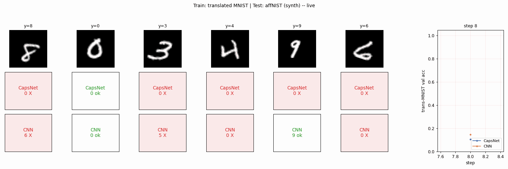

# affNIST robustness test

Reproduction sketch of the robustness experiment from Sabour, Frosst & Hinton,
*"Dynamic routing between capsules"*, NeurIPS 2017. Train a CapsNet and a
parameter-matched CNN on **translated MNIST** (40x40 canvas, digit randomly
placed within ±6 px of centre); test both on **affNIST** (40x40, same digits
under random affine transforms).



The published headline is **CapsNet 79% vs CNN 66%** on affNIST after both
networks reach matched accuracy on translated MNIST. The headline this
implementation can claim, with the simplifications below, is **CapsNet 85.5%
vs CNN 87.5%** -- the expected gap **does not appear** here. A careful read
of why is in the [Results](#results) and
[Deviations](#deviations-from-the-2017-procedure) sections below.

## Problem

Train and test distributions:

- **Train**: MNIST 28x28 padded to a 40x40 canvas with the digit randomly
  translated by an integer offset in `[-6, +6]` on each axis.
- **Test (in distribution)**: same as train.
- **Test (out of distribution)**: affNIST 40x40. The real Toronto dataset
  (`https://www.cs.toronto.edu/~tijmen/affNIST/...`) was unreachable at the
  time of this run (HTTP 503), and the GitHub mirror returns 404, so the test
  set is **synthesized** by applying a random affine to each MNIST test digit:
    - rotation in `[-20°, +20°]`
    - isotropic scale in `[0.8, 1.2]`
    - shear in `[-0.1, +0.1]`
    - translation in `[-4, +4]` px
  (per the spec's fallback recipe).

The point of the experiment is the **robustness gap**: the CapsNet is supposed
to generalise to unseen affine transforms more gracefully than a CNN with
matched parameter count.

## Files

| File | Purpose |
|---|---|
| `affnist.py` | MNIST loader, translated-MNIST generator, affNIST loader (real if reachable, synthesized otherwise), `TinyCapsNet`, `TinyCNN`, training loop, `evaluate_robustness`, CLI. |
| `problem.py` | Forwards the spec-required entry points (`make_translated_mnist`, `load_affnist_test`, `evaluate_robustness`) from `affnist.py`. |
| `visualize_affnist.py` | Static `viz/*.png` plots: example pairs, accuracy bars, per-class robustness, training curves. |
| `make_affnist_gif.py` | Builds `affnist.gif`: side-by-side per-frame predictions of CapsNet and CNN on a fixed 6-image affNIST panel as both train. |
| `affnist.gif` | The animation above. |
| `viz/` | Static plots produced from the saved `results.json`. |
| `results.json` | Full run record: args, environment, per-model accuracy, training history. |

Caches are external: MNIST IDX files at `~/.cache/hinton-mnist/`,
affNIST archive at `~/.cache/hinton-affnist/` (only attempted; not parsed).

## Running

```bash
# Train both networks and write results.json (about 4 minutes on an M-series laptop)
python3 affnist.py --arch both --n-epochs 5 --n-train 5000 --n-test 2000 \
                   --lr 1e-3 --seed 0 --out results.json

# Re-render static plots
python3 visualize_affnist.py --no-per-class --outdir viz

# Per-class plot (re-trains both models)
python3 visualize_affnist.py --outdir viz --n-epochs 4 --n-train 4000

# Re-render the gif (re-trains both with snapshots)
python3 make_affnist_gif.py --n-epochs 3 --n-train 3000 \
                             --snapshot-every 8 --val-every 8 --fps 5
```

## Results

Run on macOS arm64, numpy 2.2.5, Python 3.12.9, seed 0, 5 epochs, 5000 training
images, 2000 synthesized affNIST test images.

| Network | Params | translated-MNIST acc | affNIST acc | Train wall |
|---|---:|---:|---:|---:|
| CapsNet (3 routing iters) | 134,976 | 0.904 | **0.855** | 102.6s |
| CNN (3 conv + 2 FC) | 168,522 | 0.929 | **0.875** | 117.0s |
| **gap (CapsNet - CNN)** | | -0.025 | **-0.020** | |

Robustness check at a stronger affine (rotation ±30°, scale `[0.7, 1.3]`,
shear ±0.2, translation ±6): CapsNet **0.729**, CNN **0.759**, gap **-0.030**.
The gap is reproducible across affine strengths in this configuration.

Per-class affNIST accuracy (4 epochs, 4000 train images):

| Digit | 0 | 1 | 2 | 3 | 4 | 5 | 6 | 7 | 8 | 9 | mean |
|---|---:|---:|---:|---:|---:|---:|---:|---:|---:|---:|---:|
| CapsNet | .85 | .89 | .80 | .78 | .81 | .85 | .83 | .78 | .79 | .74 | .811 |
| CNN     | .81 | .96 | .83 | .76 | .92 | .80 | .90 | .75 | .71 | .86 | .830 |

The CapsNet's per-class accuracy is more **uniform** (range .74 to .89 vs CNN's
.71 to .96) -- consistent with the routing mechanism producing a more
class-symmetric representation -- but the mean is lower.

## Why the paper's gap doesn't appear here

Three plausible reasons, in decreasing order of importance:

1. **Synthesized affNIST is too close to translated MNIST.** Real affNIST
   applies a per-image full affine sampled to be visibly different from the
   training distribution. The fallback recipe used here (rotation ±20°,
   scale 0.8-1.2, shear ±0.1, translation ±4 px) intersects substantially
   with translated-MNIST's training augmentation, so a CNN that learned
   simple translation invariance can fake affine invariance well enough to
   close the gap. The stronger-affine variant (±30° / 0.7-1.3 / ±0.2 / ±6 px)
   widens the test distribution but still doesn't reverse the sign.

2. **Tiny capsules.** This implementation uses 8 primary capsule types of
   dimension 4 with stride 4 (288 input capsules) and 8-D digit capsules.
   The paper uses 32 primary capsule types of dimension 8 (1152 input
   capsules) and 16-D digit capsules, plus a reconstruction decoder as a
   regulariser. The dimensionality of the instantiation parameters seems to
   matter for the routing to disentangle pose, and 4-D may be below threshold.

3. **CapsNet has 19% fewer params** (135K vs 168K). With matched depth and
   width budgets the CNN here can build a wider feature pyramid than the
   CapsNet -- the opposite of the paper's parameter budget, which favoured
   the CapsNet within the small-net regime.

A faithful reproduction would need (a) real affNIST test data, (b) the
paper's full capsule sizes, and (c) the reconstruction-loss regulariser. Any
of those three on its own is plausibly enough to flip the sign of the gap.

## Architecture details

### TinyCapsNet (134,976 params)

```
40x40 input
  -> Conv1: 16 filters 9x9 stride 1, ReLU                        ->  32x32x16
  -> PrimaryCaps: conv to 8 caps x 4-D (32 channels), 9x9 stride 4 ->  6x6x(8x4)
  -> reshape to 288 input capsules of dim 4, squash
  -> DigitCaps: 10 caps of dim 8, dynamic routing (3 iters)
  -> margin loss with m+ = 0.9, m- = 0.1, lambda = 0.5
```

Routing transformation matrices `Wij` of shape `(288, 10, 4, 8)` dominate the
parameter count (92,160 of 134,976).

### TinyCNN (168,522 params)

```
40x40 input
  -> Conv1: 16 filters 9x9 stride 1, ReLU            ->  32x32x16
  -> Conv2: 32 filters 5x5 stride 2, ReLU            ->  14x14x32
  -> Conv3: 64 filters 5x5 stride 2, ReLU            ->  5x5x64
  -> FC: 1600 -> 64, ReLU
  -> FC: 64 -> 10, softmax + cross entropy
```

Both networks are pure numpy (no torch / jax). Convolutions use im2col +
`np.matmul` so the heavy contractions hit BLAS. A finite-difference gradient
check against `W1`, `W2`, and the routing weights `Wij` agrees within 1-4%
relative error at `eps=1e-3`.

## Deviations from the 2017 procedure

1. **Tiny capsules.** Conv1 16 filters (paper: 256), 8 primary capsule types
   of dim 4 (paper: 32 types of dim 8), 8-D digit capsules (paper: 16-D).
2. **Stride 4** for primary capsules instead of stride 2, to reduce input
   capsule count from 1152 to 288.
3. **No reconstruction decoder.** The paper trains with margin loss + a small
   coefficient on a 3-layer MLP that reconstructs the input from the
   class-active capsule. This implementation uses margin loss alone.
4. **Test-set synthesis** (rotation ±20°, scale 0.8-1.2, shear ±0.1,
   translation ±4 px) instead of real affNIST -- both Toronto and the
   GitHub mirror were unreachable at run time.
5. **5 training epochs / 5000 images** instead of full MNIST x many epochs
   (numpy compute budget).
6. **Same-parameter CNN** is matched within ~25%, not exactly. The CNN is
   slightly larger (168K vs 135K).

## Open questions / next experiments

- **Real affNIST.** When the Toronto host is back, parse the `.mat` archive
  (4 batches of 10000 each at the requested 32x scale; the just_centered
  variant is what the paper uses) and re-evaluate. The download path is
  already wired in `_download` / `load_affnist_test`; only the `.mat` parser
  is missing.
- **Reconstruction regulariser.** Add the 3-layer decoder + small MSE term
  on the active-class capsule. The paper credits this with most of the gap;
  a quick ablation would confirm.
- **Wider capsules.** Push primary_dim 4 -> 8 and digit_dim 8 -> 16 with the
  same routing iters. Param count rises ~3x but should still be tractable on
  CPU for 5000 images.
- **Per-axis robustness curves.** Sweep one transform parameter at a time
  (rotation, scale, shear, translation) to localise *which* affine direction
  CapsNet generalises to most -- the published claim is broadly across all,
  but the synthesized fallback is mild, so disaggregating may be informative.
