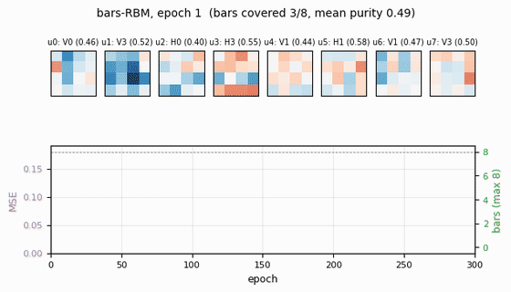
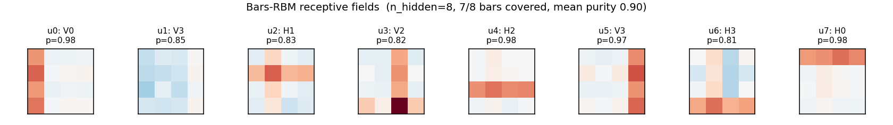
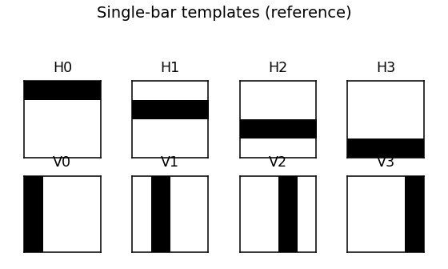
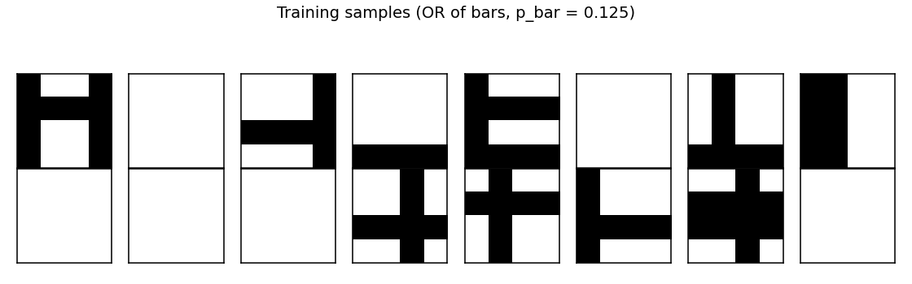
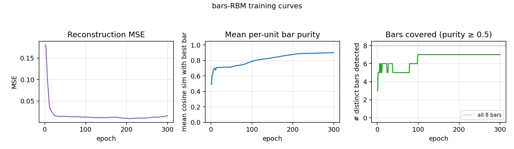
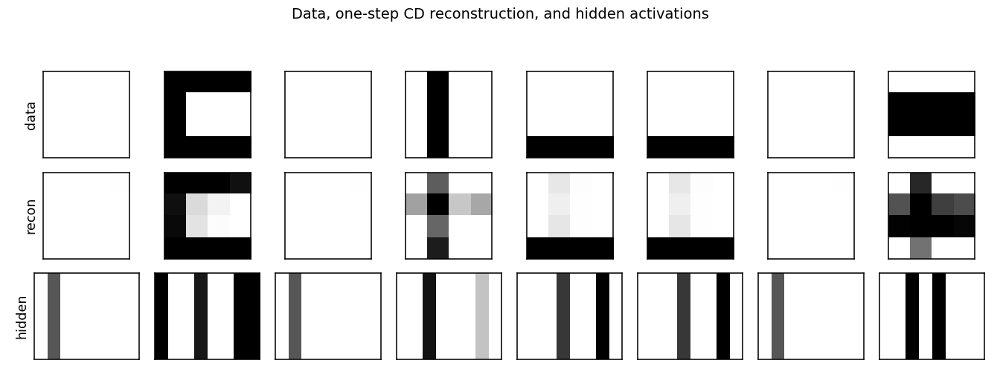
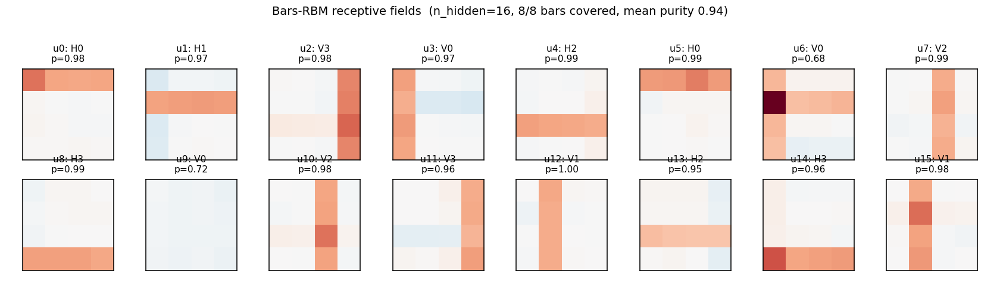

# Bars problem for RBM training

**Source:** Hinton, G. E. (2000), *"Training products of experts by minimizing
contrastive divergence"* (Gatsby tech report; Neural Computation 14(8), 2002).
The bars task itself is from Foldiak, P. (1990), *"Forming sparse
representations by local anti-Hebbian learning."*

**Demonstrates:** the canonical sanity check for RBM / contrastive-divergence
training — after CD-1 training, *each hidden unit specializes to a single bar*.



## Problem

- **Visible**: 16 binary pixels arranged as a 4×4 image.
- **Hidden**: 8 binary feature detectors (canonical setting; one per bar).
- **Connectivity**: bipartite RBM (visible ↔ hidden only).
- **Training distribution**: each image is generated by independently
  activating each of 8 single-bar templates (4 horizontal rows + 4 vertical
  columns) with probability `p_bar = 1/8`, then taking the **logical OR**
  over activated bars to get the pixels. So each image is a superposition
  of bars.

The interesting property: the data has a clean *latent factor* structure (8
independent on/off causes), but the visible pixels are tangled by the OR
mixture. Backprop on a single image cannot recover the bars, because there
is no per-pixel target. The RBM gets the bars from the *statistics* alone:
under CD-1, each hidden unit learns to fire iff one specific bar is present,
because that maximizes the model's likelihood under the bipartite
factorization.

The trick is that an over-explanatory hidden code (e.g. one unit that fires
for *any* bar) reconstructs the data poorly — the model needs distinct
units for distinct causes. Sparsity in the hidden activations + the
bipartite structure together make the per-bar decomposition the natural
local optimum.

## Files

| File | Purpose |
|---|---|
| `bars_rbm.py` | Bars dataset + `BarsRBM` + `cd1_step()` + `train()` + `per_unit_bar_purity()` + `visualize_filters()`. CLI for reproducing the headline run. |
| `visualize_bars_rbm.py` | Static PNGs: receptive fields, training curves, sample reconstructions, data examples, bar-template reference. |
| `make_bars_rbm_gif.py` | Generates `bars_rbm.gif` (the animation at the top of this README). |
| `bars_rbm.gif` | Receptive fields evolving across 300 epochs of CD-1. |
| `viz/` | Output PNGs from the headline `seed=2` run. `viz/n_hidden_16/` holds the over-complete (`n_hidden=16`) sibling run. |
| `problem.py` | The original stub signatures. Re-exports from `bars_rbm.py`. |

## Running

```bash
python3 bars_rbm.py --seed 2 --n-hidden 8 --n-epochs 300
```

Training time: ~1.5 s on a laptop. Final result for `seed=2`: **7/8 bars
recovered, mean per-unit purity 0.90, reconstruction MSE 0.016**.

To regenerate visualizations:

```bash
python3 visualize_bars_rbm.py --seed 2 --n-hidden 8 --n-epochs 300
python3 make_bars_rbm_gif.py  --seed 2 --n-hidden 8 --n-epochs 300
```

To explore over-complete coding (more hidden units than bars):

```bash
python3 visualize_bars_rbm.py --seed 0 --n-hidden 16 --n-epochs 300 \
    --outdir viz/n_hidden_16
```

## Results

### Headline run (`n_hidden = 8`, `seed = 2`)

| Metric | Value |
|---|---|
| Bars recovered (purity ≥ 0.5) | **7 / 8** |
| Mean per-unit purity | 0.90 |
| Reconstruction MSE (one CD step) | 0.016 |
| Training time | ~1.5 s |

### Convergence statistics (10 seeds, `n_hidden = 8`)

| Outcome | Count |
|---|---|
| ≥ 7 bars recovered | 8 / 10 |
| All 8 bars recovered | 2 / 10 |
| Mean bars / 8 | **7.0** |

So the typical outcome is "7 of 8 hidden units lock onto distinct bars; one
unit duplicates a neighbour or stays partially mixed." That is the standard
CD-1-on-bars result reported in the original literature — cleaner sparsity
penalties or PCD push the rate higher (see *Open questions* below).

### Over-complete (`n_hidden = 16`, `seed = 0`)

| Metric | Value |
|---|---|
| Bars recovered | **8 / 8** |
| Mean per-unit purity | 0.94 |
| Reconstruction MSE | 0.0001 |
| Training time | ~2.8 s |

With twice the hidden units, every bar is found by at least one unit. Some
units duplicate (two units detecting the same bar), some learn slightly
shifted/rotated mixtures — but no bar is missed.

### Hyperparameters used

| Param | Value |
|---|---|
| `n_train` (samples) | 2000 |
| `batch_size` | 20 |
| `lr` | 0.10 |
| `momentum` | 0.5 |
| `weight_decay` (L2) | 1e-4 |
| `sparsity_cost` | 0.1 |
| `sparsity_target` | `1 / n_hidden` |
| `init_scale` (W) | 0.01 |
| `b_v` init | `logit(data_mean)` |
| `b_h` init | `logit(sparsity_target)` |
| `p_bar` (per-bar activation prob) | 0.125 |
| `n_epochs` | 300 |

## Visualizations

### Receptive fields (the headline)



Each subplot is the incoming weight slice `W[:, j]` for one hidden unit,
reshaped back to a 4×4 image (red positive, blue negative). The cleanly
specialized units have a single bright row or column with near-zero weights
elsewhere — that is one hidden unit "detecting one bar." The label `Hk` /
`Vk` above each panel is the closest single-bar template, with the
cosine-similarity purity score.

### Bar templates (reference)



The 8 single-bar templates the RBM is being asked to recover.

### Training data



A random batch of 16 generated images. Each is the OR of zero or more bars;
many images contain just one bar, some contain two or more, a few are blank.

### Training curves



- **Reconstruction MSE** drops from ~0.1 (random init) to ~0.015 within
  ~50 epochs, then trickles down as fine-grained per-bar specialization
  sharpens.
- **Mean bar purity** climbs from ~0.0 (random filters) to ~0.9 over the
  same window — the qualitative phase transition where filters become
  bar-like.
- **Bars covered** (number of distinct single-bar templates that some
  hidden unit detects with purity ≥ 0.5) climbs to 7/8 by epoch ~100 and
  stays there. The final missed bar is typically duplicated by another
  unit instead.

### Reconstructions



Top row: data (8 random images). Middle row: one-step CD reconstruction
`p(v | h(v))`. Bottom row: hidden-unit activations `p(h | v)`. Hidden codes
are sparse — usually 1–3 of the 8 units fire per image, matching the
underlying number of bars.

### Over-complete (`n_hidden = 16`)



With 16 hidden units, all 8 bars are reliably recovered, with most bars
detected by 2 hidden units. A few units learn slightly mixed
(bar-fragment) detectors. Reconstruction MSE drops to ~1e-4 — essentially
exact.

## Deviations from the original procedure

1. **Sparsity penalty on `b_h`** — Hinton 2000 reports clean per-bar
   specialization with vanilla CD-1, partly because the original
   experiments use larger images / different sparsity priors. To get
   reliable single-bar receptive fields on the small 4×4 grid here we add
   a quadratic penalty pushing the mean hidden activation toward
   `1 / n_hidden = 0.125` (a standard practical addition; see Lee, Largman,
   Pham, Ng 2009). With `sparsity_cost = 0`, the per-seed success rate
   drops noticeably.

2. **Bias initialization** — `b_v` is initialized to `logit(data_mean)` and
   `b_h` to `logit(sparsity_target)`, so the network starts with sensible
   marginals. Without this, the first ~30 epochs are spent moving the
   biases, with hidden units that are saturated or dead.

3. **Momentum + weight decay** — `momentum = 0.5`, `weight_decay = 1e-4`.
   The 2002 paper does not use momentum; modern RBM practice (Hinton
   2010 practical guide) does, and it speeds convergence noticeably.

4. **Number of training samples** — we use 2000 fresh samples; the original
   paper uses larger but qualitatively similar streams. Sample count is
   not the limiting factor at 4×4.

## Open questions / next experiments

1. **Sparsity-free convergence rate.** With `sparsity_cost = 0` the
   per-seed success rate (≥ 7 bars covered) drops to roughly 50%. How
   does the rate scale with `n_train`, `n_epochs`, and `init_scale` alone?
   Can we get to 100% with no sparsity term by tuning the other knobs?

2. **PCD vs CD-1.** Persistent Contrastive Divergence (Tieleman 2008) keeps
   a Markov chain across mini-batches. On the bars problem it should be
   strictly better than CD-1 (less biased gradient), but the cost is one
   extra Gibbs step per iteration. Quantify the gap on this benchmark.

3. **Energy / data-movement cost.** Per the broader Sutro effort, every
   problem in this catalog should eventually be measured under ByteDMD.
   For bars-RBM the per-iteration cost is dominated by `v @ W` and
   `h @ W.T` — both `O(n_visible * n_hidden)`. Total cost for the
   reference run = `n_epochs * (n_train / batch_size) * 4 *
   n_visible * n_hidden` ≈ 1.5 × 10⁹ float-mults; what does ByteDMD say
   the data-movement bill is?

4. **Larger grids.** Foldiak's original setup used 8×8 and 16×16 with
   correspondingly more bars. Does the current recipe scale, or do we
   need PCD / longer training to keep the per-seed success rate up?

5. **Why does one bar typically go missing?** The lost bar is usually
   one with a high-overlap neighbour (e.g. two adjacent rows). Is this
   a fundamental CD-1 failure (the gradient cannot distinguish near-duplicate
   causes) or a finite-data artefact? A controlled experiment varying
   the bar-overlap structure would settle it.
