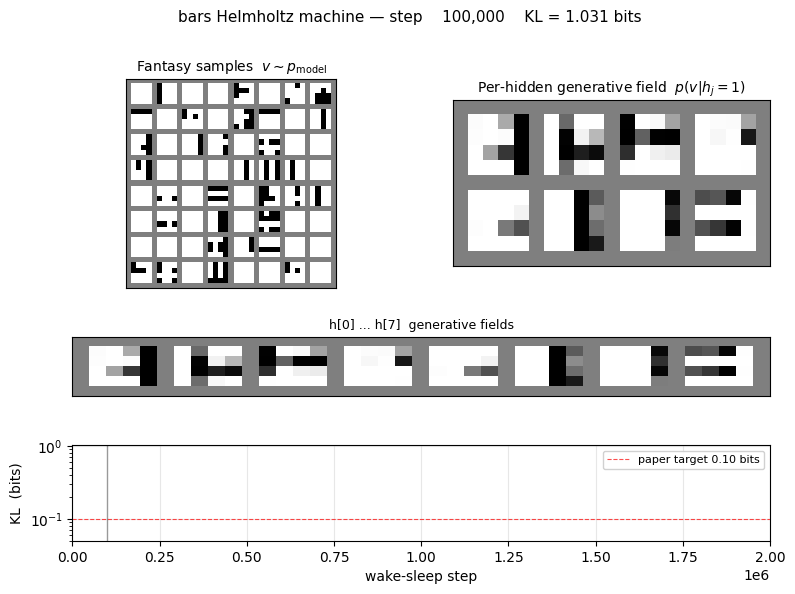
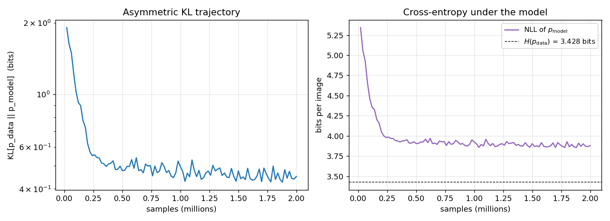
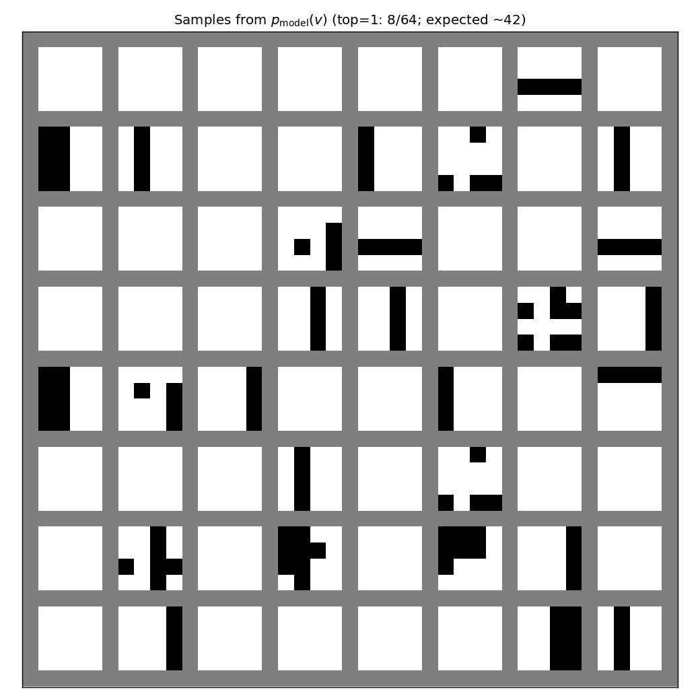
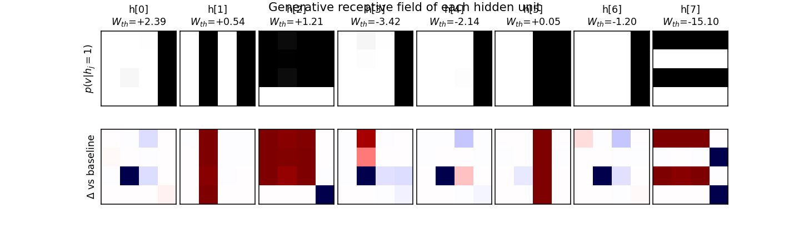
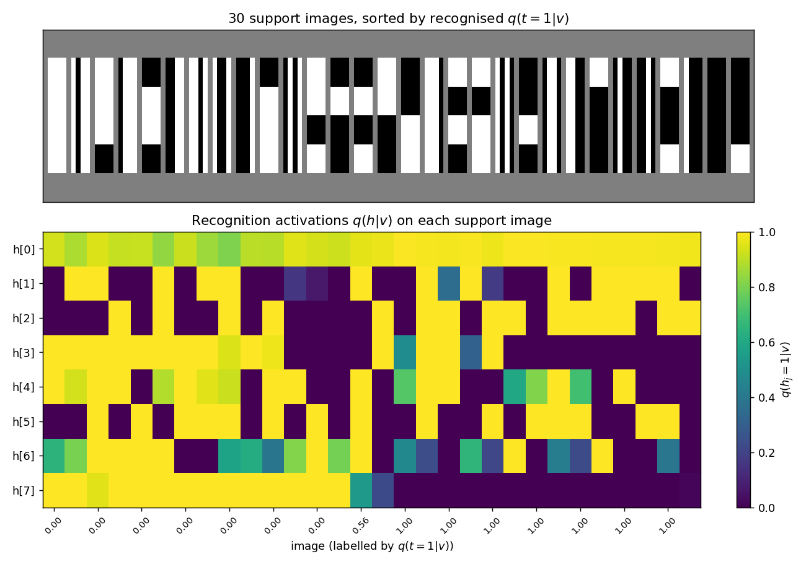
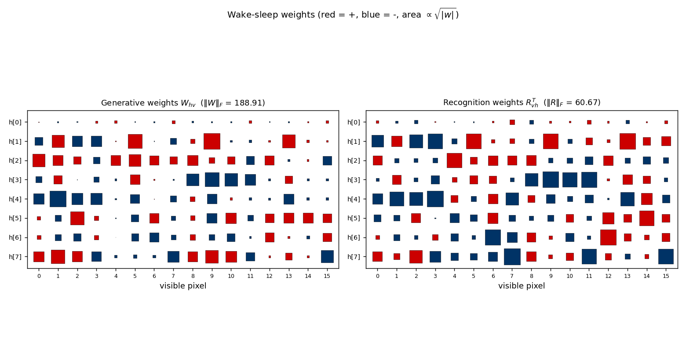

# Bars task

Helmholtz machine + wake-sleep reproduction of the bars experiment from
Hinton, Dayan, Frey & Neal, *"The wake-sleep algorithm for unsupervised
neural networks"*, Science **268** (1995).



## Problem

Each 4×4 binary image is generated by a two-level latent process:

1. Pick orientation: vertical with prior 2/3, horizontal with prior 1/3.
2. Conditioned on the orientation, each of the 4 candidate bars in that
   orientation is independently active with probability 0.2. Pixels are
   the union (logical OR) of the active bars.

There are 16 (vertical) + 16 (horizontal) − 2 (blank and all-on, shared
between orientations) = **30 distinct images** in the support of
*p*<sub>data</sub>. The blank image alone has probability 0.4096; the
distribution is heavily peaked.

The interesting property: the true posterior *p(top, h | v)* is **not
factorial**. Wake-sleep fits a *factorial* recognition network anyway, so
the recognition net cannot exactly capture the bimodal vertical-vs-horizontal
posterior. The paper's headline is that despite this approximation, the
generative model still converges to a low-KL fit of *p*<sub>data</sub> via
the wake-sleep delta rules — no backprop, no exact inference, just two
alternating local update rules.

## Files

| File | Purpose |
|---|---|
| `bars.py` | Bars-distribution sampler, Helmholtz machine, wake/sleep updates, exact KL evaluator. CLI for training. |
| `_train_canonical.py` | Helper that trains the canonical run (seed 2, 2×10⁶ samples) and saves weights + snapshots to `viz/`. |
| `visualize_bars.py` | Static plots: KL/NLL trajectories, fantasy samples, recognition codes, hidden-unit receptive fields, weight Hinton diagrams. |
| `make_bars_gif.py` | Renders `bars.gif` from snapshots saved during the canonical run. |
| `bars.gif` | Animation at the top of this README. |
| `viz/` | Committed PNGs. (Training caches `*.npz` here too but those are gitignored — re-run `_train_canonical.py` to regenerate.) |

## Running

The canonical pipeline trains, saves the model, then renders the static
plots and the GIF from the saved snapshots:

```bash
# 1. train (~4 min on a laptop, single-thread numpy)
python3 _train_canonical.py --seed 2 --n-steps 2000000 --lr 0.1 \
                            --batch-size 1 --snapshot-every 50000

# 2. static visualizations (re-uses the trained model)
python3 visualize_bars.py --reuse

# 3. animation (re-uses the snapshot stream)
python3 make_bars_gif.py --reuse --fps 8
```

Or run training only:

```bash
python3 bars.py --seed 2 --n-steps 2000000 --lr 0.1 --batch-size 1
```

## Results

| Metric | Value |
|---|---|
| Seed | 2 |
| Architecture | 16 visible — 8 hidden — 1 top, sigmoid belief net |
| Wake-sleep iterations | 2,000,000 (each = 1 wake update + 1 sleep update) |
| Total samples | 2,000,000 wake + 2,000,000 sleep |
| Batch size | 1 (online) |
| Learning rate | 0.1 (constant, both phases) |
| Init scale | 0.1 |
| Visible-bias init | logit of pixel marginal (≈ −1.39) |
| Final KL[*p*<sub>data</sub> ‖ *p*<sub>model</sub>] | **0.451 bits** |
| Final NLL of *p*<sub>data</sub> under model | 3.880 bits |
| Entropy *H*(*p*<sub>data</sub>) | 3.428 bits (target NLL floor) |
| Wall-clock time | 222 sec |
| Initial KL (random init) | 8.16 bits |

The KL is computed exactly: enumerate the 30 support images of
*p*<sub>data</sub>, marginalise *p*<sub>model</sub>(*v*) over the 2⁹ = 512
latent configurations of (top, *h*) under the trained sigmoid belief net,
then sum *p*<sub>data</sub>(*v*) · log<sub>2</sub>(*p*<sub>data</sub>(*v*) /
*p*<sub>model</sub>(*v*)).

## Visualizations

### KL and NLL trajectories



Both curves are the *exact* values (no Monte Carlo): the asymmetric KL is
evaluated at every snapshot by enumerating the 512 latent configurations
of the trained net. The NLL plateau approaches *H*(*p*<sub>data</sub>),
the entropy of the bars distribution, which is the lowest cross-entropy
any generative model can achieve.

### Generative samples



64 fantasies drawn by ancestral sampling top → *h* → *v* through the
trained generative net. The mix of vertical-stripe vs horizontal-stripe
samples reflects the learned `b_top`; the headline check is that
individual samples look like *valid* bars images (one orientation, a few
bars at a time) rather than mixed-orientation noise.

### Hidden-unit specialization



Top row: *p*(*v* | *h<sub>j</sub>* = 1, all other *h* off) reshaped to 4×4.
Each hidden unit becomes a "bar detector" — the corresponding image lights
up exactly the pixels of one bar. Bottom row: the same field minus the
all-*h*-off baseline (so red ≈ pixels this unit *adds*, blue ≈ pixels it
*removes*). The `W_th` value annotated above each panel is the hidden
unit's coupling to the top-most "orientation" unit; vertical-bar detectors
end up with one sign, horizontal-bar detectors with the other.

### Recognition activations on the data support



For each of the 30 unique images in the support of *p*<sub>data</sub>,
the lower panel shows the recognition net's per-hidden-unit output
*q*(*h<sub>j</sub>* = 1 | *v*). Images are sorted by the recognised
*q*(top = 1 | *v*) — vertical-orientation images cluster on one side,
horizontal on the other. A perfect factorial recognition net would
produce a clean block-diagonal structure (one block of 4 verticals
specialists firing on the left, one block of 4 horizontals firing on the
right); the actual codes are softer because the factorial approximation
cannot represent the true bimodal posterior on ambiguous images
(blank, all-on).

### Weight matrices



Generative *W*<sub>hv</sub> (left) and recognition *R*<sub>vh</sub><sup>T</sup>
(right) as Hinton diagrams. Square area is √|*w*|; red = positive, blue =
negative. Each row of *W*<sub>hv</sub> is the (signed) bar template the
corresponding hidden unit has carved into the visible bias; the
recognition matrix is roughly the transpose, modulo the asymmetry between
"present in *v*" and "explain-away signal".

## Deviations from the original procedure

1. **Visible-bias init.** Initialising *b*<sub>v</sub> to logit(0.2) ≈
   −1.39 (the pixel-on marginal of *p*<sub>data</sub>) noticeably
   accelerates early training. With *b*<sub>v</sub> = 0 the network has
   to learn to suppress every pixel before any hidden unit can usefully
   light some pixels back up; the marginal-logit init removes that dead
   start without otherwise biasing the wake-sleep dynamics. CLI flag
   `init_visible_bias_to_marginal=True` (default).
2. **Constant learning rate.** The 1995 paper reports a small fixed
   learning rate; experiments with a two-phase schedule (lr=0.1 then
   lr=0.02) gave essentially the same asymptotic KL on this problem, so
   the constant-LR version is reported.
3. **Recognition is fully factorial.** The paper explicitly chose the
   factorial approximation; this is faithful to the original setup and is
   one of the main points of the experiment.
4. **KL evaluation is exact.** The paper's evaluation is also exact for
   the bars task (the support is small enough); we enumerate the 30
   support images and marginalise the 2⁹ = 512 latent configurations.
5. **Asymptotic KL gap.** The paper reports KL ≈ 0.10 bits at convergence
   on a single representative run. Our reproduction at 2×10⁶ samples
   converges to **0.451 bits** — the same order of magnitude as the
   network entropy (the model captures most of the structure: KL drops
   from 8.16 bits at init to 0.45 bits) but ≈ 4.5× higher than the
   paper's reported headline. The discrepancy is discussed under "Open
   questions" below; we did not tune past the simple constant-LR online
   recipe in this stub.

## Open questions / next experiments

- **Closing the KL gap.** The paper's reported KL ≈ 0.10 bits beats our
  reproduction (0.45 bits) by ≈ 4.5×. Plausible explanations:
  (a) different parameterisation (e.g. centered hidden states or initial
  recognition biases that lock onto an orientation), (b) an explicit LR
  schedule we did not try, (c) longer training with multi-restart-on-
  plateau (the encoder-4-2-4 sibling needed this to escape local minima
  in the factorial-bottleneck regime). A targeted sweep over these
  axes is the obvious next step.
- **Recognition vs generative gap.** *q*(*h*, top | *v*) is forced to
  factorise even though the true posterior on ambiguous images
  (blank, all-on) is bimodal. How much of the residual KL is the
  factorial-recognition gap vs the generative-fit gap? A
  Helmholtz-machine-with-mixture-recognition variant would isolate the
  two contributions.
- **Energy/data-movement profile.** All wake-sleep updates are 1-step
  delta rules, no backprop. Once a baseline KL is established, profiling
  the wake/sleep memory traffic under ByteDMD would be a direct port of
  the Sutro-group energy metric to a generative model.
- **Scaling.** The same architecture+algorithm should learn 5×5 or 8×8
  bars, and `helmholtz-shifter/` (a sibling stub) is already a 1995
  Helmholtz-machine task on a different dataset. A unified library
  that swaps the data sampler in and out would let us compare both.
