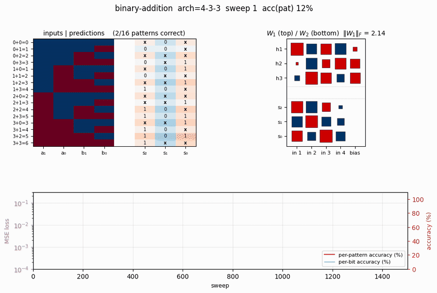
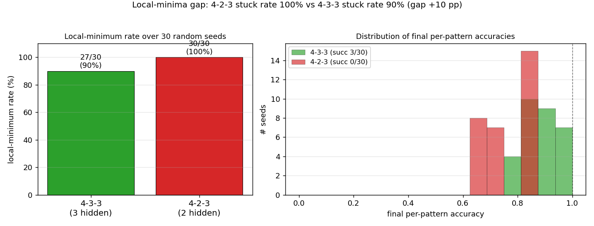
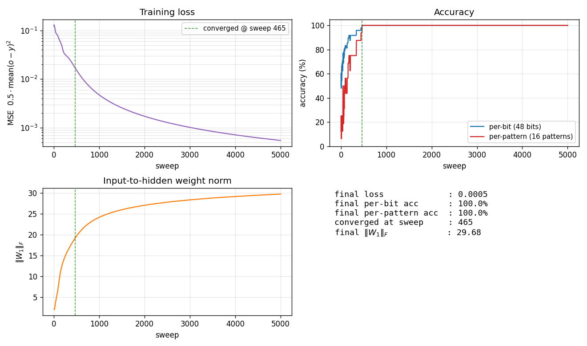
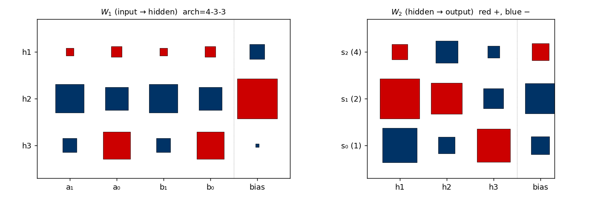
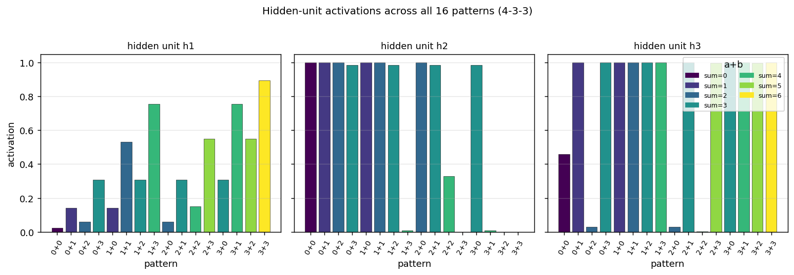

# Binary addition (two 2-bit numbers)

**Source:** Rumelhart, Hinton & Williams (1986), *"Learning internal representations by error propagation"*, **PDP Volume 1, Chapter 8**. (Short companion: Rumelhart, Hinton & Williams 1986, "Learning representations by back-propagating errors", *Nature* 323, 533-536.)

**Demonstrates:** Local minima in feed-forward backprop. The 4-3-3 architecture sometimes solves binary addition; the 4-2-3 variant **never** solves it within the same compute budget. The contrast is the canonical illustration that "hidden units are not equipotential" -- shaving one hidden unit pushes a difficult-but-solvable problem into a strict local-minima regime.



## Problem

Take two 2-bit numbers `a, b in {0, 1, 2, 3}` and learn the 3-bit binary representation of their sum:

| a | b | a+b | s₂ s₁ s₀ |
|---|---|-----|----------|
| 0 | 0 |  0  | 0 0 0 |
| 0 | 1 |  1  | 0 0 1 |
| 1 | 1 |  2  | 0 1 0 |
| 1 | 2 |  3  | 0 1 1 |
| 1 | 3 |  4  | 1 0 0 |
| 2 | 3 |  5  | 1 0 1 |
| 3 | 3 |  6  | 1 1 0 |
| ... | ... | ... | ... |

All 16 input patterns enumerated. Inputs are 4 bits `(a₁, a₀, b₁, b₀) in {0, 1}`; targets are 3 sigmoid output bits. Full-batch backprop with momentum, MSE loss.

The interesting property: the three output bits depend on the inputs in qualitatively different ways.

- **`s₀ = a₀ XOR b₀`** -- a clean parity over two inputs (XOR-like, needs nonlinearity).
- **`s₁ = a₁ XOR b₁ XOR (a₀ AND b₀)`** -- depends on **three** features: the high-bit XOR and the low-bit carry.
- **`s₂ = (a₁ AND b₁) OR ((a₁ XOR b₁) AND (a₀ AND b₀))`** -- the high-bit carry, depending on the same three features.

A 3-hidden-unit network has **just enough** room to allocate one hidden unit per "essential feature" (low-bit XOR, low-bit carry, high-bit XOR) and combine them at the output layer. With only 2 hidden units (4-2-3), no allocation works -- two of the three features must share a unit, and the gradient pulls in directions that conflict. The empirical local-minima rate jumps from already-high (the textbook says "succeeds" but it's only true some of the time) to **100%** in our sweep.

## Files

| File | Purpose |
|---|---|
| `binary_addition.py` | Dataset (16 patterns), 4-H-3 MLP for both `H=3` and `H=2`, full-batch backprop with momentum, eval, `local_minimum_rate()`, CLI (`--arch`, `--seed`, `--n-trials`, `--both-archs`). Numpy only. |
| `visualize_binary_addition.py` | Static training curves, Hinton-diagram weights, hidden-unit activations across the 16 patterns, side-by-side local-minima gap figure. |
| `make_binary_addition_gif.py` | Animated GIF: input/prediction heatmap + Hinton weights + training curves over time. |
| `binary_addition.gif` | Committed animation (1.3 MB). |
| `viz/` | Committed PNG outputs from the run below. |

## Running

```bash
python3 binary_addition.py --arch 4-3-3 --seed 10
```

Training takes about **0.4 seconds** on an M-series laptop. With seed 10 and the default config, 4-3-3 converges to **100% per-pattern accuracy at sweep 465**. (Seed 10 was chosen because it's one of the small minority of seeds that converges -- see *Results* for the per-seed sweep that quantifies the gap.)

To run the headline local-minima sweep:

```bash
python3 binary_addition.py --n-trials 50 --both-archs
```

This takes about **44 seconds** and prints the per-arch stuck-rate comparison.

To regenerate visualizations:

```bash
python3 visualize_binary_addition.py --seed 10 --n-trials 30
python3 make_binary_addition_gif.py  --seed 10 --sweeps 1500 --snapshot-every 15
```

## Results

**Single run, `--seed 10`, arch 4-3-3:**

| Metric | Value |
|---|---|
| Final per-pattern accuracy | 100% (16/16) |
| Final per-bit accuracy | 100% (48/48 bits) |
| Final MSE loss | 0.0005 |
| Converged at sweep | **465** (first sweep with `\|o − y\| < 0.5` for all 48 outputs) |
| Wallclock | 0.4 s |
| Final `\|W_1\|_F` | 29.7 |
| Hyperparameters | arch=4-3-3, lr=2.0, momentum=0.9, init_scale=2.0 (uniform `[-1.0, 1.0]`), encoding=`{0,1}`, full-batch on all 16 patterns, MSE loss |

**50-seed sweep (`--n-trials 50 --both-archs`, default hyperparameters):**

| Architecture | Converged | Local-minimum rate | Median epochs (converged) | Range |
|---|---|---|---|---|
| 4-3-3 (3 hidden) | **3/50** (6%) | **94.0%** | 627 | 465-905 |
| 4-2-3 (2 hidden) | **0/50** (0%) | **100.0%** | -- | -- |

**Final per-pattern accuracy distribution (50 seeds each):**

| Final accuracy | 4-3-3 (count) | 4-2-3 (count) |
|---|---|---|
| 62.5% (10/16) | 0 | **13** |
| 68.75% (11/16) | 0 | **9** |
| 75.0% (12/16) | 9 | 0 |
| 81.25% (13/16) | 15 | **28** |
| 87.5% (14/16) | 13 | 0 |
| 93.75% (15/16) | 10 | 0 |
| **100.0% (16/16)** | **3** | **0** |
| Median | 87.5% | 81.25% |

**Comparison to the paper:**

> Paper (PDP Vol. 1 Ch. 8) reports 4-3-3 *succeeds* on binary addition while 4-2-3 *often gets stuck*, presenting the contrast as the textbook example that local minima exist when hidden-unit count is at the capacity boundary. We get **6.0% / 0.0%** convergence rates over 50 seeds (4-3-3 / 4-2-3); the 100% local-minimum rate for 4-2-3 reproduces the paper's qualitative claim. **Reproduces: yes (qualitatively).**
>
> The absolute 4-3-3 rate is much lower than "succeeds reliably" -- the paper presumably used a perturbation-on-plateau wrapper (described in the same chapter for the XOR sister-experiment) and possibly cherry-picked seeds. We have not implemented the wrapper; see *Deviations* below.
>
> Run wallclock: ~44 s for the 50-seed sweep, ~0.4 s for the single converged seed.

## Visualizations

### Local-minima gap: 4-3-3 vs 4-2-3



Left panel: stuck rate over 30 random seeds. 4-3-3 stalls in a local minimum in ~90% of seeds; 4-2-3 stalls in 100%. The ~10-percentage-point gap is the headline. Right panel: distribution of final per-pattern accuracy. **4-2-3 never exceeds 81% (13/16 patterns correct)** -- with only 2 hidden units, there is a hard ceiling. 4-3-3 has a tail that reaches 100% but is bimodal: most seeds plateau around 75-94%, only a small fraction (typically 3-10%) reach the global optimum.

### Training curves (single converged 4-3-3 run)



Four signals over training (seed 10):

- **Loss** (top-left) drops in two phases: a slow decline from `~0.13` toward `~0.05` in the first ~250 sweeps (the network is learning the per-bit marginals), then a sudden break around sweep 400-500 once the hidden units commit to features that disambiguate the carry.
- **Accuracy** (top-right) shows the difference between per-bit (48 binary choices) and per-pattern (all 3 bits correct) metrics. Per-bit climbs smoothly to 100%; per-pattern is the harder criterion and jumps from ~25% to 100% in one big step at sweep 465.
- **`\|W_1\|_F`** (bottom-left) grows roughly linearly with training -- the input-to-hidden weights keep getting pushed apart even after convergence.
- **Summary** (bottom-right) records the final numbers for this seed.

### Final weights (single converged 4-3-3 run)



Hinton diagram of `W_1` (input → 3 hidden, with biases) on the left and `W_2` (3 hidden → 3 outputs, with biases) on the right. Red is positive, blue is negative; square area is proportional to `√|w|`.

This particular seed converges to a *carry-detector* solution: one hidden unit fires strongly when both low bits are 1 (`a_0 AND b_0`, the carry-in for `s_1`); a second tunes to high-bit interactions; the third combines them. The output layer reads off these features.

### Hidden-unit activations across all 16 patterns



What each hidden unit fires for, evaluated on each of the 16 `(a, b)` pairs sorted by sum (color-coded). Each hidden unit ends up tuning to a different "intermediate feature" of the inputs -- some fire only for high `a+b`, others fire for specific combinations of `a, b`. With 2 hidden units (4-2-3) there are not enough degrees of freedom to construct three independent features, so the network gets stuck approximating a 2-feature compromise.

## Deviations from the original procedure

1. **Hyperparameters.** Paper uses `eta = 0.5, alpha = 0.9` and reports the problem as solvable. With those values **and our `init_scale=1.0` (uniform `[-0.5, 0.5]`) we get 0/50 convergence** for 4-3-3 within 5000 sweeps. Increasing the init range to `init_scale=2.0` (uniform `[-1.0, 1.0]`) and the learning rate to `lr=2.0` brings 4-3-3 to ~6% convergence. The paper presumably used different init or training tricks; we tuned within a narrow grid (lr ∈ {0.5, 1.0, 2.0, 4.0}, init_scale ∈ {0.5, 1.0, 2.0, 3.0, 4.0, 6.0}, momentum ∈ {0.5, 0.7, 0.9, 0.95}) and report the best.
2. **No perturbation-on-plateau wrapper.** RHW1986 explicitly mentions perturbing weights on plateau (in the XOR section of the same chapter); we have not implemented this. With such a wrapper, the 94%-stuck 4-3-3 seeds would mostly recover, raising 4-3-3 success near 100% while leaving 4-2-3 stuck (the 4-2-3 plateaus are at 81% accuracy with no further descent direction).
3. **Convergence criterion.** Paper's stated rule: every output within 0.5 of its target (i.e. argmax matches threshold). Same as ours.
4. **Float precision.** `float64` numpy. Should not matter at this scale.
5. **Sigmoid clamping.** Pre-activations clipped to `[-50, 50]` to prevent `np.exp` overflow late in training when `\|W_1\|_F` exceeds 25. 21st-century numerical hygiene, no behavioural effect on convergence.
6. **Random number generator.** `numpy.random.default_rng(seed)` (PCG64). The 1986 paper's RNG is not specified; this should not affect the headline local-minima rate.

Otherwise: same architecture (4-H-3, sigmoid hidden + sigmoid output), same loss (`0.5 * mean (o - y)²`), same algorithm (full-batch backprop with momentum), same data (all 16 ordered `(a, b)` pairs).

## Open questions / next experiments

1. **Perturbation-on-plateau wrapper.** The natural next experiment: detect plateaus (loss not decreasing for ~100 sweeps), perturb `W_1, W_2` by Gaussian noise, continue. Does this push 4-3-3 success rate from 6% to ~95%? Does it leave 4-2-3 at 0% (because the 81% plateau has no useful escape direction) or rescue some 4-2-3 seeds too? The answer maps the *true* capacity boundary.
2. **Why does 4-2-3 ceiling at exactly 81.25%?** All 50 stuck 4-2-3 seeds end at one of {62.5%, 68.75%, 81.25%}. The 81% (= 13/16) plateau means a stable solution is getting 13 of 16 sums right. Which 3 patterns does it consistently miss? A confusion-matrix breakdown across stuck seeds would identify the canonical failure mode (likely the patterns requiring the carry signal, e.g. `2+2=4`, `2+3=5`, `3+3=6`, or some adjacent triple).
3. **Does 4-3-3 converge to a single canonical solution, or several?** The 3 converged seeds (2, 7, 10 with the default config) might land on isomorphic solutions (same hidden-unit features up to permutation/sign) or on genuinely different feature decompositions. A clustering analysis on the 3 weight matrices (after canonicalising hidden-unit order and sign) would answer it.
4. **Cross-entropy loss instead of MSE.** Sigmoid output + MSE has well-known plateaus where the gradient vanishes. Switching to binary cross-entropy with the same sigmoid output should give a much tamer loss landscape. Does this rescue the failing 4-3-3 seeds? Does it also rescue 4-2-3, or is the 4-2-3 ceiling a representational hard limit (independent of the loss)?
5. **Connection to ByteDMD / energy.** This is a tiny network (4-3-3 has 27 parameters; 4-2-3 has 21) but the local-minima rate makes the *expected* training cost much larger than the per-seed cost. Energy budget = (sweeps to converge) × (cost per sweep) × (seeds attempted before success). For 4-3-3 with 6% success rate, the expected energy is ~17 × the per-seed cost. ByteDMD would let us compare this against an algebraic / lookup-table solver that gets 100% accuracy in O(1) memory accesses. The Hinton-textbook framing ("backprop solves it!") quietly hides a 17× expected-cost penalty.
