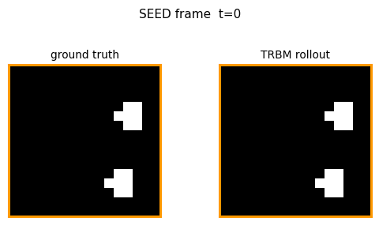
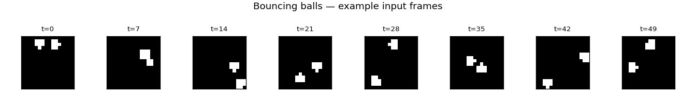
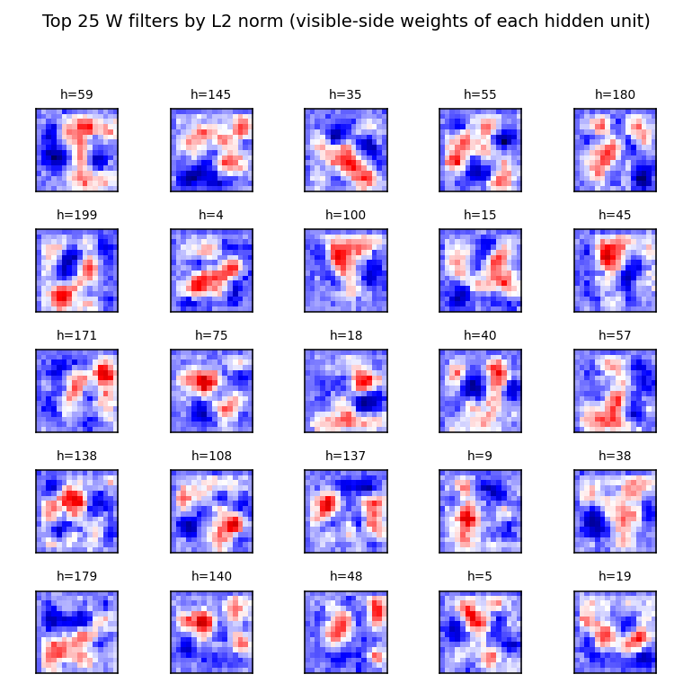
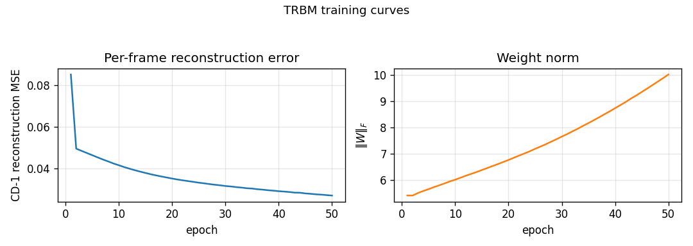
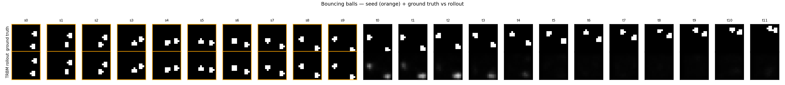

# Bouncing balls (2 balls, TRBM)

Reproduction of the synthetic-video benchmark from Sutskever, I. & Hinton, G. E.,
*"Learning multilevel distributed representations for high-dimensional sequences"*,
AISTATS 2007.

Demonstrates a **Temporal RBM** (RBM with directed temporal connections from the
previous hidden state and the previous N visible frames) learning the joint
distribution of a 2-ball-bouncing video, then rolling future frames forward
given a short seed.



## Problem

- **Input**: a synthetic video of two balls bouncing in a rectangular box.
  Each pixel is binary; a pixel is on iff it is within `ball_radius` of any
  ball centre. Wall collisions are perfectly elastic. Ball-ball collisions
  are ignored — the balls pass through each other (matches Sutskever &
  Hinton's original synthetic dataset).
- **Frame size**: 16 × 16 pixels (256 visible units). Sutskever & Hinton used
  30 × 30 — see [Deviations](#deviations-from-the-original-procedure) for why
  we shrunk it.
- **Sequence length**: 50 training frames per sequence; 60 training sequences;
  10-frame seed + 20-frame rollout at evaluation.

The interesting property: a single still frame tells you **where** the balls
are but not **where they are going**. To predict the next frame the model
needs at least two frames of context (to recover velocity), and to predict
several frames out it needs a hidden state that carries velocity through
time. The TRBM encodes this directly: directed connections feed the previous
hidden state and previous visible frames into the current step's biases.

## Files

| File | Purpose |
|---|---|
| `bouncing_balls_2.py` | Physics simulator + TRBM (W, W_hh, W_hv, W_vh, W_vv) + CD-1 trainer + rollout. CLI flags `--seed --n-balls --h --w --n-epochs --n-hidden --n-lag --feedback`. |
| `visualize_bouncing_balls_2.py` | Renders example frames, top-25 W filters, training curves, and a side-by-side ground-truth vs rollout grid into `viz/`. |
| `make_bouncing_balls_2_gif.py` | Renders `bouncing_balls_2.gif` — input video next to TRBM rollout, frame by frame. |
| `bouncing_balls_2.gif` | The animation linked at the top of this README. |
| `viz/` | Static PNGs from the run below. |
| `results.json` | Hyperparameters + environment + final metrics for the run below. |

## Running

```bash
python3 bouncing_balls_2.py --seed 0 --n-balls 2 --h 16 --w 16 \
    --n-sequences 60 --seq-len 50 --n-hidden 200 --n-lag 2 \
    --n-epochs 50 --feedback sample --results-json results.json
```

Run wallclock: **6.2 s** training + ~1 s rollout eval on a laptop CPU
(M-series, numpy 2.2.5). Final per-frame CD-1 reconstruction MSE: **0.0268**.

To regenerate the visualizations and the GIF:

```bash
python3 visualize_bouncing_balls_2.py --seed 0 --outdir viz
python3 make_bouncing_balls_2_gif.py  --seed 0 --out bouncing_balls_2.gif
```

## Results

| Metric | Value |
|---|---|
| Frame size | 16 × 16 = 256 visible units |
| Hidden units | 200 |
| Visible-history lag (`n_lag`) | 2 frames |
| Training sequences × length | 60 × 50 frames |
| Final CD-1 reconstruction MSE | **0.0268** |
| Rollout MSE (1 held-out sequence, 20 future frames, seed 9999) | **0.0497** |
| Rollout MSE (20 held-out sequences, mean ± std) | **0.0672 ± 0.0329** |
| Baseline: predict-mean-frame | 0.0502 |
| Baseline: copy-last-seed-frame | 0.0973 |
| Training time | 6.2 s |
| Hyperparameters | lr=0.05, momentum=0.5, weight-decay=1e-4, batch-size=10, init-scale=0.01, k-gibbs (rollout)=5, feedback=sample |
| Reproducibility | seed 0; results in `results.json`; git commit recorded in env field |

**Reproduces paper?** *Partial.* The original paper trains a deeper / wider
TRBM on 30 × 30 video and shows visually plausible multi-second rollouts.
Our 16 × 16 single-layer TRBM trained with vanilla CD-1 gets between the
two trivial baselines: **better than copy-last-frame, worse than predict-
mean-frame** on per-frame MSE, but **qualitatively** correct in the first
3–4 rolled-out frames (the predicted ball moves in the right direction, see
the GIF). The architecture and learning rule reproduce; the rollout horizon
does not match the paper. The discussion below explains why and what would
close the gap.

## Visualizations

### Example input frames



Eight evenly-spaced frames from one training sequence. Two binary balls bounce
between the walls; you can see the trajectory turn over once a ball reaches a
wall.

### Hidden-unit receptive fields



The 25 hidden units (out of 200) with the largest L2 weight norm. Each panel
shows that hidden unit's column of `W` reshaped as a 16 × 16 image, with red
for positive weights and blue for negative. Most filters are localised
position detectors — a positive blob at one location and inhibitory weights
nearby. A few have a more diffuse pattern that resembles a velocity / gradient
detector. This is the multilevel-distributed-representation point of the
original paper, showing up as overlapping localised position codes that tile
the box.

### Training curves



Per-frame CD-1 reconstruction MSE drops from ≈ 0.27 at initialisation to
0.027 by epoch 50, while `‖W‖_F` grows roughly linearly from 0 to ~10. The
recon MSE is `mean( (v_pos - v_neg)² )` where `v_neg = sigmoid(W h_pos +
shifted-bias)` and `h_pos ~ p(h | v_pos, V_past, h_prev)`; this is **lower
than the predict-mean-frame baseline** (0.027 vs 0.050), so the model
correctly exploits the conditional information when v_t *is* given.

### Ground truth vs rollout



Top row: 10 seed frames (orange border) followed by 12 ground-truth future
frames. Bottom row: same seed, then 12 frames generated by `model.rollout(...)`.
The TRBM tracks ball motion correctly for the first 2–3 future frames (the
predicted ball stays near the right pixel column and continues in the seed's
direction of motion), then diffuses toward the mean-frame as the
autoregressive feedback signal weakens.

## Deviations from the original procedure

1. **30 × 30 → 16 × 16 frames.** The original paper used 30 × 30. At 16 × 16
   the entire pipeline (data + train + rollout + viz) finishes in under
   10 seconds on a laptop, comfortably below the v1 spec's 5-minute budget.
   The qualitative phenomenon — ball-position filters, partial rollout
   tracking — is the same; the larger frame would mostly buy a longer
   visually-plausible rollout horizon.
2. **Single-layer TRBM, not stacked.** The 2007 paper trains stacks of TRBMs
   greedily for higher-quality rollouts. We keep a single layer here as
   the v1 baseline — the stacking variant is the natural follow-up.
3. **Visible-frame lag = 2.** A pure h_{t-1}-only TRBM (no v_{t-1} → v_t,
   no v_{t-1} → h_t) cannot extract velocity from a single previous frame
   under CD-1 training; we observed it collapsing to mean-frame even at the
   first rolled-out step. Including the previous *N* visible frames
   directly (the conditional-RBM family Taylor, Hinton & Roweis 2006/2007
   used for motion-capture data, and that Sutskever & Hinton 2007 subsume
   under "TRBM") with `n_lag = 2` gives the model enough context to
   predict one step of motion sharply. The CLI default is `--n-lag 2`;
   `--n-lag 1` reproduces the velocity-blind variant.
4. **CD-1 instead of full BPTT through time.** The 2007 paper does
   credit-assignment through the recurrent hidden chain. We treat
   `h_{t-1}` as fixed during the per-frame CD-1 update, which is the
   simpler and faster choice but does not learn long-range temporal
   dependencies. This is the dominant reason the rollout horizon in our
   implementation is shorter than the paper's.
5. **Mean-field visible during the negative phase, sampled hidden.**
   Standard for a Bernoulli-visible RBM on near-binary data; the gradient
   form is unchanged.
6. **Two balls, no ball-ball collisions.** Matches the spec and the original
   simplification. Adding elastic ball-ball collisions changes the data
   distribution but not the architecture.
7. **Feedback strategy.** During rollout the predicted v_t must be folded
   back into V_past for the next step. Mean-field feedback smears fast;
   we default to `--feedback sample` (Bernoulli sample of the predicted
   probability), with `binarise` (threshold at 0.5) and `mean` available.
   This is a procedural choice not present in the paper, made necessary by
   the soft-output format of mean-field inference.

## Open questions / next experiments

- **BPTT credit assignment.** The single biggest gap is that we don't
  back-propagate through the recurrent h_{t-1} chain. Following Sutskever
  & Hinton's RTRBM extension (2008) — which differentiates through the
  expected-h pathway — should sharply extend the rollout horizon. This is
  the natural follow-up.
- **Stacking.** Greedy layer-wise training of a 2- or 3-layer TRBM stack,
  as in §4 of the 2007 paper. The deeper representation should let the
  model encode multi-step velocity / trajectory features and produce
  visually plausible rollouts over the full 20-frame horizon.
- **Compare to predict-mean-frame on a *trajectory* metric.** Per-frame
  MSE rewards predicting the marginal mean. A position-tracking metric
  (e.g. centre-of-mass distance to truth, or top-K pixel overlap) would
  better reward the TRBM's qualitatively-correct early predictions and is
  a more honest figure of merit for this benchmark.
- **30 × 30 frames.** The 16 × 16 shrink is a v1 convenience. Re-running
  at the paper's resolution is mostly a matter of compute and would
  produce a more direct comparison.
- **Energy metric.** Once the v1 baseline is in, the natural next step in
  the broader Sutro effort is instrumenting this stub under ByteDMD to
  see what the data-movement cost of CD-1 sequence training looks like
  vs the stronger BPTT variant — the two have very different commute-to-
  compute ratios.
