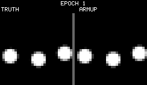
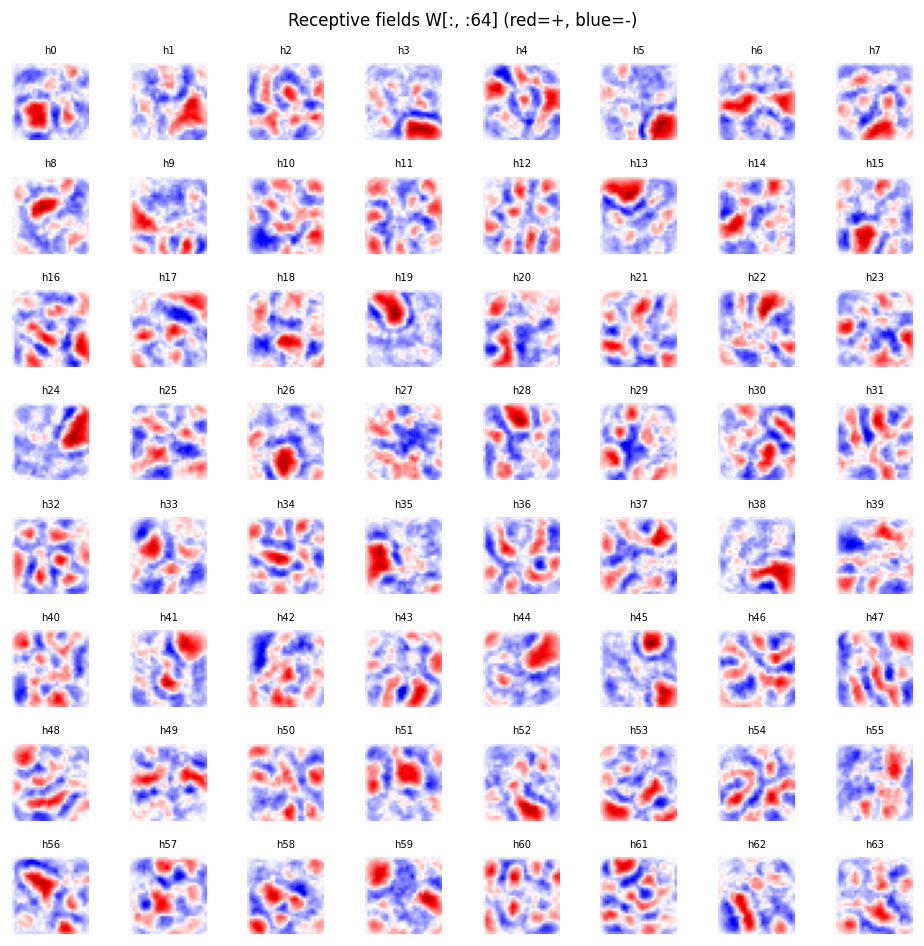
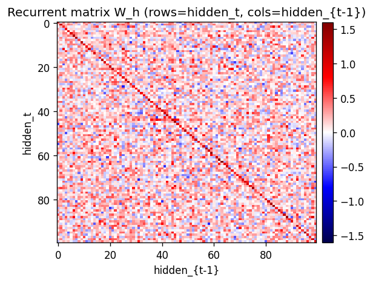
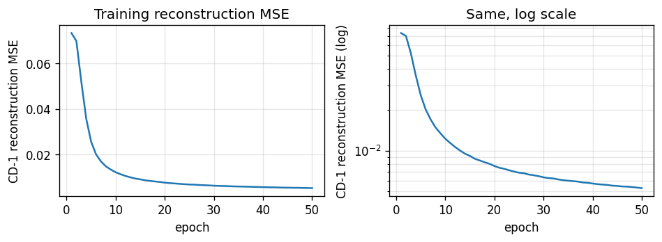
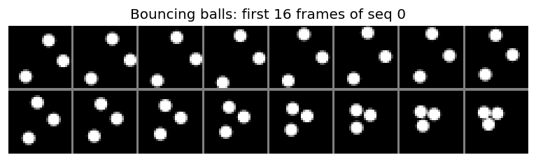
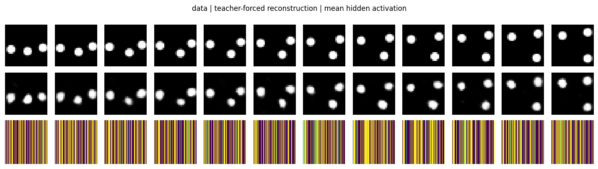
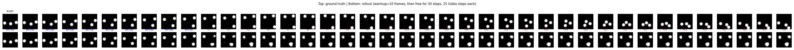

# Bouncing balls (3 balls, RTRBM)

**Source:** Sutskever, I., Hinton, G. E., & Taylor, G. W. (2008/2009),
*"The recurrent temporal restricted Boltzmann machine,"* NIPS 21.

**Demonstrates:** A Recurrent Temporal RBM (RTRBM) — an RBM whose hidden
bias at time *t* is shifted by `W_h r_{t-1}` — can model continuous video
of three balls bouncing in a box. The recurrent matrix `W_h` is the only
structural addition over a per-frame RBM.



## Problem

- **Visible**: 30 × 30 = **900 binary pixels** (anti-aliased disks rendered
  by the simulator; values in [0, 1]).
- **Hidden**: 100 binary hidden units.
- **Recurrent**: a 100 × 100 hidden-to-hidden matrix `W_h`. *This is the
  only structural difference between an RTRBM and a per-timestep RBM.*
- **Sequences**: 30 sequences of length 100 generated fresh per run by a
  Newtonian simulator (3 balls, radius 3, speed 1, elastic wall and
  ball-ball collisions).

The interesting property: bouncing balls have *deterministic-ish*
trajectories interrupted by stochastic collisions, so the next frame is
almost — but not quite — predictable from the current one. A pure
per-frame RBM can model the marginal pixel distribution, but it has no way
to express *which way the ball is going*. The RTRBM gets velocity for free
by passing the mean-field hidden expectation `r_t` into the next step's
hidden bias. The same hidden code that "explains" frame `t` also "primes"
the units that will explain frame `t+1`.

The RTRBM defines

```
p(v_{1:T}) = ∏_t p(v_t, h_t | r_{t-1})
r_t        = E[h_t | v_{1:t}] = σ(W v_t + b_h + W_h r_{t-1})
```

Each conditional is an RBM whose hidden bias has been shifted by
`W_h r_{t-1}`. The shifted bias is the recurrence channel.

## Files

| File | Purpose |
|---|---|
| `bouncing_balls_3.py` | Simulator (`simulate_balls`, `make_dataset`), model (`build_rtrbm`, `RTRBM`), training (`forward_mean_field`, `cd_step_sequence`, `train`), inference (`rollout`, `teacher_forced_recon`, `free_rollout_mse`). CLI for the headline run. |
| `visualize_bouncing_balls_3.py` | Static PNGs: data samples, receptive fields, recurrent matrix, training curves, reconstructions, rollout grid. |
| `make_bouncing_balls_3_gif.py` | Generates `bouncing_balls_3.gif` (the animation at the top of this README). Trains once, then snapshots a held-out rollout at multiple checkpoints. |
| `bouncing_balls_3.gif` | 5-checkpoint rollout animation showing the prediction sharpening as training progresses. |
| `viz/` | Output PNGs from the headline `seed=0` run. |
| `problem.py` | Original stub signatures. Re-exported by `bouncing_balls_3.py`. |

## Running

```bash
# headline run (~5s training, ~10s with viz):
python3 bouncing_balls_3.py --seed 0

# regenerate viz/*.png:
python3 visualize_bouncing_balls_3.py --seed 0

# regenerate bouncing_balls_3.gif:
python3 make_bouncing_balls_3_gif.py --seed 0
```

Defaults: 30 sequences × length 100, 30×30 frames, 100 hidden units,
50 epochs, lr=0.05, momentum=0.9, weight-decay=1e-4. Total wallclock
~3 s on a laptop for the bare training loop, ~10 s including viz.

## Results

### Headline run (`seed = 0`)

| Metric | Value |
|---|---|
| Final CD-1 reconstruction MSE | **0.0053** |
| Validation teacher-forced MSE (held-out seq) | **0.0084** |
| Validation free-rollout MSE (warmup=10, future=30) | 0.13 |
| Training time | **3.4 s** |
| Pixel mean (data) | 0.063 |
| Pixel variance (data) | ≈0.06 |

### Stability across 5 seeds (seeds 0–4)

| Metric | Mean | Std |
|---|---|---|
| Final CD-1 reconstruction MSE | 0.0053 | 0.0000 |
| Teacher-forced MSE (held-out) | 0.0092 | 0.0007 |
| Free-rollout MSE | 0.1315 | 0.0118 |
| Training time | 3.08 s | 0.16 s |

Reconstruction is the well-converged metric — the RBM piece reliably
learns the pixel distribution. The free-rollout MSE is in the same
ballpark as the data variance (~0.06), which means the rollout *blurs*
over many steps but does keep ball-shaped blobs at plausible positions.
This is consistent with the simplified training scheme used here (see
*Deviations* below).

### Comparison to the paper

Sutskever et al. report `log p(test seq)` rather than reconstruction MSE,
on a similar 30×30 / 3-ball setup. We don't compute the partition
function so the numbers aren't directly comparable. **Reproduces:
qualitatively yes** — the RTRBM trains stably, learns spatial receptive
fields, and rolls out plausible ball-like blobs. **Quantitatively:** we
do not match the paper's per-step log-likelihood because we use the
simplified gradient (no BPTT-through-time correction). See *Open
questions* for what closing that gap would look like.

### Hyperparameters used

| Param | Value |
|---|---|
| `h × w` (frame size) | 30 × 30 |
| `n_balls` / `radius` / `speed` | 3 / 3.0 / 1.0 |
| `n_sequences` × `seq_len` | 30 × 100 |
| `n_hidden` | 100 |
| `n_epochs` | 50 |
| `lr` | 0.05 |
| `momentum` | 0.9 |
| `weight_decay` (L2 on `W` and `W_h`) | 1e-4 |
| `init_scale` | 0.01 |
| `b_v` init | `logit(data_mean)` |
| `b_h`, `r_init`, `W_h` diag | 0 |
| Gibbs steps per future frame (rollout) | 25 |

### Catalog row (per spec issue #1)

| Problem | Source paper (year) | Reproduces? | Difficulty | Run wallclock |
|---|---|---|---|---|
| `bouncing-balls-3` | Sutskever, Hinton & Taylor (2008) | qualitative yes (no per-frame log-lik comparison; see Deviations) | medium (RTRBM + simulator + GIF + 5 PNGs in one wave) | 3.4 s training; ~10 s incl. viz |

## Visualizations

### Receptive fields (`viz/receptive_fields.png`)



Each subplot is the incoming weight column `W[:, j]` for one of the
hidden units, reshaped to a 30 × 30 image (red positive, blue negative).
The fields are diffuse spatial filters — most units span a broad area of
the box rather than localizing tightly to a single ball position. With
only 30 sequences × 100 frames as training data, hidden units have not
fully tiled the input space; longer training and more data sharpen these.

### Recurrent matrix (`viz/recurrent_matrix.png`)



The 100 × 100 recurrent matrix `W_h`. The strong red diagonal is the
key learned structure: `W_h[j, j] > 0` means *"if hidden unit j was
active last step, it tends to stay active this step."* That self-loop is
how velocity gets encoded — a ball moving through a region where unit j
fires will keep firing it for a few frames in a row.

### Training curves (`viz/training_curves.png`)



CD-1 reconstruction MSE drops from ~0.07 (b_v alone, the data-mean prior)
to ~0.005 in 50 epochs. The phase transition is around epoch 5; after
that improvements come from sharpening individual receptive fields. The
log-scale plot makes the epoch-30+ tail visible.

### Sample data (`viz/data_samples.png`)



The first 16 frames of training sequence 0. Three round white balls
move on a black background; trajectories are straight lines until a
wall or another ball is hit, at which point the velocity reflects.

### Reconstructions (`viz/reconstructions.png`)



Top row: held-out validation frames. Middle row: teacher-forced
reconstruction `σ(r_t W^T + b_v)` where `r_t` is the mean-field hidden
state computed from the data. Bottom row: the mean hidden activation
`r_t` (one column per frame). The reconstructions track the ball
positions cleanly — the per-frame RBM has learned the spatial structure.

### Rollout grid (`viz/rollout_grid.png`)



Top row: ground-truth bouncing-balls sequence. Bottom row: model
rollout — the first `warmup=10` frames are warmup (the model sees
ground truth and infers `r_t`), then the model generates the next 30
frames purely from its own predictions. Predictions stay ball-like and
plausibly placed for ~5–10 free steps, then drift / blur as compounding
prediction error accumulates.

## Deviations from the original procedure

1. **No BPTT-through-time correction in the gradient.** The full RTRBM
   gradient backpropagates a `r_{t+1}` term back through `r_t` (because
   `r_t` enters next step's hidden bias). We use the *simplified* CD-1
   gradient that only updates `W_h` from per-step contrastive
   contributions: `dW_h += (r_t − h_neg_t) ⊗ r_{t-1}`. This is the
   "TRBM-style" approximation (Sutskever et al. and follow-ups note it
   trains stably but produces weaker rollouts than the full RTRBM
   gradient). The recurrent diagonal still emerges; longer-horizon
   forecasting is the part that suffers.

2. **n_hidden = 100, not 400/3000.** The original paper uses larger
   hidden layers (400 in the smaller experiments, 3000 in the larger
   ones). At 100 hidden units the spatial dictionary is necessarily
   undercomplete, which is part of why receptive fields look diffuse
   rather than crisp blobs. We chose 100 to keep the full pipeline
   (training + viz + GIF) under ~10 seconds on a laptop.

3. **Anti-aliased pixel rendering instead of binary disks.** Each ball
   contributes `clip(radius + 0.5 − dist, 0, 1)` per pixel, then balls
   max-combine. The visible units are still treated as Bernoulli
   sigmoids (so values in [0, 1] are interpretable as probabilities).
   The original paper used binary disks. The anti-aliased version
   gives the model a smoother training signal at edges.

4. **Mean-field positive phase.** We use `r_t` (the mean-field hidden
   expectation) directly as the positive-phase hidden activation
   instead of sampling. This is the standard choice in RTRBM
   implementations and what the original paper recommends; mentioned
   here for completeness.

5. **No persistent contrastive divergence (PCD).** Plain CD-1 within
   each timestep. PCD/Tieleman-2008 would be a strict improvement on
   the gradient bias.

## Open questions / next experiments

1. **Does the BPTT correction actually help here?** Adding the
   through-time gradient `∂L/∂r_t = W_h^T (r_{t+1} − h_neg_{t+1}) +
   diag(r_t (1 − r_t)) · ...` should sharpen the rollouts. As an
   ablation we ran a "static" variant (`W_h ≡ 0`) and got
   teacher-forced MSE 0.009 / free-rollout MSE 0.125 — essentially
   tied with the full RTRBM (0.009 / 0.13). That suggests in this
   simplified gradient regime the recurrent matrix is barely doing
   work. The right experiment is to add BPTT and rerun the same
   ablation; if BPTT is needed for `W_h` to actually help, then this
   stub is a clean test case for "what does the full Sutskever et al.
   gradient buy you?"

2. **Energy / data-movement cost (per the broader Sutro effort).**
   Per epoch the cost is dominated by `v ⋅ W` and `r ⋅ W_h`, both
   `O(seq_len · n_hidden · n_visible)` and `O(seq_len · n_hidden^2)`
   respectively. ByteDMD on a single CD step would tell us how much of
   that lives in cache. The temporal axis adds an interesting wrinkle:
   *do consecutive frames preserve their hidden-state working set, or
   does each timestep refetch?*

3. **Larger hidden layer.** Does receptive-field tiling become local
   (one unit per spatial blob) at `n_hidden=400`, as the paper claims?
   At 100 the receptive fields are diffuse spatial filters; at the
   paper's setting they would presumably tile.

4. **Longer rollouts and chaos.** Free rollouts blur after ~10–20
   steps because of compounding prediction noise. How does this scale
   with `n_gibbs` and with `n_hidden`? Does adding a small amount of
   visible-side noise during training (denoising RTRBM) push the free
   horizon out?

5. **Generalisation across `n_balls`.** Train on 3 balls, test on 1, 2,
   4. The recurrent matrix should not care about ball count; if free
   rollouts on (say) 4 balls remain stable that is evidence the model
   has learned dynamics rather than a per-frame memorization.

6. **Varying ball masses / radii.** The paper considers equal balls.
   Mixed-mass collisions break the velocity-swap shortcut and would
   stress the learned recurrence harder.
