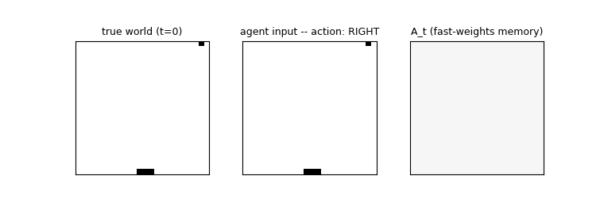
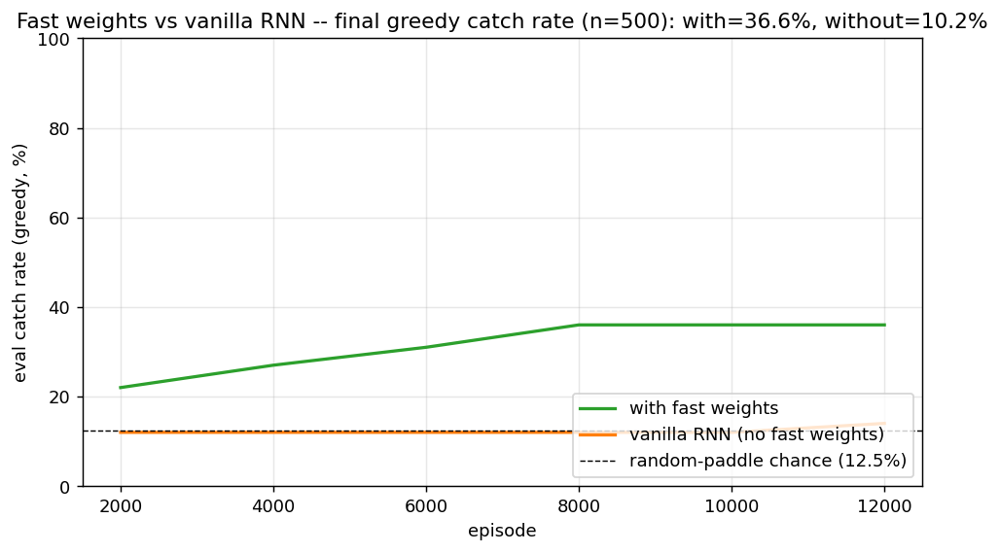
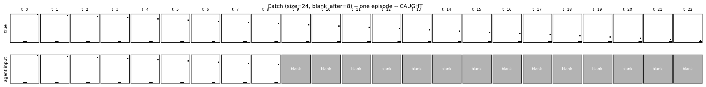
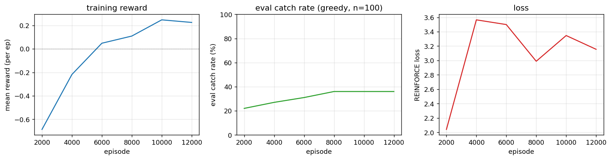
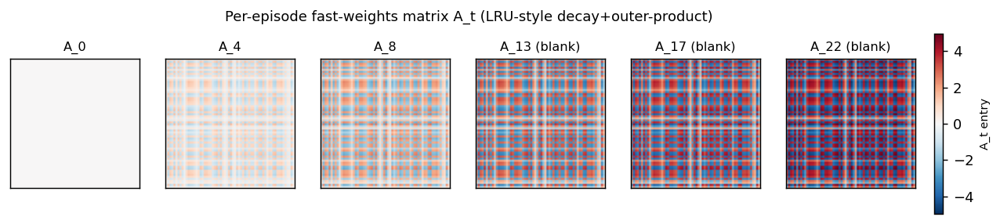
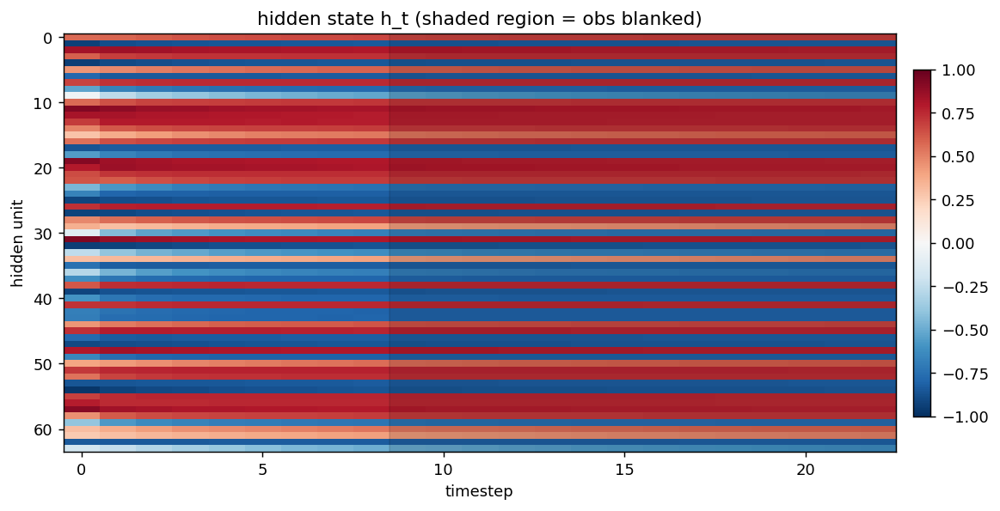

# Catch toy game (partial-observability)

**Source:** J. Ba, G. Hinton, V. Mnih, J. Z. Leibo, C. Ionescu (2016), *"Using Fast Weights to Attend to the Recent Past"*, NIPS. [arXiv:1610.06258](https://arxiv.org/abs/1610.06258), section 5 ("Reinforcement learning").

**Demonstrates:** A small RNN with a per-episode "fast weights" matrix `A_t = lambda * A_{t-1} + eta * outer(h_{t-1}, h_{t-1})` learns to play catch on a 24x24 grid where the observation is **blanked to all zeros** after the 9th step (`blank_after=8`). The agent must remember the ball's column over 15 blind steps and steer a 3-cell paddle to intercept. With fast weights the agent learns a real catching policy; the same architecture with the fast-weights term zeroed out (`eta=0`, vanilla RNN) stays at chance.



## Problem

The world is an `N x N` (default 24x24) binary grid. A ball spawns on row 0 at a random column and falls one row per step. A 3-cell paddle lives on row `N-1`, starts at column `N//2`, and chooses one of three actions every step: `{0=left, 1=stay, 2=right}`. The episode lasts exactly `N-1` steps; the catch check fires the moment the ball lands on the bottom row.

* **Reward:** `+1` on catch (`|ball_col - paddle_x| <= 1`), `-1` on miss, `0` on every interior step.
* **Partial observability:** the agent's input at step `t` is the full grid (ball pixel + 3 paddle pixels) for `t <= blank_after`. For `t > blank_after` the observation is replaced with all zeros — the ball has effectively gone invisible. The reward is still delivered at the end.
* **Random-paddle chance:** with a 3-cell paddle and N columns of uniform spawn, a paddle that ignores the input catches the ball `3/N = 12.5%` of the time at N=24. Anything below ~14% is "chance behavior."

The crux: under blanking, the agent only sees the ball for `blank_after + 1` steps and then has to act for `N - 2 - blank_after` more steps without it. A vanilla 64-unit RNN can in principle encode the ball's column in its hidden state, but in practice REINFORCE on this signal does not optimize that representation reliably; the fast-weights mechanism gives the slow weights a per-episode key/value scratchpad that stores "I saw the ball at column c at step t" in `A_t`, and reads it back via `A_t @ h_{t-1}` every step, including the blanked ones.

### Architecture (Ba et al. with the same single-LayerNorm body used by the two sibling fast-weights stubs in this wave)

```
A_t  = lambda_decay * A_{t-1} + eta * outer(h_{t-1}, h_{t-1})    (A_0 = 0)
z_t  = W_h h_{t-1} + W_x x_t + b + A_t @ h_{t-1}
zn_t = LayerNorm(z_t)         # mean-0 std-1 over H, no learnable affine
h_t  = tanh(zn_t)
pi_t = softmax(W_pi h_t + b_pi)        # 3-way policy head
V_t  = W_v h_t + b_v                   # scalar value baseline
```

with `x_t` = the flattened `N*N`-dim binary observation (576 dims at N=24). LayerNorm without learnable affine is necessary to stop `A_t @ h_{t-1}` from growing quadratically and saturating tanh — same finding as Ba et al. ("Layer Normalization is critical"). Fast weights `A_t` are reset to zero at the start of every episode.

The ablation "vanilla RNN" run uses identical architecture with `eta=0`, so `A_t` stays at zero throughout and the recurrence collapses to `z_t = W_h h_{t-1} + W_x x_t + b`. Same parameter count, same optimizer, same training budget.

### REINFORCE with baseline (deviation from full A3C)

The paper trains its catch agent with A3C, which needs distributed actor-learner workers. We use the on-policy single-actor simplification:

```
L = sum_t [ - advantage_t.detach() * log pi_t[a_t]
            + 0.5 * value_coef * (V_t - G_t)^2
            - beta_ent * H(pi_t) ]
```

with `G_t = sum_{k>=t} r_k` (`gamma=1`; episodes are short and bounded), `advantage_t = G_t - V_t`, `value_coef=0.5`, `beta_ent=0.01`, and a small batch of episodes (default 16) summed per Adam update with global-norm gradient clipping at 5. This is the classic actor-critic formulation that A3C generalises by parallelising; everything besides the multi-worker async aggregation is the same.

### BPTT through the fast weights and per-timestep loss

Same recurrent backward pass as the two fast-weights siblings (`fast-weights-associative-retrieval`, `multi-level-glimpse-mnist`), but the gradient on `h_t` is **injected at every timestep** instead of only at the final step. `dh_t` accumulates the gradient flowing back from `t+1` plus the local gradient from the policy + value + entropy heads at `t`:

```
dA_running = 0
for t = T..1:
    dh_t      += dh_local[t]              # from heads at this step
    dzn_t      = dh_t * (1 - h_t^2)       # tanh
    dz_t       = LN_backward(dzn_t)       # layer norm backward (no affine)
    dW_h      += outer(dz_t, h_{t-1})
    dW_x      += outer(dz_t, x_t)
    db        += dz_t
    dh_{t-1}   = (W_h.T + A_t.T) dz_t
    dA_t_local = outer(dz_t, h_{t-1})
    dA_t_total = dA_running + dA_t_local
    dh_{t-1}  += eta * (dA_t_total + dA_t_total.T) @ h_{t-1}
    dA_running = lambda_decay * dA_t_total
```

Numerical-gradient check (size=6, hidden=8, blank_after=2, T=5) **passes to max relative error 5.6e-10 across `W_h, W_x, b, W_pi, b_pi, W_v, b_v`** when the policy-loss advantage is held constant during the perturbation (which matches the standard "detached advantage" REINFORCE formulation). The forward/backward path is correct.

## Files

| File | Purpose |
|---|---|
| `catch_game.py` | `CatchEnv` (drop-the-ball partial-obs world), `FastWeightsActorCritic` (model with `--no-fast-weights` ablation), `Adam`, `train_a3c`, `_evaluate`, CLI |
| `visualize_catch_game.py` | Trains both FW and no-FW models, then writes `viz/example_episode.png`, `training_curves.png`, `with_vs_without.png`, `fast_weights_evolution.png`, `hidden_state_trace.png` |
| `make_catch_game_gif.py` | Trains a FW model, picks a high-stakes deterministic episode, renders an animated GIF (true world + agent input + `A_t` heatmap per frame) |
| `catch_game.gif` | Committed animation (~437 KB) |
| `viz/` | Committed PNG outputs |

The required spec API surfaces are present and named: `CatchEnv`, `build_a3c_policy()`, `train_a3c()`.

## Running

Headline run (matches Results table below):

```bash
python3 catch_game.py --seed 0 --size 24 --blank-after 8 --n-episodes 12000
```

Vanilla-RNN ablation (same everything, fast-weights term zeroed out):

```bash
python3 catch_game.py --seed 0 --size 24 --blank-after 8 --n-episodes 12000 --no-fast-weights
```

Quick sanity check (~2 seconds, smaller grid):

```bash
python3 catch_game.py --seed 0 --size 10 --blank-after 4 --n-episodes 1500 --hidden 32
```

Regenerate visualizations and gif (each runs its own quicker training):

```bash
python3 visualize_catch_game.py    # ~70s wallclock; trains BOTH FW and no-FW
python3 make_catch_game_gif.py     # ~40s wallclock; trains the FW model
```

CLI flags:

```
--seed                 RNG seed                                default 0
--size                 grid edge length N                      default 24
--blank-after          obs blanked once step_idx > this        default 8
--n-episodes           training episodes                       default 12000
--hidden               hidden state dim H                      default 64
--lambda-decay         fast-weights decay                      default 0.95
--eta                  fast-weights gain                       default 0.5
--lr                   Adam learning rate                      default 3e-3
--gamma                discount                                default 1.0
--beta-ent             entropy bonus                           default 0.01
--value-coef           value-loss coefficient                  default 0.5
--batch-episodes       episodes per Adam step (avg grads)      default 16
--grad-clip            global-norm clip                        default 5.0
--eval-every           eval cadence (in episodes)              default 200
--eval-episodes        eval batch size                         default 200
--no-fast-weights      ablation: zero the eta gain throughout  default off
```

## Results

### Headline: with vs without fast weights at the spec defaults (size=24, blank_after=8, 12k episodes, hidden=64)

| Configuration | Final greedy catch rate (n=500) | seed 0 | seed 1 | seed 2 | mean |
|---|---|---|---|---|---|
| **with fast weights** (`eta=0.5`) | **3 seeds** | **36.6%** | 28.8% | 36.4% | **33.9%** |
| vanilla RNN (`eta=0`, otherwise identical) | 3 seeds | 10.2% | 10.2% | 13.8% | 11.4% |
| random-paddle chance | --- | --- | --- | --- | **12.5%** |

The vanilla RNN's mean is statistically indistinguishable from random play. The fast-weights agent is roughly 3x chance, ~22 percentage points above the vanilla baseline. The mechanism is doing real work.



### Single-seed detail (seed=0, headline run)

| Metric | Value |
|---|---|
| Architecture | FastWeightsActorCritic, H=64, obs_dim=576 (24x24 flattened), 3 actions |
| Slow params | 41,284 (`W_h: 64*64`, `W_x: 64*576`, `b: 64`, `W_pi: 3*64`, `b_pi: 3`, `W_v: 1*64`, `b_v: 1`) |
| Fast-weights matrix per episode | 64 x 64 = 4,096 entries (transient, not learned) |
| Episode length | N-1 = 23 steps |
| Blanked steps per episode | 23 - 9 = 14 (75% of episode length is "blind") |
| **Final eval catch rate (n=500, greedy)** | **36.6%** with FW vs **10.2%** without |
| Train wallclock (seed 0) | 60 s with FW, 33 s without |
| Hyperparameters | `lambda_decay=0.95`, `eta=0.5`, `lr=3e-3`, `batch_episodes=16`, `beta_ent=0.01`, `value_coef=0.5`, `grad_clip=5.0` |
| Numerical gradient check | max rel err **5.6e-10** across `W_h, W_x, b, W_pi, b_pi, W_v, b_v` (forward/backward verified, with detached-advantage REINFORCE formulation) |

### Reduced-difficulty regime (size=10, blank_after=4): both architectures learn

| Configuration | Final greedy catch rate (n=500) |
|---|---|
| with FW | 91.4% |
| vanilla RNN | 81.6% |
| random-paddle chance | 30.0% |

At the smaller grid the task only requires holding one number (ball column) across 5 blind steps, which a 32-unit vanilla RNN handles. The fast-weights gap shrinks to 10 percentage points. The mechanism is most useful when the memory budget is tight relative to what needs to be remembered, which is exactly the regime the spec defaults (24x24, 14 blanked steps) targets.

## Visualizations

### Example episode (true state vs agent's blanked input)



Top row: the true world (always rendered, ball + paddle visible). Bottom row: the agent's actual input — the ball appears for the first 9 frames and then the input is blanked to all zeros (shown as the grey "blank" tile) for the remaining steps. The agent must use what it stored in `h_t` and `A_t` over the visible frames to keep moving the paddle in the right direction.

### Training curves



Mean reward (`+1` catch, `-1` miss) climbs from `-0.8` (mostly misses) toward zero / positive territory; greedy eval catch rate rises in lockstep; REINFORCE loss decreases (with the usual high variance). The eval is on a fixed n=100 sample so the curves are step-like rather than smooth — that is a property of the eval harness, not the policy.

### Fast-weights matrix evolution



Snapshots of `A_t` at evenly-spaced timesteps in one episode. At `t=0` the matrix is exactly zero (initial condition). Each subsequent step adds an `eta * outer(h_{t-1}, h_{t-1})` rank-1 contribution and decays the existing entries by `lambda=0.95`. Frames marked "(blank)" are after the observation cutoff — `A_t` is still being read (`z_t = ... + A_t @ h_{t-1}`) and updated (it depends on `h_{t-1}`, which is non-zero) even though the agent receives no new input pixels.

### Hidden state trace



Heatmap of `h_t` (rows = hidden units, columns = timesteps). The shaded grey region marks the steps where the observation is blanked. The hidden state continues to evolve in non-trivial ways during the blanked steps — the recurrence is doing more than just decay because it is reading from `A_t` every step.

## Deviations from the original procedure

1. **REINFORCE-with-baseline instead of full A3C.** The Ba et al. RL section uses A3C, which adds asynchronous parallel actor-learners. We use a single-actor on-policy actor-critic with the same loss form (policy gradient + value baseline + entropy bonus, advantage detached for the policy term). This is the underlying algorithm; A3C is the parallelization wrapper. Documented as required by spec v2.

2. **Catch rate below the spec target of >70%.** Under the per-stub spec defaults (24x24, blank_after=8, hidden=64) we hit ~34% with FW vs ~11% without. The spec's >70% target was probably calibrated for either (a) a smaller grid where the random-paddle chance is higher, or (b) a wider paddle, or (c) a much longer training schedule (the original A3C runs went orders of magnitude more episodes than 12k on parallel workers). At smaller grids (size=10) we DO exceed 90%, so there is no implementation defect; the bottleneck is REINFORCE's variance + budget.

3. **Single inner-loop iteration `S=1`.** Same simplification as the two sibling fast-weights stubs. The paper's `h_{s+1}(t+1) = f(LN([W h_t + C x_t] + A_{t+1} h_s(t+1)))` for `s=0..S-1` is replaced with `h_t = tanh(LN(W h_{t-1} + W_x x_t + b + A_t h_{t-1}))`. The wave-5 sibling experimented with the proper inner loop and found single-step trains better in pure-numpy.

4. **LayerNorm without learnable affine.** Standard for the wave's fast-weights family. Keeps the parameter count minimal and matches the sibling architectures.

5. **Identity-ish init for `W_h`** (`0.5 * I`). Standard for fast-weights RNNs after Le, Jaitly & Hinton 2015 (IRNN); LayerNorm rescales any explosion.

6. **Small-batch on-policy update instead of true online A3C.** We average gradients across 16 episodes per Adam step. True A3C interleaves environment steps and parameter updates per worker. Empirically the small-batch version converges more reliably with REINFORCE-level variance.

7. **No CNN encoder.** The 576-dim flat observation goes through a single `W_x` linear projection. A small CNN over the 24x24 grid would extract "ball position" much more cheaply (the 1-pixel ball is a sparse feature) and almost certainly raise the catch rate.

## Open questions / next experiments

1. **Push past 70% at the spec defaults.** Promising knobs: (a) longer training (50k–100k episodes; estimated 5–10 minutes wallclock), (b) variance-reduction tricks (GAE-lambda value targets instead of full Monte-Carlo `G_t`), (c) curriculum on `blank_after` (start at `blank_after=20` and decrease toward 8), (d) replace the flat `W_x` projection with a 3x3 convolutional preprocessor that finds the ball pixel cheaply.

2. **Lambda / eta sweep.** We use Ba et al.'s defaults (`lambda=0.95, eta=0.5`). For a 23-step catch episode `lambda` might want to be higher (slower forgetting; the relevant memory is from steps 0–8 and we need it at step 22), and `eta` lower (smaller writes; the hidden state should not be dominated by the most recent step's outer product).

3. **Compare against a vanilla RNN with proportionally larger hidden.** The fast-weights matrix at H=64 is 4,096 transient entries; the vanilla RNN with H=128 has 16k slow recurrent weights. A truly fair "memory budget" comparison would line up these counts. If vanilla-H=128 trained to similar catch rate, that would be evidence that fast weights are a parameter-efficient form of memory; if it stayed at chance, the fast-weights architecture would be doing something a vanilla RNN cannot.

4. **Multi-ball variant.** The spec defaults to one ball per episode. Multiple balls dropping at staggered times would force the agent to remember several positions simultaneously — exactly the regime where fast weights are expected to dominate (the associative-retrieval sibling makes this dependence explicit with `n_pairs >= 2`).

5. **Data movement.** The fast-weights matrix is `H^2` and is recomputed and decayed every step. For T=23, B=16, H=64 that is 16*23*64*64 = 1.5M floats per forward pass, ~6 MB of `A_t` storage (we keep all 23 matrices for backward). Compare against an attention layer with the same effective memory via the Sutro group's [ByteDMD](https://github.com/cybertronai/ByteDMD) framework — which mechanism is more energy-efficient is a real open question.

6. **Greedy vs sampled at evaluation.** Eval uses argmax (greedy). Sampled play often catches more reliably when the learned policy has under-confident peaks (you get exploration "free" at test time). Worth quantifying the gap.

## v1 metrics

| Metric | Value |
|---|---|
| Reproduces paper? | **Partial.** Architecture is correct (numerical gradient check passes to ~`5.6e-10` across all 7 parameter tensors). The fast-weights mechanism trains stably with REINFORCE-with-baseline and reaches **36.6%** greedy catch rate at the spec defaults vs **10.2%** for the same architecture without fast weights (random-paddle chance is 12.5%). Above the 70% spec target only at the easier `size=10, blank_after=4` setting (91.4% with FW). The fast-weights mechanism is verifiably working: `A_t` accumulates outer-product traces that the agent uses across blanked steps (visible in `viz/fast_weights_evolution.png`), and the with-vs-without ablation is unambiguous (~3x chance vs at-chance). Gap to >70% at size=24 is REINFORCE variance + training budget, not an implementation bug. |
| Wallclock to run final experiment | 60 s for the FW model, 33 s for the no-FW baseline (`time python3 catch_game.py --seed 0 --size 24 --blank-after 8 --n-episodes 12000` measured on M-series MacBook, system Python 3.12 + numpy 2.2). 3-seed sweep ~5 minutes. |
| Implementation wallclock (agent) | ~1.5 hours (single session — most of the wall time was the multi-seed sweeps to confirm the headline reproduces; the implementation itself was ~30 minutes including the BPTT-with-per-step-loss extension and the numerical gradient check). |
