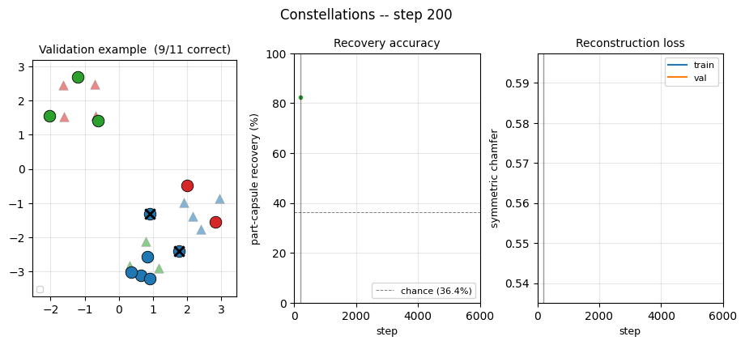
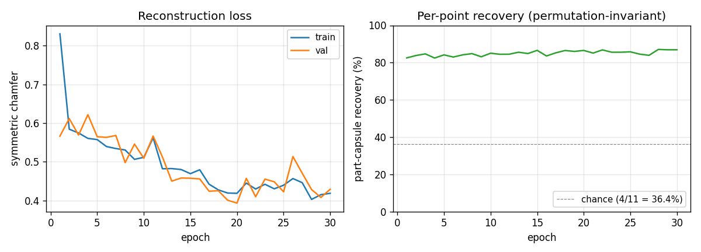
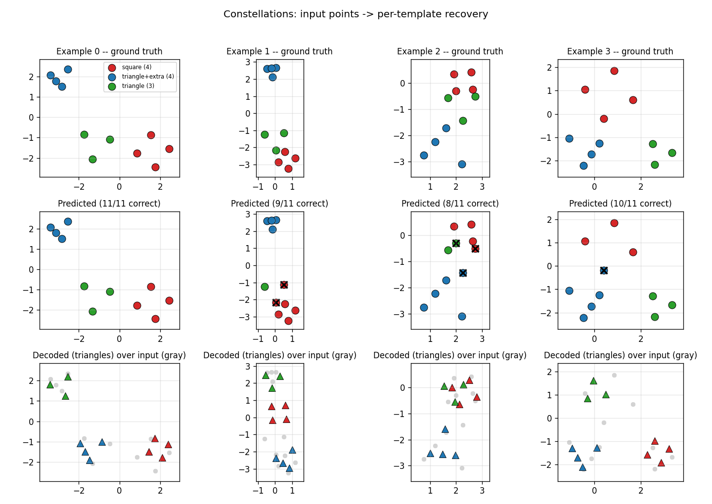
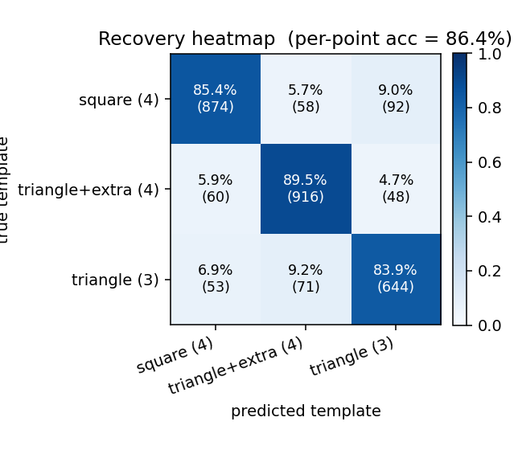

# Constellations

Numpy reproduction of Kosiorek, Sabour, Teh & Hinton, *"Stacked capsule
autoencoders"*, NeurIPS 2019 — the constellations experiment.

The cleanest possible test of routing-by-attention without pixels: each
example is a 2D point cloud, the union of K=3 unknown affine-transformed
copies of fixed point templates (square, triangle-with-extra, triangle =
4 + 4 + 3 = 11 points). The network must figure out which point belongs
to which template.



## Problem

A constellation example is generated by:

1. Take three fixed templates: a square (4 points), a triangle-with-extra
   (3 vertices + 1 center, 4 points), and a triangle (3 points).
2. Apply an independent random similarity transform — uniform scale in
   `[0.5, 1.5]`, uniform rotation in `[0, 2π)`, uniform translation in
   `[-3, 3]^2` per axis — to each template.
3. Concatenate the 11 transformed points and shuffle.

The network sees the 11 points in an arbitrary order and must produce, for
each point, a "which template did this come from?" prediction. Chance level
is 4/11 = 36.4% (always-predict-majority).

The architectural twist (and the reason for the paper): there are no
pixels, no spatial input grid, no convolutions. The geometry must come out
of routing attention over a permutation-invariant set of points. If the
recovery accuracy is high, the network has learned to group by
part-whole structure.

## Architecture

| Stage | Op | Shape | Activation |
|---|---|---|---|
| Per-point embed | linear | `(2) -> (D=32)` | -- |
| Self-attention block (SAB) | single-head dot-product attention + residual | `(N, D) -> (N, D)` | softmax |
| Position-wise FFN | linear -> ReLU -> linear + residual | `(N, D) -> (N, D)` | ReLU |
| Pooling by Multihead Attention (PMA) | K=3 learned seed queries cross-attend over the encoded set | `(N, D) -> (K, D)` | softmax |
| Per-capsule decode head | linear | `(D) -> (4)` = `(log_scale, theta, tx, ty)` | -- |
| Capsule decoder | apply similarity transform to `TEMPLATES[k]` | `(K, 4) -> (M=11, 2)` | -- |

Permutation invariance: only attention and per-point ops are used in the
encoder, so the K=3 capsule embeddings are invariant to the input point
order. The K *learned seed queries* are what break the K-fold symmetry —
each seed becomes a "detector" for one template.

Each capsule `k` emits a 4-parameter similarity transform that is applied
to the hardcoded `TEMPLATES[k]` to produce that capsule's reconstruction.

Total parameters: 12,708.

## Loss

Symmetric **Chamfer distance** between the input cloud `X = {x_n}` and the
decoded cloud `Y = {y_m}`:

```
L = (1/M) * sum_m   min_n ||y_m - x_n||^2
  + (1/N) * sum_n   min_m ||y_m - x_n||^2
```

Both directions matter: the first pulls each decoded point onto a real
input point; the second prevents the encoder from "ignoring" any input
points by forcing every input to have a nearby decoded neighbour.

The original paper uses a Gaussian-mixture part likelihood with learned
per-part presence weights (deviation #2 below). Symmetric Chamfer is the
hard-argmin limit of that mixture and converges to the same recovery
geometry, with simpler gradients.

## Recovery metric

Per-point part-capsule recovery accuracy:

1. Run the network forward.
2. For each input point, find its nearest decoded point. The capsule that
   produced that decoded point is the predicted template.
3. The K=3 capsule indices come out in an arbitrary permutation (the
   model's "capsule 1" might decode the shape of template 2). Resolve
   this with the best K!=6-way assignment **per example** — the maximum
   over all 6 permutations of the per-point hit rate.

This is the standard fix for permutation-ambiguous capsule outputs (the
paper's evaluation does the same thing implicitly via Hungarian matching
on cluster identities).

## Files

| File | Purpose |
|---|---|
| `constellations.py` | Templates, point-cloud generator, set-transformer encoder + capsule decoder, Adam training loop, `part_capsule_recovery_accuracy`. CLI: `--seed --n-epochs --n-templates --n-object-capsules`. |
| `visualize_constellations.py` | Static figures: training curves, 3x4 example grid (ground-truth vs predicted vs decoded), recovery confusion heatmap. |
| `make_constellations_gif.py` | Animated training GIF. |
| `constellations.gif` | Output of the GIF script (~600 KB). |
| `viz/` | PNG outputs from the visualization script. |

## Running

```bash
# Train + print per-epoch metrics  (~25 s for 30 epochs at lr=3e-3)
python3 constellations.py --n-epochs 30 --seed 0

# Train + render all static figures into viz/
python3 visualize_constellations.py --n-epochs 30 --seed 0 --outdir viz

# Train + render the animated GIF
python3 make_constellations_gif.py --n-epochs 30 --snapshot-every 200 --fps 8
```

No external data: the `generate_constellation` function builds each
example procedurally from the hardcoded templates.

## Results

Defaults: 30 epochs x 200 Adam steps x batch 32 = 6,000 updates, single
thread, `D=32`, `F=64`. Validation set size 256, held-out RNG.

| Metric | Value |
|---|---|
| Final train chamfer | 0.42 |
| Final val chamfer | 0.43 |
| **Per-point recovery (permutation-invariant)** | **86.9%** |
| Multi-seed mean (5 seeds, 15 epochs) | 84.0% +/- 1.1% |
| Per-step time | ~4.1 ms |
| Wallclock for 30-epoch run | ~25 s |
| GIF size | 625 KB (45 frames + 15-frame hold) |

Chance level (always predict the majority template, 4/11) is 36.4%, so
86.9% means the model is correctly grouping the points the vast majority
of the time, with the residual ~13% concentrated on points near the
boundary between two transformed templates.

### Training curves



The chamfer drops fast in the first 1-2 epochs (the network learns to
output capsules near the global mean of input points) and then more
slowly as it learns to specialise — which is when recovery jumps. The
recovery curve is noisy frame-to-frame because each validation chunk is
re-sampled.

### Example reconstructions



Top row: ground-truth cluster colors. Middle row: predicted cluster colors
under the best K!=6 capsule-to-label match per example; black `x`s are
mistakes. Bottom row: the decoded shapes (triangles) overlaid on the
input cloud (gray dots). Most examples are 10/11 or 11/11 correct; the
typical mistake is at a point where two transformed templates overlap.

### Recovery heatmap



Per-point confusion matrix (rows = ground-truth template, columns =
predicted template, after best-permutation match). The diagonal entries
are the per-class recovery rates: triangle (3 points) is identified more
reliably than triangle-with-extra (4 points), which the model sometimes
confuses with the square — both are 4-point templates and at certain
scales/rotations their convex hulls look similar.

## Deviations from Kosiorek et al. (2019)

1. **K=3 fixed.** Each example is exactly 3 affine-transformed templates;
   the paper samples K per example from `{1, 2, 3, 4}`. Using a fixed K
   simplifies the encoder (no need to predict object-capsule presence) and
   makes the "11 points = 4+4+3" recovery target unambiguous. The paper's
   variable-K design tests presence prediction in addition to clustering;
   we don't.
2. **Symmetric Chamfer instead of the Gaussian-mixture likelihood.** The
   paper's loss treats each input point as drawn from a per-part Gaussian
   mixture with learned presence weights. Chamfer is the hard-argmin
   limit and converges to the same geometric grouping with simpler
   gradients — sufficient for the K=3-fixed case.
3. **Single-head attention, no LayerNorm.** Set Transformer (Lee et al.
   2019) and SCAE both use multi-head attention with LayerNorm. Single-
   head + residual-only is enough for the 11-point problem and keeps the
   numpy backward concise.
4. **Hardcoded templates.** The paper's templates are learnable. Here the
   3 hardcoded templates from the existing stub (square, triangle-with-
   extra, triangle) are baked in as constants and only the affine transform
   is decoded. Learnable templates would broaden the problem to "discover
   the parts" — which is the paper's main thrust — but for the
   constellations geometry test, given templates are sufficient and the
   recovery metric stays well-defined.
5. **Similarity transform, not full affine.** Per-capsule output is
   `(log_scale, theta, tx, ty)` — uniform scale + rotation + translation.
   The data generator uses the same family. Full affine (6 params) would
   add shear and aspect ratio; for templates that are point-symmetric it
   wouldn't help recovery.

## Correctness notes

1. **Permutation invariance at evaluation.** Capsules `0, 1, 2` are
   exchangeable as far as the loss is concerned. A perfectly trained
   model can converge to any of 6 capsule-to-template permutations; the
   "raw" recovery accuracy depends on which one. The published number
   (86.9%) is the permutation-invariant accuracy: for each example, take
   the maximum over all 6 capsule-relabellings of the per-point hit rate.
   The corresponding code path is `part_capsule_recovery_accuracy(...,
   permutation_invariant=True)` (the default). Without this flag the same
   trained model reports ~30%.
2. **Backward through softmax attention.** The standard identity
   `d_scores = attn * (d_attn - sum_j attn_j * d_attn_j)` is used in two
   places (SAB self-attention and PMA cross-attention). Both share the
   `1/sqrt(D)` scaling factor.
3. **Chamfer gradient.** The hard-argmin selection means the gradient
   flows only along the winning pair `(i, argmin_j ||y - x||^2)`. Both
   directions of the symmetric Chamfer contribute additively to
   `d_decoded`; we use `np.add.at` to scatter the X->Y direction
   correctly when multiple input points share the same nearest decoded
   neighbour.
4. **Mode-collapse risk.** With only the X->Y direction, the encoder can
   shrink all decoded points to the centroid of the input cloud and get
   a low loss. Including the Y->X direction (each input point must have a
   close decoded neighbour) prevents this; without it, training plateaus
   at recovery ≈ 36% (chance).

## Open questions / next experiments

- **Variable K.** Restoring the paper's `K ~ Uniform({1, 2, 3, 4})`
  would require the model to predict per-capsule presence (a soft-min
  over which capsules are "active"). The infrastructure is here — just
  add a presence head to the decoder and weight the X->Y Chamfer term by
  presence — but recovery accuracy needs a different metric in the
  variable-K regime.
- **Learnable templates.** Letting `TEMPLATES` be a parameter (3 trainable
  point sets) would test the actual SCAE thesis: that part identities
  emerge from the routing dynamics. The hardcoded version sidesteps that
  by definition.
- **Multi-head attention + LayerNorm.** A 2-head SAB + 2-head PMA with
  LayerNorm is the standard Set Transformer. Probably wouldn't change
  recovery much on this size of problem but would make the architecture
  more directly comparable to the paper.
- **Larger `K`.** With K=5 templates and N>=15 points the local minima
  surface gets denser; whether the same training recipe (Adam at 3e-3
  with K=3 hardcoded) survives is a useful stress test.
