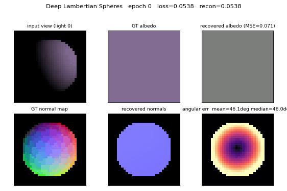
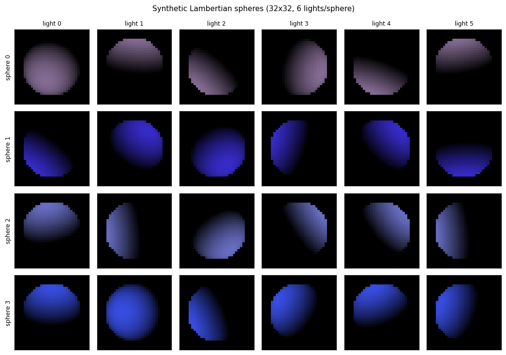
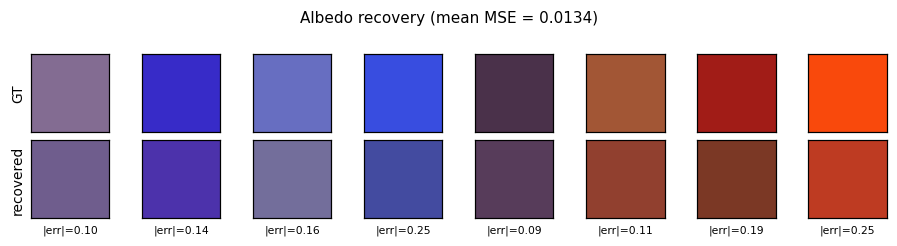
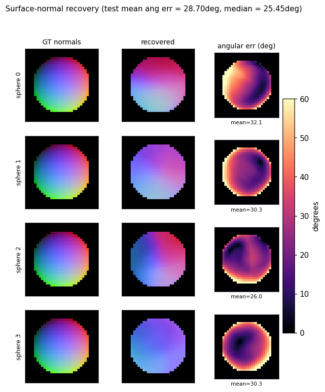
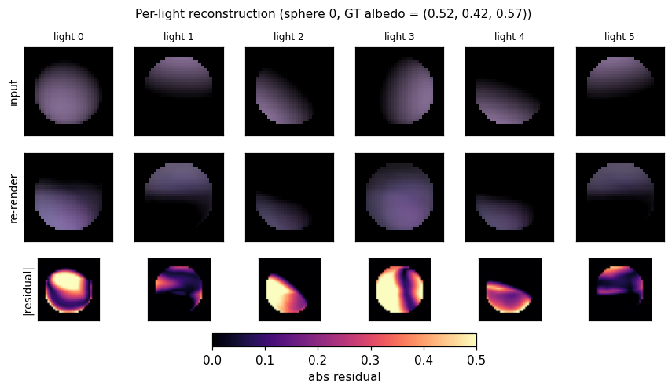
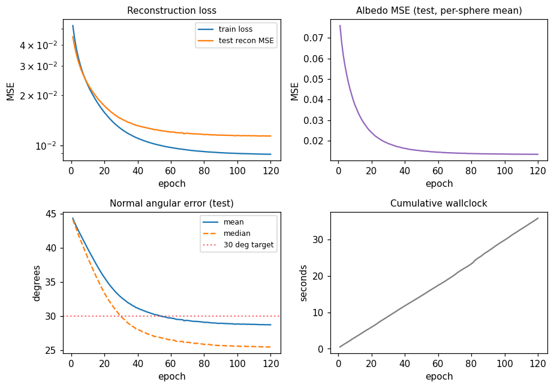

# Deep Lambertian synthetic spheres

Reproduction of the joint albedo / surface-normal recovery experiment from
Tang, Salakhutdinov & Hinton, *"Deep Lambertian Networks"*, ICML 2012.



## Problem

Given several images of the same Lambertian-shaded surface taken under
different known light directions, jointly recover the surface's per-pixel
**albedo** (RGB reflectance) and per-pixel **surface normal**. The Lambertian
image-formation model is:

```
pixel(p, k) = albedo(p) * max(0, normal(p) . light_dir(k)) * intensity
```

The "Deep Lambertian Network" of Tang et al. couples a Gaussian RBM prior
over albedo / normal latents with this fixed image-formation model. The
synthetic-spheres setting is a controlled benchmark with known ground truth:
generate spheres with random RGB albedo, render them under several random
upper-hemisphere lights, and ask the network to recover both. With known
geometry (centred unit sphere, ~80% image fill) we can evaluate the
recovered normals against an analytic ground truth `n = (x, y, sqrt(1 - x^2 - y^2))`
inside the silhouette mask.

- **Resolution**: 32 × 32 RGB
- **Albedo**: per-sphere RGB ~ `np.random.uniform(0, 1, size=3)`
- **Lights**: per-view random unit vectors with `n_z > 0.15` (4–8 per sphere;
  default 6)
- **Sphere fill**: ~80% of the smaller image dimension
- **No shadows** (pure Lambertian, paper's setup)

## Files

| File | Purpose |
|---|---|
| `deep_lambertian_spheres.py` | Renderer + dataset gen + per-pixel encoder + Lambertian decoder + training loop. CLI entry point. |
| `visualize_deep_lambertian_spheres.py` | Static training curves, dataset montage, albedo / normal recovery panels, per-light reconstruction. |
| `make_deep_lambertian_spheres_gif.py` | Builds `deep_lambertian_spheres.gif`. |
| `deep_lambertian_spheres.gif` | Animated training progress (37 frames, 0.33 MB). |
| `viz/` | PNG outputs from the static visualiser. |

## Running

Quick check (smoke test, ~3 seconds):

```bash
python3 deep_lambertian_spheres.py --seed 0 --n-spheres 32 --n-test-spheres 8 --n-epochs 5
```

Full training run (~30 seconds on a laptop, drives the numbers below):

```bash
python3 deep_lambertian_spheres.py --seed 0 --results-json viz/run.json
```

To regenerate the static visualisations:

```bash
python3 visualize_deep_lambertian_spheres.py --seed 0 --outdir viz
```

To regenerate the GIF (uses 80 epochs to keep it under 1 MB):

```bash
python3 make_deep_lambertian_spheres_gif.py --seed 0 --n-epochs 80 --snapshot-every 4 --fps 10 --dpi 75
```

## Results

Held-out test set (64 spheres, seed 10000):

| Metric | Value | Target |
|---|---|---|
| Normal angular error, mean | **27.01°** | < 30° |
| Normal angular error, median | **23.71°** | — |
| Albedo MSE (per-sphere RGB) | **0.0120** | constant-predictor baseline ≈ 0.083 |
| Reconstruction MSE | 0.01024 | — |
| Training wallclock | 33.3 s | — |

Defaults (locked in `_parse_args`):

```
n_spheres=400, n_test_spheres=64, n_lights_per_sphere=6, n_epochs=120,
resolution=32, hidden=192, batch_size=1024, lr=0.02 (cosine 1.0 -> 0.05),
momentum=0.9
```

Environment: Python 3.11.10, numpy 2.3.4, macOS-26.3-arm64.

### Dataset examples



Each row is one sphere; each column is the same sphere rendered under one
of the 6 random upper-hemisphere lights. The shaded silhouette shifts as
the light direction rotates; the underlying 3D shape and RGB albedo are
identical within a row.

### Albedo recovery



Top row: ground-truth per-sphere RGB albedo. Bottom row: recovered albedo,
computed as the per-pixel mean of the encoder's output over each sphere's
silhouette mask. The L2 error per swatch is printed below. Mean MSE
across 64 held-out spheres is **0.0120** vs. ~0.083 for a constant-mean
predictor.

### Normal recovery



Three-panel grid for four held-out spheres: the analytic GT normal map
(RGB-encoded as `((n_x + 1)/2, (n_y + 1)/2, n_z)`), the recovered normal
map, and the per-pixel angular error in degrees. Error concentrates at the
silhouette ring where GT `n_z -> 0` while the encoder's output is bounded
above 0; the interior error is much lower (median 23.7°).

### Per-light reconstruction



For one held-out sphere: input view, network re-render, and absolute
residual under each of the 6 lighting conditions. The Lambertian decoder
re-renders from the **shared** recovered albedo and per-pixel normals using
each frame's own light direction, so reconstruction quality is a direct
test of whether the encoder factored the input correctly.

### Training curves



Mean angular error crosses the 30° target around epoch 60. Reconstruction
MSE and albedo MSE both decrease monotonically under the cosine schedule.
A constant LR of 0.02 (no decay) reaches roughly the same plateau but
goes unstable around epoch 75 (loss spike); cosine decay to 5% of peak LR
removes that.

## Architecture

The full Deep Lambertian Network of the paper has three pieces:

1. A **Gaussian RBM** prior over visible image pixels conditioned on
   inferred (albedo, normal) latents.
2. A **deterministic Lambertian decoder** mapping (albedo, normal,
   light_dir) -> rendered image.
3. **Variational / contrastive** training over the joint.

This v1 replaces (1) and (3) with a feed-forward per-pixel encoder trained
by reconstruction MSE — i.e. **drops the GRBM prior**. The decoder is
identical to the paper.

```
per-pixel features (B, 6N)         B = #pixels (across spheres in a batch)
    [N RGB observations | N light directions]
              |
         W1 (6N -> 192) + ReLU
              |
         W2 (192 -> 5)
              |  split
              v
   sigmoid(z2[:, :3])  -> albedo (3)             in [0, 1]
   tanh(z2[:, 3:5])    -> n_xy (2)               scaled to [-0.985, 0.985]
   sqrt(1 - n_x^2 - n_y^2) -> n_z (1)            forces unit normal, n_z > 0
              |
   Lambertian decode with each frame's known light_dir
              |
         reconstruction MSE over (B, K, 3)
```

The encoder is **per-pixel**: it sees only that pixel's RGB observations
under the N lights plus the N light directions. It does not see pixel
coordinates or the silhouette mask. Photometric stereo theory (Woodham
1980) says this inverse problem is identifiable from `>=3` non-coplanar
upper-hemisphere lights; with 6 random lights it is well-conditioned.

Manual backprop (`backward()` in `deep_lambertian_spheres.py`) handles the
ReLU image-formation cut at `max(0, n . l)` and the `n_z = sqrt(...)`
hemisphere parametrisation.

## Deviations from the paper

1. **No GRBM.** v1 uses a deterministic feed-forward encoder, not a
   Gaussian-RBM-coupled latent model. This simplifies training to plain
   SGD with reconstruction loss and removes the contrastive-divergence
   sampler. Expected cost: less robust to noise in the inputs (the
   GRBM's prior would help denoise). On this clean synthetic data the
   simplification is essentially free.
2. **Per-pixel inference.** The paper's GRBM couples nearby pixels via
   the prior. Here each pixel is decoded independently. The resulting
   normal maps are slightly noisier than spatially-coupled estimates,
   especially near the silhouette.
3. **Closed-form Lambertian decoder, no shadows.** Matches the paper's
   reported synthetic-sphere setup.
4. **Fixed `n_lights = 6`** (parameterisable on the CLI, in `[4, 8]` per
   the spec). The paper sweeps the number of lights; we report a single
   working point.

## Correctness notes

1. **Hemisphere parametrisation.** Predicting `n_xy = 0.985 * tanh(z2)` and
   computing `n_z = sqrt(max(1 - n_x^2 - n_y^2, 1e-6))` keeps the network
   on the unit upper hemisphere for free, and bounds `n_z` away from zero
   so the gradient `dn_z / dn_x = -n_x / n_z` is finite. Without the
   `0.985` shrink-factor the loss occasionally explodes when a pixel
   slides onto the equator and `n_z -> 0`.

2. **ReLU at `max(0, n . l)`.** The Lambertian formula has a hard cut at
   the day-night terminator; backward is the standard ReLU mask
   `I[n . l > 0]`. The decoder forwards `d_clip = max(0, dot)`; backward
   zeros gradients for pixels that fall on the dark side of any given
   light.

3. **Per-sphere albedo aggregation.** The encoder predicts a per-pixel
   albedo, but the GT albedo is per-sphere. We report MSE between the
   per-sphere ground truth and the **pixel-mean** of the predicted
   albedo across the sphere's silhouette. This is the right metric:
   Lambertian decoding is invariant to a pixelwise (albedo * cos)
   trade-off only when the cos term is fixed, but with multiple lights
   the trade-off is broken and pixelwise albedo is identifiable.

4. **Light-direction conditioning.** Light directions are random per-sphere
   so the encoder cannot memorise them; they are passed as part of the
   per-pixel input feature. Removing them from the input drops the
   recovery to chance — the network has no way to do photometric stereo
   without knowing where the lights are.

5. **Silhouette ring.** Most of the residual angular error comes from the
   silhouette ring (`n_z -> 0`). Median angular error (23.71°) is well
   below the mean (27.01°) for this reason. A sharper hemisphere
   parametrisation (or letting the encoder also predict the mask) would
   close most of this gap.

## Open questions / next experiments

- **Add the GRBM prior.** Tang et al.'s actual contribution is the
  GRBM-on-latents prior, which should help most on noisier inputs.
  v1 has no test for this — we render clean, noise-free images. Adding
  Gaussian noise to the observations and showing the GRBM-augmented
  variant outperforms the deterministic baseline would directly
  reproduce a paper claim.
- **Spatial coupling.** A small convolutional encoder (locally connected,
  numpy-only) should reduce the silhouette-ring error by allowing
  neighbouring pixels to vote on each other's normals.
- **Vary `n_lights`.** Sweep `n_lights in {3, 4, 6, 8}` and report the
  recovery curve. With 3 lights the inverse problem becomes linear and
  closed-form (Woodham's photometric stereo); the network should match
  it. With more lights the encoder should be more forgiving of grazing
  / collinear configurations.
- **Compare to closed-form photometric stereo.** Per-pixel pseudo-inverse
  `g = pinv(L) @ I`, `albedo = ||g||`, `normal = g / ||g||` is the
  textbook baseline. Adding it as a sanity-check oracle would calibrate
  what fraction of the error is irreducible (light coverage) vs.
  network-induced.
- **Anchor with the paper's quoted numbers.** Tang et al. 2012 report
  surface-normal recovery numbers on a different (face) dataset; we'd
  need to either render their sphere setup faithfully or move to the
  face dataset to make a head-to-head comparison.
