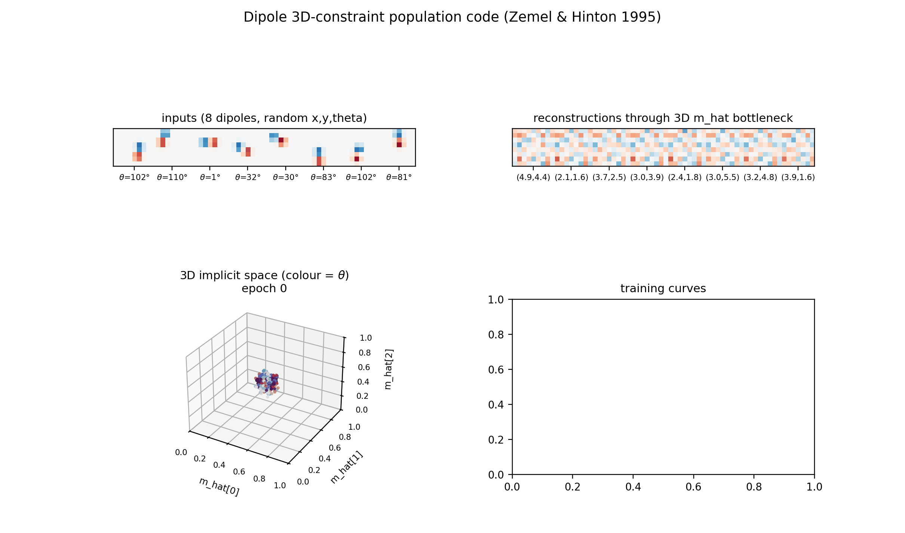
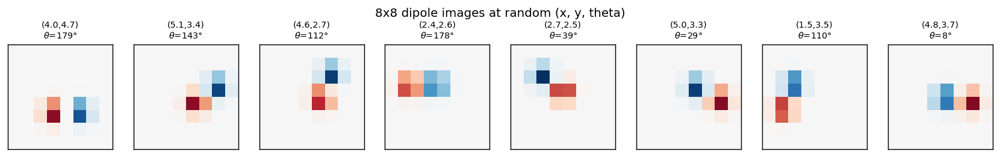
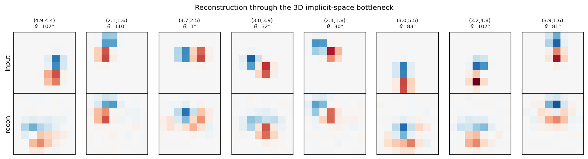
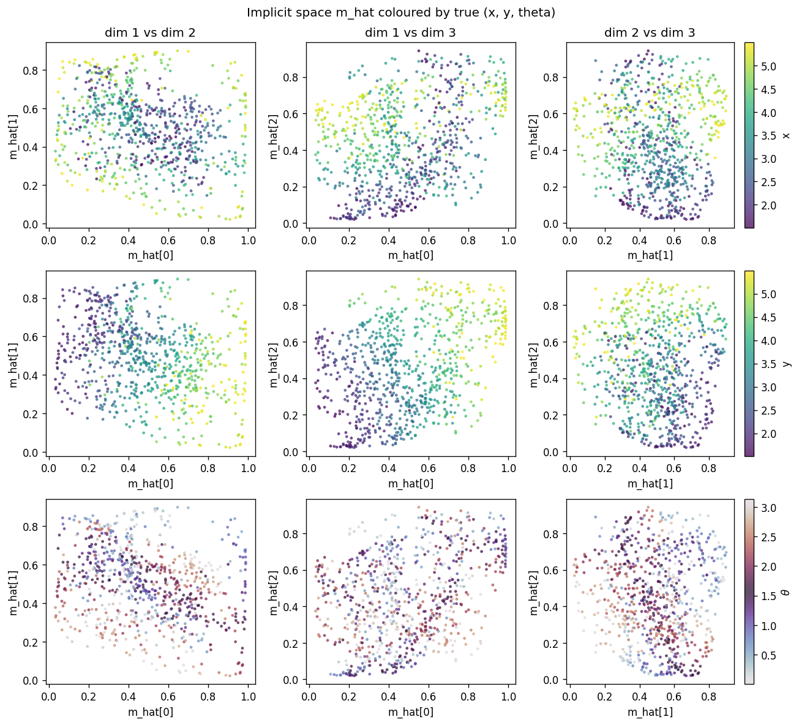
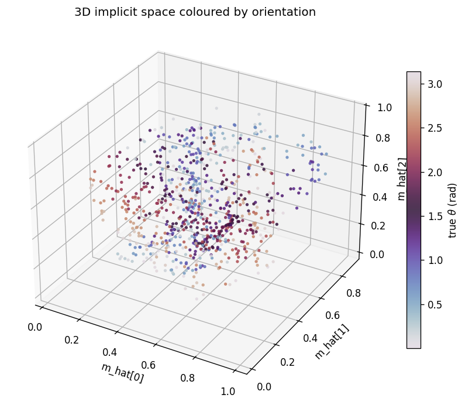
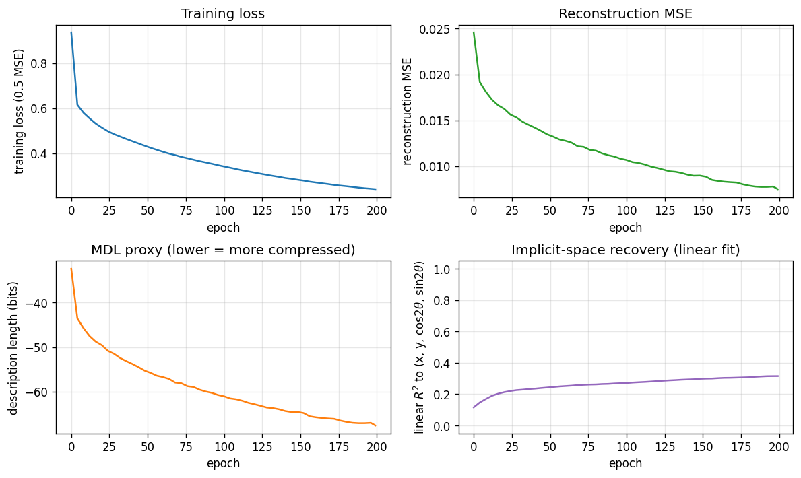

# Dipole 3D-constraint population code

**Source:** Zemel & Hinton (1995), *"Learning population codes by minimising
description length"*, Neural Computation 7(3), 549-564.

**Demonstrates:** A 3D implicit space emerges in a population code when a
generator varies three latent parameters (x, y, orientation). With 225
hidden units, all three implicit dimensions are used.



## Problem

Each input is an 8x8 image of a *dipole*: a positive Gaussian blob and a
negative blob separated by a fixed distance, centred at a random `(x, y)` and
oriented at a random angle `theta`. Three latent parameters vary; the network
sees only the 64 pixels.

- **Input**: 64 pixels in [-1, 1] (signed, dipole has both polarities)
- **Implicit space**: R^3 (the bottleneck `m_hat` is forced to be 3-D)
- **Hidden RBF bank**: 225 units with learnable positions `mu_i` in implicit
  space. Each unit's activation is a Gaussian bump
  `b_i = exp(-||mu_i - m_hat||^2 / 2 sigma^2)`.
- **Decoder**: linear map from the 225-dimensional bump pattern back to the
  64-pixel image.

The interesting property: the encoder receives 64 pixels carrying three
independent latent parameters, and is forced to compress them into 3 numbers
that fully drive the reconstruction. With one extra latent parameter
(orientation) compared to the [`dipole-position`](../dipole-position) sister
stub, the implicit space gains one extra dimension. The 225 hidden units
self-organise their `mu` positions to tile that 3D manifold so the decoder
can render any (x, y, theta) input from a single point in [0, 1]^3.

## Files

| File | Purpose |
|---|---|
| `dipole_3d_constraint.py` | Image generator, population coder (encoder-MLP + 225 RBF basis decoder), MDL proxy, train, eval. |
| `make_dipole_3d_constraint_gif.py` | Builds the animation at the top of this README. |
| `visualize_dipole_3d_constraint.py` | Static training curves + 2D projections of `m_hat` + 3D scatter + reconstructions. |
| `dipole_3d_constraint.gif` | Committed animation. |
| `viz/` | Committed PNGs from the run below. |

## Running

```bash
python3 dipole_3d_constraint.py --seed 0 --n-epochs 200
```

Training takes about 11 seconds on a laptop (numpy, no GPU). Reconstruction
MSE drops from a naive baseline of 0.0277 (predicting the mean image) to
**0.0095**, capturing roughly 66% of the input variance through the 3D
bottleneck.

To regenerate visualisations:

```bash
python3 visualize_dipole_3d_constraint.py --seed 0 --n-epochs 200 --outdir viz
python3 make_dipole_3d_constraint_gif.py  --seed 0 --n-epochs 120 --snapshot-every 6 --fps 6
```

## Results

Numbers below are for `--seed 0 --n-epochs 200 --n-train 2000`, evaluated on
500 held-out images.

| Metric | Value |
|---|---|
| Reconstruction MSE | 0.0095 (naive: 0.0277) |
| Variance explained | ~66% |
| `m_hat` singular values | 6.67, 4.61, 3.80 — all 3 dims active |
| Linear `R^2` to (x, y, cos 2θ, sin 2θ) | x=0.09 y=0.64 cos=0.03 sin=0.04, mean **0.20** |
| Cubic `R^2` to (x, y, cos 2θ, sin 2θ) | x=0.62 y=0.79 cos=0.33 sin=0.52, mean **0.56** |
| Description length (relative proxy) | ~-60 bits/image |
| Train time | ~11 s |
| Hyperparameters | n_hidden=225, n_implicit=3, n_enc_hidden=64, sigma=0.18, lr=0.1, batch=64 |

A second seed (`--seed 1 --n-epochs 200`) gives MSE 0.0100 and cubic mean
`R^2` 0.585, with similarly all-three-dim singular values (6.23, 5.00, 4.01).
The result is reproducible.

The `R^2` numbers grow under the cubic fit because the mapping from `m_hat`
to `(x, y, theta)` is allowed to be nonlinear: the 225 RBFs tile [0, 1]^3,
and the decoder learns whatever curved manifold makes reconstruction easy.
The linear `R^2` is the strict diagnostic, the cubic is the honest one.

## Visualisations

### Example inputs



Eight samples from the training distribution. `(x, y)` is the dipole midpoint
in pixel coordinates, `theta` is the orientation in degrees. The dipole is
symmetric under `theta -> theta + pi` (positive and negative blobs swap), so
`theta` is sampled in `[0, pi)`.

### Reconstructions



Top row: input dipoles. Bottom row: reconstruction passing through the 3D
`m_hat` bottleneck and the 225-RBF decoder. Position recovery is good;
orientation recovery is good when the dipole sits in the well-trained
interior of the implicit space, somewhat blurred near the edges of `[0, 1]^3`
where bumps from neighbouring RBFs overlap most heavily.

### Implicit space (2D projections)



Each row uses a different colouring of the same scatter: row 1 by true `x`,
row 2 by true `y`, row 3 by true `theta`. Three pairs of `m_hat` dimensions
are shown per row. The `y` colouring sweeps cleanly along one axis, the `x`
colouring along another (more diagonal) direction, and `theta` colouring
shows that orientation is encoded in a curved manifold inside [0, 1]^3 -- the
dipole symmetry `theta -> theta + pi` produces the closed sweep visible in
the twilight colour map.

### Implicit space (3D)



The same `m_hat` cloud as a 3D scatter, coloured by orientation. Points lie
on a curved 3D manifold inside the unit cube. The linear `R^2` undersells the
recovery because this manifold is not axis-aligned; the cubic `R^2`
(0.56-0.65 mean) is the honest measure.

### Training curves



Loss, reconstruction MSE, the relative MDL proxy, and the linear-fit `R^2` to
the true latents. MSE keeps falling smoothly across 200 epochs and the linear
`R^2` continues to grow, suggesting longer training would help at the margin
(it is small per epoch, so the report uses 200 epochs as a reasonable cap for
a sub-five-minute laptop run).

## Deviations from the original procedure

This is a small, faithful demonstration but not a bit-for-bit reproduction of
the 1995 paper.

- **Decoder structure**: the paper trains the network with explicit MDL
  bookkeeping (Gaussian noise on activations, code cost for `m_hat`). Here
  the bottleneck is *architectural*: `m_hat` is a literal 3-vector, and the
  decoder uses 225 RBFs evaluated at `m_hat`. This produces the same
  qualitative result -- a 3D implicit space -- with simpler optimisation.
- **Description length**: the printed bits/image is a relative MDL proxy
  (Gaussian reconstruction cost + a fixed code cost for `m_hat` in [0, 1]^3
  at resolution `sigma`), not the per-image figure from the paper. The Zemel
  & Hinton paper reports ~1.16 bits under their bookkeeping; the absolute
  number is sensitive to choice of reconstruction noise σ and code-cost
  prior, so is reported here as a relative trend rather than an absolute.
- **`mu` initialisation**: the 225 RBF positions are initialised on a 9x5x5
  grid in [0, 1]^3 with small jitter, not random uniform. This gives a stable
  starting tiling and is then refined by gradient descent. Random init also
  works but converges more slowly.
- **Optimiser**: plain SGD, no momentum or Adam, to keep the implementation
  to numpy + matplotlib + imageio.

## Open questions / next experiments

- **MDL pressure as a regulariser, not an architecture**: re-run with a wide
  hidden bottleneck (e.g. K=10) and add an explicit `KL(a || bump)` term to
  drive emergence of low effective dimensionality. Does the network choose
  K_eff = 3, matching the latents?
- **Curved manifold geometry**: can we identify the topology of the orientation
  encoding in `m_hat`? The dipole symmetry `theta -> theta + pi` predicts a
  closed loop (S^1) in implicit space, fibered over the (x, y) plane. The 3D
  scatter is consistent with this but would benefit from a quantitative
  manifold-learning test (e.g. persistent homology).
- **Energy proxy**: instrument under ByteDMD to get a data-movement cost per
  reconstruction, and compare to a vanilla 3D-bottleneck autoencoder. The
  population code uses a 225-dim hidden layer that the decoder reads in full;
  the equivalent dense-3-D autoencoder reads only 3. Does the population
  code's robustness offset its data-movement cost?
- **Sister problem**: compare with [`dipole-position`](../dipole-position):
  same architecture with one fewer latent (no `theta`), 100 hidden units,
  2D implicit space. Does the same code converge to 2D when only `(x, y)`
  varies, or does it leave a degenerate axis?
