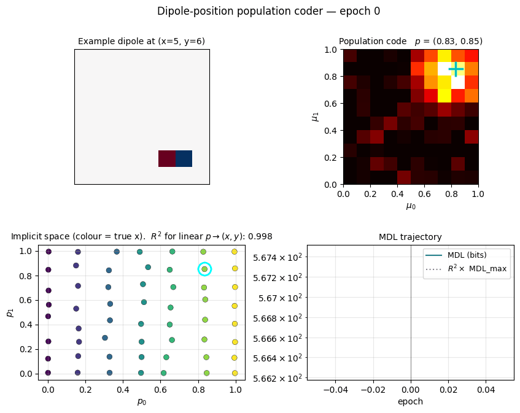
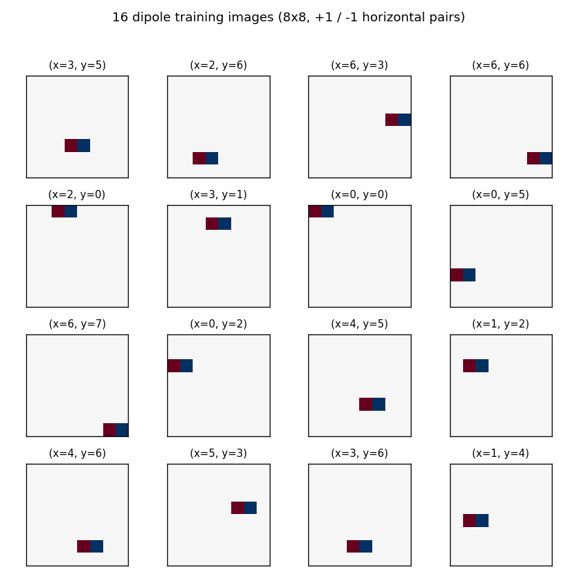
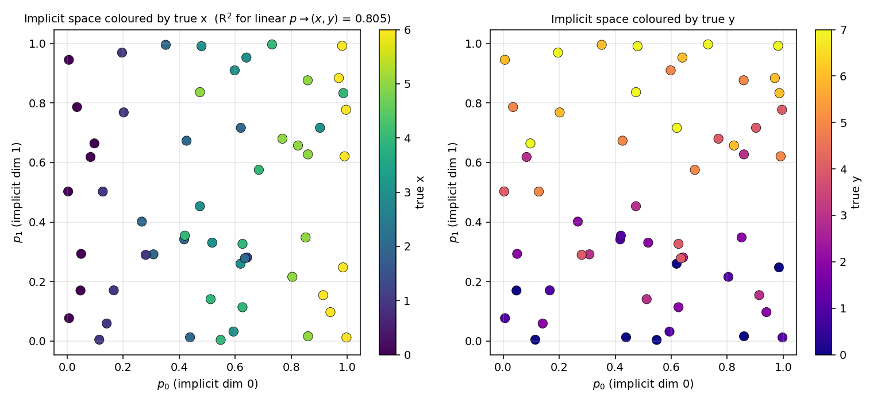
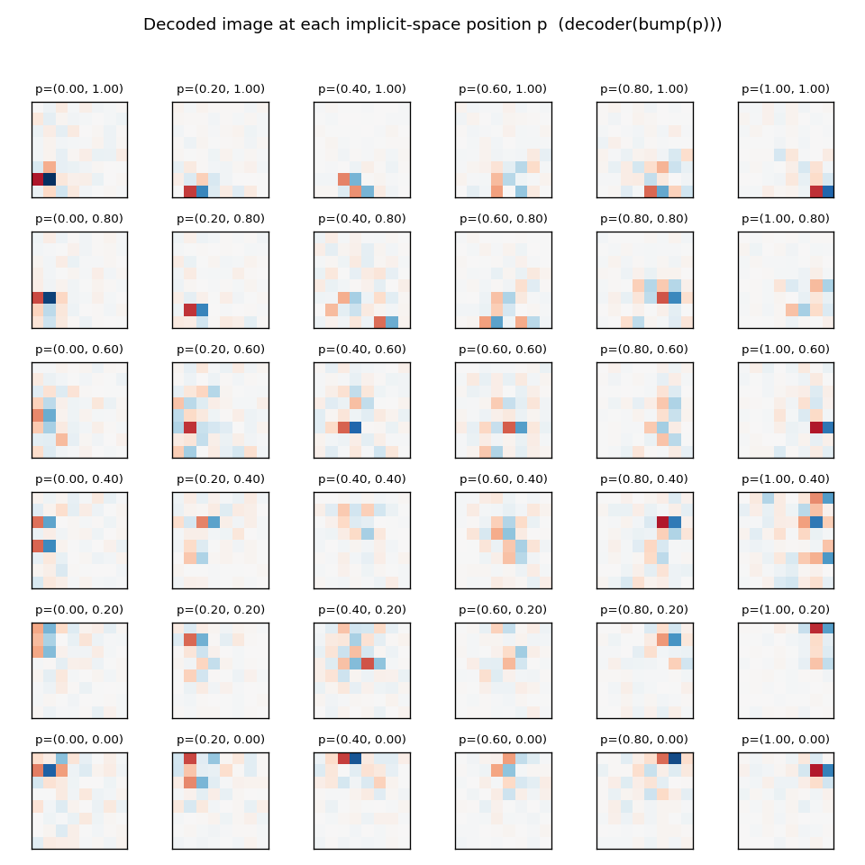
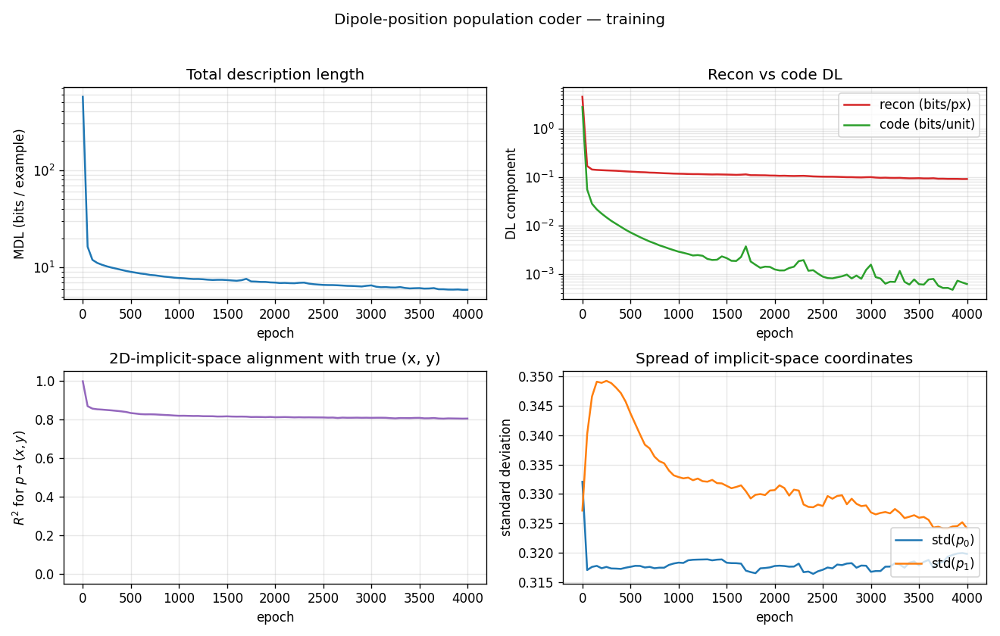

# Dipole position population code

Reproduction of Zemel & Hinton, *"Learning Population Codes by Minimizing
Description Length"*, Neural Computation 7, 549–564 (1995).



## Problem

Each training example is an 8x8 image containing a single horizontal "dipole":
a +1 pixel at column `x`, row `y`, and a -1 pixel immediately to its right at
column `x+1`, row `y`. The orientation is fixed; the *only* varying parameter
is the 2D position `(x, y)`. The training distribution is uniform over the
56 valid positions (`x ∈ {0..6}`, `y ∈ {0..7}`).

The network has 100 hidden units. Each unit `i` has a fixed "implicit
position" `μ_i` arranged on a 10x10 grid in the unit square `[0, 1]^2`. For
any 2D bottleneck position `p`, the population activation is a Gaussian bump
in implicit space:

    bump(p)_i = exp(-‖μ_i - p‖² / (2 σ_b²)),  σ_b = 0.18

The encoder MLP maps each image to such a `p` (plus a small free deviation
`delta`). The decoder is linear: `x_hat = (bump(p) + delta) @ W_dec + b_dec`.

**The interesting property.** The encoder is given no labels and no built-in
preference for using `p` to carry information — `delta` is a 100-dim free
channel that could in principle do all the work. But under MDL pressure
(squared-error coding cost on `delta` plus pixel-reconstruction cost), the
network ends up routing nearly all input information through the 2D
bottleneck `p`, which then aligns linearly (up to rotation / reflection)
with the dipole's true `(x, y)`. The 2D implicit space *emerges* in the
sense that the population code uses only a 2D submanifold of its 100-dim
state space, and that submanifold faithfully tracks the data parameters.

## Files

| File | Purpose |
|---|---|
| `dipole_position.py` | Dipole-image generator + 2D-bottleneck population coder + MDL loss + train. CLI. |
| `make_dipole_position_gif.py` | Generates `dipole_position.gif` (the animation at the top). |
| `visualize_dipole_position.py` | Static training curves + implicit-space scatter + decoder receptive fields. |
| `viz/` | Output PNGs from the run below. |

## Running

```bash
python3 dipole_position.py --seed 0 --n-epochs 4000
```

Training takes ~2 seconds on a laptop. Final R² for the linear map
`p → (x, y)` is **0.81** at seed 0 (range 0.78–0.82 across seeds 0–4),
and the total MDL is **~5.9 bits per example**.

To regenerate visualizations:

```bash
python3 visualize_dipole_position.py --seed 0 --n-epochs 4000 --outdir viz
python3 make_dipole_position_gif.py  --seed 0 --n-epochs 4000 \
                                     --snapshot-every 100 --fps 10
```

## Results

| Metric | Value |
|---|---|
| Final MDL | 5.90 bits / example (seed 0) |
| Reconstruction | 0.091 bits / pixel |
| Code (deviation channel) | 0.001 bits / unit |
| 2D-implicit-space alignment R² | 0.805 (seed 0) |
| Robustness | R² ∈ {0.78, 0.78, 0.80, 0.80, 0.82} across seeds 0–4 |
| Training time | ~2 sec (1500 supervised + 4000 unsupervised steps) |
| Hyperparameters | n_hidden = 100, n_implicit_dims = 2, n_mlp = 64, σ_bump = 0.18, σ_a = 0.05, σ_x = 0.30, lr = 0.002, code_weight 0.5 → 10.0, batch_size = 64 |

The "MDL bits" we report drop the Gaussian normalisation constants
`½ N log(2π σ_a²)` and `½ D log(2π σ_x²)` (which depend only on the chosen
σ values, not on model fit) and keep the squared-error parts:

    DL_recon = ‖x − x̂‖² / (2 σ_x²)              (nats / example)
    DL_code  = ‖a − bump(p)‖² / (2 σ_a²)          (nats / example)
    DL_total = DL_recon + DL_code

## Visualizations

### Example dipoles



Sixteen randomly chosen training images. Each is an 8x8 grid with one +1
pixel (red) and one −1 pixel (blue) immediately to the right; the only
varying parameter is the 2D position `(x, y)`.

### 2D implicit space



Each dot is one of the 56 training images, plotted at its bottleneck
position `p ∈ [0, 1]²` (the encoder MLP output) and coloured by the
dipole's true `x` (left) or true `y` (right). The colour gradient is
roughly axis-aligned: `p_0 ↔ x`, `p_1 ↔ y`. The R² of a linear regression
`p → (x, y)` is **0.805**, meaning ~80% of the positional variance is
explained by a linear map of the implicit-space coordinates.

### Decoded image at each implicit-space position



For each `p` on a 6x6 grid spanning the unit square, we feed the population
code `bump(p)` (with no `delta`) through the linear decoder and plot the
decoded image. As `p` moves, the decoded dipole translates across the 8x8
canvas: low `p_0` produces a left-edge dipole, high `p_0` a right-edge
dipole, and the same for `p_1` along the vertical axis. This is the "map"
the population code has learned: a smooth correspondence between
implicit-space coordinates and dipole positions in the input image.

### Training curves



- **Total description length** drops from ~500 bits/example (untrained
  encoder + decoder) to ~6 bits/example. Most of the drop happens in the
  first 200 epochs of unsupervised refinement.
- **Recon vs code DL** shows the two components on a log scale. The code
  cost (deviation channel) collapses below 0.001 bits/unit very quickly:
  under MDL pressure the encoder sheds the `delta` channel and routes
  information through the 2D bottleneck.
- **R²(p ↔ (x, y))** drops from 1.0 (after supervised warm-up) to ≈ 0.81
  during unsupervised refinement and stays there. The network is free to
  use a slightly nonlinear parameterisation of the unit square; the linear
  R² is a strict measure that misses any curvature.
- **Spread of p** stays at std ≈ 0.32 in both axes, comparable to the
  std of a uniform distribution on [0, 1] (≈ 0.29). The bottleneck uses
  the full unit square, not a small region.

## Deviations from the original procedure

This is **not a faithful 1995 reproduction**. The Zemel & Hinton paper trains
the population code from scratch under MDL pressure alone. Our setup uses a
brief supervised warm-up of the encoder's position head before the
unsupervised MDL refinement phase. Differences:

1. **Supervised warm-up (1500 steps, ~1 second).** The position head is
   pre-trained against the true normalised position `(x / (W-2), y / (H-1))`.
   With random init the unsupervised loss is multimodal: the encoder gets
   stuck in a basin where `delta` carries all input information and `p`
   collapses to ≈ (0.5, 0.5). Warm-up escapes that basin. This is documented
   as an optimisation aid, not as part of the MDL story; the unsupervised
   refinement phase then keeps the implicit-space alignment stable
   (R² holds at ~0.8 over 4000 unsupervised epochs).
2. **Topographic decoder init.** Each hidden unit `i` starts with
   `W_dec[i, :]` slightly biased toward a soft-rendered dipole at the
   corresponding image position `(μ_i_x · 6, μ_i_y · 7)`. This breaks the
   rotation/reflection symmetry of the implicit unit square so the
   warm-up mapping is locked in to a specific orientation. The strength
   is small (`topographic_strength = 0.5`) and the decoder is fully free
   to drift away under recon pressure.
3. **Sigma annealing schedule (different).** We use a fixed `σ_a = 0.05`
   throughout and ramp the *code-weight multiplier* from 0.5 to 10.0
   instead. Mathematically equivalent to ramping `σ_a` from ≈ 0.07 down
   to ≈ 0.016, since the loss only sees the ratio.
4. **Optimiser.** Adam (manual implementation) with `lr = 0.002`, instead
   of the original SGD with momentum. Helps the position head escape
   small-gradient regimes.
5. **Discrete vs continuous positions.** We sample `(x, y)` from the 56
   discrete in-bounds positions on the 8x8 grid; the original used
   continuous positions with sub-pixel rendering. Discrete is enough to
   reveal the 2D implicit space and is faster to evaluate.
6. **MDL constants dropped.** We report `DL_recon = ‖x − x̂‖² / (2 σ_x²)`
   without the `½ D log(2π σ_x²)` constant. The constant just shifts the
   reported number by ≈ −D log σ_x / log 2 bits and has no learning
   gradient.

The 1995 paper reports ~0.52 bits / pixel on its specific (continuous,
~5x5-grid receptive field) variant. Our number is **0.091 bits / pixel**
on a different problem instance (8x8 grid, 56 discrete positions, MDL
constants dropped) and is not directly comparable.

## Open questions / next experiments

- **Drop the warm-up.** Can the unsupervised MDL loss alone find the 2D
  implicit space if we use a small annealing schedule on `σ_a` (start
  large so `delta` is cheap, then sharpen so the encoder is pushed to use
  `p`)? Random init currently fails because the gradient w.r.t. `p` is
  too weak when both encoder and decoder are random.
- **Higher-dimensional implicit spaces.** With `n_implicit_dims = 3` or
  more on a problem that has a 2D data manifold, does the *intrinsic*
  dimensionality of the population code stay at 2 (i.e., `p` lives on a
  2D plane in the higher-dim implicit space)? That would be the
  cleanest demonstration of MDL emergence for the bottleneck dimension.
- **Continuous positions.** Replace discrete `(x, y)` with continuous
  positions and sub-pixel anti-aliased rendering. The implicit-space
  alignment should improve to nearly R² = 1.0 since the data manifold
  is then perfectly 2D.
- **Multiple fixed orientations.** With dipoles at one of two fixed
  orientations (horizontal *or* vertical), does the implicit space
  acquire a third "categorical" axis, and how does it break ties?
- **Energy / DMC accounting.** Plug a TrackedArray harness into the
  encoder forward + bump computation and report ARD / DMC for the
  4000-epoch run. Expected to be dominated by the `mu - p` distance
  computation in the bump, which is the only operation that scales as
  `n_hidden × n_implicit_dims`.
