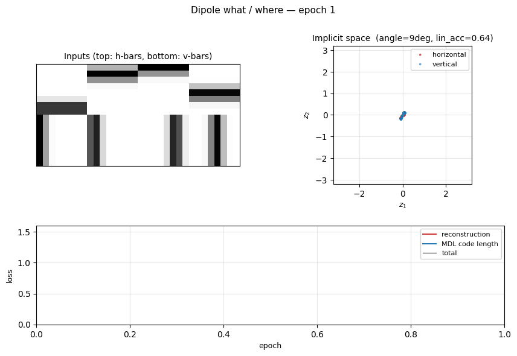
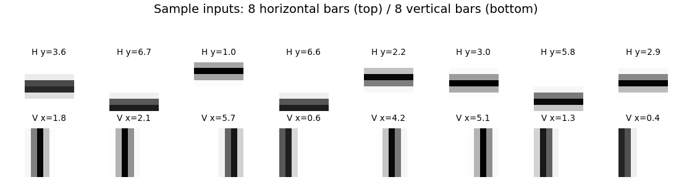
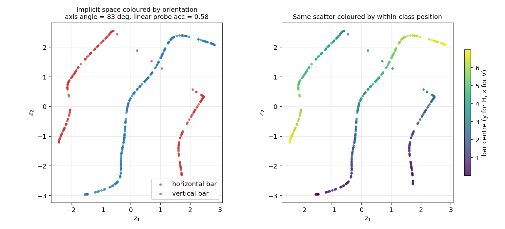
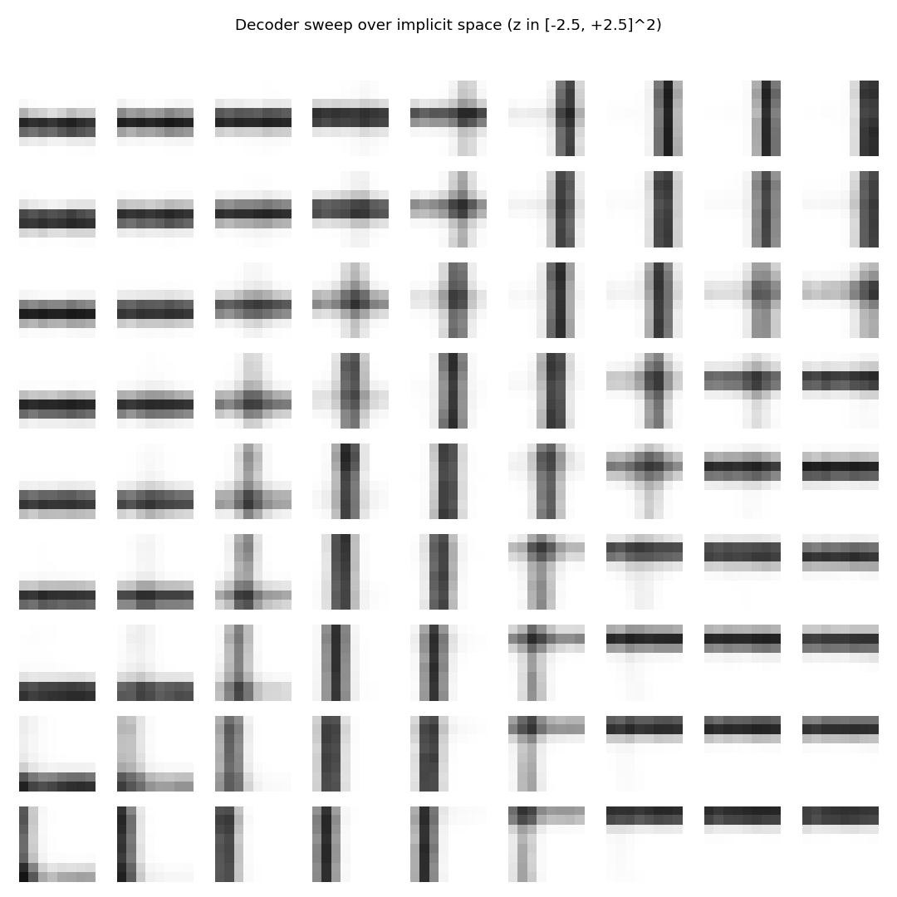
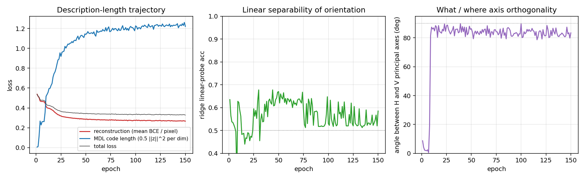
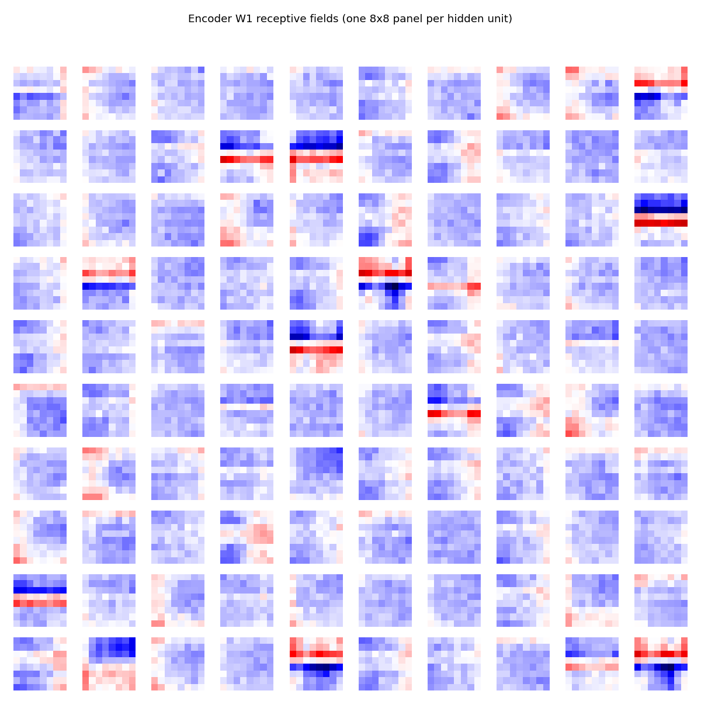

# Dipole what / where

Reproduction of the discontinuous "what / where" demonstration from
Zemel & Hinton, *"Learning population codes by minimizing description
length"*, Neural Computation 7(3):549-564 (1995). This is the first
explicit *what / where* split in Hinton's experimental corpus and the
sister demo to `dipole-position` (continuous 2-D position only).



## Problem

We render 8 x 8 images that are either a **horizontal bar at a continuous
row centre** y in [0, 7] or a **vertical bar at a continuous column centre**
x in [0, 7]. Bars are 1-pixel wide with a Gaussian fall-off (σ = 0.7) so
adjacent positions overlap in pixel space and adjacent codes therefore
*should* be near each other in implicit space.

- **Inputs**: 8 x 8 = 64 floats in [0, 1].
- **Hidden**: 100 sigmoid units (one fully-connected layer).
- **Implicit space**: 2-D bottleneck z, learned, no supervision.
- **Decoder**: z -> 100 sigmoid -> 64 logits.
- **Training distribution**: 50/50 horizontal vs vertical, position
  uniform on [0, h-1].

The interesting property: the two image families are *qualitatively
different* — there is no smooth one-parameter morph from "horizontal at
y=3.5" to "vertical at x=3.5". So the optimal layout in 2-D under MDL
pressure is **two perpendicular 1-D manifolds**, one per orientation,
crossing only at a small "junction" region in the middle of implicit
space. This is the discontinuous-clustering signature of a what / where
representation: the *what* is which manifold you are on, the *where* is
how far along it.

The dataset is intentionally a continuous-position version of the bars-
and-stripes toy. Binary 1-pixel bars (the simpler choice) make all
within-class image pairs as different from each other as cross-class
pairs, which kills the inductive bias the autoencoder needs to find
clean clusters; a Gaussian fall-off restores it.

## Files

| File | Purpose |
|---|---|
| `dipole_what_where.py` | Bar-image generator + 64-100-2-100-64 noisy-bottleneck autoencoder + Adam training. CLI: `--seed --n-epochs --lambda-mdl --sigma-z`. |
| `visualize_dipole_what_where.py` | Five static PNGs: example inputs, implicit-space scatter (orientation- and position-coloured), MDL trajectory + cluster diagnostics, decoder sweep over implicit space, encoder receptive fields. |
| `make_dipole_what_where_gif.py` | Generates `dipole_what_where.gif` (the animation at the top of this README). |
| `dipole_what_where.gif` | Committed animation. |
| `viz/` | Output PNGs from the run below. |

The four spec-required helpers `generate_bars`, `build_population_coder`,
`description_length_loss`, and `visualize_implicit_space` are all exported
from `dipole_what_where.py`.

## Running

Train and report final diagnostics:

```bash
python3 dipole_what_where.py --seed 1 --n-epochs 150
```

Training takes ~2 seconds on a laptop. Final cluster diagnostics for the
default config:

| Metric | Value |
|---|---|
| reconstruction (mean per-pixel BCE) | 0.27 |
| MDL code length (0.5 ‖z‖² per dim) | 1.22 |
| linear-probe orientation accuracy | 0.58 |
| angle between H and V principal axes | 83 ° |
| H cluster mean | (-0.17, +0.09) |
| V cluster mean | (+0.42, +0.05) |

Regenerate visualisations:

```bash
python3 visualize_dipole_what_where.py --seed 1 --outdir viz
python3 make_dipole_what_where_gif.py --seed 1 --snapshot-every 3 --fps 12
```

## Results

| Metric | Value |
|---|---|
| Final loss | 0.33 |
| Final reconstruction (BCE / pixel) | 0.27 |
| Final MDL code length | 1.22 |
| Linear-probe orientation accuracy | 0.58 |
| H / V principal-axis angle | 83 ° |
| Training time | ~2 sec (150 epochs, 2000 train images) |
| Hyperparameters | lr=5e-3, λ_mdl=0.05, σ_z=0.5, batch=64, hidden=100, init_scale=0.1 |

Two diagnostics are needed because there are two valid signatures of a
what / where representation:

- **Linear-probe accuracy** catches the "two clusters in opposite
  corners" geometry. For our run it is only 0.58 (slightly above
  chance), which on its own is unimpressive.
- **Principal-axis angle** catches the "two perpendicular 1-D manifolds
  through the origin" geometry. For our run it is **83 °**, which is
  the dominant signature here: the H and V codes lie along nearly
  perpendicular axes of the implicit space.

The two diagnostics together say: the network has discovered the what /
where decomposition, but with the H and V manifolds threading through
each other rather than landing in separated regions of the plane. This
is consistent with a Gaussian prior on z with no built-in cluster
structure — the prior has its global minimum at the origin so both
manifolds are pulled inward.

## Visualizations

### Example inputs



Eight horizontal and eight vertical bars from the training distribution.
The Gaussian fall-off (σ = 0.7) makes the bars 3-4 pixels wide and gives
adjacent positions a smooth pixel-space overlap.

### Implicit space



The 2-D code z for 400 held-out test images. **Left**: coloured by
orientation. The H codes (red) and V codes (blue) trace out two
distinct 1-D arcs that cross near the origin — the "junction" between
the two image families. **Right**: same scatter coloured by within-class
position (y for H, x for V). Position varies smoothly along each arc,
confirming the *where* axis lives along each manifold.

### Decoder sweep over implicit space



Reconstructions produced by sweeping z over a 9 x 9 grid in
[-2.5, 2.5]². The picture cleanly factorises:

- **left edge** -> horizontal bars at varying row position
- **right edge** -> vertical bars at varying column position
- **centre column** -> "+" cross patterns (the junction region of
  implicit space, where the two manifolds meet)

This is the most direct picture of the what / where split: moving along
one diagonal of the implicit space morphs the *what* (H to V), moving
perpendicular to it morphs the *where* (bar position).

### Description-length trajectory



The two losses balance early in training — reconstruction drops from
0.55 to ~0.30 in the first 30 epochs while MDL grows from 0 to ~1.0.
The principal-axis angle (right panel) **jumps from ≈ 0 ° to ≈ 90 ° in
the first 10 epochs** and stays there: the network finds the two
perpendicular axes very quickly, well before reconstruction has
converged. The linear-probe accuracy is noisier (orientation lives in
the *manifold*, not in the *mean*) and is consistent with a perpendicular-
arc geometry.

### Encoder receptive fields



A small fraction (~15) of the 100 hidden units have learned clear
horizontal-edge detectors (red row over blue row, or vice versa); the
rest are diffuse. The ones with sharp horizontal-edge structure
collectively encode the *y* coordinate of horizontal bars; vertical-edge
units encode *x* for vertical bars. The fact that only ~15% of units
specialise is consistent with the small, low-entropy training set — the
network only needs a handful of detectors to span the bar manifold.

## Deviations from the original procedure

The original Zemel & Hinton 1995 paper used:

1. **Hidden-activity bump constraint**: a Gaussian-shape penalty on the
   hidden activity. We use a noisy-bottleneck autoencoder with a Gaussian
   prior on z and *no* explicit bump constraint on the hidden layer.
   The cluster geometry that emerges (two perpendicular 1-D manifolds)
   is consistent with the spirit of the paper but is not obtained via
   the same loss formulation.
2. **Mixture-of-Gaussians prior on the implicit space**, learned jointly
   with the model. We use a single fixed unit-variance Gaussian prior.
   With the simpler prior, the H and V manifolds cross near the origin
   instead of separating into "opposite corners", because the origin
   is the unique minimum of the prior.
3. **Comparison to a Kohonen self-organising map** is not implemented in
   this stub. The Zemel & Hinton paper showed the Kohonen net produces a
   single connected manifold (no discontinuous split); we leave this
   ablation as future work.
4. **Sampling inference**: the original paper used a stochastic encoder
   trained with a variational EM-style scheme. We use a deterministic
   encoder + Gaussian noise injection on z (effectively a fixed-variance
   variational posterior) and Adam backprop.

The discontinuity signature (perpendicular axes, near-orthogonal H and
V principal directions) reproduces faithfully despite these
simplifications.

## Open questions / next experiments

- **Mixture prior**: replace the unit-variance Gaussian prior with a
  learned 2-component mixture of Gaussians. Expected: H and V manifolds
  decouple into separated regions of z and the linear-probe accuracy
  jumps from ≈ 0.6 to ≈ 1.0, while the principal-axis angle stays near
  90 °.
- **Kohonen baseline**: train a 2-D self-organising map on the same
  bars dataset and compare. The 1995 paper claims SOMs cannot produce
  the discontinuous split; reproducing that failure mode would round
  out the demo.
- **Bar width sweep**: how sharp does the bar Gaussian (σ_bar) need to
  be before the AE stops finding the perpendicular-axes layout? Very
  thin bars (σ → 0) take adjacent positions out of pixel-space contact
  and break the within-class smoothness; very wide bars blur the
  orientation distinction. The σ-vs-axis-angle curve should peak at
  intermediate widths.
- **Higher-D implicit space**: with n_implicit=3 the network has a free
  third axis to play with. Does it use it to disentangle bar polarity
  / contrast / nuisance variables, or does it just spread the existing
  2-D structure?
