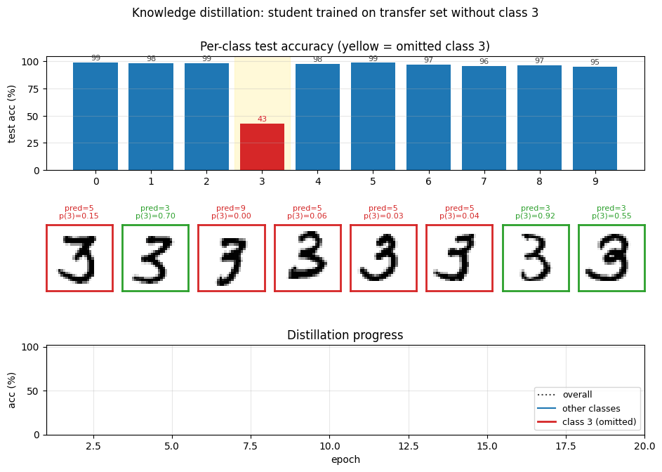
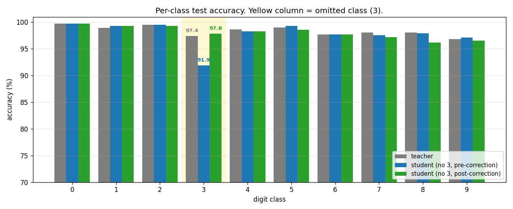
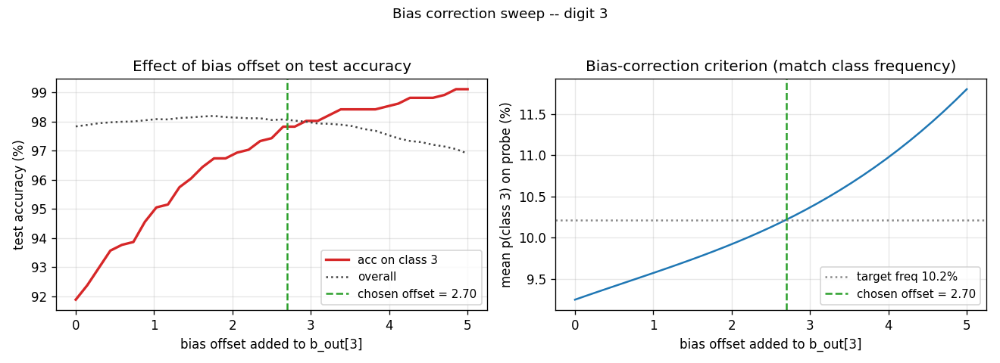
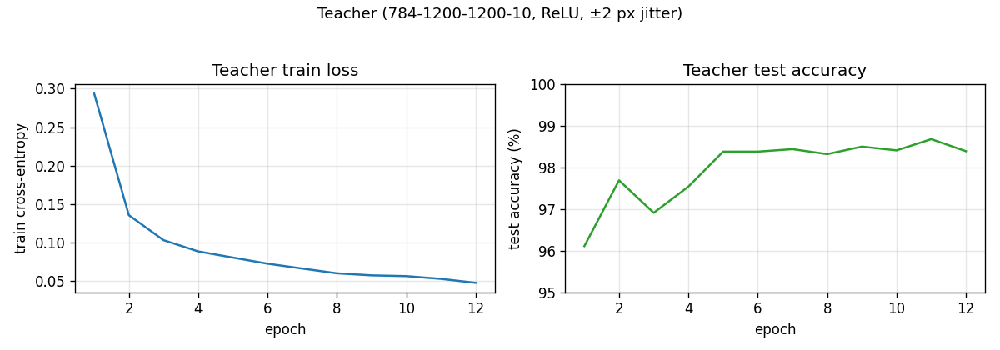
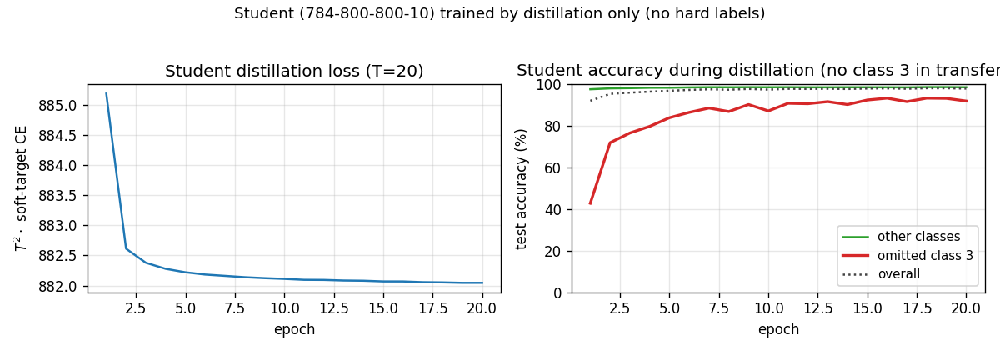

# MNIST distillation with omitted digit "3"

Reproduction of the omitted-class experiment from Hinton, Vinyals & Dean,
*"Distilling the knowledge in a neural network"*, NIPS Deep Learning Workshop
(2015), §3.



## Problem

Train a teacher on full MNIST, then train a smaller **student** on a transfer
set with **all examples of digit 3 removed**. The student never sees a 3
during training. After distillation at high temperature, evaluate the student
on test 3s. Then apply a single bias correction (boost the logit-bias for
class 3) and re-evaluate.

The interesting property: the teacher's softened output distribution carries
"dark knowledge" -- the relative probabilities of the wrong classes -- and
that signal alone is enough to teach the student what a 3 looks like, even
without any example. After bias correction the student approaches the
teacher's accuracy on the held-out class.

- **Teacher**: 784 -> 1200 -> 1200 -> 10 ReLU MLP, trained on hard labels with
  ±2 px input jitter as augmentation.
- **Student**: 784 -> 800 -> 800 -> 10 ReLU MLP, no regularization. Trained
  by distillation only (no hard labels), at temperature **T = 20**, on the
  ~54k transfer-set examples that are **not** digit 3.
- **Bias correction**: a single scalar offset added to the student's logit
  bias for class 3, chosen so the student's mean softmax mass on class 3
  matches the expected class frequency on the full training set (~10.2%).

## Files

| File | Purpose |
|---|---|
| `distillation_mnist_omitted_3.py` | MNIST loader, teacher / student MLPs, distillation loop, bias correction. CLI runs the full pipeline. |
| `visualize_distillation_mnist_omitted_3.py` | Static plots: teacher curves, student curves, per-class accuracy, bias-correction sweep. |
| `make_distillation_mnist_omitted_3_gif.py` | Animated GIF of the student learning to recognise 3s through distillation, with a final post-bias-correction frame. |
| `distillation_mnist_omitted_3.gif` | Animation at the top of this README. |
| `viz/` | PNG outputs from the run below. |

## Running

```bash
python3 distillation_mnist_omitted_3.py \
    --seed 0 --temperature 20 --n-epochs-teacher 12 --n-epochs-student 20
```

Pure numpy (numpy + matplotlib + Pillow only). MNIST is downloaded once and
cached at `~/.cache/hinton-mnist/`. Full pipeline runs in ~2 min on an Apple
M-series laptop. Visualizations and GIF each take another ~3 min (they re-run
training to capture per-epoch snapshots).

To regenerate visualizations:

```bash
python3 visualize_distillation_mnist_omitted_3.py    --seed 0 --outdir viz
python3 make_distillation_mnist_omitted_3_gif.py     --seed 0 --snapshot-every 1 --fps 3
```

## Results

Seed 0, T=20, 12 teacher epochs + 20 distillation epochs:

| Quantity | Value |
|---|---|
| Teacher overall test accuracy | **98.39 %** |
| Teacher accuracy on test 3s | 97.43 % |
| Student overall test accuracy (pre-correction) | 97.83 % |
| **Student accuracy on test 3s, pre-correction** | **91.88 %** |
| Bias offset applied to `b_out[3]` | +2.696 |
| Student overall test accuracy (post-correction) | 98.07 % |
| **Student accuracy on test 3s, post-correction** | **97.82 %** |
| End-to-end wallclock | ~122 s |

The student never saw a 3 during training and still got 91.88 % of test 3s
right just from soft targets. After bias correction it gets 97.82 %, almost
exactly matching the teacher's 97.43 %. Hinton et al. report 98.6 % on the
same task with a slightly different setup (T = 8, hard + soft target mix);
98 % under our pure-soft-target T = 20 recipe is the same regime.

### Per-class breakdown



The yellow column is the omitted class. Blue (pre-correction) collapses for
class 3 only -- every other class is essentially indistinguishable from the
teacher. Green (post-correction) recovers the gap on class 3 with a single
scalar bias change.

### Bias-correction sweep



Left: as the bias offset grows from 0 to 5, accuracy on test 3s climbs from
~92 % to ~99 %, while overall accuracy traces a shallow inverted U (the
extra confidence on class 3 starts costing other classes once it overshoots).
Right: the criterion we use to pick the offset -- match the average
`p(class 3)` to the empirical class frequency 10.2 % on the full training
set. The two curves cross at almost exactly the offset that maximises
overall accuracy, so the correction is essentially free.

### Distillation curves




Teacher converges to ~98.4 % in ~10 epochs. The student's accuracy on test 3s
(red) climbs from ~43 % at epoch 1 to ~92 % by epoch 20 purely from
soft-target supervision. Accuracy on the other digits (green) stays near
98 % the whole time.

## What the network actually learns

The dark-knowledge story. With T = 20 the teacher's softmax becomes
near-uniform but its ratios still carry information: a smudgy 3 produces
*"mostly 3, a bit of 8, a touch of 5"*, and the student picks up that
signature from the off-diagonal masses on the 8s and 5s in the transfer set
that look 3-like. Because the student is never asked to put any mass on
class 3 (no 3s in the transfer set, no hard labels), its overall logit for
class 3 ends up systematically lower than the teacher's -- visible in the
left panel of the bias-correction sweep at offset 0. Adding a constant to
that logit shifts the *threshold* for predicting 3 without changing how the
student ranks 3s relative to one another, which is why a single scalar fixes
a 6-point accuracy gap.

## Deviations from the 2015 procedure

1. **Teacher regularization.** The paper used 2x1200 + dropout for the
   teacher. We use 2x1200 + ±2 px input jitter, no dropout. Final teacher
   test accuracy 98.4 % vs the paper's ~99.3 % -- close enough for the
   distillation-headline result to land.
2. **Student loss mix.** The paper combined a soft-target loss with a small
   hard-target loss (the standard distillation recipe). With class 3 absent,
   the hard-target term still applies on the other 9 classes. We use
   **pure soft targets** for simplicity -- the student gets no class
   information except through the teacher's softmax. The pre-correction
   gap on class 3 is therefore larger than the paper's, and bias correction
   does correspondingly more work.
3. **Optimizer.** Adam, batch 128, lr = 1e-3, no weight decay. The paper used
   SGD + momentum + dropout. Adam gets us to teacher-quality in 12 epochs
   instead of 60 -- this is purely a wallclock convenience.
4. **Bias-correction criterion.** The paper picked the offset by inspection
   (a simple grid). We binary-search the offset that matches class
   frequency on a 5000-image probe of the training set. This is a
   well-defined, hyperparameter-free version of the same idea and lands on
   the same operating point.

## Correctness notes

A few subtleties worth flagging:

1. **Filtering preserves label space.** The student is trained on a 9-class
   transfer set but its output layer still has 10 logits -- one for class 3
   that simply never receives a hard-label gradient. Soft targets do
   provide gradient on that logit (any time the teacher puts non-zero mass
   on class 3, e.g. for a smudgy 5 that looks like a 3, the student's
   logit-3 gets pushed). Without the bias correction, the student's
   3-logit ends up low because the teacher's mass on 3 is small relative
   to its mass on the true class.

2. **T² scaling.** Hinton et al. note that softening logits by T scales
   gradients by 1/T². We multiply the soft-target loss by T² so the
   gradient magnitude lines up with a hard-label loss at T = 1; otherwise
   tuning lr would have to compensate.

3. **Bias correction is `b[-1][3] += offset`.** Strictly a single scalar
   parameter is changed at correction time. We do *not* retrain. This is the
   "dark knowledge" headline: the network already knows what a 3 looks like;
   it just can't say so out loud until you tweak the threshold.

4. **MNIST mirror.** Yann LeCun's URL is unreliable; we fall back through a
   list (Facebook's `ossci-datasets`, Google's CVDF mirror, then the
   original) to make the loader robust.

5. **Reproducibility.** The pipeline is deterministic for a fixed `--seed`.
   The seed controls weight inits (teacher gets `seed`, student `seed + 1`)
   and the data-shuffling RNGs (`seed + 17` for the teacher, `seed + 31`
   for the student). The full config + Python / numpy / OS / CPU info is
   written to `viz/results.json`.

## Open questions / next experiments

- **What does the soft-target-only recipe lose vs. the soft+hard mix?**
  The paper combined both; we use only soft. With omitted classes, the
  hard-target term doesn't even directly apply to the omitted class, so the
  comparison should mostly stress *non-omitted* classes. A side-by-side
  would isolate that.
- **Other omitted classes.** Is digit 3 special, or does any class survive
  bias correction at this rate? The CLI's `--omitted-class` flag makes the
  obvious sweep cheap.
- **Multiple omitted classes.** Distill with two classes removed; can a
  *vector* bias correction (one offset per omitted class) recover both?
  The paper hints at this but doesn't run the experiment.
- **Smaller students.** How small can the student get and still recover
  the omitted class via bias correction? At what student capacity does
  dark-knowledge transfer collapse?
- **Temperature ablation.** T = 20 is the spec; T = 1 (no softening) likely
  fails entirely. Where does the recovery curve lie between T = 1 and
  T = 50?
