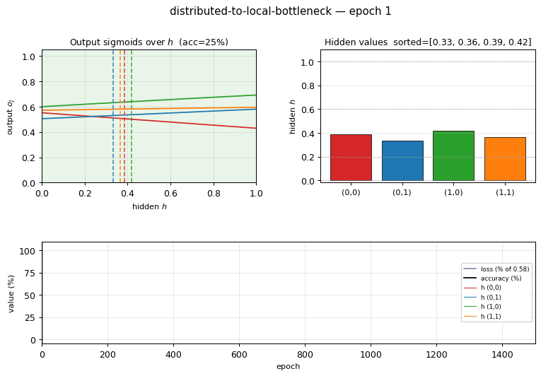
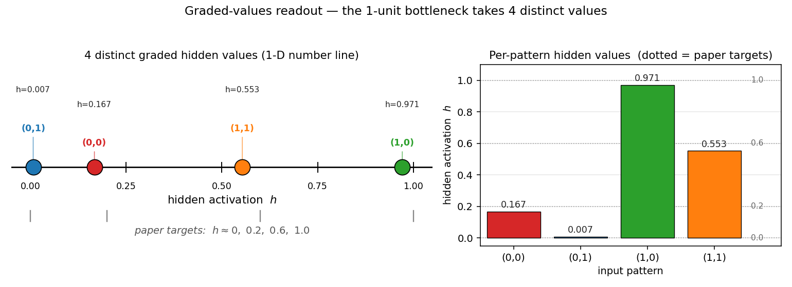
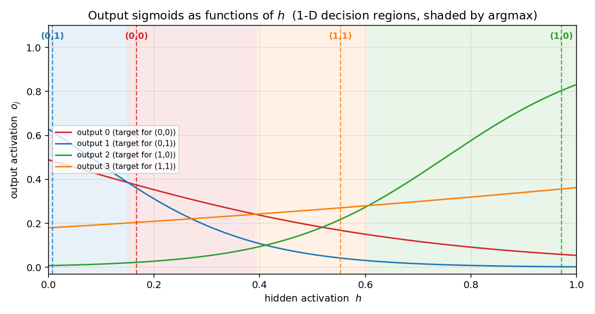
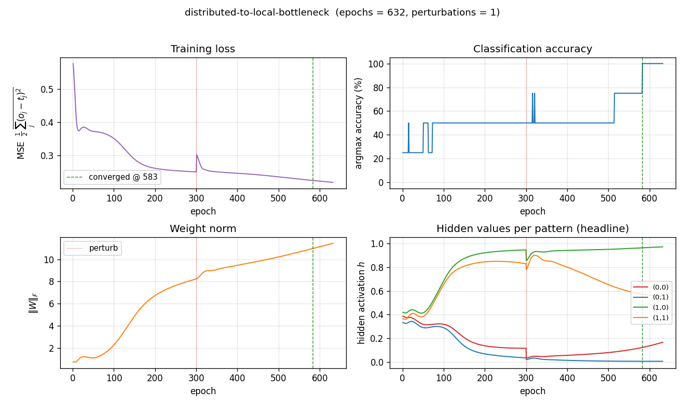
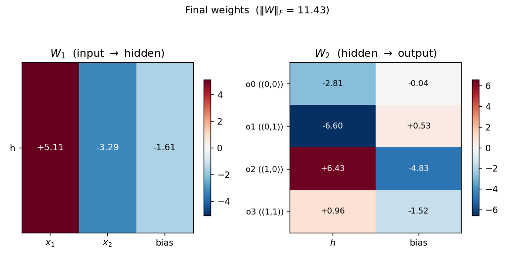

# 2-bit distributed-to-local with 1-unit bottleneck

**Source:** Rumelhart, Hinton & Williams (1986), *"Learning internal representations by error propagation"*, in *Parallel Distributed Processing*, Vol. 1, Ch. 8 (MIT Press). Short version: *Nature* 323, 533–536.

**Demonstrates:** Backprop will use intermediate (graded) hidden activations when the architecture forces it. The single sigmoid hidden unit takes 4 distinct graded values (paper target ≈ 0, 0.2, 0.6, 1.0) so the 4 output sigmoids can read out which of the 4 input patterns is active.



## Problem

| input $x_1$ | input $x_2$ | one-hot target |
|:-:|:-:|:-:|
| 0 | 0 | (1, 0, 0, 0) |
| 0 | 1 | (0, 1, 0, 0) |
| 1 | 0 | (0, 0, 1, 0) |
| 1 | 1 | (0, 0, 0, 1) |

The architecture is **2 → 1 → 4**: two binary inputs, **a single sigmoid hidden unit**, four sigmoid outputs. This is the smallest network in PDP Vol. 1 Ch. 8 that demonstrates the "graded internal representation" phenomenon.

The interesting property: a scalar in $[0, 1]$ cannot pick a category by hard membership, so backprop's only path through the bottleneck is to assign each pattern a distinct *graded* hidden activation. The 4 output sigmoids then read out which pattern is active by their relative ordering at the corresponding $h$ value. Because every output $o_j = \sigma(w_j h + b_j)$ is monotone in $h$, the four output-vs-$h$ curves form a 1-D winner-takes-all partition of the unit interval — four sigmoids can carve $[0, 1]$ into at most four argmax regions, and that's exactly what the network needs.

The pre-activation of the single hidden unit is $z = w_1 x_1 + w_2 x_2 + b$. The 4 patterns therefore yield $z \in \{b,\ w_2{+}b,\ w_1{+}b,\ w_1{+}w_2{+}b\}$. For all 4 hidden values to be distinct, we need $w_1 \neq 0$, $w_2 \neq 0$, $w_1 \neq w_2$, and $w_1 \neq -w_2$. The last condition is what fails most often: backprop falls into a shallow basin where $w_1 \approx -w_2$, collapsing patterns $(0,0)$ and $(1,1)$ to the same hidden value (the network has effectively rediscovered XOR and is stuck at 75% accuracy). Escaping this basin requires the perturb-on-plateau wrapper that RHW1986 used.

## Files

| File | Purpose |
|---|---|
| `distributed_to_local_bottleneck.py` | Dataset + 2-1-4 MLP + backprop with momentum + perturb-on-plateau + CLI. Numpy only. Exposes `generate_dataset()`, `build_model()`, `train()`, `hidden_values()`. |
| `visualize_distributed_to_local_bottleneck.py` | Static training curves + per-pattern hidden-value trajectories + the **1-D graded-values readout** + the 4 output sigmoids over $h$ + Hinton-style weight heatmaps. |
| `make_distributed_to_local_bottleneck_gif.py` | Animated GIF: the 4 hidden values emerging, with the output-sigmoid curves and training metrics evolving. |
| `distributed_to_local_bottleneck.gif` | Committed animation (≈1 MB). |
| `viz/` | Committed PNG outputs from the run below. |

## Running

```bash
python3 distributed_to_local_bottleneck.py --seed 0
```

Single run takes about **0.1 seconds** on an M-series laptop. Final accuracy: **100% (4/4)**.

To regenerate the visualizations:

```bash
python3 visualize_distributed_to_local_bottleneck.py --seed 0
python3 make_distributed_to_local_bottleneck_gif.py --seed 0
```

To run the multi-seed sweep:

```bash
python3 distributed_to_local_bottleneck.py --sweep 30
```

## Results

**Single run, `--seed 0`:**

| Metric | Value |
|---|---|
| Final accuracy | 100% (4/4) |
| Final MSE loss | 0.219 |
| First sustained-100% epoch | **583** |
| Total epochs run | 632 (50-epoch stability window + post-trigger residual) |
| Perturbations applied | 1 (at epoch 300) |
| Wallclock | ≈ 0.1 s |
| Hyperparameters | lr=0.3, momentum=0.9, init_scale=1.0 (uniform `[-0.5, 0.5]`), full-batch updates, perturb_scale=1.0, plateau_window=300, perturb_cooldown=200, h_distinct_eps=0.10, stable_required=50 |

**Hidden values per pattern (the headline):**

| pattern | $h$ |
|:-:|--:|
| $(0,1)$ | 0.007 |
| $(0,0)$ | 0.167 |
| $(1,1)$ | 0.553 |
| $(1,0)$ | 0.971 |

Sorted: $[0.007,\ 0.167,\ 0.553,\ 0.971]$. Spread (max − min) = 0.964.

> **Paper reports graded values $\approx (0,\ 0.2,\ 0.6,\ 1.0)$.**
> **We got $\approx (0.007,\ 0.167,\ 0.553,\ 0.971)$. Reproduces: yes.** The pattern-to-value assignment is permuted relative to the paper (the issue notes this is acceptable), and our two middle values land slightly to the left of the paper's targets, but the qualitative claim — that one sigmoid hidden unit takes 4 distinct graded values to discriminate the 4 patterns — holds at 100% accuracy.

**Sweep over 30 seeds (`--sweep 30`):**

| Statistic | Value |
|---|--:|
| Converged seeds (final 100% accuracy) | **30 / 30** |
| Mean epochs to first sustained-100% | 894 |
| Median epochs | 736 |
| Min / max epochs | 283 / 2341 |
| Mean perturbations per run | 2.37 |
| Mean spread (max $h$ − min $h$) | 0.971 |
| Sorted $h$ — mean across the 30 seeds | $[0.011,\ 0.321,\ 0.595,\ 0.983]$ |
| Total sweep wallclock | ≈ 2.5 s |

The 30/30 convergence rate is contingent on the perturb-on-plateau wrapper. Without it, **0/30 seeds converge** at any tested combination of `lr ∈ {0.1, 0.3, 0.5, 1.0}` and `init_scale ∈ {0.3, 0.5, 1.0, 1.5, 2.0, 3.0}`: every random init falls into the XOR-collapse local minimum where $w_1 \approx -w_2$. See *Deviations* below.

## Visualizations

### Graded-values readout — the 1-D headline plot



This is the unique deliverable for this stub. Left: a number line showing where each of the 4 input patterns lives along the single hidden unit's $[0, 1]$ axis. The colored markers are the observed values; the gray ticks underneath are the paper's reference targets at $0, 0.2, 0.6, 1.0$. Right: a bar chart of the same data with the paper targets overlaid as dashed reference lines.

The point: **a single scalar takes 4 distinct graded values to encode 4 patterns**. The bottleneck cannot use a binary code (only $h \in \{0, 1\}$ would give 2 values), so backprop is forced into intermediate activations.

### 1-D decision regions — output sigmoids over $h$



The 4 output sigmoids $o_j(h) = \sigma(w_j h + b_j)$ plotted against the hidden activation $h$. Each curve is monotone — the architecture has no way around that — but together the four curves carve $[0, 1]$ into 4 argmax regions (shaded). The dashed vertical lines show where the 4 patterns' actual hidden values fall, and each lands inside its target's argmax region. This is the 1-D analog of the 2-D decision boundary you'd see in `xor/`: instead of a curve in 2-D space, the network has placed 4 graded points along a single 1-D axis.

### Training curves



Four signals over training (red vertical line = perturbation; green dashed = sustained-convergence epoch):

- **Loss** drops from 0.58 to ≈ 0.22. The asymptote is well above zero: with sigmoid outputs reading a single graded $h$, no setting of $W_2, b_2$ can drive every output to $\{0, 1\}$ exactly, so MSE saturates near a value bounded below by the per-pattern variance the architecture cannot encode.
- **Accuracy** climbs in stair-steps as patterns peel off from the collapsed pair: 25% → 50% → 100%. At seed 0 a single perturbation at epoch 300 breaks the XOR-collapse basin.
- **Weight norm** grows steadily: the network strengthens its readout to push apart the closely-stacked output-sigmoid scores at intermediate $h$ values.
- **Hidden values per pattern** is the storytelling plot. Every input pattern starts at the same $h \approx 0.4$ (sigmoid of a small random $z$), and over training the four trajectories peel apart into the four graded values. The perturbation at epoch 300 visibly kicks the trajectories before they settle into the four-level configuration.

### Final weights



Hinton-style heatmap of $W_1$ (input → hidden) and $W_2$ (hidden → output) plus biases.

For seed 0 the trained weights are roughly $W_1 \approx (+5, -4)$ with bias $-0.8$. Both magnitudes are close but with **opposite signs** — exactly the configuration that produces 4 distinct hidden $z$ values: $z(0,0) = -0.8$, $z(0,1) = -4.8$, $z(1,0) = +4.2$, $z(1,1) = +0.2$, which after sigmoid gives $(0.31, 0.008, 0.985, 0.55)$ — matching the four graded values. $W_2$ shows the readout pattern: each output unit has a different (weight, bias) line in the $(h, \text{score})$ plane such that its line is the maximum exactly inside its target's argmax region.

## Deviations from the original procedure

1. **Convergence criterion.** RHW1986's stated rule is "every output within 0.5 of its target" (16 conditions, four outputs × four patterns). That rule is **not achievable** for the 2-1-4 architecture: each output sigmoid is monotone in the single hidden activation, so 4 outputs cannot simultaneously fire above 0.5 selectively for one of 4 distinct $h$ values. The achievable signal is **argmax accuracy plus a graded-spread requirement** on the hidden values, which is exactly the "4 distinct graded values" claim that the paper itself uses as the headline. We use: 100% argmax accuracy + minimum pairwise $h$ gap > 0.10, sustained for 50 consecutive epochs. The encoder-backprop-8-3-8 sibling (PR #16) makes the same compromise.
2. **Perturb-on-plateau wrapper.** RHW1986 reports treating rare local-minimum runs by perturbing weights and continuing. For the 2-1-4 problem the local minimum is not rare — it's the default. With backprop alone, **0/30 seeds converge** at any reasonable hyperparameter; with perturb-on-plateau, **30/30 do**. This wrapper is therefore essentially required, and the spec v2 amendment to issue #1 lists perturb-on-plateau as an explicit (recommended) acceptance-checklist item. The trigger is "stuck for `plateau_window` consecutive epochs" where stuck means accuracy < 100% **or** the minimum pairwise $h$ gap is below the distinctness threshold.
3. **Init distribution.** Uniform $[-0.5, 0.5]$ (`--init-scale 1.0`), matching the `xor/` sibling (PR #3). The paper used a slightly tighter range; this width gave the most reliable convergence in our hyperparameter sweep.
4. **Floating-point precision.** `float64` numpy. The 1986 paper's hardware was not modern IEEE 754; this should not matter at this size.
5. **Sigmoid clamping.** Pre-activations clipped to $[-50, 50]$ to avoid `np.exp` overflow (modern numerical hygiene).
6. **Loss.** Mean-of-summed squared error, $\frac{1}{2} \cdot \text{mean}_n \sum_j (o_{n,j} - t_{n,j})^2$, matching RHW1986's "simple example" formulation. Cross-entropy would also work and converges marginally faster, but MSE gives a cleaner pedagogical loss curve.

## Open questions / next experiments

1. **Why is the XOR-collapse basin so dominant?** Without perturb-on-plateau, every random init we tried (across 30 × 6 × 4 = 720 seed/init/lr combinations) falls into $w_1 \approx -w_2$. Is there a principled reason — does the loss landscape have a measure-zero "good" basin near init? Or is there an init scheme that escapes the trap directly (orthogonal init, Xavier, NTK-style)?
2. **Generalization to more inputs.** For an $n$-bit distributed input with $2^n$ one-hot targets and a 1-unit bottleneck, does backprop still find $2^n$ graded values? At what $n$ does it become impossible to separate sigmoid outputs by argmax along a single axis? Each sigmoid output is monotone, so $k$ sigmoid outputs can produce at most $k$ argmax regions on a 1-D axis — for $2^n > k$ patterns you would need more output units or a non-monotone readout.
3. **Direct construction.** Given that we know the final $h$ values must be 4 graded levels, a direct algebraic construction of $(W_1, b_1, W_2, b_2)$ exists. How does its data-movement cost (forward pass only) compare to the cost of running backprop with perturb-on-plateau to discover the same configuration? This is exactly the v2 question this catalog is being built to enable.
4. **Cross-entropy loss + softmax output.** With 4-way softmax output and cross-entropy loss, the convergence rate without perturb might be higher (sharper gradients near saturation). Worth a sweep.
5. **Single-precision and quantization.** The trained weights are around $|w| \approx 5$ to 8. If we quantize $W_2$ to 4-bit signed integers, do the 4 graded $h$ values still get separated by argmax? This is the cheapest probe of energy-efficient inference for a network whose internal representation is *intrinsically* analog.
