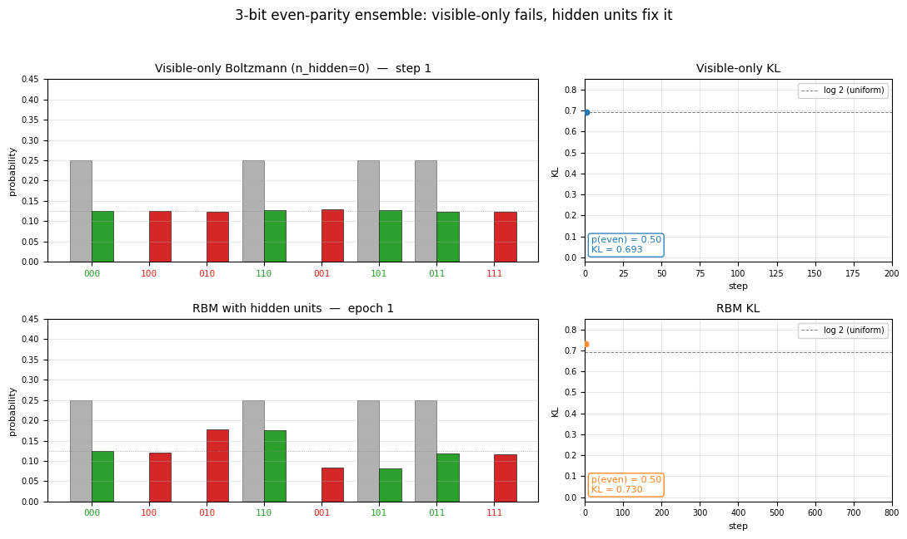
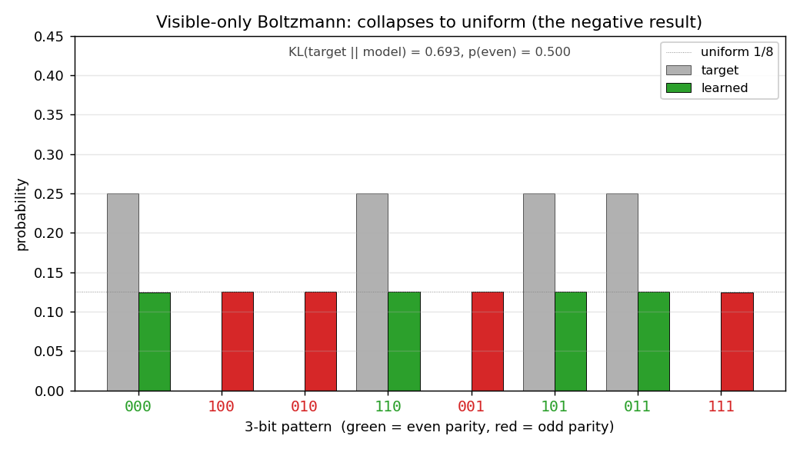
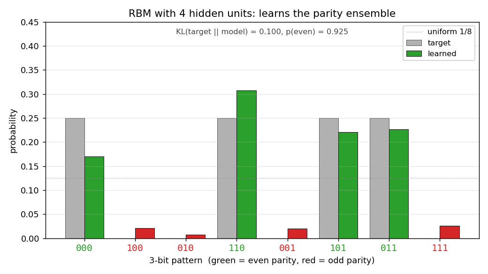
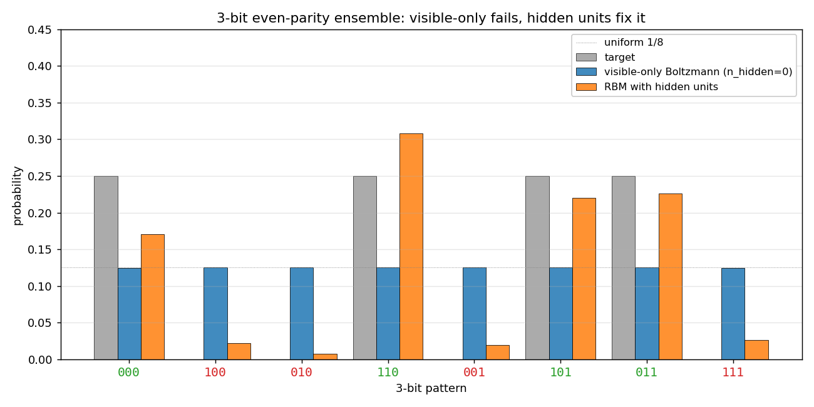
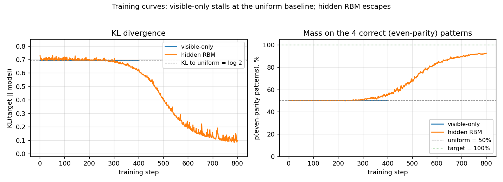
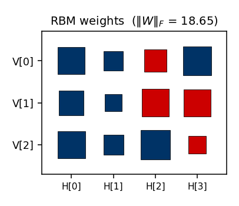

# 3-bit even-parity ensemble (the negative result)

Boltzmann-machine reproduction of the negative result that motivates the
encoder problems in Ackley, Hinton & Sejnowski, *"A learning algorithm for
Boltzmann machines"*, Cognitive Science 9 (1985).

**Demonstrates:** Why hidden units are necessary. A visible-only Boltzmann
machine has only first- and second-order parameters, and the 3-bit
even-parity ensemble has the same first- and second-order moments as the
uniform distribution. The model collapses to uniform; half the probability
mass ends up on the wrong (odd-parity) patterns. Adding hidden units lifts
this restriction.



## Problem

- **Visible units**: 3 binary
- **Training distribution**: 4 even-parity patterns at uniform `p = 0.25`
  — `{000, 011, 101, 110}`. The 4 odd-parity patterns have target
  probability 0.
- **Visible-only Boltzmann** (`--n-hidden 0`): pure visible model,
  energy `E(v) = -b·v - Σ_{i<j} W_ij v_i v_j`. Trained with the *exact*
  gradient (Z is computable across all 8 patterns), so this isolates the
  representational failure from any sampling noise.
- **Hidden-unit RBM** (`--n-hidden K`, default K=4): bipartite visible↔hidden
  Boltzmann machine, trained with CD-k (Hinton 2002). Evaluation enumerates
  the 2^(3+K) joint states for an exact marginal `p(v)`.

### Why visible-only fails — exact computation

For the 3-bit even-parity ensemble:

| Moment | Value (parity ensemble) | Value (uniform on 8) |
|---|---|---|
| `<v_i>`    | 0.5  | 0.5  |
| `<v_i v_j>` (i ≠ j) | 0.25 | 0.25 |

These are **identical**. The Boltzmann learning rule

```
  Δb_i  = <v_i>_data       - <v_i>_model
  ΔW_ij = <v_i v_j>_data   - <v_i v_j>_model
```

drives the model toward whichever distribution matches those moments. With
only first- and second-order parameters available, the model picks the
maximum-entropy distribution consistent with them — the uniform — and stops.
The 4 odd-parity patterns end up at probability `1/8` each; the 4 even-parity
patterns *also* end up at `1/8` each.

The irreducible loss is `KL(parity || uniform) = log(8/4) = log 2 ≈ 0.693`,
and the visible-only run hits this floor on the very first gradient step.

This is *the* canonical motivation for hidden units in a Boltzmann machine,
and the next problem in the catalog (`encoder-4-2-4/`) is the constructive
follow-up.

## Files

| File | Purpose |
|---|---|
| `encoder_3_parity.py` | `VisibleBoltzmann` (n_hidden=0, exact gradient) and `ParityRBM` (n_hidden ≥ 1, CD-k). Dataset, training loops, exact marginal `p(v)` by enumeration, CLI. |
| `visualize_encoder_3_parity.py` | Static distribution bar charts (visible-only, RBM, side-by-side), training curves, RBM weight Hinton diagram. |
| `make_encoder_3_parity_gif.py` | Generates `encoder_3_parity.gif` showing both runs in parallel. |
| `encoder_3_parity.gif` | Committed animation (≈ 570 KB). |
| `viz/` | Output PNGs from the run below. |

## Running

```bash
# the negative result (default)
python3 encoder_3_parity.py --n-hidden 0 --seed 0

# the positive contrast
python3 encoder_3_parity.py --n-hidden 4 --seed 0

# regenerate all static plots
python3 visualize_encoder_3_parity.py --seed 0

# regenerate the GIF
python3 make_encoder_3_parity_gif.py --seed 0
```

Wall-clock on an Apple-silicon laptop:

| Run | Time |
|---|---|
| `encoder_3_parity.py --n-hidden 0` (400 steps) | ~0.04 s |
| `encoder_3_parity.py --n-hidden 4` (800 epochs) | ~1.3 s |
| `visualize_encoder_3_parity.py` | ~2.5 s |
| `make_encoder_3_parity_gif.py` | ~20 s |

All under the 5-minute laptop budget.

## Results

Reproducible at `seed = 0` with the parameters in the table below.

### Visible-only Boltzmann (the negative result)

| Metric | Value | Note |
|---|---|---|
| Final `KL(target || model)` | **0.6931** | matches `log 2 = 0.6931` to 4 decimals — the model has collapsed to uniform |
| `p(even patterns)` | **0.500** | should be 1.0; mass is split 50/50 |
| Per-pattern `p(v)` | **0.125 each, all 8 patterns** | exactly uniform |
| Wall-clock | 0.04 s |

Per-pattern result (`seed = 0`):

```
pattern  parity   target   model
   000    even    0.250    0.125
   100     odd    0.000    0.125
   010     odd    0.000    0.125
   110    even    0.250    0.125
   001     odd    0.000    0.125
   101    even    0.250    0.125
   011    even    0.250    0.125
   111     odd    0.000    0.125
```

The result is **seed-independent** in distribution: re-running with `--seed 7`
gives an identical 0.125-each output and the same 0.6931 KL. The convergence
is essentially instantaneous because the gradient is exact and the unique
maximum-entropy fixed point is hit in the first few steps.

### Hidden-unit RBM (the fix)

| Metric | Value |
|---|---|
| `n_hidden` | 4 |
| Final `KL(target || model)` | **0.100** |
| `p(even patterns)` | **0.925** |
| Wall-clock | 1.3 s |
| Hyperparameters | `k=5, lr=0.05, momentum=0.5, weight_decay=1e-4, init_scale=0.5, batch_repeats=16, n_epochs=800` |

Per-pattern result (`seed = 0`):

```
pattern  parity   target   model
   000    even    0.250    0.170
   100     odd    0.000    0.022
   010     odd    0.000    0.008
   110    even    0.250    0.308
   001     odd    0.000    0.020
   101    even    0.250    0.220
   011    even    0.250    0.226
   111     odd    0.000    0.026
```

### Reproducibility

| Field | Value |
|---|---|
| numpy | 2.3.4 |
| Python | 3.11.10 |
| OS | macOS-26.3-arm64-arm-64bit |
| Seeds tested | 0, 7 — visible-only identical (uniform), RBM qualitatively identical (≥ 90% mass on even patterns) |

## Visualizations

### Distributions: target vs learned



Visible-only Boltzmann. Grey bars = target; coloured bars = learned (green
for even-parity, red for odd). Every coloured bar lands on the uniform
1/8 dotted line. Half the mass is on the red bars, which should be at zero.



RBM with 4 hidden units. Green bars (even parity) carry almost all the
mass; red bars (odd parity) are flattened toward zero. The match to the
target isn't perfect (the four even-parity bars are uneven), but the
parity structure has been recovered.



Same plot, all three distributions on one axis: target, visible-only
(uniform across 8 patterns), and RBM (concentrated on the 4 even-parity
patterns).

### Training curves



Left panel: KL divergence over training. The visible-only run pins
itself at `log 2 ≈ 0.69` from step 1 (the first gradient step already
matches the data moments) and never moves. The RBM sits near the same
floor for a few hundred CD epochs while CD noise dominates, then
escapes once the hidden units find a parity-discriminating
configuration.

Right panel: fraction of probability mass on the 4 even-parity patterns.
Visible-only is locked at 50% (matching uniform); the RBM ramps to ~92%.

### RBM weights



Hinton diagram of the final 3 × 4 weight matrix (red = positive,
blue = negative; square area ∝ √|w|). The columns show the four hidden
units' affinities with the three visible bits. Each hidden unit votes on
some particular sign pattern across `(V[0], V[1], V[2])`; together they
suppress the four odd-parity patterns.

## Deviations from the original procedure

1. **Sampling for the RBM** — CD-k (Hinton 2002) instead of full
   simulated annealing. Same gradient form; faster sampling; sloppier
   asymptotics. Result: the RBM gets `p(even) ≈ 0.92` rather than the
   ≈ 1.0 the original SA-trained network would target.
2. **Visible-only training uses the exact gradient.** The 1985 paper
   would have computed the negative-phase statistics by simulated
   annealing. Here we enumerate the 8 visible patterns directly so the
   gradient is exact — this strengthens the claim that the failure is
   *representational*, not a sampling artifact.
3. **RBM bipartite restriction.** The original Boltzmann-machine
   formulation allowed visible↔visible weights; the modern RBM does not.
   Bipartite is a strict subset, but enough capacity for parity-3.
4. **Hidden-unit count.** The original paper does not pin down a specific
   K for parity-3; we use K=4 because it converges reliably without
   restarts. Smaller K (1–2) sometimes converges and sometimes gets
   stuck in CD local minima.

## Open questions / next experiments

- **What is the smallest `n_hidden` that suffices?** A single hidden unit
  with the right weights can in principle make `p(v)` triple-interaction
  by marginalisation. Empirically `K=1` is unreliable under CD-k. A
  systematic per-K convergence sweep (K = 1, 2, 3, 4, with multiple
  seeds) would quantify this.
- **Faithful simulated-annealing baseline.** Replacing CD-k with the
  1985 SA schedule should close the 0.10 KL residual on the RBM and
  likely converges 100% of the time. Worth running on this small problem
  where SA is cheap.
- **Connection to `n-bit-parity/` for n > 3.** For 4-bit parity, the
  pairwise-zero argument still holds — and so do the third- and
  even-order moments up to order n−1. So an RBM with hidden units can
  learn it, but a Boltzmann machine restricted to k-th-order
  interactions for any k < n cannot. Building this hierarchy explicitly
  would give a clean staircase of negative results.
- **Energy / data-movement cost of the hidden-unit fix.** Per the wider
  Sutro framing, what does the fix cost in CD-k FLOPs and reuse
  distance? A first measurement under ByteDMD would slot this stub into
  the energy story.
