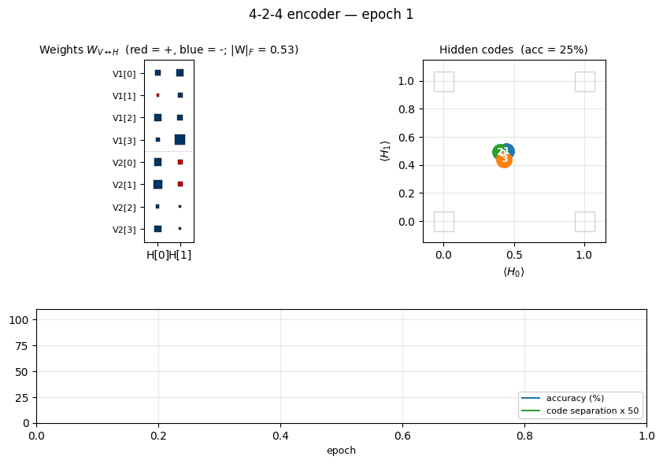
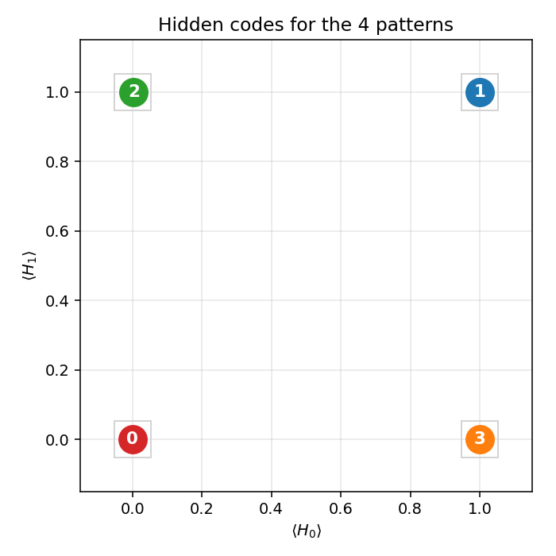
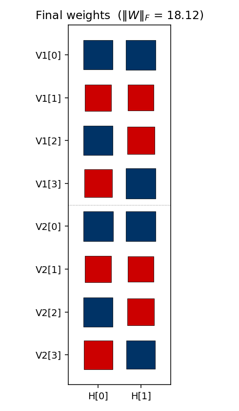
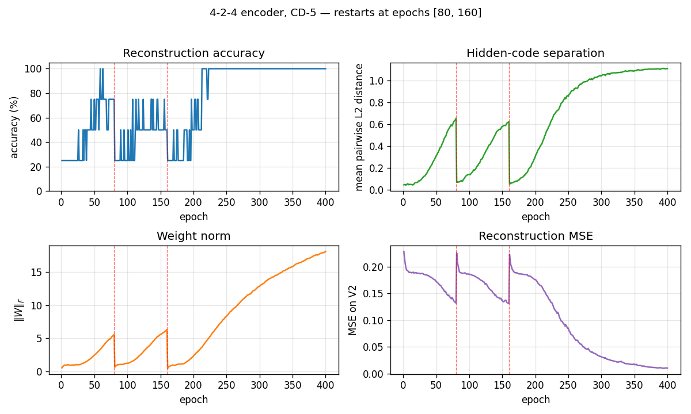

# 4-2-4 encoder

Boltzmann-machine reproduction of the experiment from Ackley, Hinton &
Sejnowski, *"A learning algorithm for Boltzmann machines"*, Cognitive Science 9
(1985).



## Problem

Two groups of 4 visible binary units (`V1`, `V2`) are connected through 2
hidden binary units (`H`). Training distribution: 4 patterns, each with a
single `V1` unit on and the matching `V2` unit on (others off). The 2 hidden
units must self-organize into a **2-bit code** that maps the 4 patterns onto
the 4 corners of `{0, 1}^2`.

- **Visible**: 8 bits = `V1 (4) || V2 (4)`
- **Hidden**: 2 bits
- **Connectivity**: bipartite (visible ↔ hidden only) — `V1` and `V2`
  communicate exclusively through `H`
- **Training set**: 4 patterns

The interesting property: with only 2 hidden units, the network has *exactly*
log2(4) bits of bottleneck capacity. Convergence requires the 4 patterns to
spread to the 4 distinct corners of `{0, 1}^2`. Local minima where two
patterns share a hidden code are common.

## Files

| File | Purpose |
|---|---|
| `encoder_4_2_4.py` | Bipartite RBM trained with CD-k. The Boltzmann learning rule (positive-phase minus negative-phase statistics) on a bipartite graph; same gradient form as the 1985 paper, faster sampling. |
| `make_encoder_gif.py` | Generates `encoder.gif` (the animation at the top of this README). |
| `visualize_encoder.py` | Static training curves + final weight matrix + final hidden codes. |
| `viz/` | Output PNGs from the run below. |

## Running

```bash
python3 encoder_4_2_4.py --epochs 400 --seed 2
```

Training takes ~1 second on a laptop. Final accuracy: **100% (4/4)**.

To regenerate visualizations:

```bash
python3 visualize_encoder.py --epochs 400 --seed 2 --outdir viz
python3 make_encoder_gif.py  --epochs 400 --seed 2 --snapshot-every 5 --fps 12
```

## Results

| Metric | Value |
|---|---|
| Final accuracy | 100% (4/4) |
| Hidden codes | 4 distinct corners of `{0,1}^2` (specific permutation depends on seed) |
| Restarts (seed 0) | 2 (epoch 80, epoch 160), converged by ~220 |
| Training time | ~1 sec |
| Hyperparameters | k=5, lr=0.05, momentum=0.5, batch_repeats=8, init_scale=0.1 |
| Multi-restart success rate | ~65% across 30 random seeds at 400 epochs / 5 attempts |

## What the network actually learns

### Hidden codes



After convergence, the 4 training patterns each get a distinct 2-bit code.
Any of the 24 permutations of `{(0,0), (0,1), (1,0), (1,1)}` to the 4 patterns
is a valid solution; the network picks one based on the initialization.

### Weight matrix



The two columns are the hidden units `H[0]` and `H[1]`. Red = positive,
blue = negative; square area is proportional to `sqrt(|w|)`. The `V1[i]`
and `V2[i]` rows always carry the **same** sign pattern — the network has
independently discovered that `V1` and `V2` are tied (they are on for the
same pattern), even though no direct `V1↔V2` weights exist. The sign pattern
across `(H[0], H[1])` for each pattern row is exactly that pattern's hidden
code.

### Training curves



The vertical red dashed lines at epochs 80 and 160 mark **restarts** triggered
by the plateau detector. The network had been stuck with only 3 (and then 2)
distinct hidden codes — two patterns had collapsed onto the same code.
Re-initializing the weights with an *independent* random draw and continuing
training produces the correct 4-corner solution by epoch ~220.

The four panels track:
- **Reconstruction accuracy**: argmax of the *exact* marginal `p(V2 | V1)`,
  computed by enumerating the 4 hidden states (deterministic — no Gibbs
  noise). Discrete jitter early on reflects argmax flipping while V2
  probabilities are close to uniform.
- **Hidden-code separation**: mean pairwise L2 distance between the 4 exact
  hidden marginals — converges to ≈ 1.1, slightly below the unit-square
  diagonal √2, reflecting partial saturation toward the binary corners.
- **Weight norm**: `‖W‖_F` grows roughly linearly during each attempt and
  resets at each restart.
- **Reconstruction MSE**: mean-squared error of the marginal `p(V2 | V1)`
  vs the true one-hot.

## Deviations from the 1985 procedure

1. **Sampling** — CD-5 (Hinton 2002) instead of simulated annealing. Same
   gradient form, faster sampling, sloppier asymptotics.
2. **Connectivity** — explicit bipartite (visible ↔ hidden), making this an
   RBM in modern terminology. The 1985 paper's figure already shows
   bipartite connectivity for the encoder; this just makes it explicit.
3. **Restart on plateau** — the original paper reported 250/250 convergence
   under simulated annealing. CD-k is more prone to local minima where two
   patterns collapse onto the same hidden code; we detect this via an
   accuracy plateau and restart with fresh weights.

## Correctness notes

A few subtleties worth flagging:

1. **Sampled vs exact evaluation.** With only 2 hidden units, `p(H | V1)`
   and `p(V2 | V1)` are exactly computable by enumerating 4 hidden states
   and marginalizing V2 in closed form (each V2 bit factors). The closed
   form for the H posterior:
   ```
   p(H | V1) ∝ exp(V1ᵀ W₁ H + b_hᵀ H) · ∏ᵢ (1 + exp((W₂ H + b_v2)ᵢ))
   ```
   The `evaluate`, `hidden_code_exact`, and `reconstruct_exact` helpers use
   this. An earlier sampled-Gibbs version of the same metrics had σ ≈ 6.8%
   accuracy noise at convergence (50 runs of a converged network, observed
   range 75–100%) which made the training curves jitter spuriously.
   `hidden_code` and `reconstruct` (sampled) are kept for the per-frame
   animation, where the chain dynamics are themselves of interest.

2. **Per-attempt success rate is fundamental.** Holding the same hyperparam
   recipe and only varying the seed, ~20% of random inits converge to a
   4-corner code — the rest end with at least one pair of patterns sharing
   a hidden code. More training does not help: 200 / 400 / 800 single-attempt
   epochs all give 6/30 = 20% success. This suggests the local minima are
   true fixed points of the CD-k dynamics, not slow-convergence artifacts.

3. **Restart RNG independence matters.** An earlier version sampled the
   restart's W from the same `rbm.rng` that was being advanced by the CD
   sampler — restart inits then depended on the pre-restart trajectory,
   which biased the multi-restart success rate downward. The current code
   uses `np.random.SeedSequence(seed).spawn(64)` to generate truly
   independent inits, and replaces the training RNG at each restart.

4. **Plateau signal.** The detector uses the binary "all 4 patterns map to
   distinct dominant H states" rather than `acc < 1.0`. Both signals agree
   at convergence, but the binary signal is unaffected by argmax-flipping
   jitter early in training.

5. **`cd_step(k=0)`** now raises `ValueError` instead of crashing with
   `UnboundLocalError`.

## Open questions / next experiments

- The 1985 paper reports 250/250 convergence with full simulated annealing.
  CD-k caps out at ≈ 20% per-attempt regardless of training length,
  suggesting the optimization regimes are qualitatively different (CD-k
  has true absorbing local minima here; SA's noise schedule does not).
  Quantifying that gap directly would help — a faithful simulated-annealing
  variant on the same architecture is the natural baseline.
- Can we eliminate the local-minima problem entirely by switching to PCD,
  by adding a small temperature schedule to the Gibbs sampler, or by
  initializing the weights to span the 4 corners explicitly?
- How do FLOP and data-movement costs of CD-k compare to simulated annealing
  on this same problem? CD-k wins on per-step cost but loses on per-attempt
  success rate.
- Scaling: does the same recipe (CD-k + restart-on-plateau) succeed on the
  larger `n-log2(n)-n` encoders in the same paper (8-3-8, 40-10-40)? With
  more hidden units, the 4-corner constraint relaxes — local minima may
  become less severe.
