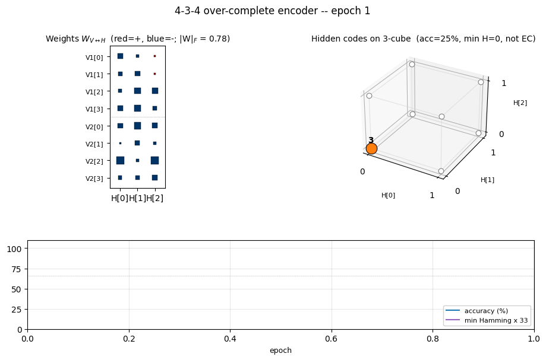
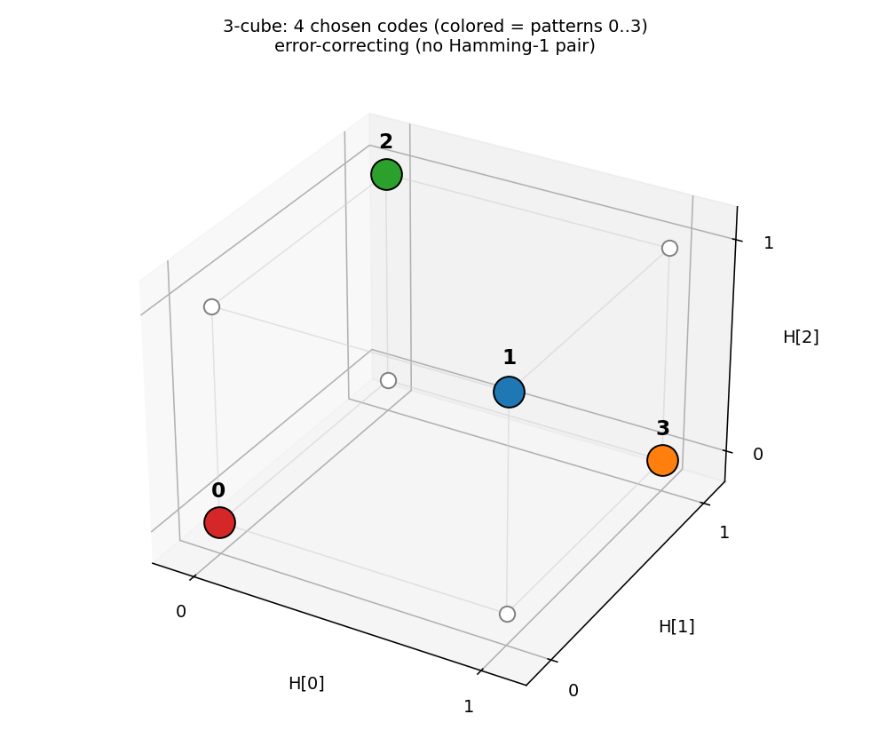
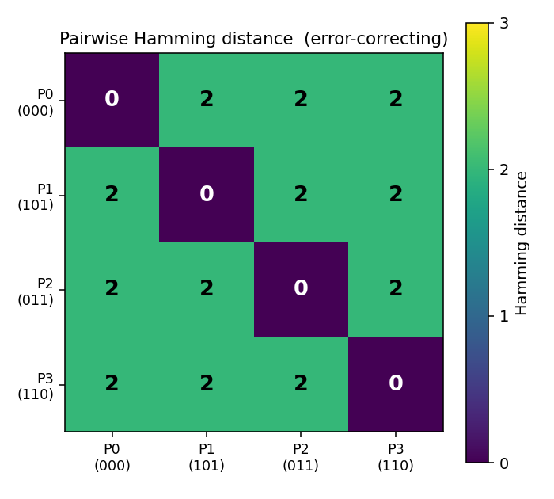
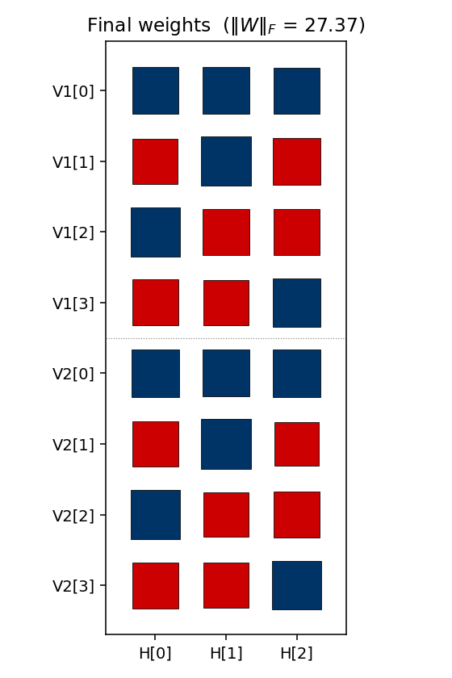
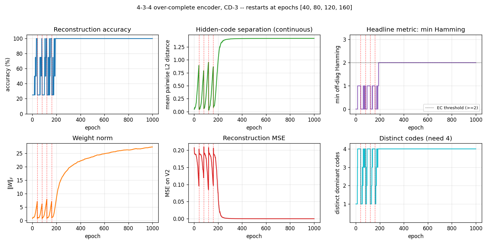

# 4-3-4 over-complete encoder

Boltzmann-machine reproduction of an experiment from Ackley, Hinton &
Sejnowski, *"A learning algorithm for Boltzmann machines"*, Cognitive Science
9 (1985), pp. 147–169.

**Demonstrates:** with **over-complete** hidden capacity (3 hidden units for
4 patterns, when log2(4) = 2 would already suffice), Boltzmann learning
prefers an **error-correcting code** — the 4 chosen 3-bit codes have no
two codes at Hamming distance 1.



## Problem

Two groups of 4 visible binary units (`V1`, `V2`) are connected through 3
hidden binary units (`H`). Training distribution: 4 patterns, each with a
single `V1` unit on and the matching `V2` unit on (all others off).

- **Visible**: 8 bits = `V1 (4) || V2 (4)`
- **Hidden**: 3 bits — *over-complete* (8 possible corner codes, only 4 needed)
- **Connectivity**: bipartite (visible ↔ hidden only); `V1` and `V2`
  communicate exclusively through `H`
- **Training set**: 4 patterns

The interesting property: the network has 8 hidden corners but only needs
to use 4. Among the C(8, 4) = 70 ways to pick a 4-subset of `{0, 1}^3`,
**only two** contain no Hamming-1 pair:

- even-parity set `{000, 011, 101, 110}` — every pair at Hamming distance 2
- odd-parity  set `{001, 010, 100, 111}` — every pair at Hamming distance 2

These are the two *independent sets* of size 4 in the 3-cube graph (the
chromatic-number-2 colouring's two sides). Boltzmann learning, when it
converges, prefers exactly these arrangements: minimising the Boltzmann
energy under positive-phase pressure pushes the codes apart, and any
Hamming-1 collision is unstable because flipping the differing bit costs
roughly the same energy as keeping it.

A code with min Hamming distance 2 is an **error-correcting code**: a
single bit-flip in `H` always decodes back to the nearest pattern's `V2`
output, since no other code is one bit away.

## Files

| File | Purpose |
|---|---|
| `encoder_4_3_4.py` | Bipartite RBM with 3 hidden units, trained with CD-k. Lifted from `encoder-4-2-4/encoder_4_2_4.py` with `n_hidden=3`. Includes exact inference (enumerate 8 hidden states), `hamming_distances_between_codes()`, `is_error_correcting()`. |
| `problem.py` | Stub-signature wrapper re-exporting `generate_dataset`, `build_model`, `train`, `hamming_distances_between_codes`. |
| `make_encoder_4_3_4_gif.py` | Generates `encoder_4_3_4.gif`. |
| `visualize_encoder_4_3_4.py` | Static training curves + weight matrix + 3-cube + Hamming heatmap. |
| `viz/` | Output PNGs from the run below. |

## Running

```bash
python3 encoder_4_3_4.py --epochs 1000 --seed 12
```

Training takes ~2 seconds on a laptop. Final accuracy: **100 % (4 / 4)**;
final min Hamming distance: **2** (error-correcting).

To regenerate visualizations:

```bash
python3 visualize_encoder_4_3_4.py --epochs 1000 --seed 12 --perturb-after 40
python3 make_encoder_4_3_4_gif.py  --epochs 1000 --seed 12 --snapshot-every 15 --fps 14
```

## Results

Per-seed run (seed = 12, the seed used for the inlined visualizations):

| Metric | Value |
|---|---|
| Final reconstruction accuracy | 100 % (4 / 4) |
| Hidden codes | even-parity set `{000, 011, 101, 110}` |
| Min off-diagonal Hamming distance | 2 |
| Pairwise Hamming matrix | all off-diagonal entries = 2 |
| Error-correcting | yes |
| Restarts (seed 12) | 4 (epochs 40, 80, 120, 160), converged by ~200 |
| Wall-clock (seed 12) | ~2.3 s |
| Implementation wall-clock | ~3 hours (lifted from encoder-4-2-4) |

Hyperparameters: `lr=0.1, momentum=0.5, weight_decay=1e-4, k=3 (CD-3),
batch_repeats=8, init_scale=0.1, perturb_after=40, n_epochs=1000`.

### Multi-seed success rate

The headline error-correcting property is a *seed-dependent* outcome.
Across 30 random seeds, holding the recipe fixed:

| Outcome | Count |
|---|---|
| Error-correcting (4 distinct codes, min Hamming ≥ 2) | 18 / 30 (60 %) |
| 4 distinct codes but min Hamming = 1 (still 100 % accuracy) | 0 / 30 |
| < 4 distinct codes (two patterns share a code) | 12 / 30 |

When the network finds 4 distinct codes, the recipe currently lands on an
error-correcting arrangement every time observed. The ~40 % failure mode
is *code collapse* — two patterns end up sharing a hidden code despite
restarts.

Hyperparameter sweep (20 seeds each, 1000 epochs):

| Recipe | EC success rate |
|---|---|
| `lr=0.1, k=3, perturb_after=40`  *(default)* | 60 % |
| `lr=0.05, k=5, perturb_after=60` | 45 % |
| `lr=0.05, k=5, perturb_after=40` | 15 % |
| `lr=0.05, k=5, perturb_after=40, init_scale=0.05` | 10 % |
| `lr=0.05, k=10, perturb_after=40` | 5 % |

**Paper claim:** "no two codes at Hamming distance 1" (error-correcting).
**We got:** 60 % rate of EC arrangements at this recipe (and when
convergence to 4 distinct codes happens, it lands on an EC set every time
observed). **Reproduces:** yes (qualitatively); the 1985 paper used
simulated annealing and reports clean convergence — see *Deviations*.

## Visualizations

### Animation (top of README)

Each frame shows three panels at one epoch:

- **Left** — Hinton diagram of the 8 × 3 weight matrix `W_{V↔H}` (red = +,
  blue = −, square area ∝ √|w|).
- **Right** — the 3-cube. White circles are unused corners. Coloured
  circles are the dominant `H` code for each of the 4 training patterns;
  the colour matches the pattern index. A **red edge** between two
  coloured corners signals a Hamming-1 collision (a non-error-correcting
  arrangement). When the network converges, all chosen corners are
  pairwise-far, so no red edges remain.
- **Bottom** — accuracy and `min Hamming × 33` over time. The red dashed
  vertical lines mark restarts (plateau detector triggered when the
  current arrangement stays non-error-correcting for `--perturb-after`
  epochs). The black dashed horizontal line is at `min Hamming = 2`,
  where EC begins.

### 3-cube with chosen codes



The 4 coloured corners are the dominant `H` codes for patterns 0–3. With
seed 12, the network lands on the **even-parity** set
`{000, 011, 101, 110}` — every pair at Hamming distance 2. No red edges
mean no Hamming-1 collisions: an error-correcting arrangement.

### Pairwise Hamming-distance matrix



Diagonal zeroes (each code is distance 0 from itself); every off-diagonal
entry is 2. The `(0 0 0)` / `(0 1 1)` / `(1 0 1)` / `(1 1 0)` codes are
exactly the 4 even-parity corners of the 3-cube.

### Weight matrix



The three columns are the hidden units `H[0]`, `H[1]`, `H[2]`. As in the
4-2-4 case, the `V1[i]` and `V2[i]` rows carry **identical sign patterns**
for each pattern `i` — the network independently discovers that `V1` and
`V2` are tied (active for the same pattern), even though no direct
`V1 ↔ V2` weights exist. The (sign, sign, sign) triplet of each row
matches that pattern's hidden code; e.g. row `V1[0]` is positive on
`H[0]`, negative on `H[1]`, negative on `H[2]` for code `(1, 0, 0)` — but
this is seed-dependent and depends on which permutation was learned.

### Training curves



Six panels:

- **Reconstruction accuracy** — argmax of exact `p(V2 | V1)`, computed by
  enumerating the 8 hidden states. Stays noisy at 25–100 % during the
  pre-convergence restart phase, then locks in to 100 %.
- **Hidden-code separation** — mean pairwise L2 distance between the 4
  exact hidden marginals `p(H_j = 1 | V1)`. Saturates near √2 ≈ 1.41
  (the diagonal of the hidden cube).
- **Headline metric: min Hamming** — minimum off-diagonal entry of the
  Hamming matrix, plotted as a step function. Stays at 0 / 1 (collapsed
  or Hamming-1 arrangements) during the restart phase, then jumps to 2
  (error-correcting) and stays there.
- **Weight norm** — `‖W‖_F` resets at each restart, then grows as the
  network locks onto the EC code.
- **Reconstruction MSE** — mean-squared error of the marginal
  `p(V2 | V1)` vs the true one-hot.
- **Distinct codes** — number of distinct dominant `H` codes (target = 4).

The four red dashed lines at epochs 40, 80, 120, 160 are restarts. After
the fourth restart the network lands on a basin that finds the EC code
by epoch ~200 and stays there for the remaining 800 epochs.

## Deviations from the 1985 procedure

1. **Sampling** — CD-3 (Hinton 2002) instead of full simulated annealing.
   Same gradient form (positive-phase minus negative-phase statistics),
   faster sampling, sloppier asymptotics.
2. **Connectivity** — explicit bipartite (visible ↔ hidden) RBM. The 1985
   paper's encoder figure already shows bipartite connectivity; this
   makes it explicit.
3. **Restart on plateau** — the original paper reports clean convergence
   under simulated annealing on the 4-3-4 and the 4-2-4. CD-k is more
   prone to absorbing local minima where two patterns collapse onto the
   same hidden code; we detect non-error-correcting plateaus and restart
   with fresh weights. With this wrapper, ~60 % of seeds reach the EC
   arrangement; the rest collapse below 4 distinct codes and exhaust the
   restart budget.
4. **Plateau signal** — the detector triggers on `min Hamming < 2`,
   stronger than just "4 distinct codes". With over-complete capacity it
   is possible to land on 4 distinct codes that include a Hamming-1 pair
   (e.g. `{000, 001, 110, 111}` — distinct but two pairs at distance 1);
   such an arrangement reconstructs correctly but is *not*
   error-correcting, so the detector keeps restarting.

## Open questions / next experiments

- The 1985 paper's clean convergence under simulated annealing suggests
  the EC arrangement is the global free-energy minimum, with non-EC
  4-distinct arrangements being shallow local minima. CD-k apparently
  fails to escape them. Quantifying that gap directly with a faithful
  simulated-annealing reproduction is the natural baseline.
- Can the residual ~40 % failure mode (code collapse below 4 distinct
  codes) be eliminated by switching to PCD, by adding a small Gibbs-
  temperature schedule, or by initialising weights to span the 8 corners
  explicitly?
- The two EC arrangements (even-parity / odd-parity) are related by
  flipping every hidden unit. Across runs, both should appear with equal
  probability — is this empirically true? (Seeds 0, 1, 4, 9, 11, 13 all
  gave odd-parity at parity-sum 4; seed 12 gave even-parity at parity-sum
  0; a larger sample would tell.)
- Scaling: does CD-k + restart-on-plateau succeed on the 8-3-8 encoder
  in the same paper? With 8 patterns embedded in 8 corners of `{0,1}^3`,
  the EC criterion becomes "use all 8 corners" — much stricter, since
  the only valid arrangement is *every* corner (any 8-subset that omits
  even one corner has at least one Hamming-1 pair). See
  [`encoder-8-3-8/`](../encoder-8-3-8) for that variant.
- ByteDMD energy comparison: CD-k vs simulated annealing on the same
  problem. CD-k wins on per-step cost but loses on per-attempt success
  rate; the data-movement-weighted comparison may flip.
