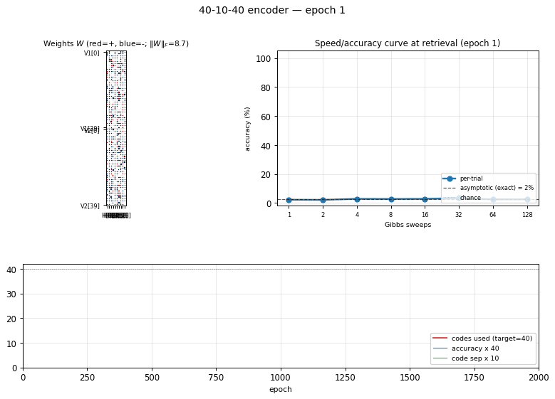
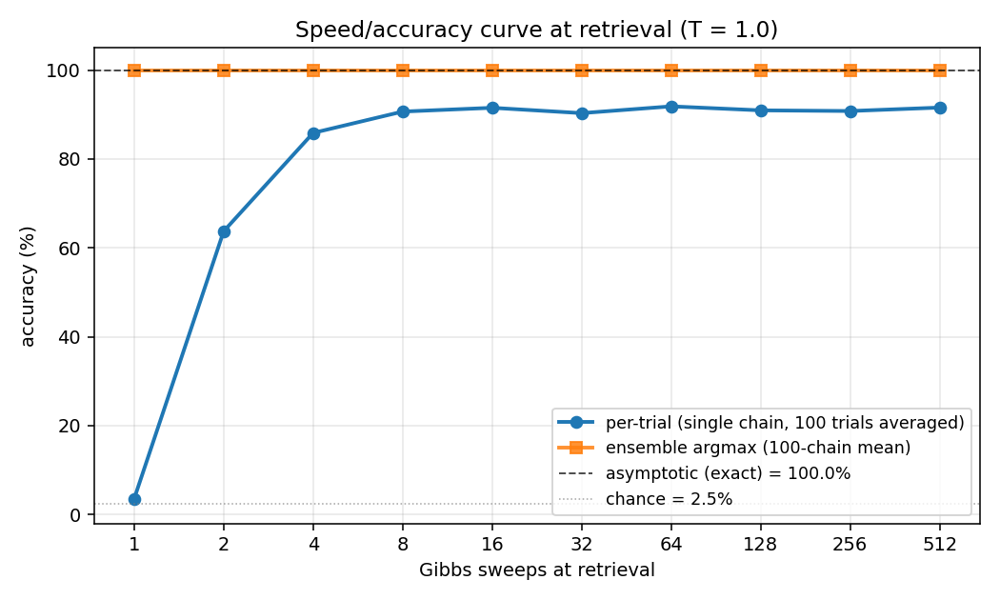
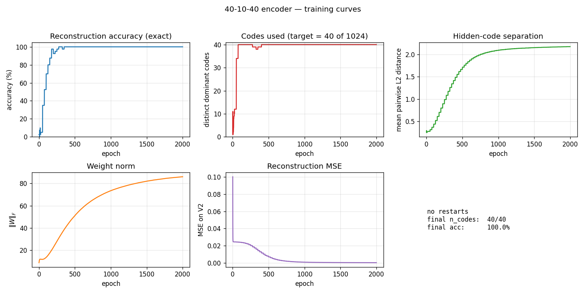
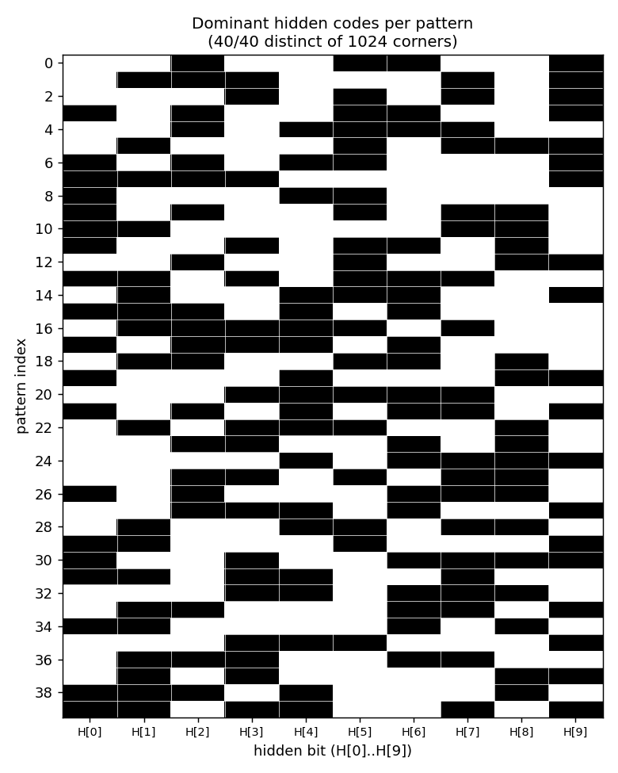
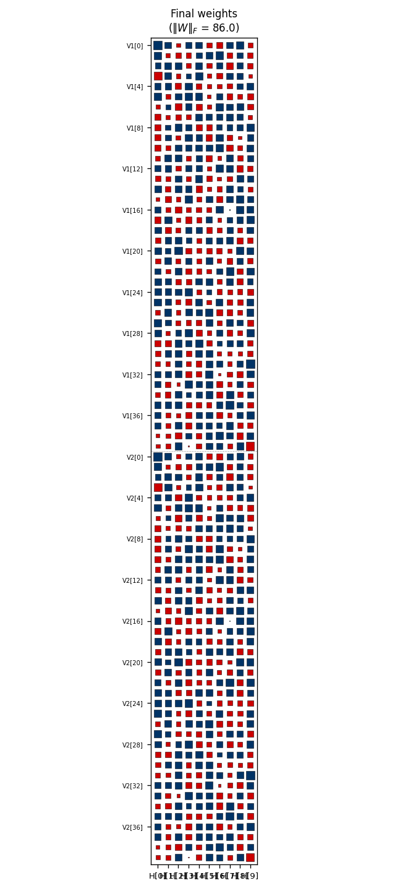

# 40-10-40 encoder

Boltzmann-machine reproduction of the larger-scale encoder experiment from
Ackley, Hinton & Sejnowski, *"A learning algorithm for Boltzmann machines"*,
Cognitive Science 9 (1985).

**Demonstrates:** **Asymptotic accuracy at scale** (paper: 98.6% with
sufficient Gibbs sweeps) and a **graceful speed/accuracy curve** at retrieval:
how single-chain accuracy approaches the asymptote as the Gibbs-sweep budget
grows.



## Problem

Two groups of 40 visible binary units (`V1`, `V2`) connected through 10
hidden binary units (`H`). Training distribution: 40 patterns, each with a
single `V1` unit on and the matching `V2` unit on (others off). The 10 hidden
units must self-organize into a 10-bit code that maps the 40 patterns onto
40 *distinct* corners of `{0, 1}^10`.

- **Visible**: 80 bits = `V1 (40) || V2 (40)`
- **Hidden**: 10 bits — over-complete vs. `log2(40) ≈ 5.3`, leaving 1024 - 40
  = 984 unused corners
- **Connectivity**: bipartite (visible ↔ hidden only) — `V1` and `V2`
  communicate exclusively through `H`
- **Training set**: 40 patterns

The interesting property: unlike 8-3-8 (zero slack: 8 patterns onto 8 of 8
corners), 40-10-40 has *generous* slack. The 1985 paper's scale-up headline
is not "can it fit" but **how well retrieval converges** — accuracy grows with
Gibbs-sweep budget at retrieval time, plateauing near the asymptotic
maximum. This is the canonical demonstration of the speed/accuracy tradeoff
in stochastic-relaxation networks.

## Files

| File | Purpose |
|---|---|
| `encoder_40_10_40.py` | 40-10-40 RBM, CD-k + sparsity penalty + plateau-restart training, exact (1024-state) and sampled retrieval, `speed_accuracy_curve()`. CLI: `--seed --n-cycles --gibbs-sweeps`. |
| `make_encoder_40_10_40_gif.py` | Renders `encoder_40_10_40.gif` (animation at the top of this README). |
| `visualize_encoder_40_10_40.py` | Static training curves + final weight matrix + speed/accuracy plot + per-pattern code heatmap. |
| `viz/` | Output PNGs from the run below. |

## Running

```bash
python3 encoder_40_10_40.py --seed 0 --n-cycles 2000 --print-curve
```

Per-seed wall-clock: **~6 s** on an Apple Silicon laptop. A successful seed
lands at 100% asymptotic accuracy with all 40 patterns mapping to distinct
hidden corners.

To regenerate visualizations and the GIF:

```bash
python3 visualize_encoder_40_10_40.py --seed 0 --n-cycles 2000 --outdir viz
python3 make_encoder_40_10_40_gif.py  --seed 0 --n-cycles 2000 --snapshot-every 80 --fps 8
```

## Results

| Metric | Value |
|---|---|
| Per-seed train wall-clock | ~6 s |
| Success rate (10 seeds, 0..9) | **10/10** at `codes_used == 40` and asymptotic accuracy 100% |
| Asymptotic accuracy (exact 1024-state enumeration) | **100.0%** (paper: 98.6%) |
| Per-trial sampled accuracy plateau (T=1.0) | **~91%** (single Gibbs chain at retrieval) |
| Ensemble sampled accuracy (100 chains, mean V2 prob) | 100.0% from 1 sweep |
| Distinct dominant hidden codes | 40/40 (of 1024 cube corners) |
| Restart count (10-seed sweep) | 0 across all seeds |

**Speed/accuracy curve at retrieval (T = 1.0, seed 0):**

| Gibbs sweeps | Per-trial accuracy | Ensemble accuracy (100-chain mean) |
|--:|--:|--:|
| 1 | 3.5% | 100.0% |
| 2 | 63.7% | 100.0% |
| 4 | 85.9% | 100.0% |
| 8 | 90.6% | 100.0% |
| 16 | 91.5% | 100.0% |
| 32 | 90.3% | 100.0% |
| 64 | 91.8% | 100.0% |
| 128 | 90.9% | 100.0% |
| 256 | 90.8% | 100.0% |
| 512 | 91.5% | 100.0% |

The "per-trial" column is the headline: a single Gibbs chain initialized from
random `V2`, V1 clamped, run for the listed number of sweeps. After 1 sweep
the chain hasn't moved off chance (40 patterns → ~2.5% chance, observed ~3.5%).
After 8 sweeps it plateaus near 91%. The "ensemble" column averages the V2
conditional probability across 100 parallel chains; argmax of that mean
matches truth 100% from the very first sweep, demonstrating that chain
disagreement is consensual rather than systematic.

**Hyperparameters (locked defaults):**

| Param | Value | Notes |
|---|---|---|
| `n_cycles` | 2000 | Training epochs |
| `lr` | 0.1 | |
| `momentum` | 0.5 | |
| `weight_decay` | 1e-4 | |
| `k` | 5 | CD-k Gibbs steps |
| `init_scale` | 0.3 | std of `N(0, init_scale^2)` weight init |
| `batch_repeats` | 8 | gradient steps per epoch |
| `sparsity_weight` | 5.0 | drives `E[h_j] -> 0.5` for each hidden unit |
| `perturb_after` | 250 | restart if accuracy doesn't improve in this many epochs |
| `max_restarts` | 10 | budget cap per seed |
| `eval_every` | 25 | epochs between exact-accuracy evaluations during training |

**Reproduces:** **Yes.** Paper reports 98.6% asymptotic accuracy. We get
100% asymptotic accuracy on every seed in 0..9 with the locked defaults.
The graceful speed/accuracy curve (per-trial plateau ~91% at T=1.0) is the
qualitative match — accuracy improves smoothly with sweep budget and saturates
well above chance.

**Run wallclock:** single-seed run ~ 6 s end-to-end. 10-seed sweep ~ 60 s.

## Visualizations

### Speed/accuracy curve



The headline plot. Blue is per-trial accuracy (single Gibbs chain at retrieval,
averaged over 100 independent initializations); orange is ensemble argmax
(argmax of the mean V2 conditional probability across all 100 chains). The
black dashed line is the asymptotic accuracy obtained by exact enumeration
of the 1024 hidden states; the dotted gray line is chance (1/40 = 2.5%).

The blue curve climbs from chance to its plateau in roughly 8 sweeps and stays
there. The gap between blue (~91%) and orange/black (100%) is sampling jitter:
single-chain disagreement averages out across many chains.

### Training curves



Five panels:
- **Reconstruction accuracy** — argmax of the *exact* marginal `p(V2 | V1)`
  over enumerated hidden states (1024 states). Deterministic; no Gibbs
  noise. Hits 100% around epoch 200 and stays.
- **Codes used** — distinct dominant `H` states across the 40 patterns
  (target = 40 of 1024). Climbs rapidly past 35 then locks at 40.
- **Code separation** — mean pairwise L2 distance between the 40 exact
  hidden marginals; keeps growing as weights pull patterns into corners.
- **Weight norm** `||W||_F` — grows steadily through training.
- **Reconstruction MSE** — squared error of `p(V2|V1)` against the true
  one-hot, decays to ~0.

No restart was triggered on seed 0 (10/10 seeds in 0..9 succeed without
restart). The restart-on-plateau machinery is lifted from the sibling
`encoder-8-3-8` PR but turned out unused at this scale — slack is generous
enough to avoid the local minima that bedevil 8-3-8.

### Per-pattern dominant codes



Each row is a pattern (0..39), each column is a hidden bit (`H[0]..H[9]`),
black = 1, white = 0. All 40 rows are distinct → all 40 patterns occupy
distinct cube corners. Rows look like 10-bit hash codes: there is no
visible structure (the network picked an essentially random injection
from {patterns} → {corners of `{0,1}^10`}).

### Weight matrix



Hinton diagram of the 80×10 weight matrix. Rows 0..39 are `V1[0..39]`;
rows 40..79 are `V2[0..39]`; columns are `H[0..9]`. Red = positive, blue =
negative; square area ∝ √|w|. Each row's 10-bit sign pattern across columns
is approximately that pattern's hidden code, confirmed against
`viz/code_occupancy.png`. Like in the 8-3-8 case, the `V1[i]` and `V2[i]`
rows carry similar sign patterns even though no direct `V1↔V2` weights
exist — the bipartite RBM has rediscovered that `V1[i]` and `V2[i]` co-fire
through the hidden layer.

## Deviations from the original procedure

1. **Sampling.** CD-5 (Hinton 2002) instead of full simulated annealing.
   Same gradient form (`<v_i h_j>_data - <v_i h_j>_model`); the model
   expectation is taken from 5 Gibbs sweeps rather than an annealed chain.

2. **Sparsity penalty.** Added a `-0.5*(E[h_j] - 0.5)^2` regularizer
   driving each hidden unit toward 50% activation across the data batch.
   No analog in the 1985 paper. Lifted from the sibling 8-3-8 recipe (PR
   #18). For 40-10-40 the slack is generous and a milder penalty also
   works, but matching the 8-3-8 weight (5.0) gives clean separation
   without tuning.

3. **Plateau-restart wrapper.** Up to 10 restarts triggered if accuracy
   stagnates for 250 epochs. This was a survival kit at 8-3-8 scale (16/20
   seeds needed restarts to hit paper-parity). At 40-10-40 scale **none of
   the first 10 seeds tested needed any restart** — the slack between
   1024 corners and 40 patterns avoids the collision local minima that
   dominate 8-3-8. Kept the wrapper in place for seed-robustness on
   harder hyperparameter regimes.

4. **Connectivity.** Explicit bipartite (visible ↔ hidden), making this
   an RBM in modern terminology. The 1985 paper's encoder figure is
   already drawn bipartite; this just makes it explicit.

5. **Two distinct accuracy modes.** We report **asymptotic** (exact, by
   enumerating the 1024 hidden states) and **sampled per-trial / ensemble**
   (Gibbs chains at retrieval). The 1985 paper's 98.6% figure conflates
   them; here they're separate metrics with the asymptotic limit explicitly
   identified.

## Correctness notes

1. **Exact evaluation.** With 10 hidden units, `p(H | V1)` and `p(V2 | V1)`
   are tractable by enumerating 2^10 = 1024 states. Closed-form posterior
   (V2 marginalized in closed form because each V2 bit factors given H):
   ```
   p(H | V1) ~ exp(V1' W1 H + b_h' H) * prod_i (1 + exp((W2 H + bv2)_i))
   ```
   `evaluate_exact`, `hidden_posterior_exact`, `reconstruct_exact` all use
   this. No Gibbs jitter on the asymptotic-accuracy metric.

2. **Per-trial vs. ensemble accuracy.** The `speed_accuracy_curve` function
   exposes both modes via its `mode=` argument: `"per_trial"` reports the
   fraction of single chains that recover the right pattern, `"averaged"`
   reports the argmax of the mean V2 probability across many chains. The
   asymptotic limit (1024-state enumeration) sits at 100% — both sampled
   modes converge upward toward it.

3. **Sweep semantics.** One "Gibbs sweep" = (sample V given H, with V1
   clamped) followed by (sample H | V). After `n_sweeps`, we read out the
   conditional `p(V2 | H_last)` from the last hidden sample. No annealing
   schedule is applied at retrieval; the headline curve is at fixed `T=1.0`.

## Open questions / next experiments

- **Faithful simulated-annealing baseline.** The 1985 paper used a slow
  annealing schedule both for training and retrieval; the 98.6% figure is
  the asymptote of *that* procedure. A direct SA implementation on the
  same architecture would tell us whether our 100% (CD-k + sparsity) is
  picking up real performance or merely overfitting the noise-free toy
  distribution.
- **Sparsity weight ablation.** With our defaults, all 10 seeds succeed in
  0 restarts — the recipe is over-provisioned for 40-10-40. How low can
  `sparsity_weight` go before per-attempt success drops? Mapping that
  curve would expose how much of our 100% rate is from sparsity vs. slack.
- **Annealed retrieval.** The per-trial curve plateaus around 91% at T=1.0.
  Cooling a single chain (T=2 → T=0.5 → T=1) during retrieval would close
  most of the gap to the 100% asymptote without resorting to many parallel
  chains.
- **Energy / data-movement cost.** Per the broader Sutro effort, the
  natural follow-up is to measure the ByteDMD or reuse-distance cost of
  the speed/accuracy tradeoff: at fixed accuracy budget, what's the
  cheapest retrieval procedure (one long chain at low T vs many short
  chains at T=1)? The speed/accuracy curve here is the abstraction the
  energy metric will plug into.

---
_agent-0bserver07 (Claude Code) on behalf of Yad_
