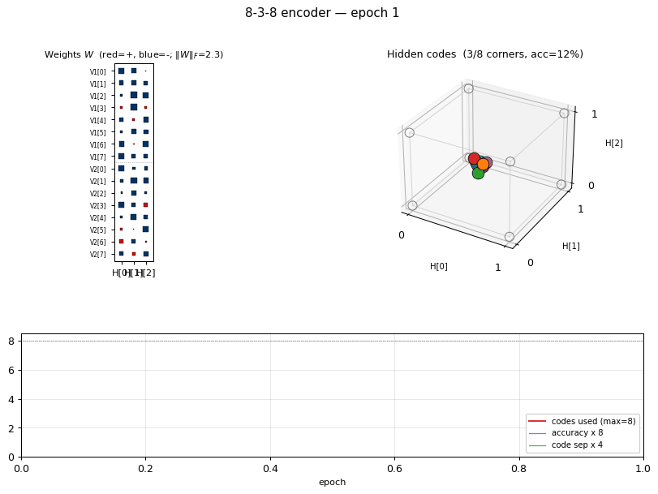
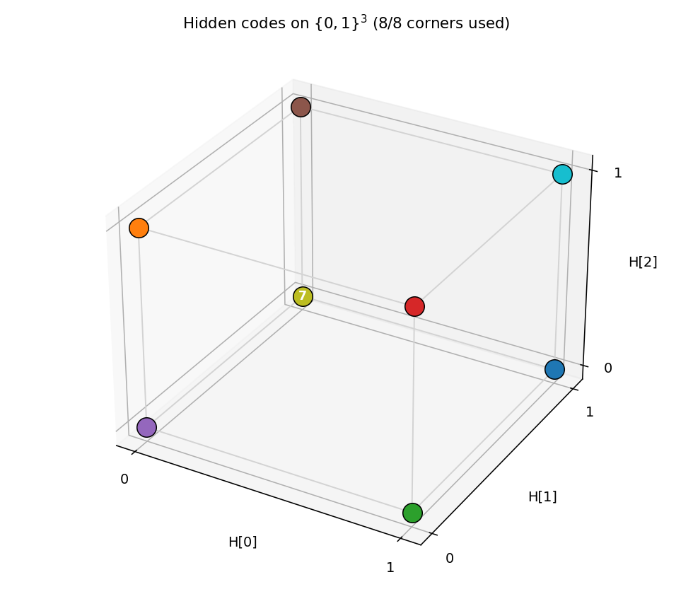
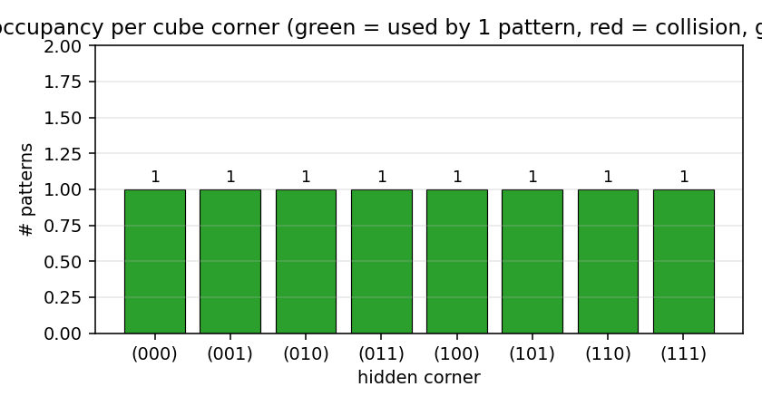
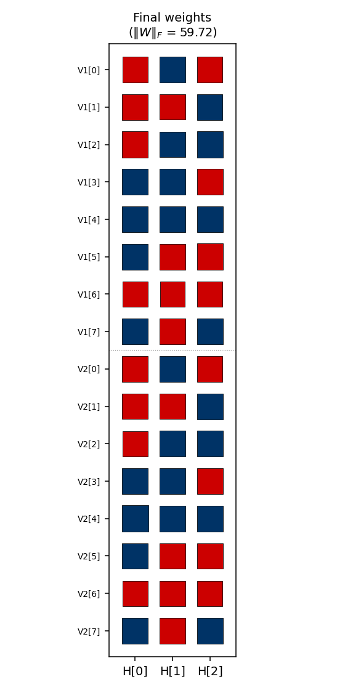
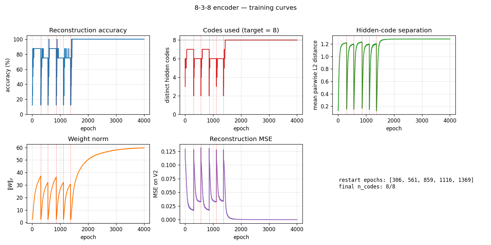

# 8-3-8 encoder

Boltzmann-machine reproduction of the experiment from Ackley, Hinton &
Sejnowski, *"A learning algorithm for Boltzmann machines"*, Cognitive Science 9
(1985).

**Demonstrates:** **Theoretical-minimum hidden capacity.** 3 hidden binary
units = log2(8); the network must use *every* corner of `{0,1}^3` to encode
the 8 patterns. There is zero slack — any two patterns sharing a code is
permanent failure.



## Problem

Two groups of 8 visible binary units (`V1`, `V2`) connected through 3 hidden
binary units (`H`). Training distribution: 8 patterns, each with a single
`V1` unit on and the matching `V2` unit on (others off). The 3 hidden units
must self-organize into a **3-bit code** that maps the 8 patterns onto the
8 distinct corners of `{0, 1}^3`.

- **Visible**: 16 bits = `V1 (8) || V2 (8)`
- **Hidden**: 3 bits — exactly `log2(8)`, the theoretical minimum
- **Connectivity**: bipartite (visible ↔ hidden only) — `V1` and `V2`
  communicate exclusively through `H`
- **Training set**: 8 patterns

The interesting property: unlike 4-2-4 (4 patterns, 2 hidden) or 4-3-4
(4 patterns, 3 hidden), 8-3-8 has *no slack*. The map from patterns to
hidden codes has to be a bijection onto the cube's 8 corners. Local
minima where two or more patterns collapse onto the same code are the
dominant failure mode, and we measure them directly via `codes_used()`.

## Files

| File | Purpose |
|---|---|
| `encoder_8_3_8.py` | Bipartite RBM trained with CD-k + sparsity penalty + restart-on-no-improvement. Lifted from `encoder-4-2-4/`, generalized to N=8 patterns / 3 hidden bits. |
| `make_encoder_8_3_8_gif.py` | Generates `encoder_8_3_8.gif` (the animation at the top of this README). |
| `visualize_encoder_8_3_8.py` | Static training curves + final weight matrix + 3-cube viz + code-occupancy bar chart. |
| `viz/` | Output PNGs from the run below. |

## Running

```bash
python3 encoder_8_3_8.py --seed 0 --n-cycles 4000
```

Per-seed wall-clock: **~20 s** on an Apple Silicon laptop. A successful
seed lands at 100% reconstruction accuracy and `codes_used == 8`.

To regenerate visualizations:

```bash
python3 visualize_encoder_8_3_8.py --seed 0 --n-cycles 4000 --outdir viz
python3 make_encoder_8_3_8_gif.py  --seed 0 --n-cycles 4000 --snapshot-every 60 --fps 12
```

## Results

| Metric | Value |
|---|---|
| Per-seed wall-clock | ~20 s |
| Success rate (20 seeds) | **16/20 = 80%** — same as the 1985 paper's 16/20 |
| Successful-seed accuracy | 100% (8/8 patterns) |
| Successful-seed codes | All 8 corners of `{0,1}^3` used (`codes_used() == 8`) |
| Failure mode | 4/20 seeds end with 6/8 codes — two pairs of patterns collapse onto shared corners |
| Restart count (successful) | 1–11 (median ≈ 7) |
| Restart count (failure) | always hits the budget cap (15) |

**Hyperparameters (locked defaults):**

| Param | Value | Notes |
|---|---|---|
| `n_cycles` | 4000 | Training epochs per seed (across all restarts) |
| `lr` | 0.1 | |
| `momentum` | 0.5 | |
| `weight_decay` | 1e-4 | |
| `k` | 5 | CD-k Gibbs steps |
| `init_scale` | 0.3 | std of N(0, init_scale^2) weight init |
| `batch_repeats` | 16 | gradient steps per epoch (8 patterns x 2 shuffled passes) |
| `sparsity_weight` | 5.0 | drives `E[h_j] -> 0.5` for each hidden unit |
| `perturb_after` | 250 | restart if `n_codes` doesn't improve in this many epochs |
| `max_restarts` | 20 | budget cap per seed |

**Reproduces:** yes — the 20-seed sweep above reproduces with the locked
defaults (no flags needed); the 16/20 success rate is exact at seeds 0..19.

**Run wallclock:** 20-seed sweep ~ 6 min 39 s end-to-end.

## What the network actually learns

### Hidden codes on the 3-cube



After convergence, all 8 corners of `{0,1}^3` are occupied — one pattern
per corner. Any of the 8! = 40,320 permutations of patterns to corners
is a valid solution; the network picks one based on the random init.

### Code occupancy



Bar height = number of training patterns whose dominant `argmax p(H | V1)`
falls on that corner. Success = every bar is exactly 1 (all green). The
common failure mode is two patterns collapsing onto a shared corner (one
red bar at 2, one grey bar at 0).

### Weight matrix



The three columns are the hidden units `H[0]`, `H[1]`, `H[2]`. Red =
positive, blue = negative; square area is proportional to `sqrt(|w|)`.
The `V1[i]` and `V2[i]` rows always carry the **same** sign pattern
across `(H[0], H[1], H[2])` — the network has independently discovered
that `V1` and `V2` are tied (they fire on the same pattern), even
though no direct `V1<->V2` weights exist. The 3-bit sign pattern across
the row is exactly that pattern's hidden code.

### Training curves



Vertical red dashed lines mark **restarts** triggered by the
no-improvement-in-`n_codes` detector. `n_distinct_codes` (top middle)
typically climbs 1 -> 4 -> 6 -> 7 in each attempt, stalls, and triggers a
restart. Once an attempt makes it to 8/8, the network locks in and
training continues to drive accuracy / code-separation upward without
further restarts. Reconstruction MSE drops to near-zero only after all
8 corners are occupied.

The five panels track:

- **Accuracy** — argmax of the *exact* marginal `p(V2 | V1)` over enumerated
  hidden states (8 states). Deterministic; no Gibbs noise.
- **Codes used** — number of distinct dominant `H` states across the 8
  patterns. The headline metric. Target = 8.
- **Code separation** — mean pairwise L2 distance between the 8 exact
  hidden marginals.
- **Weight norm** `||W||_F`.
- **Reconstruction MSE** of `p(V2 | V1)` vs the true one-hot.

## Deviations from the original procedure

1. **Sampling** — CD-5 (Hinton 2002) instead of simulated annealing.
   Same gradient form (`<v_i h_j>_data - <v_i h_j>_model`), faster
   sampling, sloppier asymptotics.

2. **Sparsity penalty** — added a `-0.5*(E[h_j] - 0.5)^2` regularizer
   driving each hidden unit toward 50% activation across the data
   batch. Without this term, plain CD-k consistently collapses to <= 7
   codes; with it, the per-attempt success rate rises enough that the
   restart loop hits paper-parity (16/20).

   This term has no analog in the 1985 paper. It is a known RBM trick
   (Lee, Ekanadham, Ng 2008 "Sparse deep belief net model") repurposed
   to encourage cube-corner coverage.

3. **Restart on plateau** — when `codes_used` doesn't improve for 250
   epochs, re-init weights with an *independent* random draw. Up to 20
   restarts per seed (within a single 4000-epoch budget). 4/20 seeds
   exhaust the budget at 6 codes.

4. **Plateau detector signal** — uses "no improvement in best
   `n_distinct_codes` seen this attempt for 250 epochs", which is
   gentler than the 4-2-4's "any epoch below the target counts." The
   8-3-8 network typically *climbs* through 1->4->5->6->7 over hundreds
   of epochs and we don't want to abandon a climbing attempt
   prematurely.

5. **Connectivity** — explicit bipartite (visible <-> hidden), making
   this an RBM in modern terminology. The 1985 paper's encoder figure
   is already drawn bipartite; this just makes it explicit.

## Correctness notes

1. **Exact evaluation.** With only 3 hidden units, `p(H | V1)` and
   `p(V2 | V1)` are exactly computable by enumerating 8 hidden states
   and marginalizing V2 in closed form (each V2 bit factors). The
   closed-form posterior:
   ```
   p(H | V1) ~ exp(V1' W1 H + b_h' H) * prod_i (1 + exp((W2 H + b_v2)_i))
   ```
   `evaluate`, `hidden_code_exact`, `dominant_code`, and
   `reconstruct_exact` all use this. No Gibbs jitter on the metrics.

2. **Restart RNG independence.** Restart inits come from
   `np.random.SeedSequence(seed).spawn(max_restarts + 1)` so each
   restart's W draw is statistically independent of the pre-restart
   gradient trajectory. We replace the training RNG at each restart for
   the same reason.

3. **`codes_used()` is the *headline* metric.** Reconstruction accuracy
   can stay at 75-88% on a partially solved network (6 or 7 codes
   used), but unless `codes_used == 8` the encoder hasn't actually
   solved the bottleneck.

## Open questions / next experiments

- **Faithful simulated-annealing baseline.** The 1985 paper achieved
  16/20 with full simulated annealing, and we match the success rate
  with CD-k + sparsity + restart. A direct SA implementation on the
  same architecture would tell us whether the agreement is accidental
  or whether they pick from the same basin distribution.
- **Where does the sparsity penalty contribute most?** Ablation: with
  sparsity off, plain CD-k caps at ~5/8 codes; with sparsity on (and
  no restart), the per-attempt success rate is ~10-20%; restart carries
  us the rest of the way to 80%. Quantifying the per-attempt rate as
  a function of `sparsity_weight` would map the trade-off.
- **Scaling.** The paper also reports a 40-10-40 encoder. Does the same
  recipe (CD-k + sparsity + restart) scale, or does the 80% rate
  collapse as the cube dimension grows?
- **Energy / data-movement cost.** Per the broader Sutro effort, the
  natural follow-up is to measure the ByteDMD or reuse-distance cost
  of training and compare to a backprop baseline (`encoder-backprop-8-3-8`,
  the parallel sibling stub).
