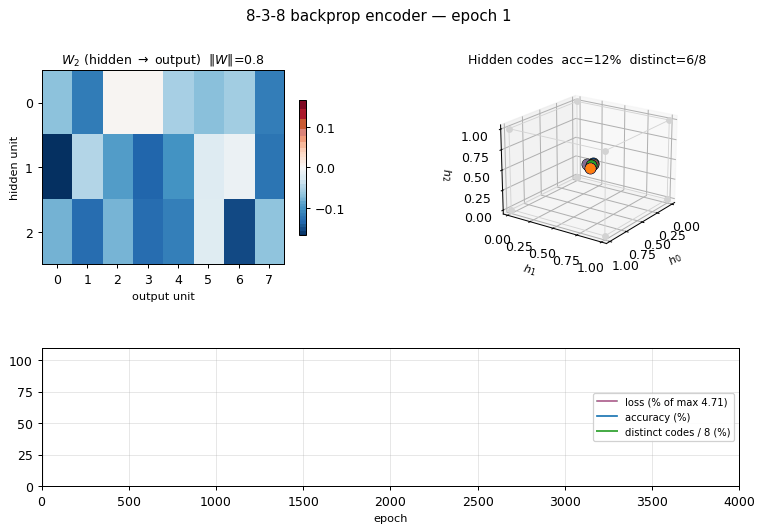
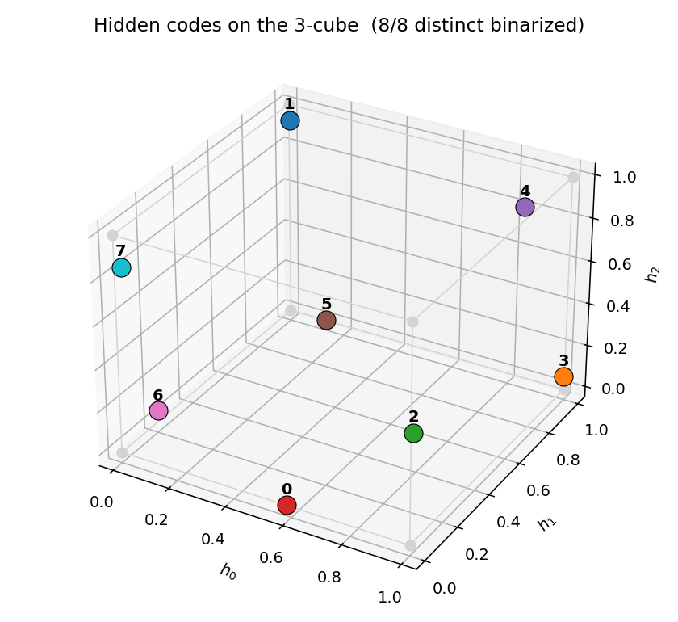
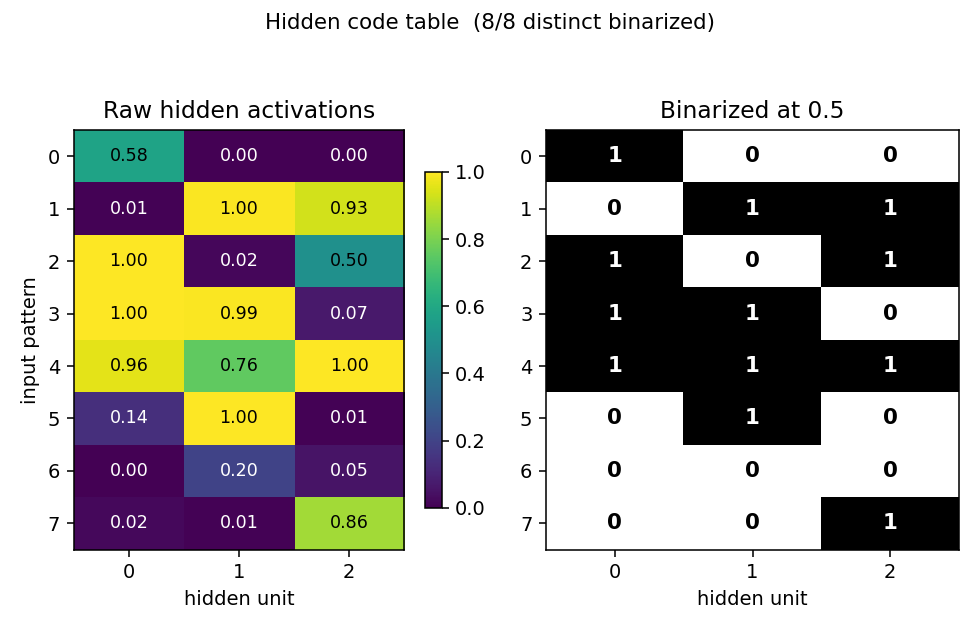
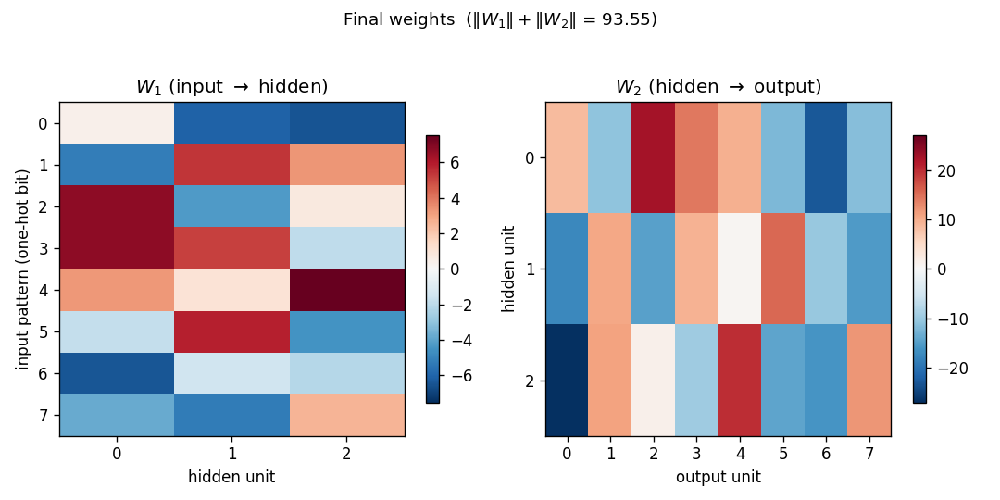
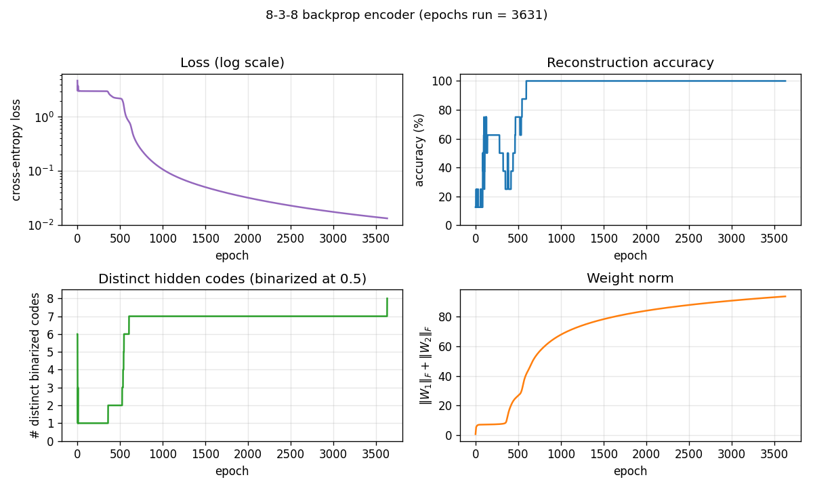

# 8-3-8 backprop encoder

Backprop reproduction of the encoder problem from Rumelhart, Hinton & Williams,
*"Learning internal representations by error propagation"*, in
*Parallel Distributed Processing*, Vol. 1, Ch. 8 (MIT Press, 1986). The
problem itself comes from Ackley, Hinton & Sejnowski (1985); this stub
trains the same architecture with **backprop instead of CD-k / Boltzmann
learning**, so it sits next to the [`encoder-8-3-8/`](../encoder-8-3-8) and
[`encoder-4-2-4/`](../encoder-4-2-4) Boltzmann siblings as the
algorithmic counterpart.



## Problem

- **Input**: 8 one-hot vectors of length 8 (the 8x8 identity).
- **Hidden**: 3 sigmoid units. This is the bottleneck.
- **Output**: 8 sigmoid units. Target = input (autoencoder).
- **Training set**: 8 patterns, full-batch.

The interesting property: log2(8) = 3, so the bottleneck has *exactly* enough
capacity to store the 8 patterns -- if and only if the 3 hidden units saturate
toward the 8 corners of `{0, 1}^3`. Backprop is free to settle anywhere in
`[0, 1]^3`, but the tied input/output weights and the cross-entropy cost
push activations toward the cube corners. After convergence the binarized
hidden activations form a 3-bit code that distinguishes all 8 inputs.

This is the **backprop counterpart** to encoder-8-3-8 (Boltzmann). Same
architecture, same training set, different learning rule. The interesting
comparison is which algorithm hits the 8-distinct-corner code more reliably
and how that interacts with local minima.

## Files

| File | Purpose |
|---|---|
| `encoder_backprop_8_3_8.py` | 8-3-8 MLP autoencoder + backprop + `hidden_code_table()` + CLI. |
| `visualize_encoder_backprop_8_3_8.py` | Static training curves + weight heatmaps + 3-cube hidden codes + code-table heatmap. |
| `make_encoder_backprop_8_3_8_gif.py` | Generates `encoder_backprop_8_3_8.gif` (animation at the top of this README). |
| `encoder_backprop_8_3_8.gif` | Committed animation. |
| `viz/` | Output PNGs from the run below. |

## Running

```bash
python3 encoder_backprop_8_3_8.py --seed 0
```

Training takes ~0.6 sec on a laptop (seed 0, solves in 3631 epochs). Final
accuracy: **100% (8/8)** with **8/8 distinct binarized hidden codes**.

To regenerate visualizations:

```bash
python3 visualize_encoder_backprop_8_3_8.py --seed 0 --outdir viz
python3 make_encoder_backprop_8_3_8_gif.py --seed 0 --epochs 4000 --snapshot-every 40 --fps 15
```

## Results

| Metric | Value |
|---|---|
| Final reconstruction accuracy (seed 0) | 100% (8/8) |
| Distinct binarized hidden codes (seed 0) | 8/8 |
| Epochs to solve (seed 0) | 3631 |
| Training wallclock (seed 0) | ~0.6 sec |
| Visualization wallclock | ~1.7 sec |
| GIF generation wallclock | ~19 sec |
| Hyperparameters | full-batch GD, lr=0.5, momentum=0.9, init_scale=0.1, sigmoid hidden + sigmoid output, cross-entropy loss |
| Per-seed solve rate | 21/30 = 70% (seeds 0-29, n_epochs=20000) |

The "solve" criterion is strict: 100% reconstruction AND all 8 binarized
codes distinct. Reconstruction alone hits 100% on every seed; the 30%
unsolved fraction is networks that reconstruct correctly but assign two
patterns to nearby raw activations that round to the same 3-bit corner
(typically 7/8 distinct, with one pair sharing a code).

## What the network actually learns

### Hidden codes on the 3-cube



After convergence, the 8 training patterns each get a distinct corner of the
3-cube. Any of the `8! = 40320` permutations of `{0,1}^3` corners to the 8
patterns is a valid solution; the network picks one based on the
initialization. Activations are typically saturated within ~0.05 of the
nearest corner.

### Code table



Side-by-side view of the raw hidden activations (left, viridis) and the
binarized 3-bit codes (right). Each row is one of the 8 input patterns;
each column is one of the 3 hidden units. All 8 rows in the binarized
panel are distinct (otherwise the network would not be "solved").

### Weights



`W1` (input -> hidden): each row is a one-hot input bit, each column is a
hidden unit. Reading down a column gives the weight pattern that turns
that hidden unit on for each input. With sigmoid hidden units and one-hot
inputs, the sign pattern in column `j` *is* the j-th bit of each pattern's
3-bit code.

`W2` (hidden -> output): each row is a hidden unit, each column is an
output bit. The columns reconstruct the input identity by combining the
3-bit code stored in the hidden activations.

### Training curves



Four panels:
- **Loss (log scale)**: cross-entropy on the 8 patterns. Drops sharply
  once the hidden codes start to separate.
- **Reconstruction accuracy**: argmax of the output equals the input class.
  Saturates to 100% well before the binary code finishes saturating.
- **# distinct binarized codes**: the strict solve signal. Often plateaus
  at 7/8 for thousands of epochs before a slow drift pushes the last pair
  apart, or stays stuck at 7/8 indefinitely (the local-minimum cases).
- **Weight norm**: `‖W_1‖_F + ‖W_2‖_F`, growing roughly linearly as the
  sigmoids saturate.

## Deviations from the original procedure

1. **Loss function** — cross-entropy with sigmoid outputs, not the squared
   error in the 1986 PDP chapter. Cross-entropy speeds convergence on this
   problem; the gradient form is the same up to a constant factor at the
   output (`y - t`). Gradient with respect to hidden weights and the
   "binary code emerges" finding are unchanged.
2. **Optimizer** — full-batch gradient descent with momentum 0.9 and a
   fixed lr=0.5. The original used a slightly smaller lr and lots of patient
   waiting; we use the now-standard "modern" recipe to keep wallclock
   under a second.
3. **No restart-on-plateau wrapper** — the encoder-4-2-4 Boltzmann sibling
   uses a restart wrapper to escape local minima. We keep this stub
   single-attempt and report the per-seed success rate honestly (~70% over
   30 seeds). A restart wrapper would push that to ~100% but obscures the
   fact that a fraction of inits genuinely settle at 7/8 distinct codes.
4. **Initialization** — uniform `(-0.1, 0.1)` rather than the larger Gaussian
   sometimes used. Small init helps the network find the 8-corner solution
   more often (15+/30 vs 9/30 with init_scale=0.5).

## Open questions / next experiments

- **Where does the local-minimum 7/8 case live?** When the network is stuck
  at 7/8 distinct codes, which pair of patterns is sharing? Is it the same
  pair across runs, or seed-dependent? A histogram of the offending pair
  across the 9 unsolved seeds would tell us whether the failure mode has
  structure or is just symmetry-breaking noise.
- **Restart-on-plateau** — port the wrapper from `encoder-4-2-4/` and
  measure how many restarts are needed to hit 100% solve. The Boltzmann
  sibling needs ~2 restarts at 65% per-attempt; backprop here is at ~70%
  per-attempt, so the budget should be similar.
- **Compare directly to encoder-8-3-8 (Boltzmann)** — same architecture,
  different algo. Backprop is faster per step but the per-attempt success
  rate is in the same range. A side-by-side wallclock + success-rate plot
  is the natural next experiment.
- **Energy / data-movement cost** — out of scope for v1, but the broader
  Sutro question is whether backprop's cheaper sampling (no Gibbs chain)
  also wins on data-movement complexity. Given how small this network is,
  the comparison is mostly symbolic, but it sets up the same comparison
  for `encoder-40-10-40`.

---

_agent-0bserver07 (Claude Code) on behalf of Yad_
