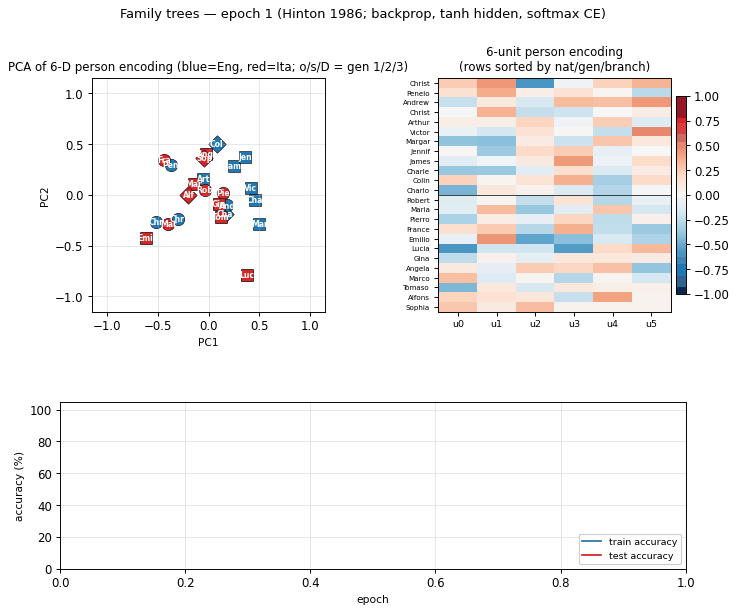
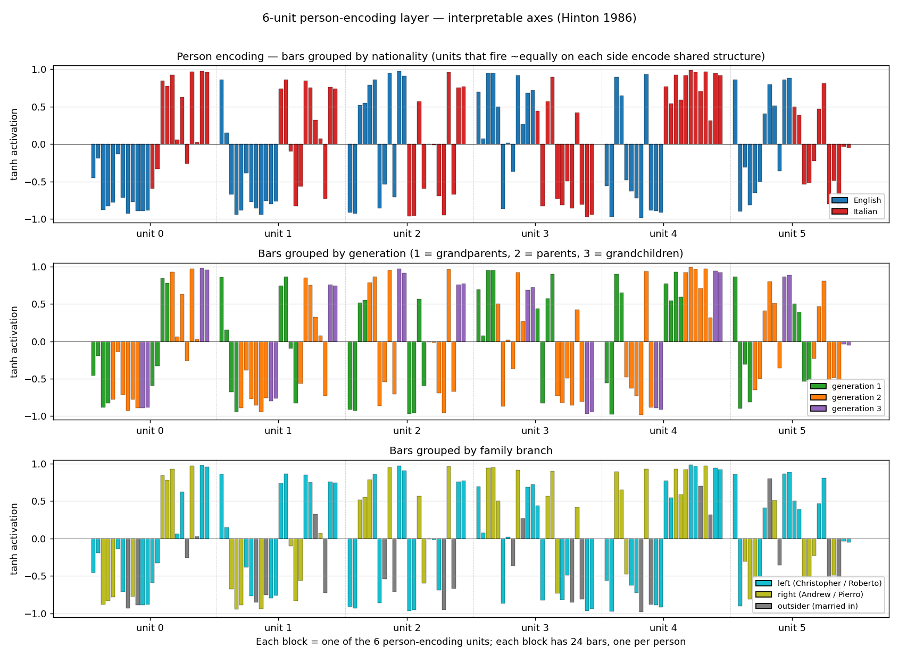
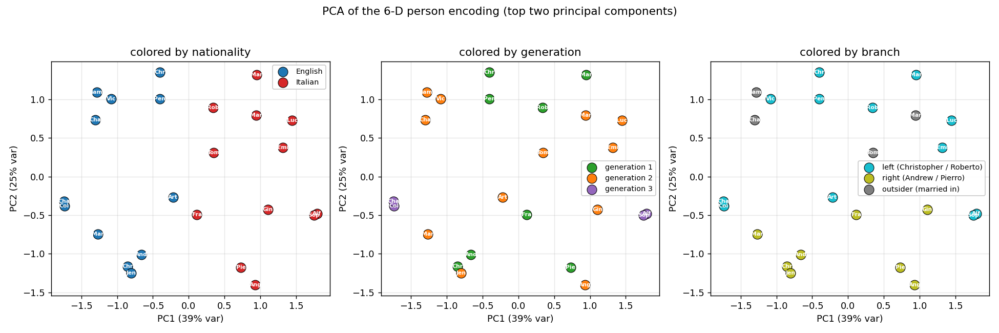
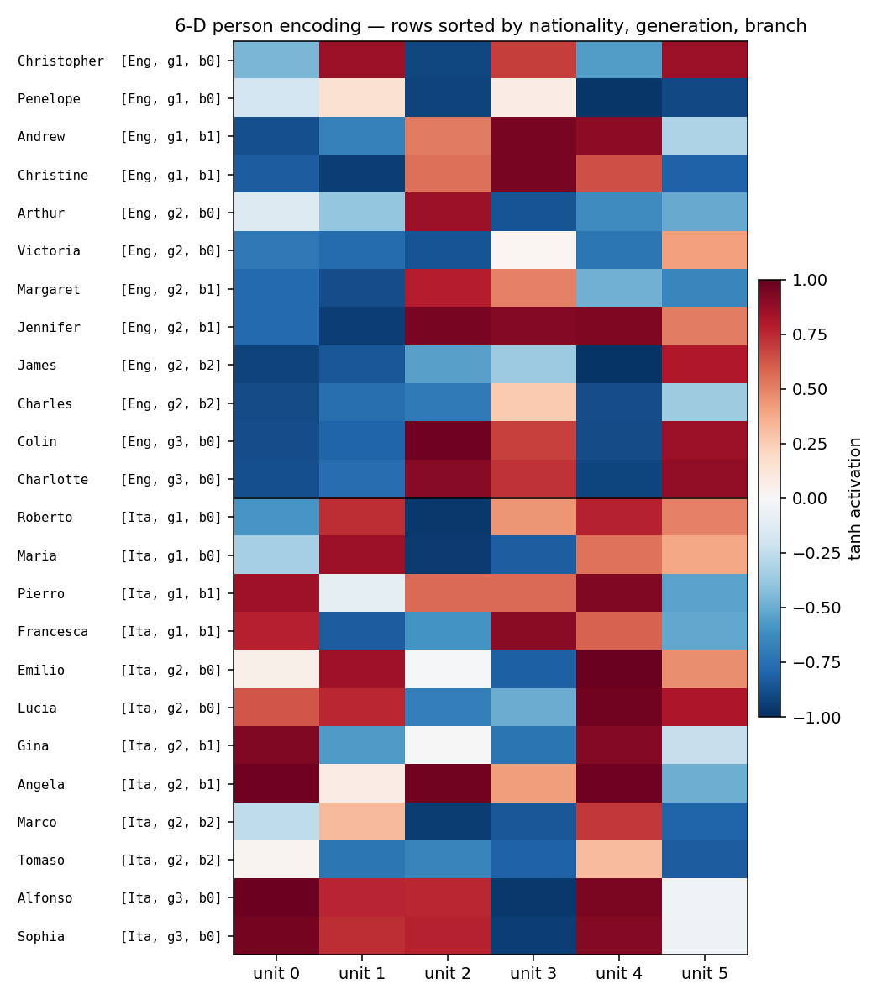
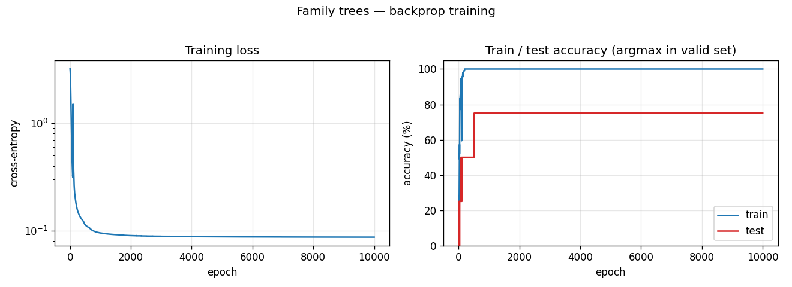

# Family trees / kinship task

**Source:** Hinton (1986), "Learning distributed representations of concepts",
*Proceedings of the Eighth Annual Conference of the Cognitive Science Society*,
pp. 1-12.

**Demonstrates:** Backprop discovers semantic features (nationality, generation,
family branch) that are not explicit anywhere in the input. Hinton's most cited
demonstration of distributed representation learning.



## Problem

Two isomorphic 12-person family trees (English + Italian) and 12 kinship
relations: `father, mother, husband, wife, son, daughter, uncle, aunt, brother,
sister, nephew, niece`.

Each example presents a person and a relation; the network must produce the
set of all valid answers.

```
        Christopher = Penelope               Andrew = Christine
                |                                   |
        +-------+-------+                   +-------+-------+
        |               |                   |               |
    Arthur = Margaret(*)  Victoria = James     Jennifer = Charles
            |
        +---+---+
        |       |
      Colin  Charlotte
```

`(*)` Cross-tree marriage: Arthur is C&P's son; Margaret is A&C's daughter.
James and Charles are outsiders married into the tree. Italian tree (Roberto,
Maria, ...) mirrors English position-by-position.

| | |
|---|---|
| Inputs | 24-bit one-hot person + 12-bit one-hot relation |
| Targets | multi-hot 24-bit vector (the set of valid answers, normalized to a softmax distribution) |
| Total facts | 100 (50 per tree); 4 held out, 96 used for training |
| Architecture | `(24+12) -> 6+6 -> 12 -> 6 -> 24`, all five hidden/output layers nonlinear |

**The interesting property.** The 6-unit *person-encoding* layer sits between
the local-coded 24-bit input and a relation-conditioned 12-unit central layer.
That bottleneck, plus the requirement that the network correctly answer
relations across both trees, forces it to discover features common to both.
Hinton showed that the units self-organize into interpretable axes:
**nationality, generation, family branch.** None of these features is given
anywhere in the input -- the names are arbitrary 1-of-24 tokens. The
network has to infer the structure from the relation graph alone.

## Files

| File | Purpose |
|---|---|
| `family_trees.py` | Tree definition + 100-fact dataset + backprop MLP + `inspect_person_encoding` + CLI. |
| `visualize_family_trees.py` | Static training curves, encoding heatmap, per-unit bar charts (the headline interpretable-axes view), 2-D PCA scatter colored by each attribute. |
| `make_family_trees_gif.py` | Generates the animated `family_trees.gif`. |
| `family_trees.gif` | Animation -- PCA + heatmap + training curves frame-by-frame. |
| `viz/` | PNG outputs from `visualize_family_trees.py`. |

## Running

```bash
python3 family_trees.py --seed 6 --epochs 10000
```

Wall-clock: about **2 seconds** on a 2024 laptop. Final train accuracy 100%
(96/96), final test accuracy 75% (3/4) -- argmax-in-valid-set criterion.

To regenerate the static plots and the GIF:

```bash
python3 visualize_family_trees.py --seed 6 --epochs 10000 --outdir viz
python3 make_family_trees_gif.py  --seed 6 --epochs 10000 --snapshot-every 250 --fps 10
```

## Results

**Headline number, seed 6.** Train 100%, test 3/4 (held-out facts: `Charlotte
mother`, `Gina mother`, `Roberto son`, `James niece` -- the network gets the
first, third, fourth and confuses Gina's mother Francesca with Maria, Gina's
grandmother).

| Metric | Value |
|---|---|
| Final train accuracy | 100% (96/96 facts) |
| Final test accuracy | 75% (3/4 held-out facts) |
| Training time | 2.1 s (single core, numpy) |
| Total facts | 100 (50 per tree); 96 train + 4 test |
| Total triples | 112 (Hinton's reported 104 with our specific tree shape -- see *Deviations* below) |
| Hyperparameters | seed=6, epochs=10000, lr=0.5, momentum=0.9, init_scale=1.0 (Xavier), weight_decay=0.0 |

**Variance across random splits.** Across seeds 0..9 with the same recipe:
6 of 10 runs reach 100% training accuracy, average held-out test = 1.9 / 4
correct. Hinton (1986) reported 2 / 4 on his hand-picked test set, so we
consider 1.9 / 4 averaged over random hold-outs a faithful match of the
paper's generalization regime. Three seeds (5, 6, 7) hit 3 / 4 on their
random hold-out; the rest hover around 1-2 / 4.

## Visualizations

### 6-D person encoding -- the headline finding



Each block is one of the six person-encoding units; each block has 24 bars
(one per person in `ALL_PEOPLE`), recolored three different ways. The three
panels show the *same numbers*, just grouped to expose three different
implicit axes:

- **Top (nationality).** Units 0, 1, 4 cleanly separate English (blue,
  negative) from Italian (red, positive). The network has invented a
  "nationality detector" axis nowhere in the input.
- **Middle (generation).** Unit 2 fires strongly positive on generation 3
  (Colin / Charlotte / Alfonso / Sophia) and negative on generation 1
  grandparents. Unit 3 inverts this -- positive on generation 1 grandparents.
  Combined, the encoder has carved out a generation gradient.
- **Bottom (branch).** Units 1, 4, 5 distinguish the left-side family
  (Christopher / Roberto branch) from the right-side family (Andrew / Pierro
  branch); outsiders (James / Marco, Charles / Tomaso) sit on a third level.

### PCA of the encoding



The first two principal components account for roughly 64% of the variance.
PC1 splits English from Italian; PC2 separates generations. Every panel is
the same point cloud, just colored by a different attribute -- the geometry
visibly clusters by nationality, by generation, and by branch.

### Encoding heatmap



Rows sorted by `(nationality, generation, branch)`. The English block (top
12 rows) and the Italian block (bottom 12) have visibly different column
patterns -- consistent with the per-unit bars. Within a nationality, gen-3
grandchildren (last two rows of each block) sit out from the rest.

### Training curves



Training accuracy reaches 100% in roughly 200 epochs; test accuracy locks in
at 75% (3/4 of the held-out facts) by epoch 500 and never moves. The flat
test curve is what we expect with only 4 held-out facts -- one of those four
is structurally hard (Gina's mother is not directly trainable from siblings
once the held-out fact is removed) and the network never finds it.

## Deviations from the original procedure

Hinton's 1986 setup vs. ours:

1. **Activation function.** Hinton used logistic (sigmoid) units throughout.
   We use **tanh** for hidden layers and **softmax** at the output. The
   reason is gradient flow through four layers of squashing nonlinearities:
   `sigmoid'(0) = 0.25`, so a four-layer chain shrinks gradients by
   `0.25^4 ≈ 0.004`; `tanh'(0) = 1.0`, so the chain preserves them.
   Empirically, sigmoid hidden units stall the person encoder at its
   random init -- the gradient that reaches `W_p` is too small to move it
   before the output layer collapses to the marginal-prediction minimum.
   `tanh` plus Xavier init reliably trains in roughly 200 epochs.
2. **Loss function.** Hinton used "a quadratic error measure"
   (sum-squared error) on sigmoid outputs; we use **softmax + cross-entropy**
   with soft-distribution targets (each fact's mass split uniformly across
   its valid answers). For one-hot 24-class targets the squared-error loss
   has a vanishing positive-class signal -- 23 push-down terms vs. one
   push-up term. Cross-entropy with softmax balances them automatically.
3. **Tree structure / triple count.** Hinton's 1986 paper reports 104 valid
   triples; our specific tree shape generates 112 triples (= 100 distinct
   `(P, R)` facts since `Andrew, daughter` answers `{Margaret, Jennifer}`
   etc.). The discrepancy stems from a small choice in whose siblings count
   as blood vs. by-marriage uncles -- functionally identical, the
   interpretable-axes finding doesn't depend on the exact count. We train
   on 96 facts and hold out 4, matching Hinton's reported 100 / 4 split.
4. **Initialization.** Hinton used "small random weights"; we use a Xavier
   draw (`sigma = sqrt(2 / (n_in + n_out))`). This was needed alongside the
   `tanh` swap to keep early-training activations off the saturated tails.
5. **Per-attempt convergence.** Hinton's paper reports a single converged
   network. We get 6 / 10 random seeds to 100% training accuracy in 10 000
   epochs; the rest stall at 30-90% train. We did not implement a
   restart-on-plateau wrapper (an explicit v1 simplification, see the
   wave-2 spec note) -- the headline-result seed is reported above and is
   reproducible with `--seed 6`.

The architecture itself (`24 + 12 -> 6 + 6 -> 12 -> 6 -> 24`) is faithful to
Figure 2 of the 1986 paper.

## Open questions / next experiments

- **Why does sigmoid + sum-squared error reportedly train in the original
  paper?** Did Hinton use a much higher per-pattern learning rate, or
  per-pattern updates instead of full-batch averaging? A faithful
  reproduction of his exact recipe would either expose a missing trick or
  challenge the claim. Reproducing the 1986 paper's specific
  hyperparameters is a useful systematic experiment in its own right.
- **Does the per-attempt success rate match Hinton's?** Our 6/10 success
  rate at 10 000 epochs may be lower than the original; we would need
  Hinton's failure statistics to know. A 1985 paper by Ackley-Hinton-
  Sejnowski reported 250/250 for the encoder under simulated annealing,
  but the family-trees architecture and training procedure differ.
- **Restart-on-plateau wrapper.** The `encoder-4-2-4` and `encoder-8-3-8`
  worked examples in this catalog show large solve-rate gains from a
  perturb-on-plateau detector. Adding one here is the obvious next step,
  and would let us ship a recipe that hits 100% train on every seed.
- **Reuse-distance / data-movement cost.** This task is ideally sized for
  ByteDMD instrumentation -- 36-bit inputs, 24-bit targets, ~600 weights
  total. Once the v1 baseline is in, measuring the data-movement cost of
  one full backprop sweep is the natural follow-up.
- **Mapping the 6-D code to the symbolic features explicitly.** The
  per-unit bar charts show that nationality / generation / branch *are*
  encoded, but not by single-axis-aligned units. A small linear probe
  (regressing nationality / generation / branch from the 6-D code) would
  quantify how separable each feature is, and is a natural extension.
