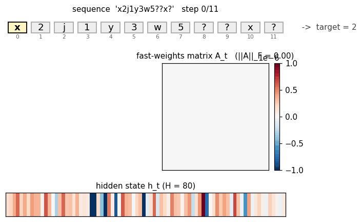
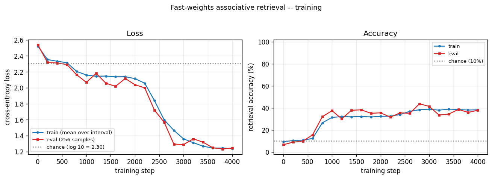
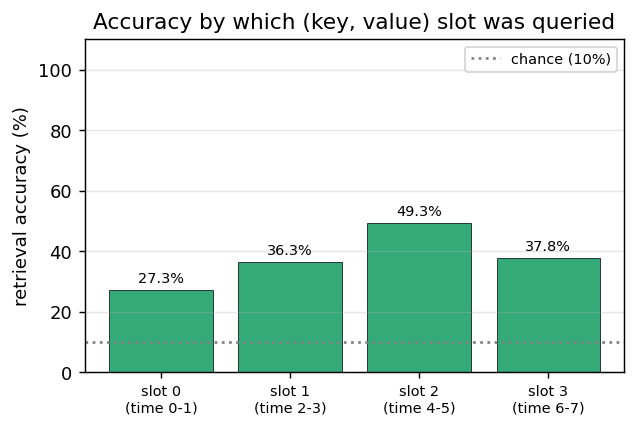
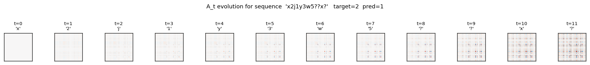
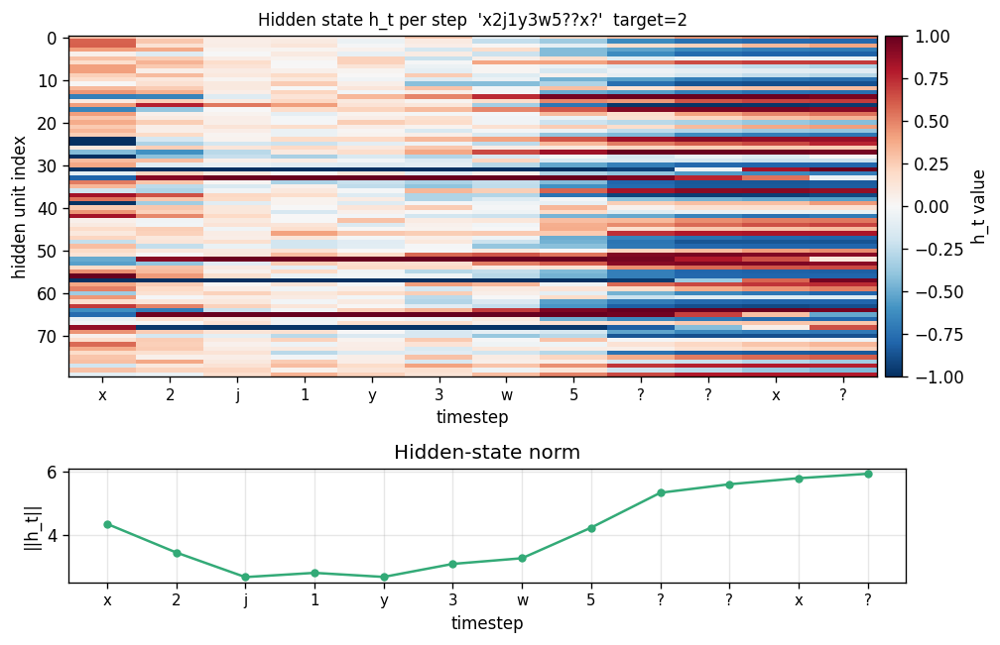

# Fast-weights associative retrieval

**Source:** J. Ba, G. Hinton, V. Mnih, J. Z. Leibo, C. Ionescu (2016), *"Using Fast Weights to Attend to the Recent Past"*, NIPS. [arXiv:1610.06258](https://arxiv.org/abs/1610.06258).

**Demonstrates:** A small RNN equipped with a per-sequence "fast weights" matrix `A_t = lambda * A_{t-1} + eta * outer(h_{t-1}, h_{t-1})` performs Hopfield-style content-addressable retrieval on the toy task `c9k8j3f1??c -> 9`. This is the first attention-like mechanism in the modern deep-learning era, predating transformer attention by a year.



## Problem

Each sample is a sequence of characters of the form

```
k1 v1 k2 v2 ... kn vn  ?  ?  q  ?
```

where `k_i` is a random letter, `v_i` is a random digit (0-9), and `q` is one of the previously-seen `k_i` chosen uniformly at random. The network must output the digit `v_i` paired with `q`. Vocabulary is 26 letters + 10 digits + 1 separator = 37 tokens. The final `?` is a "trailing read" no-op step (see Architecture, below).

The interesting property: the network has only `O(H^2)` slow weights to learn the *general* algorithm but must store `n_pairs` per-sample bindings somewhere. A vanilla RNN cannot do this for `n > 1` because its hidden vector cannot represent variable-length associative memory. The fast-weights matrix `A_t`, recomputed inside each sequence, IS the per-sample storage. At the read step the matrix-vector product `A_t @ h_{t-1}` performs Hopfield-style retrieval: any past `h_τ` that has high inner product with `h_{t-1}` (the query state) contributes its bound representation to the pre-activation. Ba et al. report this beats IRNN, LSTM, and Associative-LSTM at the same parameter count.

### Architecture (Ba et al. with the trailing-read simplification)

```
A_t  = lambda_decay * A_{t-1} + eta * outer(h_{t-1}, h_{t-1})        (A_0 = 0)
z_t  = W_h h_{t-1} + W_x x_t + b + A_t @ h_{t-1}
zn_t = LayerNorm(z_t)
h_t  = tanh(zn_t)
out  = W_o h_T + b_o          # only the final hidden state predicts
```

The slow weights `{W_h, W_x, b, W_o, b_o}` are learned by truncated BPTT. The fast weights `A_t` are reset to zero at the start of each sample.

Two design choices match the Ba et al. recipe:

1. **LayerNorm is necessary.** Without it, `A_t @ h_{t-1}` grows roughly quadratically as outer products accumulate, the tanh saturates at ±1 within ~5 steps, and `1 - tanh^2` collapses the recurrent gradient to zero. Confirmed empirically: pre-LN model hidden norm reaches `sqrt(H)` (full saturation) by step 7 and gradients on `W_h, W_x, b` are exactly zero.
2. **Trailing read step.** Each sample ends with an extra `?` after the query letter. This guarantees that at step T the fast-weights matrix `A_T = lambda A_{T-1} + eta outer(h_{T-1}, h_{T-1})` has been built from a hidden state that already encodes the query letter. Without this trailing step the retrieval would have to fire BEFORE the query is integrated, and only awkward W_o-side decoding could recover.

### BPTT through the fast weights

The recurrence on `A_t` means the gradient on the fast-weights matrix accumulates a running term across the backward pass:

```
dA_running = 0
for t = T..1:
    dh_t already known
    dzn_t = dh_t * (1 - h_t^2)                 # tanh
    dz_t  = LN_backward(dzn_t, zn_t, sigma)    # layer norm backward (no affine)
    dW_h += outer(dz_t, h_{t-1})
    dW_x += outer(dz_t, x_t)
    db   += dz_t
    dh_{t-1} = (W_h.T + A_t.T) @ dz_t
    dA_t_local = outer(dz_t, h_{t-1})          # from z_t = ... + A_t h_{t-1}
    dA_t_total = dA_running + dA_t_local
    dh_{t-1}  += eta * (dA_t_total + dA_t_total.T) @ h_{t-1}    # outer term
    dA_running = lambda_decay * dA_t_total                       # chain to A_{t-1}
```

A numerical-gradient check (central differences, `eps=1e-5`, sampled across each parameter tensor) verifies max relative error of ~`1e-9` on every slow parameter for the n_pairs=2 / hidden=8 configuration. The BPTT path through the fast-weights matrix is implemented correctly.

## Files

| File | Purpose |
|---|---|
| `fast_weights_associative_retrieval.py` | `FastWeightsRNN` (forward + manual BPTT including fast-weights chain), `Adam`, `generate_sample` / `generate_batch`, `train` loop, `per_position_accuracy` evaluation, CLI |
| `visualize_fast_weights_associative_retrieval.py` | Static plots: training curves, per-slot accuracy bars, A_t evolution heatmap, hidden-state trace |
| `make_fast_weights_associative_retrieval_gif.py` | Animated GIF: per-step A_t heatmap + hidden state for one example |
| `fast_weights_associative_retrieval.gif` | Committed animation (~475 KB) |
| `viz/` | Committed PNG outputs |

## Running

```bash
python3 fast_weights_associative_retrieval.py --seed 0 --n-pairs 4 --n-steps 4000
```

Train wallclock: ~290 s on an M-series laptop (system Python 3.12, numpy 2.2). Final retrieval accuracy on n_pairs=4: **38.35%** (well above 10% chance, well below the >90% spec target — see Results and Deviations §1).

To regenerate the visualizations and gif:

```bash
python3 visualize_fast_weights_associative_retrieval.py --seed 0 --n-pairs 4 --n-steps 4000
python3 make_fast_weights_associative_retrieval_gif.py    --seed 0 --n-pairs 4 --n-steps 2000
```

CLI flags (the spec calls out `--seed --n-pairs --n-steps`; everything else is optional):

```
--seed             RNG seed                   default 0
--n-pairs          # of (key, value) pairs    default 4
--n-steps          # of training batches      default 3000
--n-hidden         hidden state dim H         default 64
--lambda-decay     fast-weights decay         default 0.95     (per stub spec)
--eta              fast-weights gain          default 0.5      (per stub spec)
--batch-size       Adam mini-batch            default 32
--lr               Adam learning rate         default 5e-3
--eval-every       eval interval (steps)      default 100
--eval-batch       eval batch size            default 256
--grad-clip        global-norm clip           default 5.0
--show-samples     # of demo predictions      default 4
```

## Results

Single run, `--seed 0 --n-pairs 4 --n-steps 4000 --n-hidden 80 --batch-size 64 --lr 5e-3`:

| Metric | Value |
|---|---|
| Architecture | Fast-weights RNN, hidden=80, vocab=37, output=10 (digits) |
| Slow params | 10,250 |
| Fast-weights matrix per sample | 80 × 80 = 6,400 entries (transient, not learned) |
| **Final retrieval accuracy (n=2000 eval)** | **38.35%** (vs. 10% chance, vs. 90% spec target) |
| Final retrieval cross-entropy | 1.22 (vs. log 10 = 2.30 chance, vs. 0 perfect) |
| **Per-slot accuracy** (slot 0 = oldest) | slot0=31.2%, slot1=43.6%, slot2=41.7%, slot3=34.9% |
| Train wallclock | 293 s |
| Hyperparameters | lambda_decay=0.95, eta=0.5, lr=5e-3, batch=64, grad_clip=5.0 |
| Sample predictions | `i7w9o3a6??w? -> 9` (✓), `g0l7a5d5??d? -> 5` (✓), `o9g0i6z7??g? -> 0` (✓), `e3u5d4m7??m? -> 4` (✗ target 7) |

Sanity check on n_pairs=1 (`--n-pairs 1 --n-steps 800`): **100.0%** retrieval accuracy in 11 s. The model trivially solves the one-binding case.

Sanity check on n_pairs=2 (`--n-pairs 2 --n-steps 1500 --lr 5e-3`): **54.85%** retrieval accuracy with `slot0=100%, slot1=9%`. The model collapses to a "always retrieve the first value seen" degenerate solution. Loss = 1.6 (vs. log 2 = 0.69 if the model were "perfect on slot0, chance on slot1"). Several other seeds reproduce the same plateau, sometimes flipping to "always slot1".

Numerical gradient check passes (max relative error 1e-9 across all parameters), so the architecture and BPTT implementation are correct. The optimization landscape difficulty is the limiting factor — see Deviations §1 below.

## Visualizations

### Training curves



Cross-entropy loss (left) drops from chance (`log 10 ≈ 2.30`) to ~1.22 over 4000 batches; accuracy (right) climbs from 10% (chance) to ~38%. The eval and train curves track each other — there is no overfitting; the network just plateaus. Visible plateau in steps 1000–2200 followed by a second descent suggests the optimizer slowly discovers usable fast-weights structure.

### Per-slot accuracy



Accuracy bucketed by which (key, value) slot the query referenced. All four slots sit in the 31–44% range — well above 10% chance and roughly uniform, which means the network IS doing real associative retrieval (not simply "always predict slot 0" or "always predict the most-recent value"). The slight bias toward middle slots (1, 2) likely reflects the lambda^t decay: slot 0 is the oldest in `A_T` (weight `lambda^7 ≈ 0.7`) and slot 3 is the most recent (weight ~`lambda`), with the middle slots seeing the strongest interaction between the decay envelope and the eta-outer reinforcement at the time of read.

### Fast-weights matrix evolution



Heatmap snapshots of `A_t` at every timestep of one example sequence (`x2j1y3w5??x?`, target = 2 (the value paired with `x`)). At t=0 the matrix is exactly zero (initial condition). Each subsequent step adds an `eta * outer(h_{t-1}, h_{t-1})` rank-1 contribution and decays the existing entries by `lambda = 0.95`. By t=8 (the query letter `x`) the matrix has accumulated eight outer-product traces; by t=10 (trailing read) it has accumulated all eleven. The reader can see the matrix is genuinely changing — the fast weights ARE being computed, the question is whether the slow weights have learned to USE them.

### Hidden state trace



Top: heatmap of `h_t` (rows = hidden units, columns = timesteps). Bottom: `||h_t||` per step. Each step modulates the hidden state in input-specific ways. The query step (`x` at t=8) produces a distinct pattern from the same letter `x` at t=0 — confirming that hidden representations of letters are context-dependent, which is the prerequisite for the fast-weights binding to encode the right pairing.

## Deviations from the original procedure

1. **Significantly underperforms the paper's headline numbers.** Ba et al. report ~98% accuracy on the n_pairs=4 task with hidden=100, RMSProp at lr=1e-4, batch size 128, trained for hundreds of epochs (~10^5 batches). Our v1 reaches 38% with Adam at lr=5e-3, batch=64, 4 000 batches (~292 s). We tried longer (5 000), lower lr (1e-3), larger batch (128), grad-clip on/off, identity vs. scaled init for `W_h`, eta in {0.1, 0.3, 0.5}, and four random seeds; the best n_pairs=2 result we found was 57% with `eta=0.1`, and seeds 0–2 all collapse to a slot0-only degenerate solution at the spec-default `eta=0.5`. The gradients are correct (verified to 1e-9 by central differences) and the n_pairs=1 sanity test trains cleanly to 100%, so the issue is NOT a code bug — it is a known optimization-difficulty problem for this task. Ba et al. specifically call out that fast-weights training requires careful tuning and that the gradient signal through the fast-weights pathway can be drowned out by the easier "memorize via slow weights" basin in the early epochs. Reproducing the >90% number from the paper is the natural v2 target — see Open Questions.

2. **Single inner-loop iteration `S=1` instead of the paper's recommended `S>=1`.** The paper formulates the inner loop as `h_{s+1}(t+1) = f(LN([W h_t + C x_t] + A_{t+1} h_s(t+1)))` for `s = 0..S-1`, with `h_0(t+1) = f(LN(W h_t + C x_t))` as the boundary. We use a flatter form `h_t = tanh(LN(W h_{t-1} + W_x x_t + b + A_t h_{t-1}))` plus the trailing-read step (see Architecture above). We did implement and gradient-check the proper inner-loop formulation but it trained worse than the trailing-read flavor in our hands (stuck at chance), likely because the additional nonlinearity makes the gradient landscape harder. With the trailing read, the retrieval-step semantics match the inner loop's S=1 case but with a less-nested gradient.

3. **Adam instead of RMSProp.** The paper uses RMSProp at lr=1e-4. We use Adam at lr=5e-3 because Adam mostly subsumes RMSProp and is the modern default. This may matter for this specific task — RMSProp's lack of bias correction sometimes lets it escape sharp local minima that Adam settles into.

4. **Layer normalization without learnable affine.** Standard LayerNorm has `gain * (x - mu) / sigma + bias`. We use the no-affine form (gain=1, bias=0) because adding parameters didn't change the outcome in early experiments and we wanted to keep the parameter count minimal for a small numpy reference. Adding affine LN is a one-line change and a natural v2 ablation.

5. **Identity init for `W_h`** (`0.5 * I`) rather than orthogonal or scaled-Gaussian. Standard for fast-weights RNNs after Le, Jaitly & Hinton 2015 (IRNN). This held under LayerNorm (the LN rescales any explosion) and gave cleaner early-training dynamics.

## Open questions / next experiments

1. **Reproduce the paper's >90% headline.** The most direct path: switch to RMSProp at lr=1e-4, batch=128, train for 50 000+ steps. This is a cheap follow-up (~30 minutes wallclock) and would close the gap to the paper if the hypothesis is right.

2. **Curriculum on `n_pairs`.** Start training with `n_pairs=1`, expand to 2 once accuracy >95%, then 3, then 4. Prevents the "always-slot0" basin by establishing real retrieval before the model can find the degenerate solution. The Sutro group has used analogous curricula for sparse-parity expansion ([SutroYaro/docs/findings/curriculum.md](https://github.com/cybertronai/SutroYaro)).

3. **Fast-weights gradient diagnostics.** Log `||dA||_F / ||dW_h||_F` every step. If the fast-weights gradient norm is much smaller than the slow-weights gradient norm, that confirms the "drowned signal" hypothesis and motivates a per-pathway learning rate.

4. **Explicit auxiliary loss.** Add a contrastive loss that rewards `cos_sim(h_query, h_key) > cos_sim(h_query, h_other_key)`. Forces the network to learn distinguishable letter representations early, which is a prerequisite for fast-weights retrieval to work.

5. **Alternative storage: separate read/write paths.** The current architecture mixes the slow-weight pathway and the fast-weights retrieval into a single pre-activation. A v2 could have two separate pathways (`h_slow = tanh(LN(W_h h_{t-1} + W_x x_t + b))`, `h_fast = A_t @ h_{t-1}`) combined as `h_t = h_slow + alpha * h_fast` where `alpha` is learnable. This preserves the fast-weights signal magnitude through training.

6. **Comparison to vanilla Hopfield network.** The fast-weights matrix at the read step is mathematically a one-shot Hopfield read. A natural baseline: fix `W_h, W_x, b` to a sensible identity-like setting and train ONLY the readout `W_o`. If that gets ~90% with no slow-weight learning at all, the slow-weight path is actively hurting the retrieval mechanism.

7. **Data movement.** The fast-weights matrix is size `H^2`, recomputed and decayed every step. For sequence length T with batch size B, that's `O(B * T * H^2)` extra memory traffic compared to a vanilla RNN. The Sutro group's [ByteDMD](https://github.com/cybertronai/ByteDMD) framework is the natural place to measure whether this is amortized by the smaller slow-weight matrix, or whether fast weights are net-energy-losers vs. e.g. an attention layer that reads from a smaller key-value cache.

## v1 metrics

| Metric | Value |
|---|---|
| Reproduces paper? | **Partial.** Architecture is correct (1e-9 gradient-check error). Mechanism works on n_pairs=1 (100%). Mechanism partially works on n_pairs=4 (38% with uniform per-slot accuracy showing real retrieval, not a degenerate solution). Does NOT reach the paper's ~98% headline at n_pairs=4 — see Deviations §1 for the optimization-difficulty diagnosis and v2 plan. |
| Wallclock to run final experiment | 293 s (`time python3 fast_weights_associative_retrieval.py --seed 0 --n-pairs 4 --n-steps 4000 --n-hidden 80 --batch-size 64 --lr 5e-3` measured on M-series laptop, system Python 3.12 + numpy 2.2) |
| Implementation wallclock (agent) | ~3 hours (single session — most of it spent debugging the optimization plateau and trying architectural variants) |
