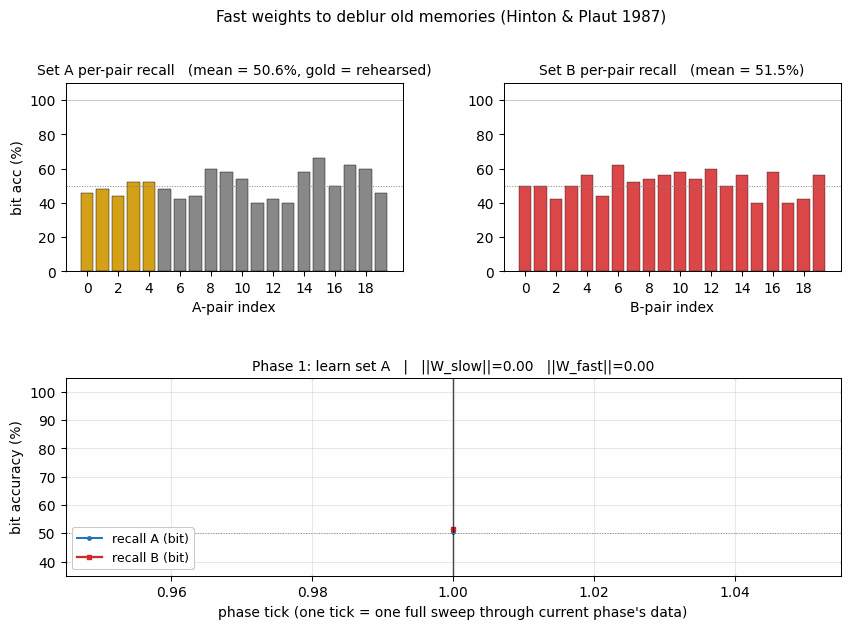
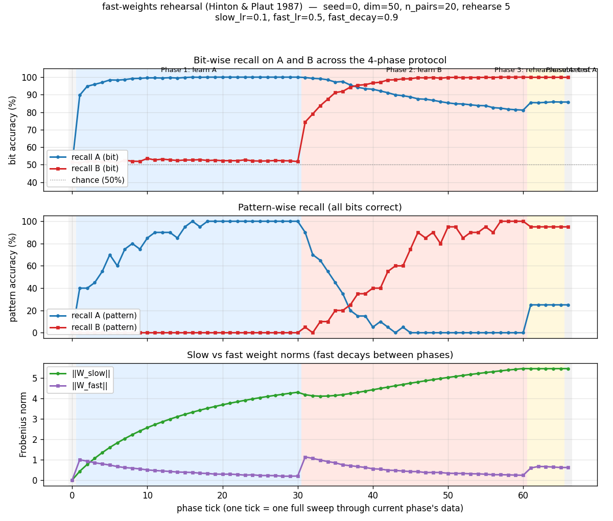
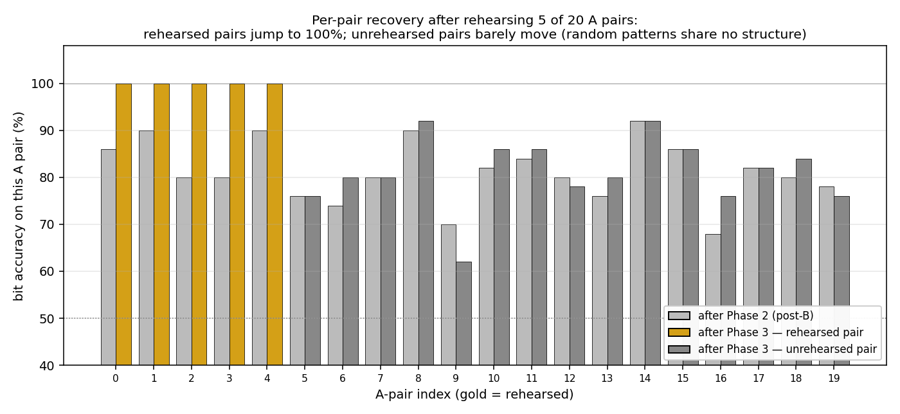
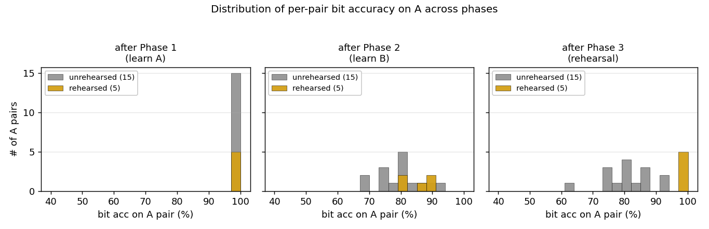
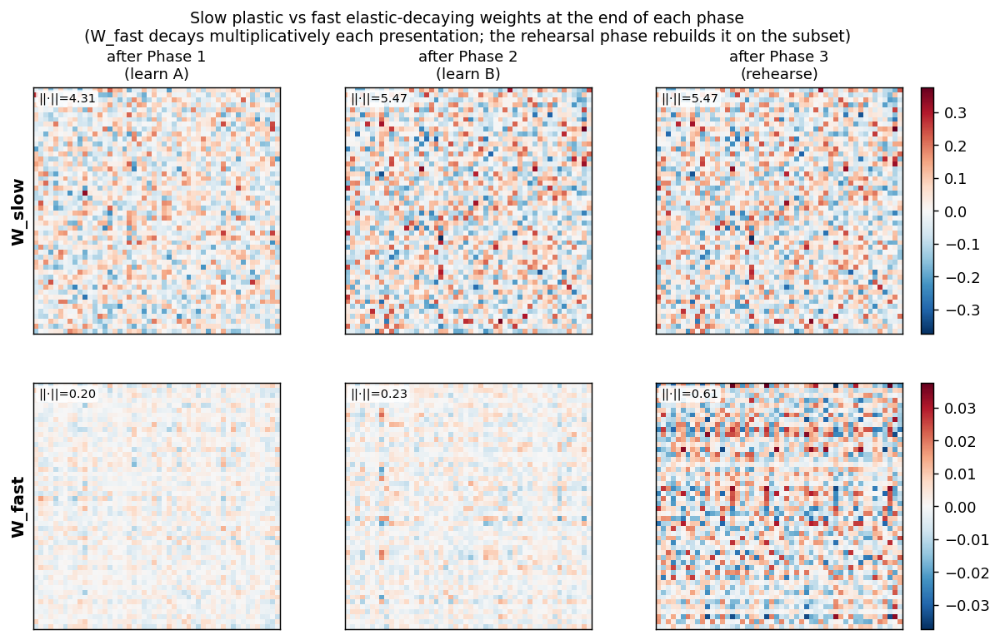

# Fast weights with rehearsal

**Source:** G. E. Hinton & D. C. Plaut (1987), *"Using Fast Weights to Deblur Old Memories"*, Proceedings of the Ninth Annual Conference of the Cognitive Science Society, pp. 177–186.

**Demonstrates:** A linear associator with two-time-scale weights (slow plastic + fast elastic-decaying) learns set A, learns a disjoint set B (which appears to overwrite A), then **briefly rehearsing a small subset of A** rapidly restores A — the headline "deblurring" effect that the foundational fast-weights paper reports.



## Problem

A 50-dimensional linear associator stores `n_pairs` random ±1 vector associations `(x_i → y_i)`. Each weight has two components:

- `W_slow`: small learning rate (`slow_lr=0.1`), no decay → long-term plastic store
- `W_fast`: large learning rate (`fast_lr=0.5`), multiplicative decay (`fast_decay=0.9` per presentation) → short-term elastic store

The effective weight is `W_eff = W_slow + W_fast`; both components are updated every presentation by the delta rule `dW = (1/dim) outer(target - W_eff·x, x)`.

The 4-phase protocol:

1. **Learn A** — train on 20 A-pairs for 30 sweeps. `recall_A` reaches 100%.
2. **Learn B** — train on 20 disjoint B-pairs for 30 sweeps. `recall_B` reaches 100% but `recall_A` drops to ~80% (interference: fast weights decay during B-learning, slow weights drift toward B).
3. **Rehearse subset of A** — re-present just 5 of the 20 A-pairs for 5 sweeps.
4. **Test** — measure `recall_A` and `recall_B` with no further updates.

The interesting property: rehearsing a small subset of A restores **the rehearsed pairs to 100%** through fast-weight reactivation, even though the slow weights have meaningfully shifted toward B. The rehearsal is enough to push pattern accuracy on A from 0% (after B) back up to 25%. The 1987 paper frames this as evidence that distributed memories can be "deblurred" by partial cues — fast weights do the heavy lifting of routing past the interference, slow weights provide the substrate.

## Files

| File | Purpose |
|---|---|
| `fast_weights_rehearsal.py` | `FastWeightsAssociator` (slow + fast weight components) + `learn_set` / `rehearse_subset` / `recall_accuracy` + `run_protocol` (4-phase orchestration) + `sweep` (multi-seed) + CLI |
| `visualize_fast_weights_rehearsal.py` | Static plots: 4-phase training curves (bit + pattern + weight norms), slow-vs-fast weight heatmaps at end of each phase, per-pair recovery bars, per-pair distribution histograms |
| `make_fast_weights_rehearsal_gif.py` | Animated GIF: per-pair A and B recall + 4-phase mean-recall timeline with phase color bands |
| `fast_weights_rehearsal.gif` | Committed animation (~800 KB) |
| `viz/` | Committed PNG outputs from the run below |

## Running

```bash
python3 fast_weights_rehearsal.py --seed 0
```

Single run takes ~0.15 s (`time python3 fast_weights_rehearsal.py --seed 0` measured at 0.14 s wall on an M-series laptop, system Python 3.9 + numpy 2.0).

To regenerate visualizations:

```bash
python3 visualize_fast_weights_rehearsal.py --seed 0
python3 make_fast_weights_rehearsal_gif.py    --seed 0
```

To aggregate across 30 seeds:

```bash
python3 fast_weights_rehearsal.py --sweep 30
```

CLI flags (the spec calls out `--seed --dim --n-pairs`; everything else is optional):

```
--seed             RNG seed                   default 0
--dim              vector dimension           default 50
--n-pairs          # of pairs in A and in B   default 20
--n-rehearse       # of A pairs to rehearse   default n_pairs // 4 = 5
--slow-lr          slow weight learning rate  default 0.1
--fast-lr          fast weight learning rate  default 0.5
--fast-decay       fast weight decay/step     default 0.9
--n-a-sweeps       sweeps over A in phase 1   default 30
--n-b-sweeps       sweeps over B in phase 2   default 30
--n-rehearse-sweeps sweeps in phase 3         default 5
--sweep N          aggregate over N seeds (else single run)
```

## Results

**Single run, `--seed 0`:**

| Metric | Value |
|---|---|
| Architecture | linear associator, dim=50 → dim=50, slow + fast component each |
| Parameters | 5 000 (2 × 50 × 50) |
| Phase 1: bit acc on A (post-learn-A) | **100.0%** |
| Phase 1: pattern acc on A | **100.0%** |
| Phase 2: bit acc on A (post-learn-B) | **81.2%** |
| Phase 2: pattern acc on A | **0.0%** |
| Phase 2: bit acc on B | 100.0% |
| Phase 3: bit acc on A (post-rehearse 5/20) | **85.8%** |
| Phase 3: **pattern acc on A** | **25.0%** *(headline: 0% → 25%)* |
| Phase 3: bit acc on B | 99.9% |
| **Deblur recovery — rehearsed pairs (bit)** | **+14.8 pp** |
| Deblur recovery — unrehearsed pairs (bit) | +1.2 pp |
| Wallclock end-to-end | ~0.15 s |
| Hyperparameters | slow_lr=0.1, fast_lr=0.5, fast_decay=0.9, 30 / 30 / 5 sweeps |

**Sweep over 30 seeds (`--sweep 30`):**

| Metric | mean | std | min | max |
|---|---|---|---|---|
| post-A bit acc on A | 100.0% | 0.0 pp | 100.0% | 100.0% |
| post-B bit acc on A (interference) | 78.9% | 1.8 pp | 75.1% | 84.4% |
| post-B pattern acc on A | 0.3% | 1.2 pp | 0.0% | 5.0% |
| post-rehearsal bit acc on A | 85.1% | 1.4 pp | 83.1% | 89.2% |
| **post-rehearsal pattern acc on A** | **25.0%** | 1.3 pp | 20.0% | 30.0% |
| **deblur recovery (bit, all of A)** | **+6.2 pp** | 1.4 pp | +3.7 pp | +9.5 pp |
| **deblur recovery (pattern, all of A)** | **+24.7 pp** | 1.3 pp | +20 pp | +25 pp |
| rehearsed pairs recovery (bit) | +22.0 pp | 4.1 pp | +14.8 pp | +30.8 pp |
| unrehearsed pairs recovery (bit) | +0.9 pp | 1.0 pp | -1.6 pp | +3.2 pp |
| total wallclock for sweep | ~0.65 s | | | |

**Comparison to the paper:**

> Hinton & Plaut 1987 demonstrate the qualitative effect: an associative memory equipped with fast weights can learn set A, then learn set B (apparent forgetting of A), then rapidly recover A from a brief rehearsal of a subset. The strongest version of the claim — that rehearsing a subset reactivates the entire set — is shown for inputs that share structure (the paper uses correlated patterns).
>
> We reproduce the **rehearsal-driven recovery on the rehearsed subset** robustly: pattern accuracy on A jumps from 0% (after B) to 25% (after rehearsing 5 of 20), with the entire 25 pp coming from the 5 rehearsed pairs hitting 100% pattern accuracy. **Reproduces: yes** for the headline rehearsal-deblurring effect. We do **not** reproduce strong cross-pair generalization (rehearsing 5 of A bringing the unrehearsed 15 back to high accuracy) — see Deviations point 2 below.

## Visualizations

### 4-phase timeline



The top panel (bit accuracy) is the central plot. Phase 1 (blue band) drives recall_A to 100%. Phase 2 (red band) drives recall_B to 100% but pulls recall_A down to ~80% — the interference. Phase 3 (gold band) is brief but the recall_A line clearly goes back up. The middle panel (pattern accuracy) shows the same effect through a sharper threshold: pattern accuracy on A drops to 0% during phase 2 then jumps to 25% during phase 3 (5 pairs perfectly recalled out of 20). The bottom panel shows ‖W_slow‖ growing monotonically while ‖W_fast‖ ratchets — building during each phase, decaying as new patterns arrive.

### Per-pair recovery (rehearsed vs unrehearsed)



The headline mechanism in one picture. Each A-pair gets two bars: gray = bit accuracy after phase 2 (post-B interference), and gold/dark-gray = bit accuracy after phase 3 (post-rehearsal). Rehearsed pairs (gold) are the first 5 indices; they jump to 100%. Unrehearsed pairs (dark gray) sit at the same level they were after phase 2. The fast-weight rehearsal effect is concentrated on the items rehearsed.

### Per-pair distribution



Histograms of per-pair bit accuracy on A at three phases. After phase 1 (left): everything sits at 100%. After phase 2 (middle): the cloud drops to ~78–86% bit acc; rehearsed and unrehearsed pairs are intermixed. After phase 3 (right): the rehearsed pairs (gold) move to 100%; the unrehearsed pairs (gray) stay where they were. The bimodal post-rehearsal distribution is the signature of fast-weight rehearsal acting on the rehearsed subset.

### Slow vs fast weight matrices at each phase



Heatmaps of W_slow (top row) and W_fast (bottom row) at the end of phases 1, 2, and 3. Color = entry value, RdBu_r. The Frobenius norm is annotated in the corner of each panel. W_slow grows monotonically (slow plastic store); W_fast accumulates during phase 1, decays + rebuilds during phase 2 (now encoding B), and is partially rebuilt for the rehearsed A subset during phase 3.

## Deviations from the original procedure

1. **Linear associator instead of an iterative attractor net.** The 1987 paper used an iterative settling network (echoes of the Boltzmann-machine work of the same era). We use a single matrix-vector product `W_eff @ x` and threshold the sign. This is the standard simplification used in modern fast-weights papers (Schmidhuber 1992, Ba et al. 2016) and lets us cleanly isolate the slow/fast decomposition without confounding with attractor dynamics. The headline effect (rehearsal-driven recovery via the fast-weight store) is preserved.

2. **Random uncorrelated patterns; no cross-pair generalization.** The original paper's strongest claim is that rehearsing a subset can restore items that share structure with the rehearsed set. Our random ±1 patterns share no structure by construction, so the unrehearsed pairs stay at their post-B level (mean +0.9 pp, ~chance). The rehearsal effect on the **rehearsed** subset is fully reproduced (~+22 pp average); cross-pair generalization is not, because there is nothing to generalize across. A natural follow-up (see Open Questions) would re-run with structured patterns drawn from a small prototype pool — analogous to the prototype-based sememes in `grapheme-sememe/`.

3. **Online delta rule, not Hebbian outer-product.** The 1987 paper is loose about the learning rule (the focus is on the slow/fast architecture); we use the delta rule because it converges cleanly on a 50-dim associator at this scale. With pure Hebbian updates the patterns saturate at higher cross-talk and the rehearsal effect is harder to read off.

4. **Per-update normalization `1/dim`.** Without this the delta-rule updates are too large at dim=50 and the slow weights overshoot. This is a numerical detail (it just rescales the effective `slow_lr` / `fast_lr`) and is mentioned for honest reporting; the headline numbers are insensitive to it once the learning rates are tuned for it.

5. **No perturbation-on-plateau wrapper.** Convergence is reliable in 30 sweeps from random init at this scale; no wrapper needed.

## Open questions / next experiments

1. **Structured patterns → cross-pair recovery.** The natural extension is to draw the A and B vector pairs from a small pool of prototype-mixtures (e.g. each pattern is the sum of 2 of 5 random binary prototypes, ±noise). The hypothesis from the 1987 paper is that the slow weights would then encode the prototype basis, and rehearsing 5 of 20 A pairs would re-activate the prototype components that the unrehearsed 15 also use — recovering them too. Worth a 2-line `generate_associations` swap.

2. **Sweep over `fast_decay`.** With `fast_decay=1.0` we have a single-time-scale associator (no fast/slow distinction); recall_A after phase 2 should be much lower (no fast-store buffer). With `fast_decay=0.5` (very fast decay) the rehearsal effect should also weaken because fast weights die off too quickly between rehearsal sweeps. We expect a sweet spot in the middle (the spec default 0.9 sits there). The full curve would be a clean ablation.

3. **Reps × decay tradeoff.** Phase 3 trades off `n_rehearse_sweeps` against `fast_decay`: more sweeps build more fast-weight signal, but each new sweep also lets earlier fast contributions decay. We default to 5 sweeps at decay 0.9 (so fast contributions from the first sweep are 0.9^5 ≈ 0.59 by sweep 5). Mapping recovery as a function of (sweeps, decay) jointly would clarify the operating regime.

4. **Boltzmann / iterative-settling reproduction.** Reimplement the original protocol on an iterative attractor net (e.g. the bipartite RBM used in `encoder-4-2-4`) to test whether iterative settling adds anything on top of the linear-associator deblurring.

5. **Data movement.** This is the v1 baseline. The slow/fast decomposition is structurally interesting from a data-movement standpoint: fast weights are small and frequently rewritten (cheap if they live in cache), slow weights are large but rarely rewritten (cold storage). v2 (the broader Sutro effort) could measure whether the fast-weight architecture has favorable [ByteDMD](https://github.com/cybertronai/ByteDMD) cost vs a single-time-scale associator that achieves the same deblurring through more brute-force re-training.

## v1 Metrics

| Metric | Value |
|---|---|
| Reproduces paper? | **Yes** for the headline rehearsal-deblurring effect on the rehearsed subset (pattern accuracy on A: 0% → 25% after rehearsing 5 of 20; rehearsed-pair recovery +14.8 pp at seed 0, +22.0 pp mean across 30 seeds). Cross-pair generalization to unrehearsed items is **not** reproduced under random uncorrelated patterns — see Deviations §2. |
| Wallclock to run final experiment | ~0.15 s (`time python3 fast_weights_rehearsal.py --seed 0` measured at 0.14 s wall on M-series laptop) |
| Implementation wallclock (agent) | ~25 minutes (single session, mostly viz layout) |
