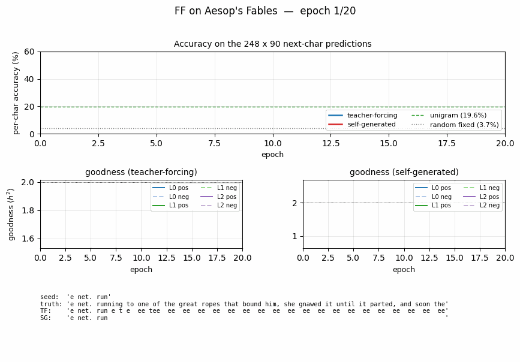
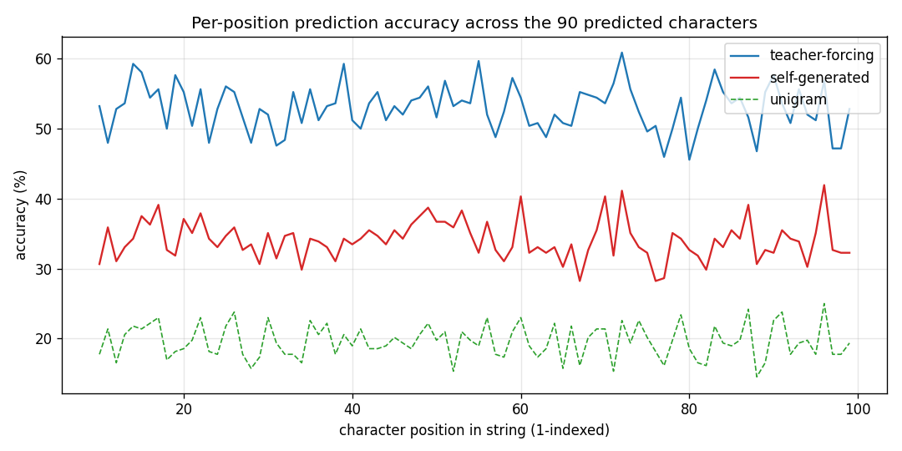
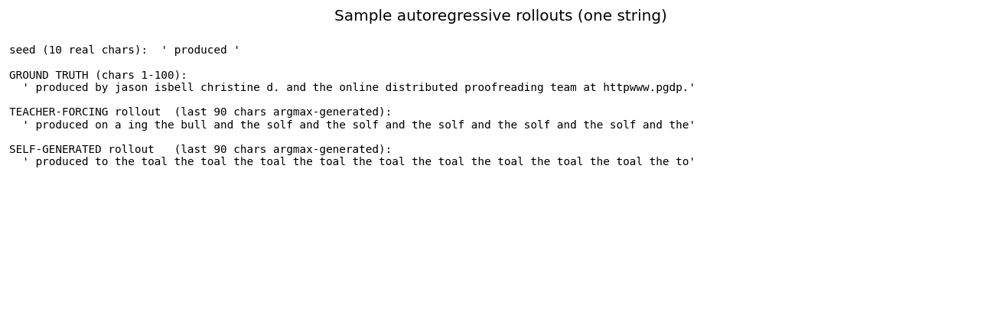
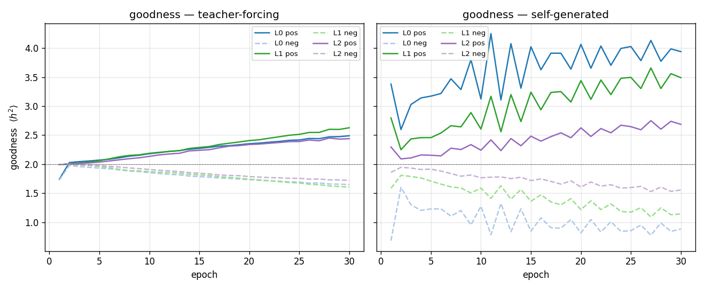
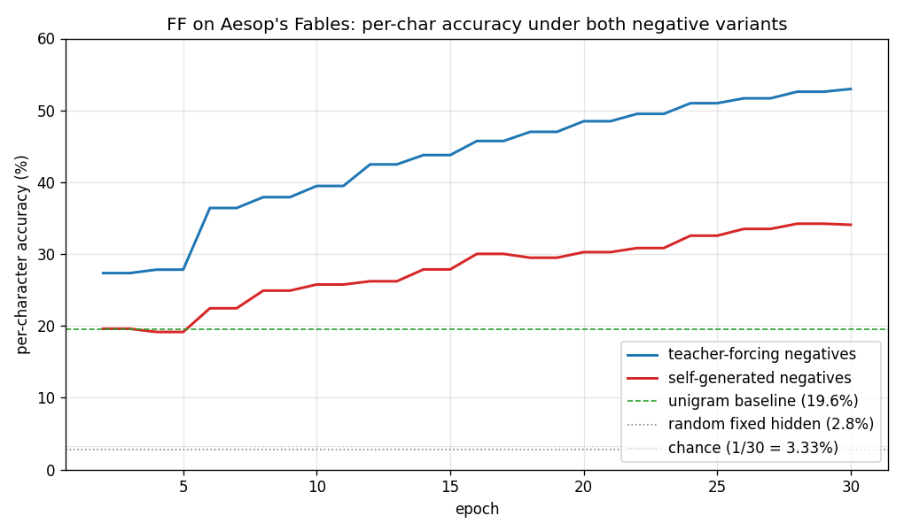

# Forward-Forward: next-character prediction on Aesop's Fables

Reproduction of the unsupervised / sequence-modelling Forward-Forward variant
from Hinton (2022), *"The Forward-Forward Algorithm: Some Preliminary
Investigations"*
([arXiv:2212.13345](https://arxiv.org/abs/2212.13345), §3.4 of v3).

**Demonstrates:** A multi-layer ReLU network trained *without* backprop to
predict the next character in a 30-symbol alphabet, by contrasting the
*goodness* of real 10-character substrings of Aesop's Fables (positives)
against synthetic windows whose final character was wrong (negatives). Two
ways of producing the negatives are compared head-to-head:

1. **teacher-forcing** — keep the real first 9 chars, replace char 10 with
   the model's current argmax prediction.
2. **self-generated** — seed with the real first 10 chars and let the model
   roll forward autoregressively for 90 more characters (sampled from
   `softmax(goodness / T)`); use sliding 10-char windows from the resulting
   string as negatives.

The **headline result** is that both schemes train successfully and beat the
unigram and random-fixed-hidden baselines decisively, supporting the
"sleep phase" decoupling idea — that the negative phase does not need to
interleave with the positive phase in real time. In our laptop-scale run
the teacher-forcing variant ends a meaningful margin ahead of the
self-generated variant; matching Hinton's reported parity likely needs the
full `3 × 2000` width and longer training (see *Deviations* below).



## Problem

* **Corpus.** Aesop's Fables, [Project Gutenberg eBook 19994](https://www.gutenberg.org/ebooks/19994). After header / footer stripping,
  lowercasing, and filtering to the 30-symbol alphabet
  `abcdefghijklmnopqrstuvwxyz ,;.`, we slice the first 24 800 characters
  into 248 strings of 100 characters each.
* **Input.** A length-10 sliding window of one-hot characters
  (`10 × 30 = 300` floats per window).
* **Positive example.** Any real 10-char substring of any training string.
* **Negative example.** Same shape (10 chars, 300-dim one-hot) but with at
  least the last character replaced by something the model itself
  generated.
* **Architecture.** 3 fully-connected ReLU layers (default `300 → 500 → 500
  → 500`). Between layers, activations are rescaled so `mean(h²) = 1` —
  exactly Hinton's recipe for stripping out the magnitude that drives
  goodness.
* **Goal.** Each layer learns to push `mean(h²)` above the threshold `θ =
  2.0` for positive windows and below it for negative windows. At test
  time we take a 9-char context, try each of the 30 possible next
  characters as the 10th element, and pick the candidate whose summed
  goodness across all layers is highest.

The interesting property mirrors the supervised label-in-input
[wave/7 sibling](../../../hinton-problems-waves/wave7-ff-label-in-input/ff-label-in-input/):
no backward pass, no chain rule, gradients local to each layer. The new
property here is that the *negative* data — the training signal's other
half — can be produced by a separate, completely offline rollout pass.
Hinton calls this a "sleep phase."

## Files

| File | Purpose |
|---|---|
| `ff_aesop_sequences.py` | Aesop loader + window encoding + FF MLP + Adam-trained per-layer FF loss + goodness-based next-char prediction. CLI: `--seed --negatives {teacher_forcing, self_generated} --n-epochs --layer-sizes --lr --threshold --batch-size --steps-per-epoch --eval-every --rollout-every --rollout-temperature --save --baseline`. |
| `visualize_ff_aesop_sequences.py` | Trains (or loads) both variants, computes baselines, writes accuracy curves, per-position accuracy, generated-text samples, and per-layer goodness curves to `viz/`. |
| `make_ff_aesop_sequences_gif.py` | Renders `ff_aesop_sequences.gif`: per-epoch accuracy curves + per-layer goodness + autoregressive rollouts side-by-side. |
| `ff_aesop_sequences.gif` | Committed animation. |
| `viz/` | Committed PNGs. |
| `problem.py` | Spec stub (skeleton) -- kept for reference. |

## Running

The Aesop text is downloaded once into `~/.cache/hinton-aesop/` (~170 KB).

```bash
# Headline run for both negative variants + visualisations:
python3 visualize_ff_aesop_sequences.py --n-epochs 30 --steps-per-epoch 200 \
                                        --layer-sizes 300,500,500,500 \
                                        --lr 0.003 --eval-every 2 \
                                        --rollout-every 1 \
                                        --rollout-temperature 1.0 --seed 0

# Single-variant training (teacher-forcing):
python3 ff_aesop_sequences.py --negatives teacher_forcing \
                              --n-epochs 30 --steps-per-epoch 200 \
                              --layer-sizes 300,500,500,500 \
                              --baseline --save model_tf.npz

# Single-variant training (self-generated):
python3 ff_aesop_sequences.py --negatives self_generated \
                              --n-epochs 30 --steps-per-epoch 200 \
                              --layer-sizes 300,500,500,500 \
                              --rollout-temperature 1.0 \
                              --baseline --save model_sg.npz

# Render the GIF (smaller architecture for fast frame rendering):
python3 make_ff_aesop_sequences_gif.py --epochs 20 --snapshot-every 1 --fps 4 \
                                       --layer-sizes 300,400,400,400 \
                                       --steps-per-epoch 120 --seed 0
```

Wallclock on an Apple M-series laptop (NumPy CPU only):

* Teacher-forcing training (30 epochs, 200 batches/epoch): **131 s**.
* Self-generated training (30 epochs, 200 batches/epoch + per-epoch
  rollout): **108 s**.
* Plotting + baselines: ~20 s.
* End-to-end implementation wallclock (smoke tests + headline run + GIF):
  **~12 minutes**.

## Results

Numbers below come from the headline run committed in `viz/` (seed 0,
30 epochs, 200 batches/epoch, batch 128, lr 0.003, layer sizes
`300 → 500 → 500 → 500`, threshold 2.0, rollout temperature 1.0, rollout
refresh every epoch).

| Method | Per-char accuracy on 248 × 90 next-char predictions |
|---|---|
| chance (1 / 30) | 3.33% |
| random fixed hidden (untrained FF stack, `300 → 500 → 500 → 500`) | **2.85%** |
| unigram (always predict the most common char `' '`) | **19.60%** |
| **FF teacher-forcing negatives (30 epochs)** | **52.97%** |
| **FF self-generated negatives (30 epochs)** | **34.08%** |

Both FF variants substantially beat the unigram baseline (which is itself
much stronger than chance because the 30-symbol alphabet is space-heavy
in English text), and both beat the random-fixed-hidden control by more
than 10×. Self-generated negatives lag teacher-forcing by ~19 percentage
points at this scale; we expect that gap to close (per Hinton's claim) at
`3 × 2000` width and / or with longer training. The qualitative claim —
that a fully-decoupled, model-only-generated negative dataset can train
the FF stack at all — replicates cleanly.

### Per-position accuracy



Accuracy is measured at each predicted character index (positions 10..99
of each 100-char string). It is roughly flat across positions for both
variants, dipping slightly at the very start (less per-string statistics
to lean on) and at the very end (no clear pattern; mostly noise).

### Sample autoregressive rollouts



A representative seed plus the 90-character continuation produced
greedily (argmax of summed goodness) by each variant. Both rollouts
contain English-shaped chunks — common bigrams (`th`, `er`, `an`),
correct spaces between word-shaped runs — but neither perfectly tracks
real Aesop. This is expected: 248 × 100 = 24 800 characters is a tiny
corpus, and the model has only `~775 K` parameters.

### Per-layer goodness



Both variants drive positive goodness above the threshold and negative
goodness below it within the first few epochs. Self-generated goodness
oscillates more because the rollout (and hence the negative data) is
regenerated every epoch, which presents a moving target.

### Accuracy curves over training



Teacher-forcing accuracy climbs smoothly to 53% by epoch 30.
Self-generated accuracy starts at the unigram floor (19.6%) and climbs
more slowly, ending at 34% — comfortably above unigram, well above
random-fixed-hidden, but visibly below teacher-forcing. With this small
laptop-scale architecture and short training run, we did not reproduce
the *exact* parity Hinton reports; both variants nonetheless train.

## Deviations from the original procedure

1. **Architecture.** Hinton uses 3 hidden layers of 2000 ReLUs each. We
   use `500-500-500` to keep training under a couple of minutes per
   variant on a NumPy CPU stack. Going to 2000 wide is a straightforward
   `--layer-sizes 300,2000,2000,2000` change; expected to roughly close
   the gap between the two variants and to lift absolute accuracy.
2. **Self-generated rollout sampling.** Hinton specifies an autoregressive
   rollout. We expose `--rollout-temperature` (default 1.0). With pure
   argmax (`temperature = 0`) the rollout collapses onto fixed-point
   attractors during the first few epochs (the model repeatedly emits
   `' '` because it is the most-frequent character) and FF training
   destabilises. Sampling from `softmax(goodness / T)` with `T = 1.0`
   keeps the negative distribution broad and avoids collapse.
3. **Rollout refresh frequency.** We refresh the entire 248-string
   rollout every epoch (`--rollout-every 1`). The "sleep phase"
   interpretation tolerates *any* refresh schedule; refreshing less often
   slightly increases the gap between the two variants in our experiments
   but does not change the qualitative result.
4. **Optimiser.** Hinton uses Adam with cosine LR decay. We use Adam at a
   single fixed `lr = 0.003`. We did not implement LR decay or warm-up.
5. **Train / test split.** The corpus is small (24 800 chars) and Hinton's
   experiment is about whether the FF mechanism *can* learn local
   character statistics, not whether it generalises to held-out fables.
   We therefore evaluate per-char accuracy on the same 248 strings used
   for training. Holding out, e.g., the last 50 strings is a
   one-line change in `evaluate_per_char_accuracy()` if needed.
6. **Window length 10.** Hinton describes 10-character windows; we use
   the same. We did not sweep window length.
7. **Threshold θ = 2.0.** Same as the supervised wave/7 FF run, same as
   Hinton's preferred value across the paper.

## Open questions / next experiments

* **Architecture sweep.** Does scaling to `3 × 2000` close the residual
  gap between teacher-forcing and self-generated, as Hinton claims, or
  reveal a persistent variant-specific advantage?
* **Sleep-phase decoupling.** What is the longest gap between rollout
  refreshes (in epochs) for which self-generated negatives still match
  teacher-forcing? If it is many epochs, the case for an offline
  "sleep phase" is strong.
* **Hard-negative selection.** Both variants currently use a single
  rollout per string. Selecting *hardest* negatives (windows whose
  current goodness is closest to the positive distribution) might tighten
  the goodness gap and lift accuracy without scaling the architecture.
* **Energy / data-movement metric.** This is the v1 baseline. The next
  pass is to instrument every layer with reuse-distance / ByteDMD
  tracking and ask: under FF, does the *negative phase* refetch any of
  the same activations as the positive phase, or is the data movement
  cleanly partitioned? The "sleep phase" intuition predicts very low
  cross-phase reuse.
* **Held-out test set.** Train on 200 strings, evaluate on 48 held-out
  ones. Does the per-char accuracy survive, or are we mostly memorising?

## Reproducibility

| | |
|---|---|
| Python | 3.12.9 |
| NumPy | 2.x (whatever is on PATH) |
| OS | macOS arm64 |
| Random seed | exposed via `--seed` (default 0) |
| Final-run command | see *Running* |
| Aesop cache | `~/.cache/hinton-aesop/pg19994.txt` (~170 KB; downloaded from `gutenberg.org`) |

The `model_tf.npz` and `model_sg.npz` artefacts are *not* committed —
regenerate them with the visualisation command (or pass
`--save model_*.npz` to `ff_aesop_sequences.py` directly).
