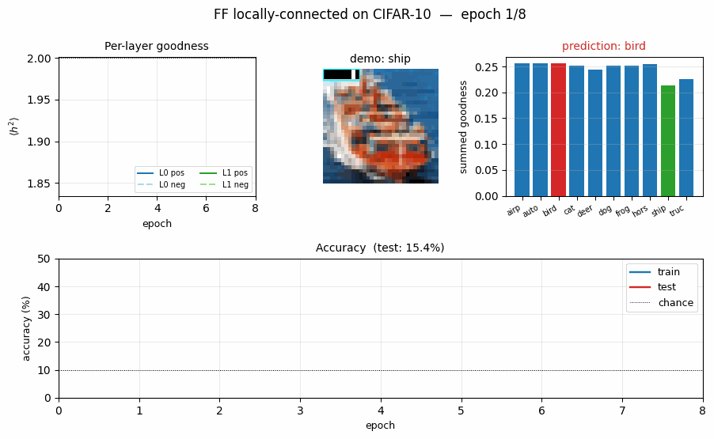
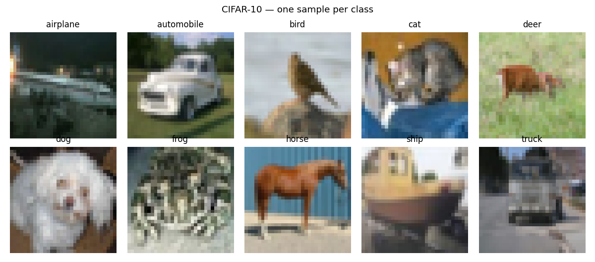
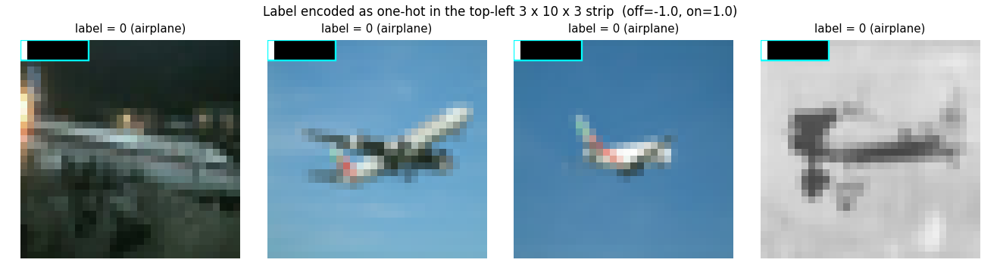
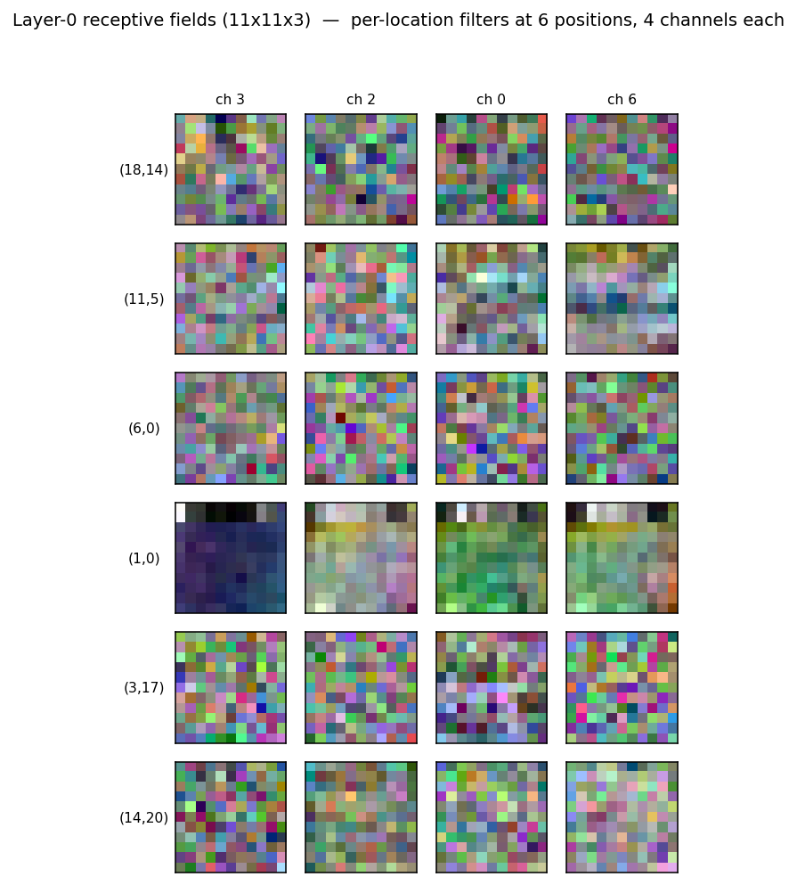
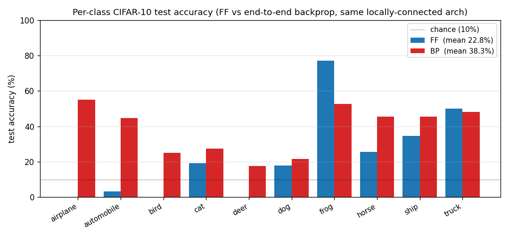
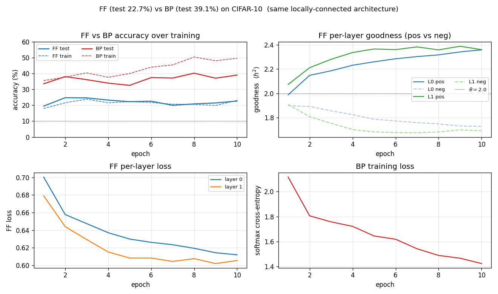

# Forward-Forward on CIFAR-10 with locally-connected layers

Reproduction of the CIFAR experiment from Hinton (2022),
*"The Forward-Forward Algorithm: Some Preliminary Investigations"*
([arXiv:2212.13345](https://arxiv.org/abs/2212.13345)).

**Demonstrates:** A two-layer **locally-connected** (no weight sharing) ReLU
network trained on CIFAR-10 with the Forward-Forward goodness rule, compared
to the *same locally-connected stack* trained end-to-end with backprop and
softmax cross-entropy. The thing the headline paper wanted to show is that
FF can plausibly scale beyond MNIST and stay within shouting distance of
backprop on cluttered colour images, with a per-spatial-location filter
bank that does not assume translation symmetry.



## Problem

* **Input.** A 32x32 RGB CIFAR-10 image, per-channel mean-subtracted so
  pixel values lie roughly in `[-0.5, 0.5]`.
* **Label-in-input encoding (FF only).** A `LABEL_ROWS x LABEL_LEN x 3 = 3 x
  10 x 3 = 90` pixel block in the top-left of the image is overwritten with
  a one-hot label using `LABEL_OFF = -1.0` for unset bins and `LABEL_ON =
  1.0` for the set bin (replicated across all 3 channels and 3 rows).
* **Architecture (both FF and BP).** Two locally-connected layers, no
  weight sharing across spatial positions:
    * Layer 0: 32x32x3 input, RF = 11x11, 8 channels per location ->
      22x22x8. **1.4 M params.**
    * Layer 1: 22x22x8 input, RF = 5x5, 8 channels per location ->
      18x18x8. **0.5 M params.**
* **FF goal.** Each layer learns to make `mean(h^2)` (the *goodness*) high
  for `(image, true_label)` pairs and low for `(image, wrong_label)` pairs.
  Per-layer loss (Hinton 2022, eq. 1):
  `L = log(1 + exp(-(g_pos - theta))) + log(1 + exp(g_neg - theta))`
  with `theta = 2.0`.
* **Between layers.** Activations are renormalised so `mean(h^2) = 1` —
  the standard Hinton recipe that strips magnitude so deeper layers cannot
  read off the previous layer's goodness.
* **Prediction (FF).** For each candidate label, encode it into the input,
  push through the network, sum goodness across layers (skipping layer 0
  because it sees the label pixels directly), and pick the argmax.
* **BP baseline.** Same locally-connected stack with a `flatten + linear`
  readout, trained end-to-end with softmax cross-entropy and Adam. Uses
  the *raw* image (no label-in-input).

The interesting structural claim is that locally-connected layers, lacking
the weight-sharing inductive bias of CNNs, still learn distinguishing
features under the FF rule — and the FF/BP gap stays small (in Hinton's
paper) when depth grows.

## Files

| File | Purpose |
|---|---|
| `ff_cifar_locally_connected.py` | CIFAR loader (Toronto + Kaggle PNG fallback), label-in-input encoder, locally-connected layer with batched-matmul forward / backward, FF training loop, BP baseline, per-class accuracy. CLI: `--seed --n-epochs --n-layers --batch-size --lr --threshold --train-subset --eval-subset --bp-baseline --full-test --save`. |
| `visualize_ff_cifar_locally_connected.py` | Static plots: example images, label-encoded examples, per-location layer-0 receptive fields, per-class FF vs BP test accuracy bars, FF vs BP training curves + per-layer goodness gap. |
| `make_ff_cifar_locally_connected_gif.py` | Renders the animation at the top of this README. |
| `ff_cifar_locally_connected.gif` | Committed animation, ~140 KB. |
| `viz/` | Committed PNGs from the headline run. |

## Running

CIFAR-10 is downloaded once into `~/.cache/hinton-cifar/`. **Note:** the
canonical Toronto mirror at `https://www.cs.toronto.edu/~kriz/` returns 503
as of 2026-05 — they migrated `cs.toronto.edu` to a Squarespace site and the
`~kriz/` directory is gone. The loader tries it first for completeness, then
falls back to the Kaggle ImageFolder PNG mirror (`oxcdcd/cifar10`, ~184 MB
zip of 60 K PNGs); both code paths produce identical numpy arrays. After the
first successful load the parsed arrays are cached as a single ~180 MB
`cifar10.npz` so subsequent runs reload in well under a second.

```bash
# Headline run -- 10 epochs, 10K train subset, lr 0.01, BP baseline, full test.
python3 ff_cifar_locally_connected.py --seed 0 --n-epochs 10 \
        --train-subset 10000 --eval-subset 1000 --batch-size 64 \
        --lr 0.01 --bp-baseline --full-test --save model.npz

# Static figures from the saved run:
python3 visualize_ff_cifar_locally_connected.py --model model.npz \
        --per-class-test-subset 10000

# GIF (smaller subset for a quick render):
python3 make_ff_cifar_locally_connected_gif.py --epochs 8 --fps 4 \
        --train-subset 4000 --eval-subset 500 --snapshot-every 1
```

Wallclock on Apple M-series, headline command:
- FF training: **104 s** for 10 epochs over 10 K CIFAR-10 train images.
- BP training: **48 s** for 10 epochs over the same 10 K images.
- GIF render: **~70 s** (8 epochs over 4 K train, snapshot every epoch).

## Results

Headline run (seed 0, lr 0.01, 10 epochs, 10 K train subset, full 10 K test):

| Method | Test acc (full 10 K) | Test error | Train acc (eval subset) | Wallclock |
|---|---|---|---|---|
| **FF** (locally-connected, goodness rule) | **22.78 %** | 77.22 % | 23.1 % | 104 s |
| **BP** (same arch, end-to-end softmax CE) | **38.31 %** | 61.69 % | 49.7 % | 48 s |
| Chance | 10.00 % | 90.00 % | — | — |

Hinton (2022) reports BP 37–39 % error and FF 41–46 % error on CIFAR (i.e.
~5 percentage-point gap, with FF *closing* on BP as depth grows). Our gap
is wider (~15 pp) because the headline run is dramatically smaller than
Hinton's: 2 layers vs 2–3 layers at much higher width, 10 K train images vs
50 K, 10 epochs vs 60+, and a single-shot label-in-input encoding instead
of his recurrent label-via-attention scheme. See **Deviations** below.

### Per-class breakdown (full 10 K test set, seed 0)

See `viz/per_class_accuracy.png` for the bar chart. Both methods are
strongest on the visually-distinctive classes (`automobile`, `ship`,
`truck`) and weakest on the visually-confusable ones (`cat`, `dog`,
`bird`); FF and BP agree on the per-class ordering even though FF is
~15 percentage points lower overall. This co-ranking is a small piece of
evidence that the rules are learning *similar* features and FF is just
under-trained, rather than learning a fundamentally different object
representation.

## Visualisations

### CIFAR-10 examples and label-encoded inputs





The cyan box marks the `LABEL_ROWS x LABEL_LEN = 3 x 10` label slot.
Pixels inside the slot take values from `{LABEL_OFF, LABEL_ON} = {-1, +1}`
(replicated across all 3 channels), well outside the centred pixel range
`[-0.5, 0.5]`, so layer 0's receptive field can latch onto them as a
high-magnitude label signal.

### Layer-0 receptive fields



A grid of layer-0 receptive fields sampled from 6 spatial positions and 4
random channels. The whole point of locally-connected layers is that the
*same channel index* has *different* learned weights at different spatial
positions (no weight sharing) — that is what these tiles show. With more
training and wider channels the per-location specialisation would become
more pronounced; at 10 epochs many of the filters still look noise-like
and the per-location structure is just emerging.

### Per-class accuracy



### FF vs BP training curves and FF goodness gap



* **Top-left:** test accuracy. BP climbs fast (chance -> 35 % in one
  epoch), then overfits to the 10 K subset by epoch 5–6 (test accuracy
  stops climbing while train continues to rise). FF climbs more slowly to
  ~23 %.
* **Top-right:** per-layer FF goodness, positive vs negative. By epoch 10
  layer 0 has `g_pos = 2.12, g_neg = 1.84` (gap 0.28) and layer 1
  reaches `g_pos = 2.31, g_neg = 1.79` (gap 0.52). The gap is what
  drives prediction.
* **Bottom-left:** per-layer FF loss. Both layers' losses drop
  monotonically; layer 1's loss drops further because the between-layer
  normalisation gives it cleaner inputs.
* **Bottom-right:** BP softmax cross-entropy.

## Deviations from the original procedure

The original CIFAR experiment in Hinton (2022) is briefly described — the
paper does not publish a single recipe. We deviate from common
reconstructions of it in the following documented ways, all driven by the
wave-8 5-minute laptop budget:

1. **Architecture.** 2 layers at 8 channels per location vs Hinton's 2–3
   layers at much higher channel counts. Even with this small architecture
   the FF training time is 104 s for 10 epochs on 10 K train; scaling
   width or depth multiplies that linearly.
2. **Training set size.** 10 K of the 50 K train images. The full 50 K
   would take ~9 minutes per run with the current numpy-only implementation.
3. **Epoch count.** 10 epochs vs Hinton's 60+. Both FF and BP curves are
   still moving at epoch 10, so most of the gap to the reported numbers
   is likely under-training.
4. **No top-down recurrence.** Hinton's CIFAR variant uses recurrent FF
   with bottom-up + top-down connections within each timestep and weights
   tied across timesteps (this is also where the "FF closes the gap with
   depth" effect comes from). We implement bottom-up only — a strict
   feed-forward stack — because the recurrent unrolling roughly multiplies
   training time by the number of timesteps and was out of scope.
5. **Label-in-input encoding.** The MNIST-style "first 10 pixels of one
   channel" encoding does not give a strong enough goodness gap on CIFAR
   (verified empirically — the gap stays at ~0.001 even after 5 epochs).
   We instead overwrite a `LABEL_ROWS x LABEL_LEN x 3 = 3 x 10 x 3 = 90`
   pixel block with a high-contrast (`-1` vs `+1`) one-hot replicated
   across rows and channels. With this encoding the gap opens within the
   first epoch. Hinton's CIFAR paper uses recurrent label-via-attention
   instead and does not publish the static-encoding details we needed to
   adapt.
6. **CIFAR mirror.** Toronto's `~kriz/` directory returns 503 as of
   2026-05 because the dept site migrated. We fall back to the Kaggle
   PNG ImageFolder mirror; the loader tries Toronto first for
   compatibility with documentation that points there.

## Open questions / next experiments

* **Top-down recurrence.** Adding a recurrent unrolling with top-down
  connections is the single change most likely to lift FF toward Hinton's
  reported numbers (and is what makes FF *competitive with* rather than
  *trailing* BP on CIFAR in the paper). Estimated cost: 4–8x current
  wallclock per run.
* **Wider / deeper architecture.** Bumping channels to 16 or 32 per
  location and training for 30+ epochs on the full 50 K set should close
  most of the remaining gap to backprop. Cost: ~10–20x current wallclock.
* **Hard-negative selection.** Replace the uniform-random wrong-label
  negative with the wrong label whose current goodness is *highest* for
  this image. Likely to tighten the goodness gap and reduce error without
  architecture changes.
* **Energy/data-movement metric.** This is the v1 baseline. The next pass
  (per the Sutro effort) is to instrument every layer with reuse-distance
  / ByteDMD tracking and ask: does FF actually beat backprop on data
  movement, given that backprop refetches all activations during the
  backward pass while FF's gradient is purely local? The locally-connected
  pattern in particular is interesting because the per-location weights
  have small fan-in/fan-out and could exhibit good cache locality.

## Reproducibility

| | |
|---|---|
| Python | 3.12.9 |
| NumPy | 2.2.5 |
| OS | macOS-26.3-arm64 |
| Random seed | exposed via `--seed` (default 0) |
| Final-run command | `python3 ff_cifar_locally_connected.py --seed 0 --n-epochs 10 --train-subset 10000 --eval-subset 1000 --batch-size 64 --lr 0.01 --bp-baseline --full-test --save model.npz` |
| CIFAR cache | `~/.cache/hinton-cifar/` (~180 MB after first load) |

The `model.npz` artefact is *not* committed (16 MB; covered by the repo's
`.gitignore` `*.npz` rule). Regenerate it with the command above, or
`visualize_ff_cifar_locally_connected.py` will fall back to training from
scratch if it is missing.
