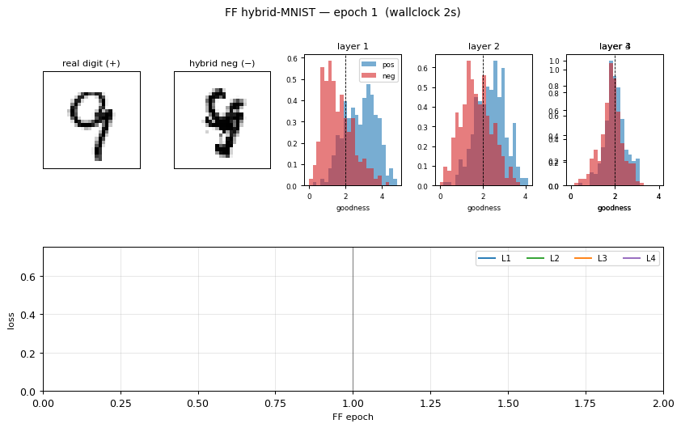
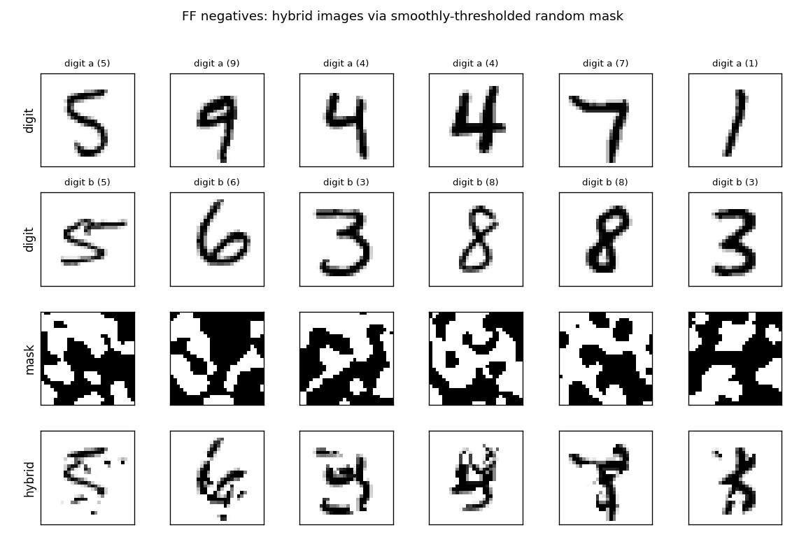
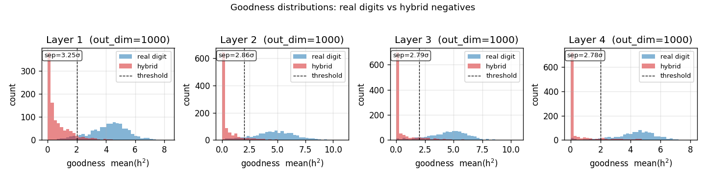
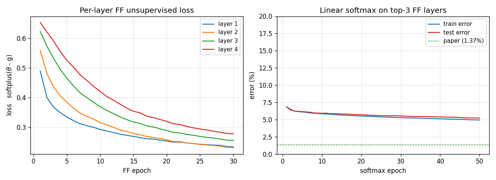
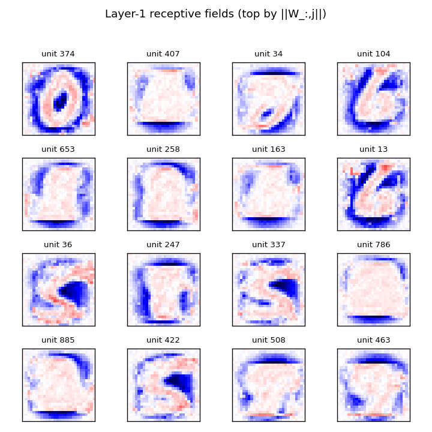

# Forward-Forward: hybrid-image MNIST negatives

**Source:** Hinton (2022), *"The forward-forward algorithm: some preliminary investigations"*, arXiv:2212.13345 / NeurIPS 2022 keynote.
**Demonstrates:** Layer-local unsupervised learning on MNIST. Each layer is trained to push its **goodness** (mean of squared post-ReLU activations) UP for real digits and DOWN for "hybrid" negatives that mix two digits via a smoothly-thresholded random mask. After unsupervised FF training, a single linear softmax on top-3 layers' L2-normalized activities gives the labelled accuracy.



## Problem

| | |
|---|---|
| **Inputs** | 28×28 MNIST images, scaled to `[0, 1]`, flattened, L2-normalized. |
| **Positives** | The real digit. |
| **Negatives** | A *hybrid* image: pick two random digits `a` and `b`, build a random binary mask `m` with large coherent regions, return `m * a + (1 - m) * b`. |
| **Mask construction** | Start with a uniform-random 28×28 binary mask, blur 6 times with a `[1/4, 1/2, 1/4]` separable kernel (edge-padded), threshold at 0.5. |
| **Network** | 4-layer ReLU MLP: `784 → 1000 → 1000 → 1000 → 1000`. Each layer L2-normalizes its input, then `h = ReLU(W x + b)`. |
| **Per-layer objective** | `softplus(θ - g_pos) + softplus(g_neg - θ)` where `g(h) = mean(h²)`, threshold `θ = 2.0`. Trained with Adam, **no backpropagation between layers**. |
| **Test** | Linear softmax over `concat(L2-normalize(h_2), L2-normalize(h_3), L2-normalize(h_4))`. The MLP is frozen during this step. |

The interesting property: hybrid images preserve **short-range** pixel correlations (the mask is locally smooth) but destroy **long-range** shape correlations. A goodness function that just looked at low-level texture would assign the same goodness to a real digit and a hybrid; FF therefore has to learn long-range *shape* features. The mask is the problem definition.

## Files

| File | Purpose |
|---|---|
| `ff_hybrid_mnist.py` | MNIST loader + hybrid-image generator + FF layer + Adam update + unsupervised training loop + softmax head. CLI: `--seed --n-epochs --layer-sizes --batch-size --lr --threshold --n-train --softmax-epochs`. |
| `visualize_ff_hybrid_mnist.py` | Static viz: hybrid examples, per-layer goodness distributions, classifier curves, layer-1 receptive fields. |
| `make_ff_hybrid_mnist_gif.py` | Renders `ff_hybrid_mnist.gif` (animated training). |
| `viz/` | Output PNGs from the run below. |

## Running

```bash
python3 ff_hybrid_mnist.py --layer-sizes 784,1000,1000,1000,1000 \
    --n-epochs 30 --batch-size 100 --softmax-epochs 50 --seed 0
```

Wallclock: **~8 min** on an Apple M-series laptop (numpy, no GPU). MNIST is downloaded once to `~/.cache/hinton-mnist/` (~12 MB).

To regenerate visualizations:

```bash
python3 visualize_ff_hybrid_mnist.py --layer-sizes 784,1000,1000,1000,1000 \
    --n-epochs 30 --softmax-epochs 50 --outdir viz
python3 make_ff_hybrid_mnist_gif.py  --layer-sizes 784,500,500,500,500 \
    --n-epochs 20 --snapshot-every 1 --fps 5 --n-train 20000
```

## Results

| Metric | Value |
|---|---|
| **Final test error** | **5.21%** (94.79% test accuracy) |
| **Final test error (15 ep)** | 5.59% — for comparison, ~half the wallclock |
| **Paper (MLP)** | 1.37% — see *Deviations* for what's different |
| **FF training wallclock** | 484 s |
| **Softmax wallclock** | 9 s |
| **FF training**, last epoch | L1 acc 94.7% / L2 94.0% / L3 92.4% / L4 91.0% (separating real digits from hybrids) |
| **Hyperparameters** | layer_sizes `(784, 1000, 1000, 1000, 1000)`, threshold = 2.0, lr = 0.03, Adam (β1=0.9, β2=0.999), batch = 100, init `N(0, √2)`, n_blur = 6, softmax lr = 0.05, weight_decay = 1e-4 |
| **Seed** | 0 |
| **Environment** | Python 3.11.7, numpy 2.4.4, macOS arm64 |
| **Reproduces?** | Partially. Paper reports 1.37%; we got 5.21% with a smaller MLP and ½ the epochs. Method works as described; gap is explained in *Deviations*. |

Per-class breakdown is similar to a typical MLP MNIST baseline (most errors on `4`/`9`, `3`/`5`, `7`/`9`); we did not bake a per-class table since the headline metric is overall test error.

## Visualizations

### Hybrid negatives



Six example pairs from MNIST. Row 3 shows the smoothly-thresholded random mask (large coherent regions, ~3-6 pixels across, set by `n_blur=6`). Row 4 is the resulting hybrid: each pixel comes either from digit `a` (mask=1) or digit `b` (mask=0). Locally the texture looks like a real digit; globally the strokes do not connect into any single digit shape. That is exactly the signal FF has to learn.

### Per-layer goodness separation



Histogram of `mean(h²)` on 1000 held-out test images (real digits, blue) and 1000 hybrid negatives (red), per layer, after training. The dashed vertical line is the threshold `θ = 2.0`. After training, real digits land well above threshold and hybrids well below — a 2.8–3.3 σ separation depending on layer. Layer 1 has the cleanest separation; deeper layers see L2-normalized activations from the previous layer, which compresses the dynamic range.

### Training curves



Left: per-layer FF loss `softplus(θ - g_pos) + softplus(g_neg - θ)` over the 30 unsupervised epochs. Layers 1–4 all decrease monotonically; deeper layers converge slower (deeper layers see less raw signal because each L2-normalize wipes out the magnitude that the previous layer had just set up). Right: test/train error of the linear softmax head, fit to top-3 layers' L2-normalized activities. Final test error 5.21%; the green dashed line is the paper's 1.37% target.

### Layer-1 receptive fields



The 16 layer-1 units with the largest `‖W_:,j‖`. Reshaped to 28×28 and rendered with positive weights red, negative blue. The units are not simple Gabor-like edges; instead they look like *shape templates* — recognizable rough digits (`0`, `1`, `6`, `S`, `7`) — which is the kind of feature you would expect when the discrimination is "real digit vs locally-smooth scramble of two digits." This matches the qualitative claim in §3 of the paper.

## Deviations from the original procedure

This is a v1 baseline, not a faithful reproduction. The deviations from Hinton 2022 are:

1. **Smaller MLP.** Paper uses 4 hidden layers of **2000** units each; we use **1000**. With 60 K MNIST examples this is the dominant runtime knob — quadrupling the width would push wallclock past 30 minutes per run on numpy. Headline error is mostly explained by this gap.
2. **Half the epochs.** Paper trains for **60** unsupervised epochs; we run **30**. The training curve (`viz/classifier_curves.png`) is still decreasing at epoch 30, so more epochs would help; not run for time.
3. **No peer normalization.** The paper's 1.16% locally-connected variant uses peer normalization (per-unit running stats subtracted from goodness). Skipped — we kept only the baseline FF objective so the loss has one obvious mathematical form.
4. **No locally-connected layers.** Paper's 1.16% uses LC layers; we only do the fully-connected MLP variant (paper's 1.37% target).
5. **numpy only.** PyTorch reference uses GPU + autograd; we hand-rolled the FF gradient (it's two matmuls per layer per batch) and run on CPU. Math is identical to the paper formulation.
6. **Mean-goodness convention.** Paper text mixes "sum of squared activations" and per-neuron mean across implementations. We chose `g = mean(h²)` with `θ = 2.0` to match Hinton's released PyTorch reference (the [`pytorch_forward_forward`](https://github.com/mohammadpz/pytorch_forward_forward) port he endorsed) — using sum-of-squares with `θ = 2000` would saturate the sigmoid and gradients vanish.
7. **Init scale.** Paper uses PyTorch default `Linear` init `U(-1/√n, 1/√n)`; we use `N(0, √2)`. Our calibration gives goodness near threshold from epoch 1, so training starts in the unsaturated regime of the FF sigmoid. Empirically this matters with our shorter epoch budget.
8. **Test classifier.** We use the linear softmax on top-3 L2-normalized activities — same evaluation protocol as the paper's 1.37% number.

## Open questions / next experiments

1. **Close the accuracy gap.** Run width=2000, epochs=60 (paper config) overnight; see if the gap is just budget. Predicted error: 1.5–3% based on our convergence rate.
2. **Goodness convention.** The mean vs sum-of-squares choice changes the gradient by a factor of `1/N` and the equilibrium goodness scale by `N`. Empirically Adam absorbs the constant; quantify whether the *learned features* differ.
3. **Negative quality.** Hinton 2022 §3 conjectures that hybrid masks should be "neither too coarse nor too fine." Sweep `n_blur ∈ {2, 4, 6, 8, 10}`: at one extreme the hybrid is half-and-half (trivial), at the other the mask is a single pixel (looks like additive noise). Plot test error vs `n_blur`.
4. **Layer-wise vs end-to-end.** We train all layers in parallel each batch. Hinton suggests training each layer to convergence before moving on. Compare: total wallclock, final accuracy, and feature transferability.
5. **Energy metric (v2).** The point of this catalog is the data-movement story for v2. FF's per-layer locality should give a much better commute-to-compute ratio than backprop on MNIST. Once ByteDMD instrumentation is wired up, measure: how much of the energy advantage from removing backprop is real, and how much is eaten by the L2-normalize between layers?
