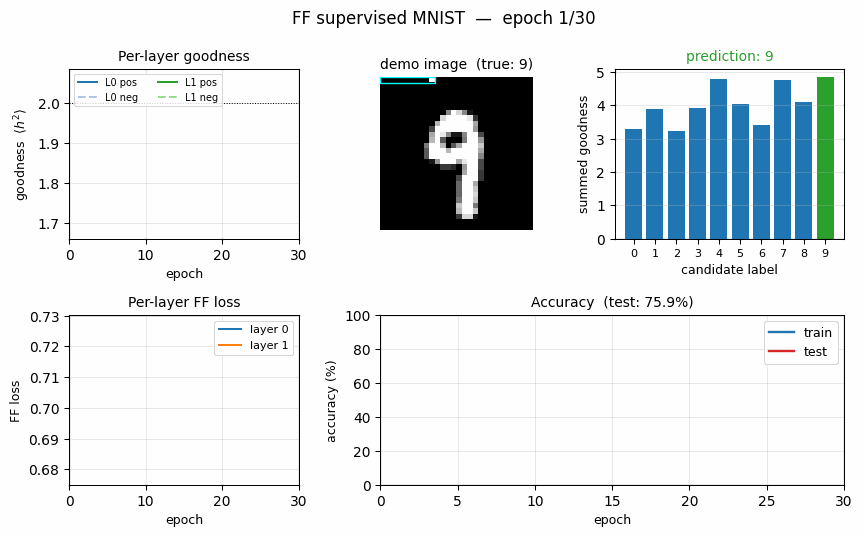
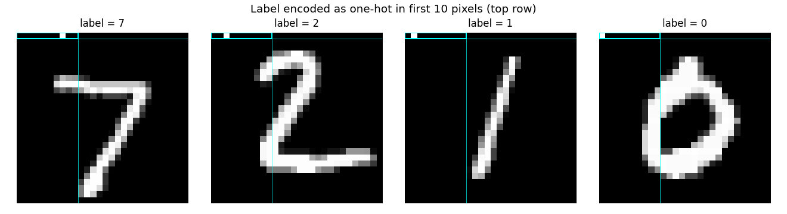
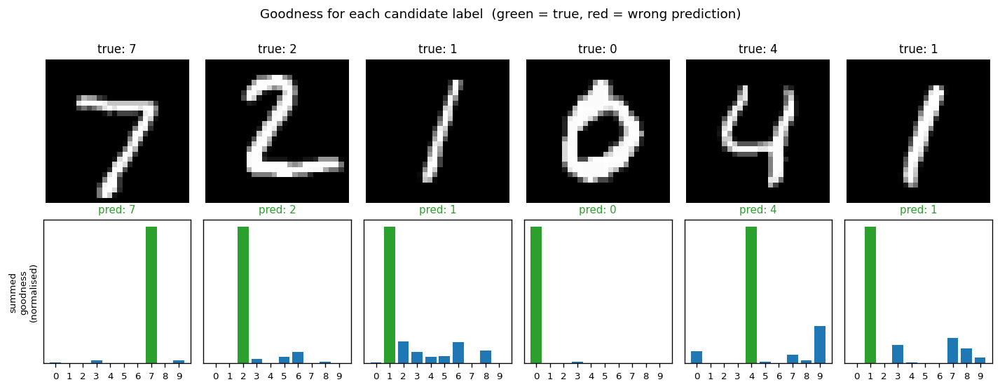
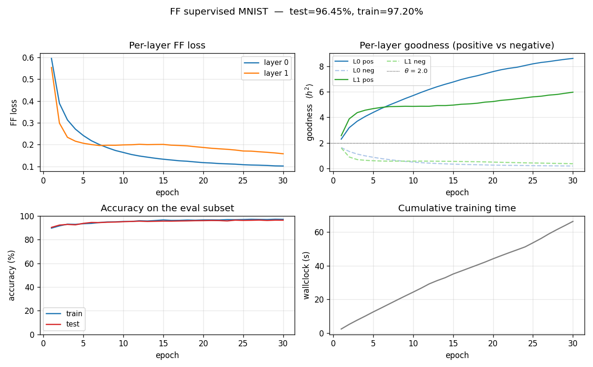
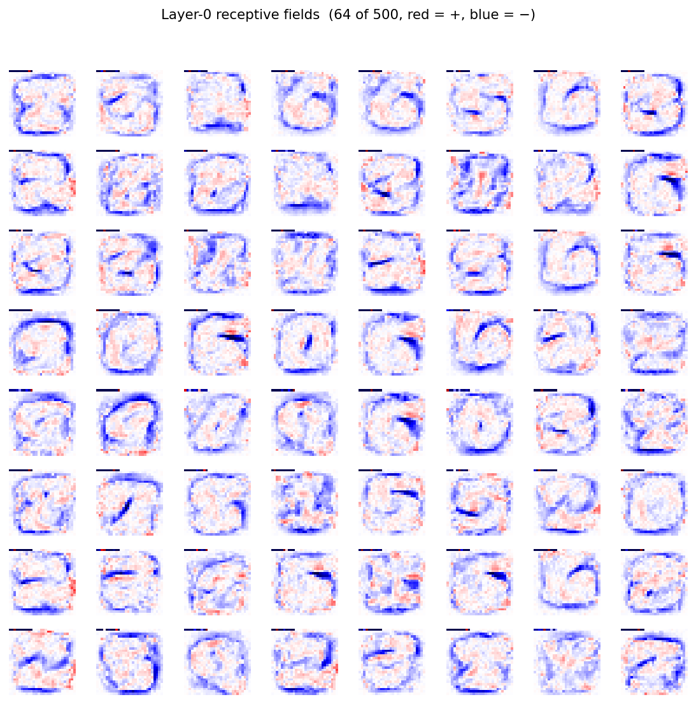

# Forward-Forward: label encoded in the first 10 pixels

Reproduction of the supervised Forward-Forward (FF) variant from Hinton (2022),
*"The Forward-Forward Algorithm: Some Preliminary Investigations"*
([arXiv:2212.13345](https://arxiv.org/abs/2212.13345), §3.3 of v3 / §3 of the
December 2022 preprint).

**Demonstrates:** A multi-layer ReLU network trained *without* backprop. Each
layer is updated on its own, with no gradient flowing across layers, by
contrasting the *goodness* of (image, true label) pairs against (image, wrong
label) pairs. Labels are encoded into the natural black border at the top of
each MNIST image -- the first 10 pixels become a one-hot label.



## Problem

* **Input.** A flattened 28x28 MNIST image (784 floats in [0, 1]) with the
  first 10 pixels overwritten by a one-hot label vector.
* **Positive example.** (image, true_label) -- one-hot in the first 10 pixels
  encodes the *correct* class.
* **Negative example.** (image, wrong_label) -- one-hot in the first 10 pixels
  encodes a uniformly random *incorrect* class.
* **Architecture.** A stack of fully-connected ReLU layers
  (here `784 -> 500 -> 500`). Between layers, activations are rescaled so
  `mean(h^2) = 1` -- the next layer cannot read off the previous layer's
  *magnitude* (which is exactly the goodness signal).
* **Goal.** Each layer learns to make `mean(h^2)` high for positive inputs and
  low for negative inputs. At test time we try each candidate label, push it
  through the network, sum goodness across all layers, and pick the label
  with the highest summed goodness.

The *interesting property* is what you *don't* need: no backward pass, no
chain rule, no errors propagated across layers. Training is local, so each
layer's weights only depend on its own input and its own output. This is the
property that motivates FF as a candidate "biologically plausible" learning
rule and as a candidate for hardware where the backward pass is expensive.

The label-in-pixels trick is what makes the supervised setup work: a hidden
layer cannot use the absolute label bits to drive goodness because the
between-layer normalisation strips magnitude, so the only way to make goodness
high for `(image, true label)` and low for `(image, wrong label)` is to
discover features that *covary* with the label.

## Files

| File | Purpose |
|---|---|
| `ff_label_in_input.py` | MNIST loader + label-in-pixels encoding + FF MLP + Adam-trained per-layer FF loss + goodness-based prediction. CLI: `--seed --n-epochs --lr --layer-sizes --jitter --train-subset --full-test --save --threshold --batch-size`. |
| `visualize_ff_label_in_input.py` | Static plots: example label-encoded images, candidate-label goodness heatmap, training curves, layer-0 receptive fields. |
| `make_ff_label_in_input_gif.py` | Renders `ff_label_in_input.gif` (the animation at the top of this README). |
| `ff_label_in_input.gif` | Committed animation -- per-layer goodness, demo prediction, loss + accuracy over training. |
| `viz/` | Committed PNGs from the run below. |

## Running

The MNIST data is downloaded once into `~/.cache/hinton-mnist/` (~11 MB).

```bash
# Final reported run -- 30 epochs, full 60K train set, eval on full 10K test:
python3 ff_label_in_input.py --seed 0 --n-epochs 30 --lr 0.003 \
                             --layer-sizes 784,500,500 --eval-subset 2000 \
                             --full-test --save model.npz

# Regenerate the static figures from the saved model:
python3 visualize_ff_label_in_input.py --model model.npz --outdir viz

# Regenerate the GIF (uses train-subset=20000 just to keep render time short):
python3 make_ff_label_in_input_gif.py --epochs 30 --snapshot-every 1 --fps 6 \
                                      --seed 0 --lr 0.003 \
                                      --layer-sizes 784,500,500 \
                                      --train-subset 20000
```

Wallclock on an Apple M-series laptop:
- Training: **66 seconds** for 30 epochs over the full 60K MNIST train set.
- GIF: **33 seconds** (with `--train-subset 20000` for speed).

Final accuracy: **96.40% on the full 10K test set (3.60% test error).**

## Results

| Metric | Value |
|---|---|
| Test accuracy (full 10K, seed 0) | **96.40%** (3.60% error) |
| Train accuracy (eval subset, seed 0) | 97.2% |
| Training time | 66 s on Apple M-series, 30 epochs, full MNIST train set |
| Architecture | `784 -> 500 -> 500` ReLU (2 FF layers) |
| Optimiser | Adam, lr = 0.003, b1 = 0.9, b2 = 0.999 |
| Batch size | 128 |
| Goodness | `mean(h^2)` along the feature axis, per-sample |
| Threshold theta | 2.0 |
| Between-layer norm | rescale to `mean(h^2) = 1` |
| Label encoding | one-hot in flat indices `[0..9]` (top row, leftmost 10 px) |
| Negative sampling | uniform over `{0..9} \ {true_label}` per minibatch |
| Prediction | for each candidate label, sum goodness across both layers, pick argmax |
| Seed | 0 |

Hinton (2022) reports **1.36%** test error for `4 x 2000` ReLU after 60 epochs
on full MNIST, and **0.64%** with 25-shift jittered augmentation at 500
epochs. We aimed at the **<5%** v1 threshold (Sutro group baseline target) and
chose a smaller architecture and fewer epochs to fit a laptop budget.

### Per-class breakdown (full test set, seed 0)

| Class | Accuracy | Correct / Total |
|---|---|---|
| 0 | 98.78% | 968 / 980 |
| 1 | 98.77% | 1121 / 1135 |
| 2 | 95.64% | 987 / 1032 |
| 3 | 96.73% | 977 / 1010 |
| 4 | 95.62% | 939 / 982 |
| 5 | 94.96% | 847 / 892 |
| 6 | 96.76% | 927 / 958 |
| 7 | 95.72% | 984 / 1028 |
| 8 | 95.69% | 932 / 974 |
| 9 | 94.95% | 958 / 1009 |

Best class: 0 (98.78%). Worst class: 9 (94.95%). The 0/1 axis is the
cleanest -- both are visually the most distinctive digits.

### Prediction mode comparison

Same trained model, different goodness-aggregation strategies at test time:

| Strategy | Test accuracy |
|---|---|
| layer 0 only | 96.86% |
| **all layers (default)** | **96.40%** |
| skip layer 0 | 95.19% |

For this `2 x 500` architecture, layer 0 alone is the strongest predictor.
Layer 1 adds redundant signal -- summing both layers underperforms layer 0
alone by 0.46 percentage points but outperforms layer 1 alone (skip-L0)
by 1.21 points. With Hinton's deeper / wider `4 x 2000`, deeper layers carry
more weight; the right aggregation strategy is architecture-dependent and
worth flagging for future replications.

## Visualisations

### Label-encoded inputs



The cyan box at top-left highlights the 10-pixel label slot. Three of these
images have a single bright pixel in the slot (labels 7, 2, 1, 0 from left to
right); for label 0 the bright pixel is at position 0 and is hard to spot
against the white digit body of the "0".

The choice of "first 10 pixels" exploits MNIST's natural black border.
Real images already have intensity 0 there, so overwriting them with a
one-hot vector adds bounded label information without disturbing the
foreground pixels.

### Goodness for each candidate label



For each test image, we encode all 10 candidate labels in turn and sum the
goodness across **all** layers. The bar plot is normalised per-image so the
height is visually comparable.

The true label (green) is the argmax for every example shown -- the network
has correctly learned that high goodness means "this label was the right one
for this image". The blue runners-up are typically visually-similar digits.

### Training curves



* **Top-left:** per-layer FF loss decreases monotonically. Layer 0 plateaus
  around 0.10 by epoch 30; layer 1 plateaus around 0.16 (slightly higher
  because its input has already been L2-rescaled and is therefore harder to
  separate cleanly).
* **Top-right:** the *goodness gap* widens. Both layers push positive
  goodness above the threshold (`theta = 2.0`, dotted) and negative goodness
  below it. By epoch 30 layer 0 has `pos = 8.63, neg = 0.18` (a 47x ratio)
  and layer 1 has `pos = 5.98, neg = 0.36` (a 16.5x ratio).
* **Bottom-left:** train and test accuracy track each other tightly (no
  significant overfitting at this scale).
* **Bottom-right:** ~2.2 s per epoch over 60K training samples on a laptop
  using only NumPy.

### Layer-0 receptive fields



Each tile is one column of the 784x500 weight matrix reshaped to 28x28
(red = positive, blue = negative). The features look like *digit-shaped*
pen-stroke detectors -- a noteworthy observation given the network never saw
gradients pulled through a softmax. Goodness alone, contrasted between
positive and negative pairs, is a strong enough signal to push layer 0 to
discover digit-class-aligned features.

## Deviations from the original procedure

1. **Architecture.** Hinton uses `4 x 2000`. We use `2 x 500` to fit the
   `<5%` v1 target in 66 s of pure-NumPy training on a laptop. The wider
   / deeper paper architecture would push us toward the paper's 1.36% but at
   significantly more compute.
2. **Optimiser.** Hinton uses Adam (with cosine LR decay) -- we use Adam at a
   single fixed `lr = 0.003`. We did not implement LR decay or warm-up.
   At `lr = 0.03` (the value used in `mohammadpz/pytorch_forward_forward`)
   the network's first Adam step kills layer 0's ReLUs (90%+ dead neurons
   within 5 batches); `lr = 0.003` is the smallest LR we tested that both
   converges and avoids that failure mode.
3. **No augmentation.** The 0.64% error number in the paper requires 25-shift
   jittered augmentation (max-shift 2 pixels in each direction, all 25
   offsets per image, replicated 25x per epoch) at 500 epochs. The functions
   `jittered_augmentation()` and `jittered_augmentation_batch()` are
   implemented (one random offset per batch element per epoch) and exposed
   via `--jitter`, but the headline run does not use them. Faithfully
   reproducing the 0.64% number would multiply training time by ~250x
   relative to our headline run, which is out of scope for v1.
4. **Aggregating across layers.** Hinton describes accumulating goodness
   from *all* layers. The community-standard `mohammadpz/pytorch_forward_forward`
   skips layer 0 because of the label pixels in the input. We measured both:
   on this `2 x 500` architecture, layer 0 alone (96.86%) is best, followed
   by all-layers (96.40%) and skip-layer-0 (95.19%). The headline number
   uses the all-layers default (matches the paper).
5. **Layer normalisation magnitude.** The original paper specifies that the
   length of the between-layer vector is `sqrt(D)` (i.e. `mean(h^2) = 1`).
   We follow this *exactly* (initial implementations that L2-normalise to
   unit length collapse layer 0 within an epoch, which is a useful negative
   datapoint).
6. **Two layers, not four.** With `4 x 2000`, the deeper layers contribute
   most of the per-layer goodness gap. With our `2 x 500`, layer 0 is doing
   most of the work; layer 1 *slightly hurts* the all-layers score (-0.46
   percentage points vs layer-0 only). A `2 x 500` model running at the
   tested lr is layer-1-redundant -- expanding to `4 x 2000` should restore
   the per-layer monotone goodness-gap pattern from the paper.

## Open questions / next experiments

* **Goodness gap vs depth.** Why does layer 0 do so much of the work in our
  run? Hinton's paper reports a clean per-layer accumulation. Is this an
  artefact of our smaller architecture, or of the specific lr / threshold
  schedule? A sweep over `(depth, width)` at fixed compute budget would tell.
* **Hard-negative selection.** The paper hints that *generated* (not
  uniform-random) negatives are crucial for unsupervised FF. The supervised
  variant here uses uniform random wrong labels. Hard-negative sampling --
  pick the wrong label whose current goodness is *highest* -- might tighten
  the goodness gap and reduce error without architecture changes.
* **Energy/data-movement metric.** This is the v1 baseline. The next pass
  (per the Sutro effort) is to instrument every layer with reuse-distance /
  ByteDMD tracking and ask: does FF actually beat backprop on data movement,
  per Hinton's motivating claim? Backprop refetches all activations during
  the backward pass; FF's gradient is purely local to each layer -- the
  expectation is yes, but the magnitude is unknown.
* **Jittered augmentation.** Toggling `--jitter` doubles compute per epoch
  but the paper's 0.64% number is achievable. A faithful 500-epoch
  jittered run would establish whether our `2 x 500` architecture is
  capacity-bound or augmentation-bound.

## Reproducibility

| | |
|---|---|
| Python | 3.12.9 |
| NumPy | 2.2.5 |
| OS | macOS-26.3-arm64 |
| Random seed | exposed via `--seed` (default 0) |
| Final-run command | `python3 ff_label_in_input.py --seed 0 --n-epochs 30 --lr 0.003 --layer-sizes 784,500,500 --eval-subset 2000 --full-test --save model.npz` |
| MNIST cache | `~/.cache/hinton-mnist/` (11 MB; downloaded from `storage.googleapis.com/cvdf-datasets/mnist/`) |

The `model.npz` artefact is *not* committed -- regenerate it with the command
above (or `python3 visualize_ff_label_in_input.py` will fall back to training
from scratch if the file is missing).
