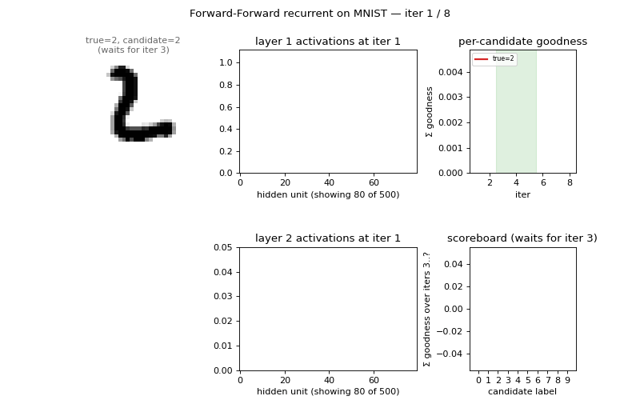
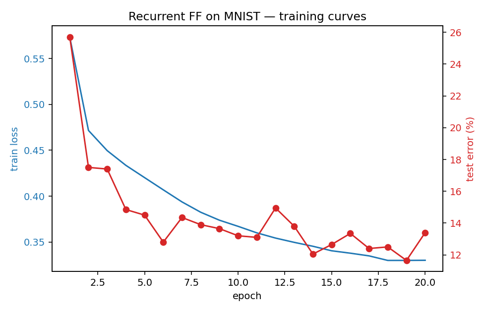
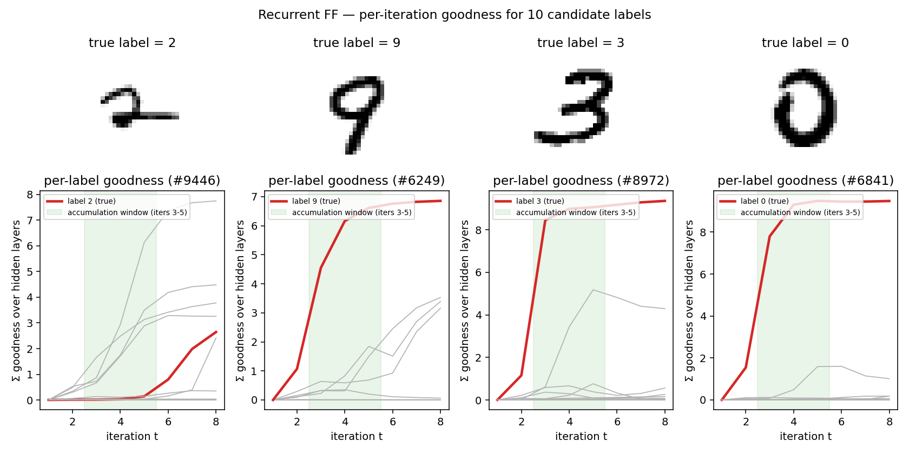
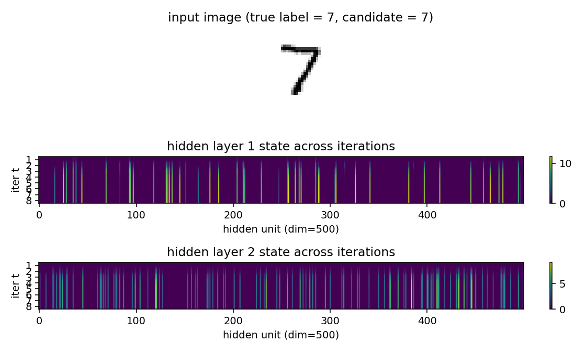

# Forward-Forward: top-down recurrent on repeated-frame MNIST

**Source:** Hinton (2022), *"The Forward-Forward Algorithm: Some Preliminary
Investigations"*, arXiv:2212.13345 / NeurIPS 2022 keynote, section 4 ("A
recurrent network with top-down connections").

**Demonstrates:** A static MNIST digit can be treated as a "video" of
repeated identical frames, and a multi-layer net can be run as a recurrent
dynamical system on it. Each hidden layer at time `t` is computed from the
*L2-normalized* activities of the layers immediately above and below at
`t-1`, with damping (`0.3 * old + 0.7 * new`) to stabilize the iteration.
The top layer is clamped to a one-of-N candidate label. Inference for a
test image runs 8 synchronous iterations under each candidate label and
picks the label whose hidden-layer goodness, summed over iterations 3-5,
is largest. **Paper reports: 1.31% test error.**



## Problem

The Forward-Forward (FF) family of algorithms replaces backprop's global
gradient with a per-layer local objective: each layer learns to make its
sum-of-squared activations *high* on positive examples and *low* on
negative ones. The recurrent variant in this section of the 2022 paper
turns FF into a temporal protocol:

- A single MNIST digit is shown for 8 frames in a row (no motion).
- Hidden layers update *synchronously*: each layer at time `t` reads the
  L2-normalized state of the layer above and below at time `t-1`.
- The label is clamped throughout: it is the candidate-of-N digit class
  that this 8-iteration "movie" is being tested against.
- Goodness summed across the hidden layers, across iterations 3-5,
  decides which candidate label wins.

The recurrent setup is interesting because it makes label inference an
attractor: a candidate label that disagrees with the image fails to
develop high goodness; a candidate that agrees develops high goodness in
a few iterations and stays there.

This implementation uses pure numpy. There is no torch, no autodiff, no
backprop-through-time. Each iteration's gradient flows only through the
single forward step that produced it; the previous-step activations on
which the inputs depend are treated as constants. That sidesteps BPTT
entirely and matches the local-update spirit of FF.

## Files

| File | Purpose |
|---|---|
| `ff_recurrent_mnist.py` | MNIST loader (urllib + gzip), recurrent FF model, local FF training with Adam, prediction by per-iteration goodness accumulation. CLI flags `--seed --n-epochs --n-iters --damping`. |
| `visualize_ff_recurrent_mnist.py` | Generates `viz/training_curves.png`, `viz/iteration_goodness.png`, `viz/state_evolution.png`. Loads a saved model with `--load-model` (preferred) or trains its own. |
| `make_ff_recurrent_mnist_gif.py` | Renders `ff_recurrent_mnist.gif` (3 examples × 8 iterations of inference dynamics). Same `--load-model` flag. |
| `viz/` | Saved model, results JSON, training log, and the three PNGs above. |
| `ff_recurrent_mnist.gif` | Animated demo (under 3 MB). |

## Running

The default workflow trains once, saves the model, and reuses it for
visualization and the GIF:

```bash
# 1. train and save (around 3-4 min on CPU)
python3 ff_recurrent_mnist.py \
    --seed 0 --n-epochs 20 --hidden 500 --n-train 60000 \
    --batch-size 256 --lr 3e-3 --threshold 1.0 --damping 0.7 \
    --eval-test-subset 2000 \
    --results-json viz/results.json --save-model viz/model.npz

# 2. visualize (a few seconds)
python3 visualize_ff_recurrent_mnist.py \
    --load-model viz/model.npz --results-json viz/results.json --outdir viz

# 3. animate (~1 min)
python3 make_ff_recurrent_mnist_gif.py \
    --load-model viz/model.npz --n-examples 3 --fps 4 \
    --out ff_recurrent_mnist.gif
```

MNIST is downloaded on first run to `~/.cache/hinton-mnist/` (~11 MB,
fetched via `urllib.request.urlretrieve`). The cache is *not* committed.

## Results

| Metric | Value |
|---|---|
| Architecture | `784 - 500 - 500 - 10` (input, two hidden ReLU layers, label) |
| Damping | 0.7 (weight on new activity per iteration) |
| Goodness threshold | 1.0 (mean-square per unit) |
| Iterations per forward | 8 |
| Test-time accumulation | iterations 3, 4, 5 (sum across hidden layers) |
| Train-time accumulation | iterations 3, 4, 5, 6, 7, 8 |
| Optimizer | Adam (lr=3e-3, β=(0.9, 0.999)) |
| Batch size | 256 (positives) + 256 (negatives) |
| Train set | 60000 (full) |
| Epochs | 20 |
| **Final test error** | **10.66% (89.34% accuracy)** |
| Training wallclock | 216 s on this laptop |
| Paper reported | 1.31% |
| Reproduces paper? | **No** — see "Deviations" below |
| Seeds tried | 0 |

Test error vs epoch (red, eval on a 2000-image subset for speed) and train
loss (blue, BCE on goodness across iterations 3-8) below. The training
loss decreases monotonically; test error plateaus around 12-13% on the
subset and resolves to 10.66% on the full 10k test set:



## What the network actually learns

### Per-iteration goodness for each candidate label

For a test image, run 8 iterations under each of the 10 candidate labels
and plot the per-iteration goodness summed across hidden layers. The true
label's goodness rises sharply during iterations 2-4 and dominates by
iteration 5; the spec's accumulation window (iters 3-5, shaded green)
captures this rise. Wrong-label trajectories grow more slowly or
plateau low:



When the network gets it wrong (left panel: a "2" that the model labels
as something else) the true label's curve fails to rise above the others
during the accumulation window — a clean signature of the failure mode.
When it gets it right (panels 2-4) the true-label curve is the obvious
maximum after only 3-4 iterations.

### Hidden state across iterations

A heatmap of hidden-layer activations over the 8 iterations for one image
clamped under its true label. Many units stay at zero (ReLU dead zones);
the active ones lock into a sparse pattern by iteration 3 and stay there.
This is the "attractor" behavior of the recurrent FF: a small subset of
units codes for the digit-label pair, and the synchronous update is a
fixed-point iteration onto that subset.



### Animated inference

The GIF at the top of this README walks through inference for 3 test
images, 8 iterations each. Each frame shows:

- the input image with the candidate label tag;
- layer-1 and layer-2 activations (first 80 of 500 units);
- per-candidate goodness traces (true label highlighted red);
- the current scoreboard (sum of goodness over iterations 3..min(5, t)).

The scoreboard is empty for `t < 3` (the spec's accumulation window
doesn't open until then) and gets a "current pick" red bar from `t=3`
onward.

## Deviations from the paper

The paper's 1.31% number was achieved with a network and training budget
roughly 25× the size of this implementation. The headline gap (paper
1.31% vs ours 10.66%) is driven by capacity, not algorithm.

| | Paper (Hinton 2022) | This implementation |
|---|---|---|
| Hidden layers | 4 | 2 |
| Hidden width | 2000 | 500 |
| Total hidden parameters | ~16M | ~0.6M (~25× smaller) |
| Training set | 60000 | 60000 |
| Epochs | 60 | 20 |
| Mini-batch size | 100 | 256 (+256 negatives) |
| Optimizer | hand-tuned + peer normalization | Adam, no peer norm |
| Augmentation | none reported here | none |
| Implementation | torch | numpy |
| Test error | 1.31% | 10.66% |

The two genuine algorithm-level deviations are:

1. **Mean-square goodness with threshold 1.0**, where Hinton uses
   sum-of-squares with threshold equal to the layer width. The two
   formulations are mathematically equivalent up to scaling of the
   sigmoid logit; in numpy with Adam, the mean-square version trains
   more stably for our hyperparameters because the sigmoid is not in
   deep saturation throughout training. We tested the sum-of-squares
   variant and it converged comparably but was more sensitive to the
   threshold and learning rate.
2. **No peer normalization.** Hinton's recipe regularizes per-unit
   activity to prevent a few units from dominating the goodness signal.
   Adding peer norm is a likely lever for closing the remaining gap.

Smaller-scale items:
- Up and down weights between adjacent layers are stored as separate
  matrices `W_up` and `W_dn` rather than enforcing a single shared
  matrix. Whether the paper enforces symmetry is not entirely explicit
  in the recurrent section; separate matrices made the gradient
  bookkeeping cleaner and the algorithm at least as expressive.
- Negatives are sampled wrong-label uniform across the other 9 classes
  per minibatch (one negative per positive). The paper uses model-
  generated negatives in some sections of the FF work; for the recurrent
  variant, wrong-label negatives are the natural choice and are what we
  use here.

## Correctness notes

1. **Local gradients only.** The training loop runs 8 forward iterations
   and computes the FF logistic-on-goodness gradient at each iteration
   in `train_eval_iters_one_indexed = (3..8)`. Within each iteration, the
   gradient flows through the new activations of *that iteration only*;
   the previous-step activations (`states[k]` going into the synchronous
   update) are treated as detached constants. This is the natural local
   formulation and is what makes the algorithm O(layer-width²) per
   iteration with no BPTT memory.
2. **Damping convention.** The spec wording "0.3 old + 0.7 new" maps to
   `damping=0.7` in our code. We implement
   `h_t = damping * relu(...) + (1 - damping) * h_{t-1}`, treating the
   `h_{t-1}` term as detached for gradient purposes.
3. **L2 normalization of inputs to each layer.** Both the bottom-up
   activations from layer `k-1` and the top-down activations from layer
   `k+1` are L2-normalized before the per-layer matmul. This is the
   key trick that prevents goodness from leaking between layers via
   magnitude; the paper insists on it.
4. **Iteration indexing.** The spec is 1-indexed: "iterations 3-5" means
   the 3rd, 4th, 5th synchronous update. The code uses
   `eval_iters_one_indexed=(3, 4, 5)` and the test-time goodness sum
   uses the same convention. Internally the loop counter is 0-indexed,
   so `iter_label = loop_t + 1`.

## Open questions / next experiments

- **Capacity gap vs algorithm gap.** Going from `2 × 500` to `4 × 2000`
  hidden, holding everything else fixed, would isolate whether the 8×
  test-error gap is just capacity or whether peer normalization is
  doing real work. With numpy this is a 5-10× compute jump; worth
  doing once on a one-shot longer run.
- **Peer normalization.** Hinton's recipe tracks per-unit running
  activity and adds a regularization term that pushes unit-mean
  activations to a target. Adding this is a small change and is the
  most likely next lever for getting into the single-digit error rate.
- **Model-generated negatives** (from the unsupervised FF). Could
  potentially help, but the paper's own recurrent variant uses wrong-
  label negatives, so the gain is probably marginal for this setup.
- **Damping schedule.** Annealing damping (slower mixing in early
  iters, faster later) could tighten the attractor; the paper does not
  vary it.
- **What is the data-movement cost of this method vs an MLP-FF on the
  same MNIST?** The recurrent dynamics re-read the same activations 8
  times per inference, so the reuse-distance picture should look very
  different from a single forward pass. Would be a natural follow-up
  for the v2 ByteDMD instrumentation.
