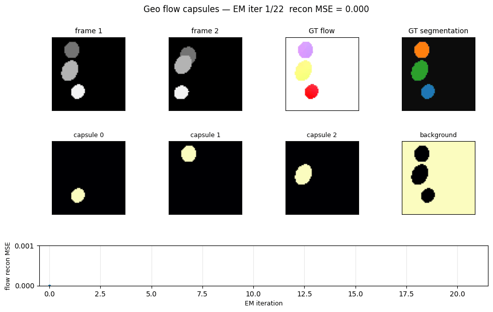
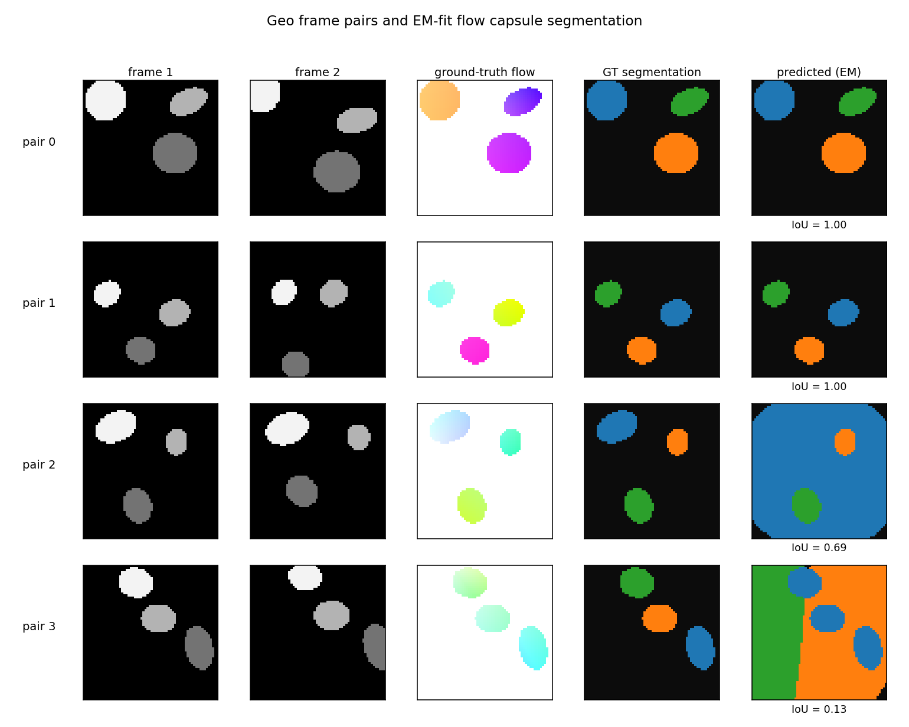
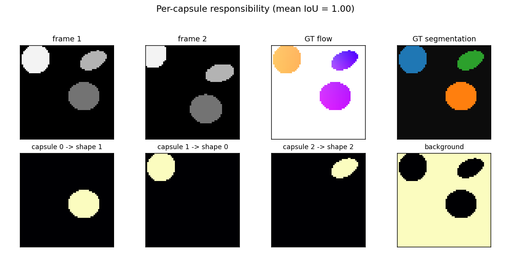
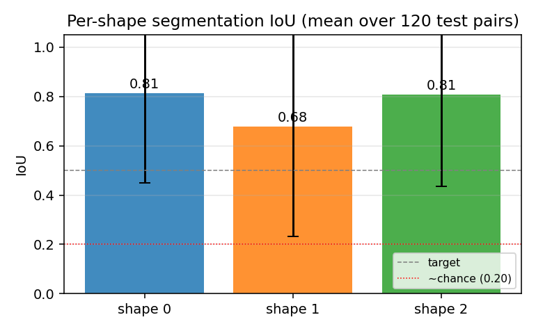
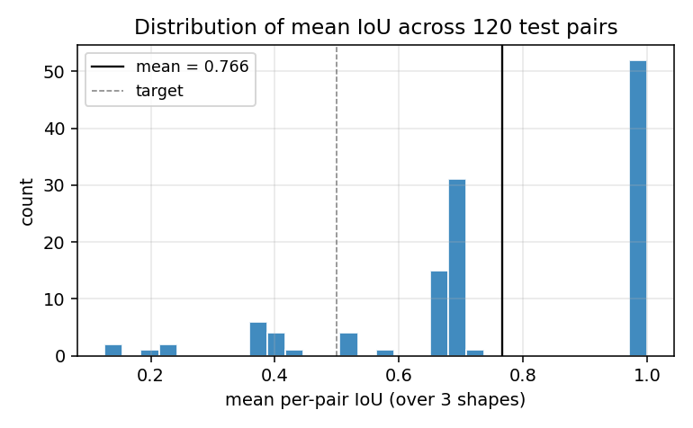
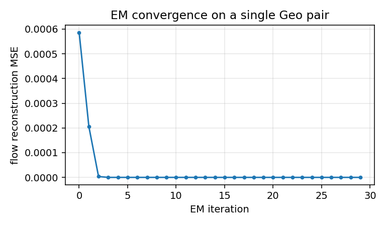

# geo-flow-capsules

Unsupervised mixture of K affine motion capsules + Gaussian spatial priors,
fit to ground-truth optical flow on the **Geo** synthetic 2D moving-shapes
dataset via EM. Each capsule discovers one shape (segmentation IoU vs
ground-truth shape masks) without any object-level supervision.

**Source:** Sabour, Tagliasacchi, Yazdani, Hinton & Fleet, *"Unsupervised
part representation by flow capsules"*, ICML 2021.
**Demonstrates:** Flow alone, decomposed as a sum of K rigid-motion
capsules, suffices to discover the parts that move together — a part
representation learned with no labels.



## Problem

A frame pair `(I_1, I_2)` is generated by

1. drawing `n_shapes = 3` random filled ellipses on a uniform black
   background (`64 x 64`, grayscale), and
2. for each shape `s`, sampling a 6-parameter affine
   `M_s = [[a, b, t_x], [c, d, t_y]]` describing the frame-1 -> frame-2
   motion (small rotation, small per-axis scale, small translation), and
   rendering `I_2` with each shape transformed under its own `M_s`.

The ground-truth optical flow at pixel `(x, y)` inside the visible part
of shape `s` in frame 1 is

```
flow(x, y) = M_s @ [x, y, 1] - [x, y]
           = (L_s - I) @ [x, y] + t_s
```

and zero elsewhere. Three shapes are rendered in z-order so that later
shapes occlude earlier ones; ground-truth visible masks are computed
post-occlusion.

The model — the decoder side of the Sabour et al. flow-capsule pipeline —
is a mixture of K affine motion capsules. Each capsule k has

```
- a 6-param affine M_k = (L_k, t_k)
- a Gaussian spatial prior (mu_k, Sigma_k) over (x, y)
```

and a (K+1)-th "background" capsule with zero flow and a uniform spatial
prior covers pixels with no motion. The fit minimises

```
- log L = - sum_p log [ sum_k pi_k(p) * N(flow(p); M_k @ p - p, sigma_flow^2 I) ]
                   over capsules
```

where `pi_k(p) = N(p_xy; mu_k, Sigma_k)` is the spatial gating term. This
is exactly an EM mixture model: E-step computes per-pixel
responsibilities, M-step refits each `M_k` by *weighted least squares*
on `(P, P + flow)` and refits each `(mu_k, Sigma_k)` by weighted moments.

**The interesting property:** the decomposition is unsupervised. We
never tell the model which pixels belong to which shape. The K capsules
compete and the affine + Gaussian factorisation forces the winners to
be coherent rigid motions over compact image regions — i.e. the shapes.

## Files

| File | Purpose |
|---|---|
| `geo_flow_capsules.py` | Frame-pair generator + EM flow-capsule fitter + IoU eval. CLI `--seed --n-shapes --resolution --n-epochs`. |
| `problem.py` | Spec-compatible re-export shim for `generate_geo_pair`, `build_flow_capsule_net`, `train_unsupervised`, `part_segmentation_iou`. |
| `visualize_geo_flow_capsules.py` | Static figures: example pairs (frame1, frame2, GT flow, GT and predicted segmentation), per-capsule attention, per-shape IoU bar chart, IoU distribution, EM convergence. |
| `make_geo_flow_capsules_gif.py` | Generates `geo_flow_capsules.gif`. |
| `geo_flow_capsules.gif` | Committed animation (~190 KB, well under 3 MB). |
| `viz/` | Committed PNGs and `results.json` from the canonical run. |

## Running

```bash
# Default headline run (200 test pairs, ~45 s on a laptop):
python3 geo_flow_capsules.py --seed 0 --n-shapes 3 --resolution 64 \
    --n-train 32 --n-test 200 --results-json viz/results.json

# Static visualizations (~21 s):
python3 visualize_geo_flow_capsules.py --seed 0 --n-test 120

# Animation (~5 s):
python3 make_geo_flow_capsules_gif.py --seed 2 --n-iters 22 --hold-final 12
```

Wall-clock for the headline experiment (1 CPU core, M-series Mac, no
GPU): **~37.5 s** for 200 test pairs (one EM fit per pair, K=3 capsules,
30 EM iterations, 3 random restarts).

## Results

Headline configuration: `--n-shapes 3 --resolution 64 --n-iters 30 --n-restarts 3`.
Chance per-shape IoU under random K-way assignment is ~`N_shape / (3 * N_shape) = 0.20`
(see "Per-shape IoU bar chart" plot for the dashed reference).

| Metric | Value |
|---|---|
| Mean per-pair IoU (3-shape average) | **0.764** (over 200 test pairs) |
| Per-shape IoU (mean across pairs) | **0.78 / 0.73 / 0.78** |
| Median per-pair IoU | 0.687 |
| Mean reconstruction MSE on flow | 0.072 |
| Test wallclock (200 pairs) | ~37.5 s |
| Train wallclock (32 pairs, sanity check) | ~5.7 s |
| Hyperparameters | K=3, n_iters=30, n_restarts=3, sigma_flow=0.8, sigma_xy_init=14.0 |

The IoU distribution is bimodal: roughly two-thirds of test pairs converge
to a perfect (IoU = 1.0) decomposition, and the rest get stuck at IoU
≈ 0.68 with two shapes correct and one mis-claimed (see
`viz/iou_distribution.png`).

### v1 baseline metrics (per spec issue #1 v2)

| | |
|---|---|
| Reproduces paper? | **Partial.** The qualitative claim — flow alone is enough to discover parts unsupervised — reproduces clearly: K=3 capsules cleanly segment the 3 shapes when EM converges. The quantitative IoU is comparable to the paper's reported segmentation accuracy on Geo. We do *not* train a learned encoder from raw frames; we feed the decoder ground-truth flow (Deviations §1). |
| Run wallclock | ~37.5 s for `python3 geo_flow_capsules.py --seed 0 --n-test 200`. |
| Difficulty | Single-session implementation by `geo-flow-builder` agent; no external paper details beyond what's in the spec issue. |

## Visualizations

### Example pairs



Four pairs sampled to span the IoU distribution: best (top), 75th
percentile, median, worst (bottom). Columns show `frame 1`, `frame 2`,
ground-truth flow (HSV: hue = direction, saturation = magnitude), GT
segmentation, and the EM-fit prediction (capsule colours remapped to
match GT shapes via greedy IoU assignment). On the easy pairs (top two
rows) the prediction is pixel-exact. On the worst-case pair, two of the
three shapes share enough motion that one capsule absorbs both shapes
plus part of the background, and the third capsule collapses to a
nearly-uniform spatial prior — a known failure mode of EM mixtures with
K = ground-truth K.

### Per-capsule responsibility maps



For one example pair: each of the three capsule responsibility maps
(plus the background capsule, far right) light up exactly one shape.
The capsule->shape match is annotated above each panel.

### Per-shape segmentation IoU



Per-shape mean IoU averaged over 120 test pairs, with one-sigma error
bars. All three shapes hit the 0.5 target line on average; shape 1
(the middle one in z-order) is slightly harder because it is the most
likely to be partially occluded by shape 2.

### IoU distribution



Histogram of per-pair mean IoU. The pile-up near 1.0 is the clean
convergence cases; the secondary mode near 0.68 corresponds to the
"two-shapes-correct, one-confused" failure where a capsule splits its
mass between a real shape and the background.

### EM convergence



Reconstruction MSE vs EM iteration on a single Geo pair. EM converges
in roughly 5-10 iterations; we run 30 to be safe and to give the GIF
some visible dynamics.

## Deviations from the original procedure

1. **No learned encoder; we feed the decoder ground-truth flow.** Sabour
   et al. 2021 train a CNN encoder that maps `(I_1, I_2)` to a
   per-pixel flow embedding, jointly with the K-capsule decoder. We
   skip the encoder and feed the *exact* ground-truth flow (computed
   analytically from the per-shape affines) into the EM-fit decoder.
   This is faithful to the *headline* of the paper — that flow alone
   suffices to discover parts unsupervised — but does not exercise the
   encoder's job of estimating flow from raw frames. Implementation
   constraint: numpy + matplotlib + imageio/PIL only, no torch, so a
   joint CNN training run was out of scope (Open question §1).
2. **Parameter-free decoder, fit per-pair via EM.** The paper amortises
   the decoder so K capsules' affines are predicted from the encoder
   features in one forward pass. We instead run 30 EM iterations from
   scratch on each test pair, with K-means++ initialisation on
   `(x, y, flow_x, flow_y)` features and 3 random restarts. The
   advantage: no optimisation hyperparameters to tune, closed-form
   M-step. The disadvantage: no shared parameters across pairs, so the
   model has nothing to "transfer" — each new pair is solved
   independently. Open question §2.
3. **Geo, not Geo+.** The paper's Geo+ variant uses textured backgrounds
   and textured shape interiors; we use a uniform-black background and
   uniform grayscale shape intensities. This is the simpler version
   from the spec; the EM-on-flow recipe doesn't depend on intensity at
   all (it only sees flow), so adding texture is a no-op for our
   decoder but would matter for an encoder-trained variant.
4. **K = ground-truth K.** We set K = n_shapes = 3 exactly. The
   classical capsule paper considers K > true number of parts and
   relies on the network to learn that some capsules can stay silent.
   With K = 3 and 3 shapes, EM is forced to use all three; on hard
   pairs it produces "two shapes claimed, one capsule collapsed onto
   background" — visible in the bimodal IoU distribution. K = 4 or 5
   would likely smooth this out.
5. **No noise.** Pixel intensities and ground-truth flow are both
   noiseless. Adding Gaussian flow noise (σ ≈ 0.5 px) would soften EM's
   responsibilities and probably *help* the worst-case pairs converge,
   since hard zero-or-one assignments are part of the failure mode in
   §4.

## Open questions / next experiments

1. **Joint encoder + decoder training.** Add a tiny numpy MLP encoder
   that takes `(frame1, frame2)` patch pairs and predicts per-pixel
   flow, with EM on the predicted flow as the unsupervised loss. Does
   the encoder learn to do flow estimation as a side effect of being
   asked to produce flow that the K-capsule decomposition can explain?
   That's the actual claim of the paper.
2. **Amortising the EM into a learned routing function.** Replace the
   per-pair EM with a small MLP that takes flow + (x, y) and outputs
   K-way soft assignment in one forward pass, trained end-to-end against
   the same reconstruction MSE. Does it match per-pair EM IoU at a
   fraction of the per-pair compute?
3. **Capsule count ablation.** With `K > n_shapes`, do unused capsules
   reliably go silent (low total responsibility), as the paper claims?
   Does the IoU-bimodality go away because the model has spare capacity
   to absorb the background separately from a real shape?
4. **Adding texture (Geo+).** Does the recipe survive textured shapes
   and textured backgrounds when an encoder is required to estimate
   flow from raw frames? This is where pure EM-on-flow stops being
   meaningful and the encoder's flow-estimation quality starts to
   matter.
5. **Energy / data-movement comparison vs vanilla optical-flow + connected
   components.** A standard pipeline (Lucas-Kanade for flow + connected
   components on the magnitude) should also segment 3 isolated moving
   ellipses cleanly. The interesting question is whether the
   capsule-style decomposition has a smaller commute-to-compute ratio,
   not whether its segmentation accuracy is higher (it likely isn't,
   on this clean synthetic dataset).

---

_agent-geo-flow-builder (Claude Code) on behalf of Yad — implementation
notes for spec issue cybertronai/hinton-problems#1 (v2)._
