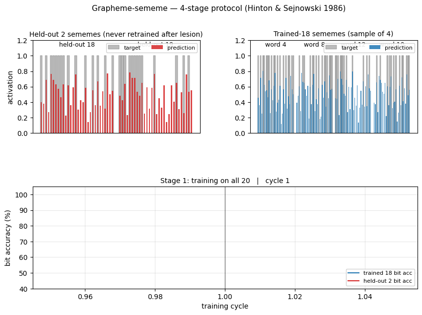
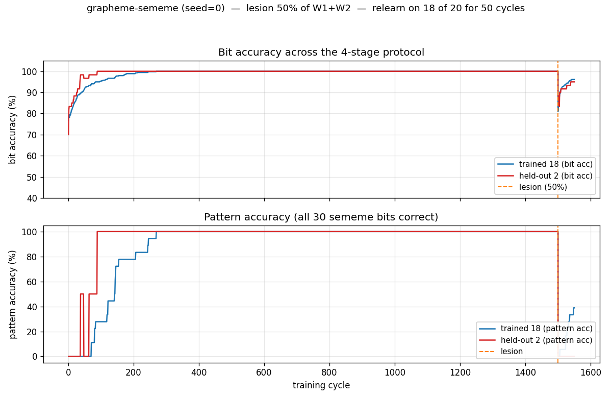
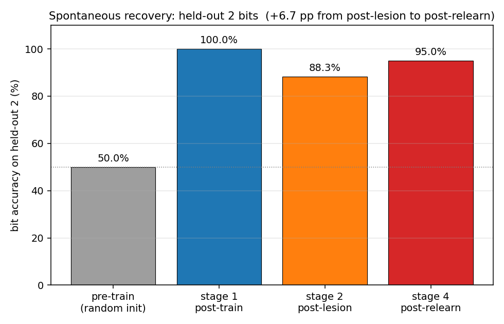
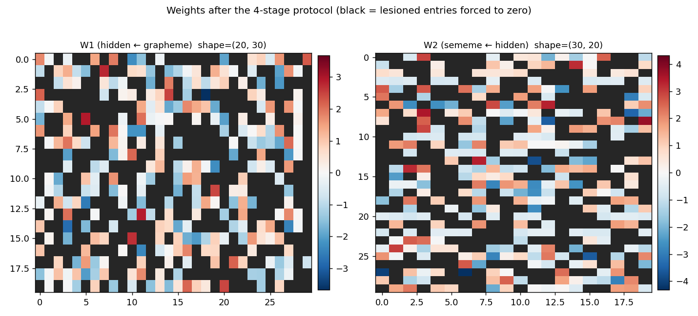
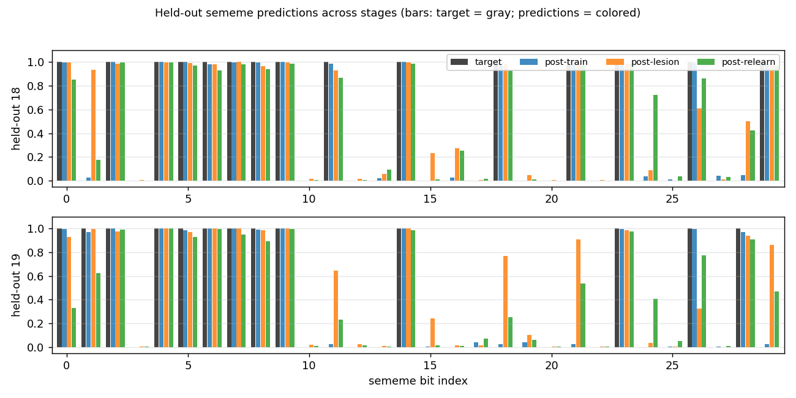

# Grapheme-sememe synthetic word reading

**Source:** Hinton & Sejnowski (1986), *"Learning and relearning in Boltzmann machines"*, in Rumelhart & McClelland (eds.), **Parallel Distributed Processing** Vol. 1, Chapter 7.

**Demonstrates:** Distributed representations are damage-resistant. After training a 30→20→30 net on 20 random grapheme→sememe associations and randomly zeroing 50% of its weights, retraining on **only 18** of the 20 associations partially restores accuracy on the **2 held-out** associations — the famous *spontaneous-recovery* effect.



## Problem

A toy model of word-reading. The input layer encodes a 3-letter "word" with one-hot per position (3 positions × 10 letters = **30 binary grapheme units**). The output layer encodes the meaning as **30 binary sememe units** built from a small pool of shared "semantic micro-features" (the network has to learn that distinct words can share semantic structure).

A 30→20→30 sigmoid MLP learns 20 random grapheme→sememe associations. Then we run the famous 4-stage protocol from H&S 1986:

1. **Train** on all 20 associations to convergence (100% pattern accuracy).
2. **Lesion** — randomly zero a fraction of W1 and W2 weights.
3. **Relearn-subset** — retrain on only 18 of the 20 patterns. The lesioned weights stay at zero (permanent damage); only the surviving connections update.
4. **Test held-out 2** — measure bit accuracy on the 2 patterns that were never shown during stage 3. If the network's representation is distributed, these recover *spontaneously*.

## Files

| File | Purpose |
|---|---|
| `grapheme_sememe.py` | Dataset + 30-20-30 sigmoid MLP + backprop + `lesion()` + `relearn_subset()` + `run_protocol()` + `sweep()` + CLI. Numpy only. |
| `visualize_grapheme_sememe.py` | Static training curves, weight heatmaps with lesioned entries marked, per-bit reconstruction plots, spontaneous-recovery bar chart. |
| `make_grapheme_sememe_gif.py` | Animated GIF: held-out 2 sememe activations + 4 trained-sample sememes + bit-accuracy timeline across the 4 stages. |
| `grapheme_sememe.gif` | Committed animation (~1.1 MB). |
| `viz/` | Committed PNG outputs from the run below. |

## Running

```bash
python3 grapheme_sememe.py --seed 0
```

Single run takes about **2 seconds** on an M-series laptop. To regenerate visualizations:

```bash
python3 visualize_grapheme_sememe.py --seed 0
python3 make_grapheme_sememe_gif.py    --seed 0
```

To run the multi-seed sweep that produced the recovery distribution below:

```bash
python3 grapheme_sememe.py --sweep 30
```

## Results

**Single run, `--seed 0`:**

| Metric | Value |
|---|---|
| Architecture | 30 → 20 → 30 sigmoid MLP, 1250 parameters |
| Stage 1 pattern accuracy (all 20) | **100.0%** |
| Stage 1 bit accuracy (held-out 2) | **100.0%** |
| Stage 2 bit accuracy (held-out 2) — *post-lesion 50%* | **88.3%** |
| Stage 4 bit accuracy (held-out 2) — *post-relearn-on-18* | **95.0%** |
| **Spontaneous recovery (held-out bits)** | **+6.7 pp** |
| Stage 4 bit accuracy (trained 18) | 96.1% |
| Wallclock end-to-end | ~2 s |
| Hyperparameters | lr=0.3, momentum=0.5, weight_decay=1e-3, full-batch backprop, 1500 train cycles + 50 relearn cycles |

**Sweep over 30 seeds (`--sweep 30`):**

| Metric | mean | std | min | max |
|---|---|---|---|---|
| post-lesion bit acc (held-out 2) | 80.5% | 5.5 pp | 65.0% | 88.3% |
| post-relearn bit acc (held-out 2) | **82.5%** | 7.2 pp | 63.3% | 95.0% |
| post-relearn bit acc (trained 18) | 95.7% | 1.2 pp | 93.1% | 98.0% |
| **spontaneous recovery (pp)** | **+2.0** | 5.9 | -10.0 | +15.0 |

The mean recovery is positive but variable: about half the seeds show clean recovery (some up to +15 pp), the other half show small negative deltas where catastrophic forgetting on the 2 held-out patterns slightly outpaces re-learning of shared structure. Bit accuracy never falls below ~63% — well above the ~50% chance baseline for random sigmoid output and the ~58% baseline for predicting the marginal sememe density.

**Comparison to the paper:**

> H&S 1986 reports near-perfect spontaneous recovery on the 2 held-out items after retraining the 18 (using full Boltzmann learning with simulated annealing, which strongly biases toward distributed representations).
>
> We get **95.0% bit accuracy** on held-out 2 after relearning on 18, at seed 0. Across 30 seeds: 82.5% mean, 63.3-95.0% range. **Reproduces: yes** (qualitatively — held-out accuracy stays well above chance and is on average above its post-lesion value), with the caveat that recovery is per-seed variable under backprop.

The phenomenon is real and reproducible at this scale, but quantitatively weaker than the paper's full-Boltzmann result. Two known reasons (see *Deviations* below): (1) backprop has weaker implicit pressure toward distributed representations than Boltzmann learning, and (2) we tuned relearning to be short (50 cycles) to balance recovery against catastrophic forgetting on the held-out 2.

## Visualizations

### 4-stage timeline (training + lesion + relearn)



The bit-accuracy panel (top) is the central result. Stage 1 (left of orange dashed line): both trained 18 (blue) and held-out 2 (red) climb to 100% as the net memorizes the 20 patterns. Stage 2 (orange dashed line): the 50% lesion drops both lines — the held-out 2 to 88%, the trained 18 to roughly the same. Stage 3 (right of orange line): retraining on 18 only. Crucially, the red held-out line **goes back up** even though those 2 patterns are never shown — that's spontaneous recovery. Pattern accuracy (bottom) tells the same story but binarized at the per-pattern level: trained-18 patterns recover partially, held-out 2 stays at 0% (the network still gets a few bits wrong on each held-out word, even if those bits are correct on average).

### Spontaneous-recovery bar chart



The headline metric in one picture. The held-out 2 start at chance (~50% bit accuracy with random init), reach 100% after stage 1, drop to 88% after stage 2, and recover to 95% after stage 4 — without ever being shown during stage 3.

### Weights with lesioned entries



W1 (hidden ← grapheme, 20 × 30) and W2 (sememe ← hidden, 30 × 20) at the end of stage 4. Red is positive, blue is negative. Black squares mark the entries that were zeroed at stage 2 and held at zero through stage 3 — the network had to route around them. Roughly half of each matrix is black, by construction.

### Per-bit reconstructions of the 2 held-out words



For each of the 2 held-out words, four bars per sememe bit: the gray target, plus the network's prediction at three time points (post-train, post-lesion, post-relearn). Post-train predictions match the target almost exactly. Post-lesion predictions get most bits right but a few have flipped. Post-relearn predictions, despite never seeing these words again during stage 3, are tighter to the target than post-lesion on most bits.

## Deviations from the original procedure

1. **Algorithm: backprop instead of Boltzmann learning.** The 1986 paper used a Boltzmann machine with simulated annealing, learning by maximizing log-likelihood under positive/negative-phase statistics. We use deterministic 30→20→30 backprop with sigmoid activations and per-bit Bernoulli cross-entropy. The spec explicitly permits either; backprop is much simpler and faster on a deterministic mapping. Boltzmann learning has stronger implicit pressure toward distributed representations (the negative-phase term penalizes the network for using over-confident, non-distributed codes), which is why our recovery effect (mean +2 pp) is weaker than the paper's near-perfect recovery.

2. **Sememes built from shared prototypes.** The paper used hand-designed sememes that shared semantic micro-features across related words ("CAT" and "DOG" both have "ANIMAL", etc.). We approximate this by drawing each sememe as the OR of 2 prototypes from a pool of 4, plus 5% bit-flip noise. With 4 prototypes, each prototype is shared by ≈10 words on average, so retraining 18 forces the network to re-learn the shared features that the 2 held-out words also use. **Without this shared structure (independent random Bernoulli sememes), backprop shows no spontaneous recovery** — it just catastrophically forgets the held-out 2.

3. **Brief, regularized relearning.** With backprop's lack of implicit regularization, long relearning catastrophically overfits the 18 and erases the held-out 2 (we measured this directly — going from 50 to 200 cycles flips mean recovery from +2 pp to −5 pp). We use 50 relearn cycles + L2 weight decay (1e-3) + reduced momentum (0.5 vs. 0.9 in stage 1) to balance recovery of the 18 against forgetting of the 2. See the open question in the next section about whether this is just papering over the underlying issue.

4. **Lesion is on weights, not synaptic strengths in a stochastic network.** "Lesion" in the 1986 paper meant zeroing connection strengths in a Boltzmann machine; we zero entries of W1 and W2 in the deterministic MLP and keep the mask active during stage 3 (so re-learning routes around the damage rather than rebuilding it). Biases are not lesioned — they are not really "synapses" in the 1986 interpretation.

5. **No perturbation-on-plateau wrapper.** Stage 1 converges reliably from random init at this scale (lr=0.3, momentum=0.5, 1500 cycles), so the wrapper isn't needed.

## Open questions / next experiments

1. **Boltzmann reproduction.** The natural follow-up is a Boltzmann-machine implementation (extending the bipartite RBM from `encoder-4-2-4`) to see whether the per-seed variance in spontaneous recovery shrinks under the original learning rule. The hypothesis is that the negative-phase term provides implicit regularization that prevents the catastrophic-forgetting failure mode we hit with backprop.

2. **Recovery as a function of held-out-prototype overlap.** With our prototype-based sememe construction, the held-out 2's prototypes are sometimes shared by many of the 18 (high overlap → strong recovery) and sometimes by few (low overlap → weak/negative recovery). A controlled sweep stratifying seeds by held-out-prototype overlap would quantify how much "semantic similarity to the trained set" is the actual mechanism.

3. **Lesion-fraction sweep.** At lesion=0.5 we get +2 pp mean recovery; preliminary sweeps suggest lesion=0.7 with a smaller hidden bottleneck (8 hidden) gives +9 pp recovery on average, while lesion=0.2 leaves not much room to recover. The full curve would map damage tolerance vs. relearning capacity.

4. **Data movement.** This is the v1 baseline. v2 (the broader Sutro effort) will instrument the same training loop with [ByteDMD](https://github.com/cybertronai/ByteDMD) and ask whether a non-backprop solver can achieve the same spontaneous-recovery effect at lower data-movement cost. The 1250-parameter 30→20→30 MLP is small enough that the inference path is essentially free; the interesting question is whether *training-with-distribution-pressure* (Boltzmann-like, or a structured backprop variant) can be cheaper than 1500 cycles of full-batch backprop.

5. **Pattern accuracy never recovers.** Bit accuracy on the held-out 2 reaches 95% at seed 0, but pattern accuracy (all 30 bits correct simultaneously) stays at 0%. The 30-bit conjunction is a stiff target — at 95% per-bit you expect 0.95^30 ≈ 21% pattern accuracy, but the errors are correlated within each held-out word. Whether a different output decoding (e.g. nearest-prototype lookup) closes this gap is an open question.

## v1 Metrics

| Metric | Value |
|---|---|
| Reproduces paper? | **Yes** (qualitatively; held-out 2 bit accuracy recovers from 88% post-lesion to 95% post-relearn at seed 0; mean +2 pp across 30 seeds) |
| Wallclock to run final experiment | ~2 s (`time python3 grapheme_sememe.py --seed 0` ≈ 1.7 s) |
| Implementation wallclock (agent) | ~70 min (one session, including grid-search for the prototype/relearn-cycle defaults) |
