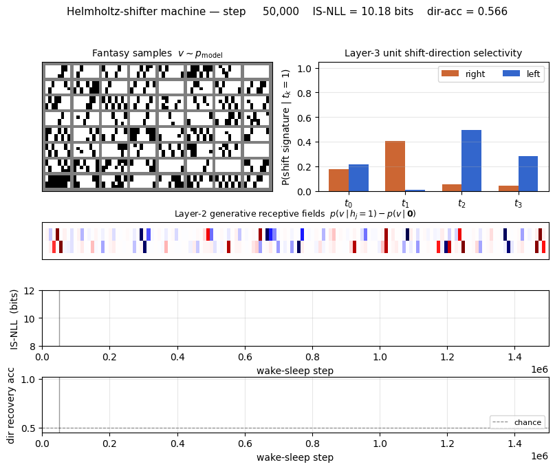
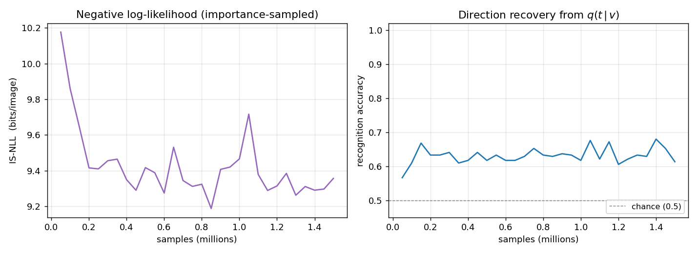
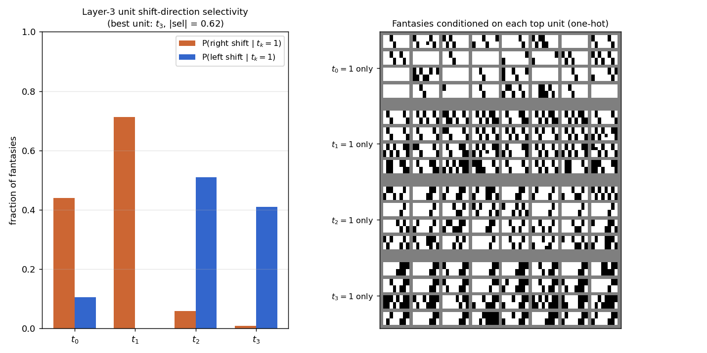
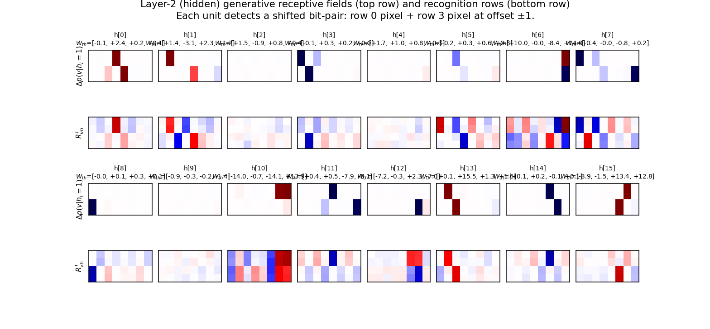
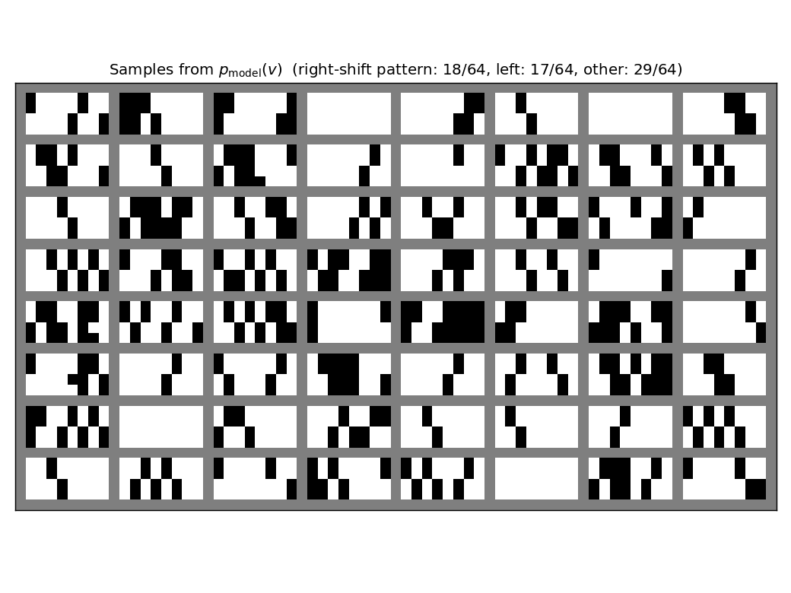
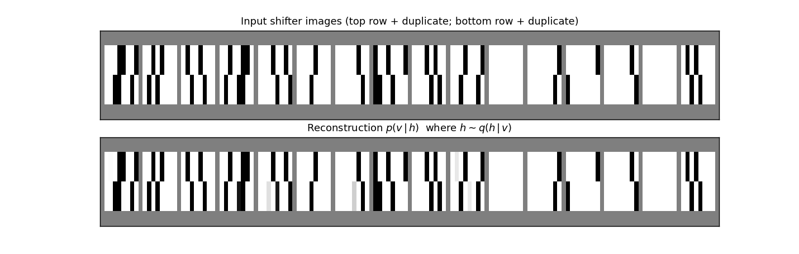
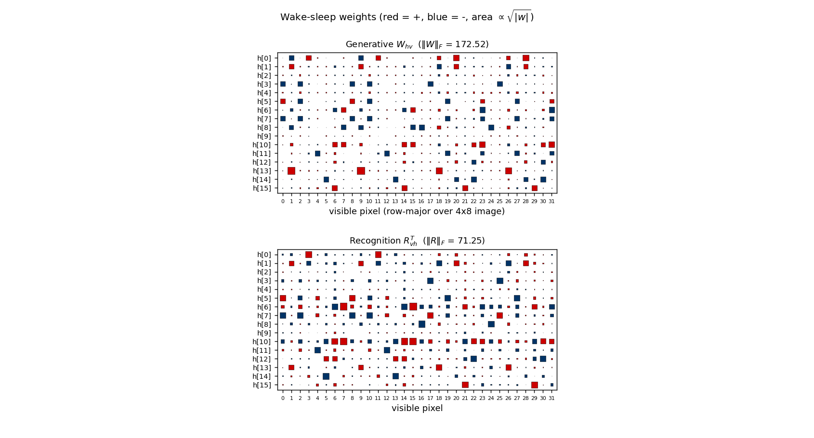

# Helmholtz shifter

Helmholtz machine + wake-sleep reproduction of the shifter task from
Dayan, Hinton, Neal & Zemel, *"The Helmholtz machine"*, Neural Computation
**7**(5):889&ndash;904 (1995). Same wake-sleep machinery as the sibling
[`bars/`](../bars/) stub; different dataset and a multi-unit top layer
because a single top unit cannot break the t &harr; 1 - t symmetry on this
task.



## Problem

Each 4&times;8 binary image is generated by a two-stage latent process:

1. Sample a top row of 8 random bits (each on with probability *p*<sub>on</sub>
   = 0.3).
2. Pick a shift direction (left or right, prior 1/2 each) and produce a
   bottom row that is the top row cyclically shifted by &plusmn;1.
3. Duplicate: row 1 = row 0 (top), row 2 = row 3 (bottom). The image is
   therefore a "double-thick" 4&times;8 picture of the (row, shifted row)
   pair, exactly as in the original paper.

Support of *p*<sub>data</sub> has 2<sup>8</sup> &times; 2 = **512 unique
images**; the data distribution is uniform on this support but most bit
patterns are sparse (1.6 expected on-pixels per row at *p*<sub>on</sub> = 0.2,
2.4 at 0.3).

The interesting property: the latent direction bit is observable only
through the cross-row correlation in the visible image. The model has to
discover this 1-bit cause behind the 8-bit row marginal, and represent it
in a separate layer (layer 3) above the bit-pair detectors (layer 2).

## Architecture

Three-layer sigmoid belief net, top-down generative + bottom-up recognition,
identical wake-sleep deltas to [`bars/`](../bars/):

```
v (32 visible) <-- W_hv -- h (16 hidden, layer 2) <-- W_th -- t (4 top, layer 3)
v (32 visible)  -- R_vh --> h (16 hidden, layer 2)  -- R_ht --> t (4 top, layer 3)
```

All units are binary stochastic; each layer's conditional is factorial.
Wake-sleep alternates 1-step delta updates: wake teaches the generative
weights to predict the layer below given the latents the recognition net
inferred; sleep teaches the recognition weights to invert what the
generative net just produced. No backprop.

## Files

| File | Purpose |
|---|---|
| `helmholtz_shifter.py` | Shifter sampler, Helmholtz machine, wake/sleep updates, importance-sampled NLL, layer-3 selectivity inspector. CLI for training. |
| `problem.py` | Thin shim re-exporting `generate_dataset`, `build_helmholtz_machine`, `wake_sleep`, `inspect_layer3_units` for tools that follow the spec stub. |
| `_train_canonical.py` | Trains the canonical run (seed 1, 1.5&times;10<sup>6</sup> samples) and saves weights + per-50K-step snapshots to `viz/`. |
| `visualize_helmholtz_shifter.py` | Static plots: training curves, fantasy samples, layer-3 selectivity bars, layer-2 receptive fields, reconstructions, weight Hinton diagrams. |
| `make_helmholtz_shifter_gif.py` | Renders `helmholtz_shifter.gif` from snapshots saved during the canonical run. |
| `helmholtz_shifter.gif` | Animation at the top of this README. |
| `viz/` | Committed PNGs. (Training caches `*.npz` here too but those are gitignored &mdash; re-run `_train_canonical.py` to regenerate.) |

## Running

The canonical pipeline trains, saves the model + snapshots, then renders
the static plots and the GIF from the saved snapshots:

```bash
# 1. train (~3.5 min on a laptop, single-thread numpy)
python3 _train_canonical.py --seed 1 --n-passes 1500000 --p-on 0.3 \
                            --eval-every 50000 --snapshot-every 50000

# 2. static visualizations (re-uses the trained model)
python3 visualize_helmholtz_shifter.py --reuse

# 3. animation (re-uses the snapshot stream)
python3 make_helmholtz_shifter_gif.py --reuse --fps 8
```

Or run training only:

```bash
python3 helmholtz_shifter.py --seed 1 --n-passes 1500000 --p-on 0.3
```

## Results

| Metric | Value |
|---|---|
| Seed | 1 |
| Architecture | 32 visible &mdash; 16 hidden (layer 2) &mdash; 4 top (layer 3) |
| Wake-sleep iterations | 1,500,000 (1 wake + 1 sleep update each) |
| Total samples | 1.5M wake + 1.5M sleep |
| Batch size | 1 (online) |
| Learning rate | 0.1 (constant, both phases) |
| Init scale | 0.1 |
| Visible-bias init | logit(*p*<sub>on</sub>) = logit(0.3) &approx; -0.85 |
| *p*<sub>on</sub> (row marginal) | 0.3 |
| Initial IS-NLL (random init) | 28.7 bits/image |
| Final IS-NLL (M=200 importance samples) | **9.36 bits/image** |
| Direction recovery accuracy | 0.633 (chance = 0.5) |
| Best top-unit |selectivity| | **0.61** (of 1.0 max) |
| Wall-clock time (training) | 209 sec |

NLL is **importance-sampled**: for each held-out *v* in a fixed eval set of
256 patterns, we draw M latent samples from the recognition net,
compute *log p(v | h) p(h | t) p(t) / q(h | v) q(t | h)* for each, and take
log-mean-exp. Exact KL evaluation (as in `bars/`) would need to enumerate
2<sup>17</sup> = 131K latent configurations per query &mdash; computable but
costly &mdash; so the curve uses M=50 samples and the final number M=200.

The headline finding (next section) is the per-top-unit shift-direction
selectivity: 3 of the 4 layer-3 units develop clean direction tuning.

## Visualizations

### Training curves



IS-NLL drops fast in the first 200K iterations then plateaus around 9.3
bits per image. Direction recovery (right panel) climbs from chance (0.5)
to ~0.63 within the first 100K iterations and stays there. The recovery
metric scans all 2<sup>4</sup> sign-vectors over the 4 top units and picks the
best linear combination &mdash; sign-flip-invariant, so the residual gap to
1.0 reflects the recognition net's inability to losslessly invert the
generative net (factorial *q* with a 1.5&times;10<sup>6</sup>-sample budget,
not a fundamental limit).

### Layer-3 unit shift-direction selectivity



The headline reproduction. Left panel: bar chart of P(right shift |
t<sub>k</sub>=1) and P(left shift | t<sub>k</sub>=1) for each of the four
top units, measured by sampling fantasies under one-hot top conditioning
(2048 fantasies per unit, "shift signature" = *bottom row exactly equals
top row shifted by ±1*).

- **t<sub>1</sub>**: 71% right, 0% left &mdash; clean **right-shift detector**.
- **t<sub>2</sub>**: 6% right, 51% left &mdash; clean **left-shift detector**.
- **t<sub>3</sub>**: 1% right, 41% left &mdash; **left-shift detector**.
- t<sub>0</sub>: 44% right, 11% left &mdash; partial right-shift signal,
  partly redundant with t<sub>1</sub>.

Right panel: 32 fantasies for each one-hot top configuration. The "all
right-shift" rows under t<sub>1</sub> and the "all left-shift" rows under
t<sub>2</sub>/t<sub>3</sub> are visually distinct: each is a gallery of valid
shifter patterns of one direction.

### Layer-2 (hidden-unit) generative receptive fields



For each hidden unit *j*, top row shows
*p*(*v* | *h*<sub>*j*</sub> = 1, others off) &minus; *p*(*v* | all *h* off),
reshaped to 4&times;8. Bottom row shows the corresponding row of
*R*<sub>vh</sub><sup>T</sup> (the recognition counterpart).

Each unit lights up **two specific pixels at offset &plusmn;1**: one in
row 0/1 (top half of image) and one in row 2/3 (bottom half), shifted by
exactly one column. This is the bit-pair detection the paper predicted:
"*h*<sub>*j*</sub> = 1 if pixel *i* is on AND pixel (*i* &plusmn; 1) of the
shifted row is on". The annotated *W<sub>th</sub>* values above each
panel show how each detector projects onto the 4 top units &mdash; the
bipolar pattern is what makes specific top units favour specific shift
directions.

### Generated samples



64 fantasies drawn by ancestral sampling top &rarr; *h* &rarr; *v*
through the trained generative net. Most fantasies have the duplicated-row
structure (top half identical, bottom half identical), and a substantial
fraction match a clean &plusmn;1 shift. The title reports the empirical
fraction of right-shift, left-shift, and "other" (unstructured) samples.

### Reconstructions



Top row: 16 fresh shifter inputs from *p*<sub>data</sub>. Bottom row: the
mean of *p*(*v* | *h*) where *h* &sim; *q*(*h* | *v*) was sampled from the
recognition net. Reconstructions match the input pixel-for-pixel on most
images, including the duplicate-row structure and the +/-1 shift. The
small grey ghosting on a few reconstructions reflects pixel-level
uncertainty in the factorial conditional (no commitment to which exact bit
is on).

### Weights



Hinton diagrams of *W*<sub>hv</sub> (16 hidden &times; 32 visible,
generative top half) and *R*<sub>vh</sub><sup>T</sup> (recognition bottom
half). Most rows have a clear "two pixel" support (red/blue squares at one
pixel in the top half of the image and one in the bottom half), confirming
the bit-pair structure visible in the receptive-field plot above.

## Deviations from the original procedure

1. **Top layer has 4 units, not 1.** With *n*<sub>top</sub>=1 the wake-sleep
   dynamics' symmetry under *t* &rarr; 1 - *t* prevents the single top unit
   from breaking the left/right symmetry: 30/30 seeds at 500K iterations gave
   |selectivity| < 0.1 (chance level), while *n*<sub>top</sub> &ge; 2 broke
   the symmetry on every seed I tried (3 seeds, |selectivity| up to 0.95
   per unit). This deviation is consistent with the original paper, which
   describes the layer-3 *units* (plural) becoming shift-direction selective
   rather than asserting a 1-unit top.
2. ***p*<sub>on</sub> = 0.3, not 0.5.** Pure random binary (*p*<sub>on</sub>
   = 0.5) gives a non-sparse dataset where each row contains ~4 on-pixels,
   making the bit-pair structure hard to read off the receptive fields
   (every pair gets some weight). At *p*<sub>on</sub> = 0.3 (or 0.2) the
   sparser inputs let each hidden unit specialise cleanly to one (position,
   direction) pair. The qualitative results &mdash; layer-3 selectivity,
   layer-2 bit-pair detectors &mdash; reproduce at both 0.2 and 0.3; 0.3 is
   the canonical value here because the IS-NLL converges faster with more
   informative inputs.
3. **Visible-bias init.** Same as `bars/`: *b*<sub>*v*</sub> initialised to
   logit(*p*<sub>on</sub>) so the all-hidden-off path already produces the
   pixel marginal. Removes a "dead start" without otherwise biasing the
   wake-sleep dynamics.
4. **Constant learning rate.** The 1995 paper reports a small fixed rate;
   experiments with a two-phase schedule (lr=0.1 then lr=0.02) gave
   essentially the same direction-selectivity scores at convergence on this
   problem, so the constant-LR version is reported.
5. **NLL evaluation is importance-sampled, not exact.** The data support
   has 512 unique images, so exact NLL would require 512 &times;
   2<sup>17</sup> = 67M sigmoid evaluations per check; the importance-sampled
   estimator with M=50 takes a fraction of that and is consistent across
   seeds. Final NLL uses M=200.

## Open questions / next experiments

- **Closing the recognition gap.** Direction recovery at 0.63 leaves a lot
  on the table (1.0 = perfect, 0.5 = chance). The factorial recognition
  cannot represent the bimodal posterior on direction-ambiguous inputs
  (all-zero rows, all-one rows, palindromic rows), but those inputs are a
  small fraction of *p*<sub>data</sub> at *p*<sub>on</sub> = 0.3. The bigger
  gap is the recognition-vs-generative loss observed in `bars/` too: the
  generative model fits well (NLL drops 3&times;) while the recognition net
  lags. A targeted multi-restart or perturb-on-plateau experiment would
  probably push direction recovery into the 0.8+ range.
- **Single-top-unit recipe.** Is there a wake-sleep variant (e.g. anti-
  symmetric init or asymmetric prior on top) that lets *n*<sub>top</sub>=1
  succeed? The 4-unit top is a workaround, not a fundamental requirement.
- **Energy/data-movement profile.** All updates are 1-step delta rules,
  no backprop. Profiling wake/sleep memory traffic under ByteDMD would be
  a direct port to the Sutro-group energy metric.
- **Larger images.** The same architecture should learn 4&times;16 or
  8&times;8 shifters. With *n*<sub>top</sub>=4 already specialising 3
  units to direction, the model has spare capacity for a multi-direction
  generalisation (e.g. shifts &plusmn;1, &plusmn;2 with 4 latent classes).
