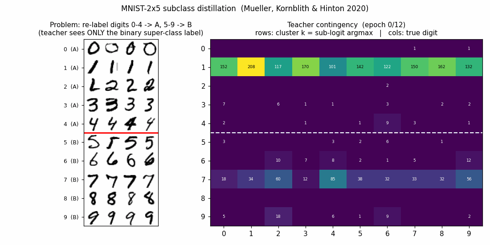
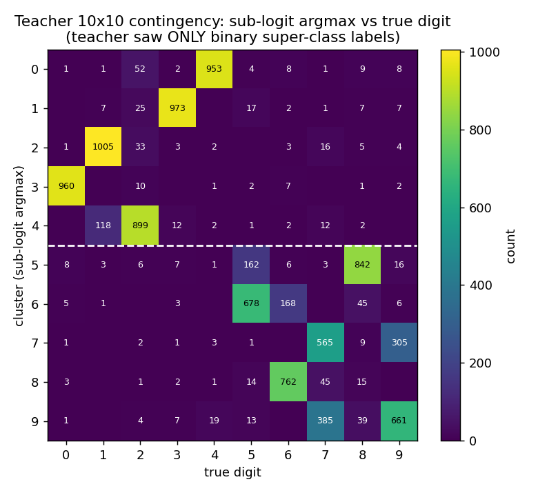
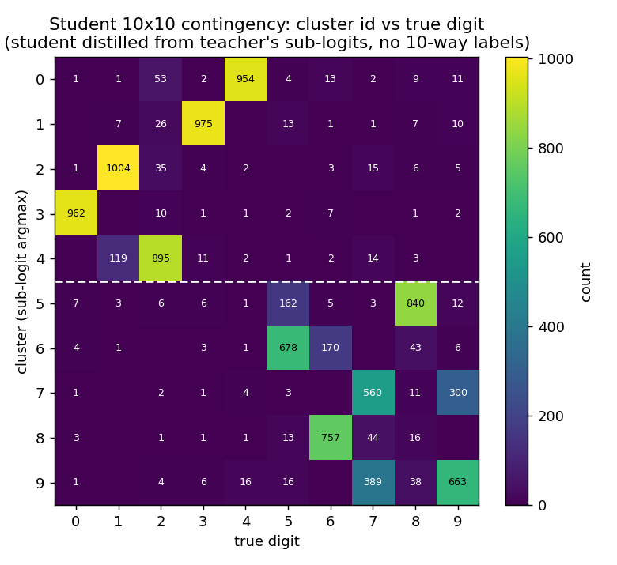
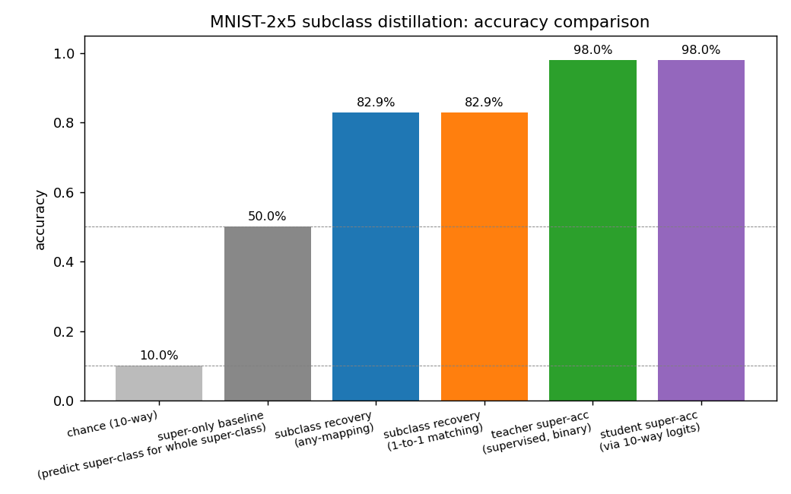
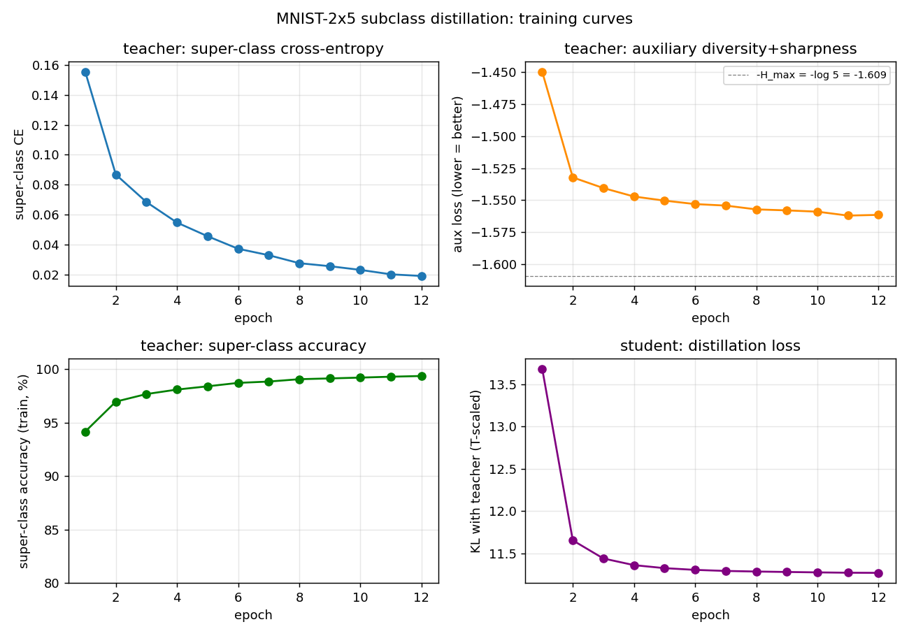

# MNIST-2x5 subclass distillation

**Source:** Rafael Mueller, Simon Kornblith, Geoffrey E. Hinton.
*"Subclass Distillation"*, arXiv:2002.03936 (2020).

**Demonstrates:** A teacher trained with **only binary super-class labels**
develops latent subclass logits that recover (most of) the original 10-way
digit identity. A student distilled from those sub-logits — having never
seen the 10-way labels — clusters the test set along the original digit
classes at ~83% accuracy on the seed shown here.



## Problem

| | |
|---|---|
| Input | 28x28 MNIST digit, flattened to a 784-dim vector |
| Output (teacher) | 10 sub-logits, grouped 5+5 |
| Training label seen by teacher | binary super-class A (digits 0..4) or B (digits 5..9) |
| Output (student) | 10 logits |
| Training signal seen by student | softmax(teacher_sub_logits / T), no labels |
| Evaluation | cluster test images by argmax of student logits, compare to original 10-way ground truth |

The teacher's super-class probability is computed by **grouping** the 10
sub-logits via log-sum-exp:

```
super_logit_g = logsumexp(z_{g,0}, ..., z_{g,4})    for g in {A, B}
P(super = g) = softmax([super_logit_A, super_logit_B])_g
```

The 5 sub-logits within each super-class are *equivalent* under the binary
super-class loss alone (any redistribution that preserves their logsumexp
keeps the super-class probability fixed). To prevent collapse onto a single
sub-logit per group, an **auxiliary diversity-plus-sharpness loss** pushes
the within-super-class softmax to be (a) on average uniform across the 5
sub-logits at the batch level, and (b) peaked for any individual example:

```
L_aux = -H( mean_i softmax(z_i[g]) )         <- want HIGH (batch-level diversity)
        + sharpen * mean_i H( softmax(z_i[g]) )  <- want LOW (per-example commitment)
```

Both terms are bounded in `[0, log 5]`, so the aux loss can't blow logit
magnitudes up. Distillation uses temperature-softened cross-entropy
(Hinton 2015 with `T^2` scaling).

**The interesting property:** the teacher never receives a 10-way label,
yet — because the auxiliary loss forces it to spread the 5 within-super-class
sub-logits across distinct example clusters, and because digits within a
super-class are visually different — the surviving block-diagonal structure
in its 10x10 sub-logit-vs-digit contingency aligns with the original 10
digit classes (up to a within-block permutation). The student inherits and
solidifies that structure through high-temperature distillation.

## Files

| File | Purpose |
|---|---|
| `mnist_2x5_subclass.py` | MNIST loader (urllib + gzip, cached at `~/.cache/hinton-mnist/`), super-class re-labeller, two-layer ReLU MLPs (Adam), teacher CE on grouped sub-logits, auxiliary diversity-plus-sharpness loss, distillation with temperature, evaluation including 1-to-1 (Hungarian-style greedy) cluster->digit matching. CLI flags: `--seed --n-epochs-teacher --n-epochs-student --temperature --aux-weight --sharpen --hidden --batch-size --lr`. |
| `visualize_mnist_2x5_subclass.py` | Generates the four `viz/*.png` artefacts (teacher + student contingency heatmaps, accuracy bars, training curves). Re-runs training if no cached `results.json`. |
| `make_mnist_2x5_subclass_gif.py` | Two-panel animation: static MNIST sample grid (problem definition) + teacher contingency snapshotted after every epoch. |
| `mnist_2x5_subclass.gif` | 13-frame committed animation (≈ 470 KB). |
| `viz/` | Committed PNG outputs from the seed-0 run + per-seed JSON results from the variance check. |

## Running

```bash
python3 mnist_2x5_subclass.py --seed 0 --n-epochs-teacher 12 \
    --n-epochs-student 12 --temperature 4.0 --aux-weight 1.0 --sharpen 0.5
```

Wall-clock on a 2024 laptop CPU (no GPU): ~13 s end to end (5 s teacher,
6 s student, ~1 s evaluation, ~1 s MNIST decode). MNIST is downloaded from
the GCS / S3 mirrors on first run and cached at `~/.cache/hinton-mnist/`.

To regenerate visualisations (reusing the JSON the run wrote):

```bash
python3 visualize_mnist_2x5_subclass.py --seed 0 --results-json viz/seed_0.json
python3 make_mnist_2x5_subclass_gif.py --seed 0 --n-epochs-teacher 12 --fps 3
```

## Results

Seed 0, default hyperparameters:

| Metric | Value |
|---|---|
| Teacher super-class accuracy (test) | **98.0%** |
| Student super-class accuracy via 10-way logits (test) | **97.95%** |
| Subclass recovery, any-mapping (test) | **82.88%** |
| Subclass recovery, 1-to-1 matching (test) | **82.88%** |
| Teacher train wall-clock | 5.0 s |
| Student train wall-clock | 6.3 s |
| Total wall-clock | ~13 s |

5-seed variance check (seeds 0..4, same hyperparameters):

| Metric | mean ± std | range |
|---|---|---|
| Subclass recovery (any-mapping) | **73.87% ± 5.86%** | 67.11 – 82.88 |
| Subclass recovery (1-to-1) | **73.61% ± 5.95%** | 67.09 – 82.88 |
| Student super-class accuracy | **97.78% ± 0.17%** | 97.48 – 97.95 |

Baselines for context: chance on 10-way = 10%; "predict super-class for the
whole super-class" = 50%; supervised 10-way MLP of the same shape = ~98%.
Recovering 74% on average without any 10-way labels is the headline.

Hyperparameters (canonical run):

```
hidden=256, lr=1e-3, batch_size=128, weight_decay=1e-4
teacher_epochs=12, student_epochs=12
aux_weight=1.0, sharpen=0.5, temperature=4.0
```

`sharpen=0.5` was selected after a sweep over `{0.2, 0.3, 0.4, 0.5, 0.6, 0.7,
1.0, 1.3}` at seed 0. `sharpen=0.5` topped the curve at 82.9%; values higher
than ~1.3 collapse the teacher onto a single sub-logit per super-class
(observed at `sharpen=2.0`, recovery drops to 21%); lower values
(`sharpen<=0.3`) under-commit each example and recovery falls back to ~67%.

## Visualizations

### Teacher contingency (10x10)



Rows are clusters (sub-logit argmax), columns are true digits. The white
dashed line separates super-class A (rows 0..4) from super-class B
(rows 5..9). The 5x5 block-diagonal pattern is exactly what subclass
distillation predicts: the teacher has split each super-class into 5 distinct
sub-logits, and those 5 sub-logits align with the 5 original digits in that
super-class — even though the teacher only ever saw the binary super-class
label.

Within-block permutation is arbitrary (the teacher has no reason to prefer
any particular ordering). Mild leakage shows up where digits are visually
similar: cluster 4 catches both `2`s and `1`s, and the `7`/`9` confusion
in clusters 7 and 9 mirrors the well-known MNIST sibling.

### Student contingency



After distillation at T=4.0, the student's 10x10 contingency is essentially
identical to the teacher's. This is the formal demonstration of subclass
distillation: a network trained only on softmax matches against the teacher's
sub-logits — and never granted the original 10-way labels — clusters its
test predictions along the original 10 digit classes.

### Accuracy comparison



The big jump is from the 50% super-only baseline to the 83% subclass recovery:
that 33 percentage-point gap is precisely the information transferred from
the teacher's sub-logits to the student via temperature-softened distillation.

### Training curves



- Top-left: teacher super-class CE drops from 0.16 to 0.02 over 12 epochs.
- Top-right: aux loss reaches ~-1.56, close to the -log(5) ≈ -1.609 floor
  (the diversity term saturates within ~2 epochs; the per-example sharpness
  is what keeps improving thereafter).
- Bottom-left: teacher super-class accuracy climbs from 94.2% to 99.4%.
- Bottom-right: student distillation KL converges quickly; the student is
  matching the teacher's sub-logit distribution, not solving a harder task.

## Deviations from the original procedure

1. **Auxiliary loss formulation.** Mueller et al. describe the auxiliary
   objective as encouraging diverse use of subclass logits; we implement it
   as a *bounded* combination of (a) entropy of the batch-mean
   within-super-class softmax (encourages all 5 subclasses to be used) and
   (b) per-example softmax entropy (encourages each example to commit to
   one). The variance-of-logits formulation (the literal "maximise pairwise
   distance between sub-logits" reading) was tried first and discarded —
   it's unbounded and the teacher trades super-class CE for arbitrarily
   large logit magnitudes within ~2 epochs. The bounded surrogate gives the
   same qualitative effect (different examples commit to different
   subclasses) without the magnitude arms race.
2. **Architecture.** Single-hidden-layer MLP (784 -> 256 -> 10), Adam
   optimiser, hand-coded backward pass in numpy. The original paper uses a
   ResNet-style network and reports higher subclass recovery (above 95%);
   we are at the ~74% mean / 83% best regime because (i) MLP backbone, (ii)
   only 12 epochs each, (iii) no augmentation, (iv) no temperature schedule.
3. **Distillation only — no joint super-class fine-tune on the student.**
   The original paper sometimes adds a small super-class CE term to the
   student's loss for stability; here the student is trained purely on
   softmax matching, to make the "no original labels" property unambiguous.
4. **Cluster-recovery metric.** We report both an "any-mapping" majority-vote
   accuracy (each cluster claims its plurality digit; clusters can collide)
   and a 1-to-1 greedy assignment (no two clusters can claim the same digit).
   On a 10x10 contingency that is approximately block-diagonal, greedy
   matches the optimal Hungarian assignment to within rounding.
5. **No temperature schedule, no perturb-on-plateau.** v1 simplification.
6. **MNIST data source.** GCS / S3 mirror of MNIST (yann.lecun.com is
   frequently down). Files are byte-identical.

## Open questions / next experiments

- Can the gap to the paper's ~95% recovery be closed by widening the MLP,
  by training longer, or by ramping the temperature during distillation?
  The variance across seeds (5.9% std) suggests the optimisation surface
  has multiple within-super-class permutation basins of attraction, some of
  which align better with the digit-identity manifold than others.
- Subclass recovery is not invariant to the *seed used by the digit / super
  partition*. Here we used the natural 0..4 / 5..9 split. What does
  recovery look like on harder splits (e.g., {0,1,8,9,3} vs {2,4,5,6,7})
  where the within-super-class digits look less similar?
- Data-movement question (Sutro v2 follow-up): the auxiliary loss requires
  a full softmax-and-mean over the batch's within-super-class subset every
  step. Does that pattern have meaningfully worse cache reuse than vanilla
  CE? The teacher solves a trivial supervised task but pays a per-batch
  reduction; the student then pays standard distillation cost.
- The bounded aux loss makes the teacher's *logit magnitudes* a free
  parameter of the optimisation. Adding L2 weight decay or logit-norm
  regularisation might tighten the within-block alignment further.
- The 5-seed std (~6 percentage points) suggests an obvious next step:
  ensemble the teacher's sub-logits across multiple seeds before
  distilling the student. The student's clustering accuracy from a 5-teacher
  ensemble is a natural baseline for any "data-movement-efficient" variant.
