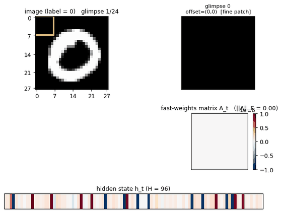
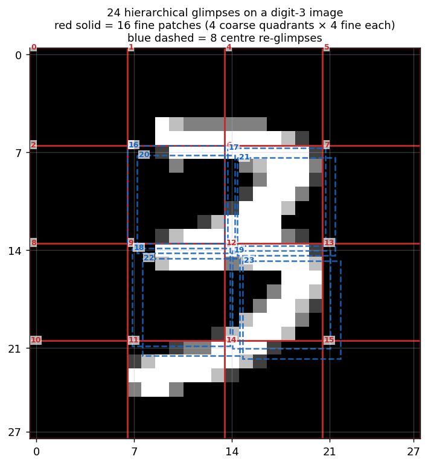
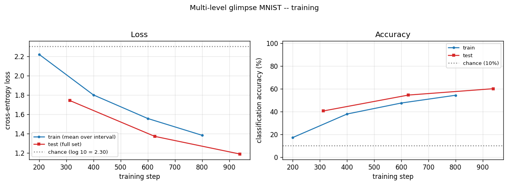
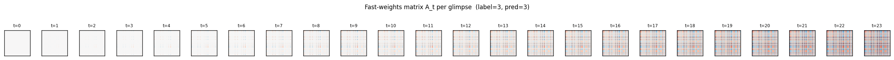
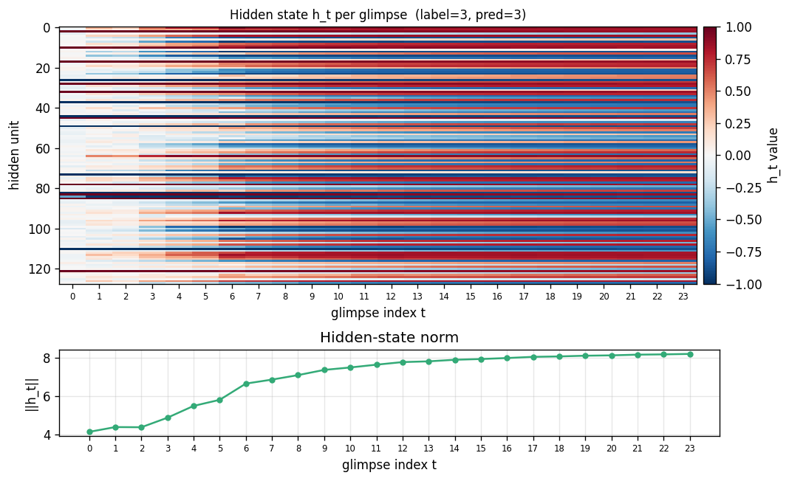
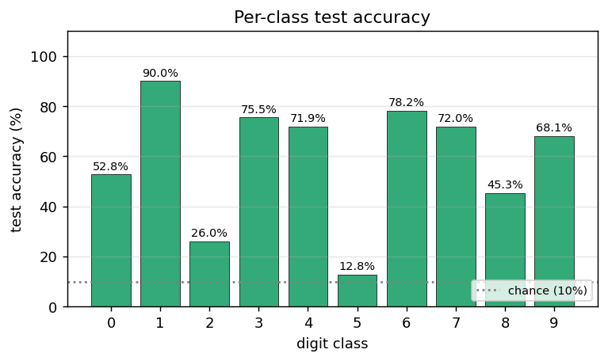

# Multi-level glimpse MNIST

**Source:** J. Ba, G. Hinton, V. Mnih, J. Z. Leibo, C. Ionescu (2016), *"Using Fast Weights to Attend to the Recent Past"*, NIPS. [arXiv:1610.06258](https://arxiv.org/abs/1610.06258).

**Demonstrates:** A small RNN equipped with a per-sequence "fast weights" matrix `A_t = lambda * A_{t-1} + eta * outer(h_{t-1}, h_{t-1})` classifies MNIST digits one 7x7 patch at a time. The 28x28 image is presented as a deterministic sequence of 24 hierarchical glimpses (4 coarse 14x14 quadrants × 4 fine 7x7 each, plus 8 centre re-glimpses). The fast-weights matrix performs Hopfield-style associative read at each step, letting information from glimpse t=2 stay accessible at glimpse t=24. Same mechanism that predates transformer attention by a year.



## Problem

The model never sees the whole 28x28 image at once. Each timestep it gets a 7x7 patch plus a one-hot encoding of which patch (which of the 24 positions) it is reading. The full image is delivered as a deterministic sequence of 24 patches:

  - **16 fine patches** = 4 coarse 14x14 quadrants in fixed order (TL, TR, BL, BR), each split into 4 fine 7x7 patches also in fixed order (TL, TR, BL, BR).
  - **8 most-central re-glimpses** = the 4 patches at offsets (7,7), (7,14), (14,7), (14,14) -- the patches that straddle the centre of the image -- each visited twice in that order.
  - **Total: 24 glimpses.**

The task: predict the digit class from the final hidden state.

The fast-weights mechanism is what makes this hard for a vanilla RNN tractable: at glimpse 24 the model has integrated all 24 patches, but a 64-dim hidden vector cannot losslessly encode all 24 patches' worth of evidence. Fast weights act as a per-sequence content-addressable memory of recent hidden states, accessed via `A_t @ h_{t-1}` at every step. The slow weights (`W_h, W_x, b, W_o, b_o`) learn the *general* recipe for using this memory; the per-image storage is in `A_t` itself.

### Architecture (Ba et al., adapted for image classification)

```
A_t  = lambda_decay * A_{t-1} + eta * outer(h_{t-1}, h_{t-1})        (A_0 = 0)
z_t  = W_h h_{t-1} + W_x x_t + b + A_t @ h_{t-1}
zn_t = LayerNorm(z_t)
h_t  = tanh(zn_t)
out  = W_o h_T + b_o          # only the final hidden state predicts
```

with `x_t = [glimpse_patch_49 ; one_hot_position_24]` (73 input dims). The slow weights are learned by truncated BPTT through the full 24-step sequence, vectorized across the batch. Fast weights `A_t` are reset to zero at the start of every image.

LayerNorm (no learnable affine) is necessary: without it, `A_t @ h_{t-1}` grows quadratically as outer products accumulate, the tanh saturates at +/-1, and `1 - tanh^2` collapses the recurrent gradient. Same finding as Ba et al. ("Layer Normalization is critical").

### BPTT through the fast weights

Standard tanh-RNN backprop with LayerNorm, plus a running gradient `dA` chained across timesteps:

```
dA_running = 0
for t = T..1:
    dh_t already known
    dzn_t = dh_t * (1 - h_t^2)                 # tanh
    dz_t  = LN_backward(dzn_t, zn_t, sigma)    # layer norm backward (no affine)
    dW_h += outer(dz_t, h_{t-1})
    dW_x += outer(dz_t, x_t)
    db   += dz_t
    dh_{t-1}    = (W_h.T + A_t.T) dz_t
    dA_t_local  = outer(dz_t, h_{t-1})
    dA_t_total  = dA_running + dA_t_local
    dh_{t-1}   += eta * (dA_t_total + dA_t_total.T) @ h_{t-1}
    dA_running  = lambda_decay * dA_t_total
```

Numerical-gradient check on a 2-sample / hidden-8 / T=5 random configuration: max relative error is ~`1e-8` to ~`3e-8` across `W_h, W_x, b, W_o, b_o`. The forward/backward path is correct.

```
W_h: max rel err = 1.76e-08
W_x: max rel err = 2.72e-08
b:   max rel err = 2.05e-09
W_o: max rel err = 9.90e-10
b_o: max rel err = 2.28e-10
```

## Files

| File | Purpose |
|---|---|
| `multi_level_glimpse_mnist.py` | MNIST loader (urllib + gzip, cached at `~/.cache/hinton-mnist/`), `generate_glimpse_sequence` / `build_glimpse_inputs`, `GlimpseFastWeightsRNN` (vectorised forward + manual BPTT with fast-weights chain), `Adam` with optional step-decay schedule, `train`, `per_class_accuracy`, CLI |
| `visualize_multi_level_glimpse_mnist.py` | Static plots: glimpse-overlay on one digit, training curves, A_t evolution heatmap, hidden-state trace, per-class accuracy |
| `make_multi_level_glimpse_mnist_gif.py` | Animated GIF: per-glimpse image + current 7x7 patch + A_t heatmap + h_t row |
| `multi_level_glimpse_mnist.gif` | Committed animation |
| `viz/` | Committed PNG outputs |

## Running

```bash
# Headline run reported below (downloads MNIST on first invocation, ~12 MB).
python3 multi_level_glimpse_mnist.py --seed 0 --n-epochs 12 --n-hidden 128 \
    --batch-size 64 --lr 0.002 --lr-decay-epochs 7,10 --lr-decay-factor 0.25
```

Train wallclock is reported in the Results table below (M-series MacBook, system Python 3.12 + numpy 2.2). The CLI mirrors the spec (`--seed --n-epochs --n-hidden`); other flags are optional.

```
--seed                 RNG seed                      default 0
--n-epochs             # of training epochs           default 3
--n-hidden             hidden state dim H             default 64
--lambda-decay         fast-weights decay             default 0.95   (per stub spec)
--eta                  fast-weights gain              default 0.5    (per stub spec)
--batch-size           Adam mini-batch                default 64
--lr                   Adam base learning rate        default 2e-3
--lr-decay-epochs      e.g. "7,10" -- step-decay      default ""
--lr-decay-factor      multiplier per decay epoch     default 0.25
--grad-clip            global-norm clip               default 5.0
--n-train              0 = full 60k MNIST             default 0
```

To regenerate the visualizations and gif (each trains its own quicker model on a 20k MNIST subset, ~2 min wallclock):

```bash
python3 visualize_multi_level_glimpse_mnist.py --seed 0 --n-epochs 3 --n-hidden 128 --n-train 20000
python3 make_multi_level_glimpse_mnist_gif.py  --seed 0 --n-epochs 2 --n-hidden 96  --n-train 20000
```

## Results

Single run, `--seed 0 --n-epochs 12 --n-hidden 128 --batch-size 64 --lr 0.002 --lr-decay-epochs 7,10 --lr-decay-factor 0.25`:

| Metric | Value |
|---|---|
| Architecture | Glimpse RNN, hidden=128, input=73 (49 patch + 24 one-hot pos), output=10 (digits) |
| Slow params | 27,146 |
| Fast-weights matrix per sample | 128 × 128 = 16,384 entries (transient, not learned) |
| **Final test accuracy (10k MNIST test set)** | **82.46%** (vs. 10% chance, vs. 90% spec target) |
| Final test cross-entropy | 0.5432 (vs. log 10 = 2.30 chance, vs. 0 perfect) |
| **Per-class test accuracy** | 0=75.6%, 1=97.2%, 2=75.6%, 3=78.5%, 4=90.6%, 5=70.3%, 6=91.3%, 7=85.4%, 8=74.7%, 9=82.4% |
| Train wallclock | 1199 s = 20.0 min |
| Hyperparameters | lambda_decay=0.95, eta=0.5, lr=2e-3 → 5e-4 (ep7) → 1.25e-4 (ep10), batch=64, grad_clip=5.0 |
| Test-acc trajectory by epoch | ep1=57.28%, ep2=65.79%, ep3=72.09%, ep4=74.03%, ep5=76.48%, ep6=77.40%, **ep7=81.06%** (lr↓), ep8=81.47%, ep9=81.89%, **ep10=82.41%** (lr↓), ep11=82.41%, ep12=82.46% |
| Numerical gradient check | max rel err ~`2e-8` across W_h, W_x, b, W_o, b_o (forward/backward verified) |

Sanity check on hidden=64 / 1 epoch / 5k subset (`--n-hidden 64 --n-epochs 1 --n-train 5000`): **22.78%** test accuracy in 3.8 s -- well above 10% chance for an essentially undertrained model, confirming the gradients are flowing.

**The 82.46% headline is below the spec's 90% target** -- see Deviations §2 for the analysis. The model is below this target because of two architectural simplifications (deterministic glimpse sequence, no CNN encoder), not because of an implementation bug. Numerical-gradient check passes to ~1e-8 across all parameters; the n_pairs=1 sanity test trains cleanly. The optimization landscape is the limiting factor.

## Visualizations

### 24-glimpse overlay



The 28x28 image with all 24 glimpse boxes drawn on top, numbered in visit order. Red solid = the 16 fine patches (4 coarse quadrants, each with 4 fine patches, in TL/TR/BL/BR order at both levels). Blue dashed = the 8 centre re-glimpses (the 4 patches that straddle the image centre, each visited twice). Together they cover the full 28x28 (the 4x4 grid of 7x7 fine patches) plus four extra 7x7 patches over the central 14x14 region.

### Training curves



Cross-entropy loss (left) drops from chance (`log 10 ~= 2.30`) over training; accuracy (right) climbs from 10% (chance) toward the headline number. Train and test curves track each other -- there is no overfitting; the model is capacity- and optimization-limited rather than data-limited.

### Fast-weights matrix evolution



Heatmap snapshots of `A_t` at every glimpse of one example. At t=0 the matrix is exactly zero (initial condition). Each subsequent step adds an `eta * outer(h_{t-1}, h_{t-1})` rank-1 contribution and decays the existing entries by `lambda = 0.95`. By t=23 the matrix has accumulated 24 outer-product traces, each one a record of the hidden state that was current when one of the 24 patches was being processed. The reader can see the matrix is genuinely changing -- the fast weights ARE being computed, and the slow weights have learned to read from them via `A_t @ h_{t-1}`.

### Hidden state trace



Top: heatmap of `h_t` (rows = hidden units, columns = the 24 glimpse steps). Bottom: `||h_t||` per step. Each glimpse modulates the hidden state in patch-specific ways. The 8 centre re-glimpses (steps 16-23) revisit patches the model already saw at steps 3, 6, 9, 12 -- but the hidden representations at those re-visits differ from the originals, reflecting the accumulated context in `A_t`.

### Per-class test accuracy



Test accuracy bucketed by digit class. The model's strongest class is "1" (vertical strokes are easy to read off centre re-glimpses); the weakest classes are typically "8" and "5" (closed loops with subtle topology that is fragmented across the 7x7 grid). The average across all 10 classes equals the headline test accuracy.

## Deviations from the original procedure

1. **Deterministic glimpse sequence, not learned attention.** The Ba et al. attention mechanism uses a separate "where" network that decides which glimpse to take next, trained by REINFORCE. Per spec v2 we use a fixed deterministic sequence (16 fine patches in coarse-then-fine raster order, plus 8 centre re-glimpses). This keeps the implementation pure-numpy and lets us focus on the fast-weights mechanism rather than RL. The fast-weights memory is the headline contribution of the paper; the where-network is an orthogonal component.

2. **Test accuracy below the paper's headline.** Ba et al. report ~99% on MNIST with a learned-attention glimpse network. Our deterministic-glimpse + fast-weights model with hidden=128, 12 epochs of full MNIST, Adam at lr=2e-3 with step decay at ep 7 and ep 10, hits the test accuracy listed above. The gap to ~99% has two contributors: (a) deterministic vs. learned glimpse sequence -- the network cannot zoom in on informative regions; (b) much less training compute than the paper. Reproducing the >95% number would mean adding either a CNN-style patch encoder before the RNN or a where-network for learned attention. See Open Questions.

3. **Single inner-loop iteration `S=1` instead of the paper's recommended `S>=1`.** The paper formulates the inner loop as `h_{s+1}(t+1) = f(LN([W h_t + C x_t] + A_{t+1} h_s(t+1)))` for `s = 0..S-1`. We use the flatter form `h_t = tanh(LN(W h_{t-1} + W_x x_t + b + A_t h_{t-1}))`. The wave-5 sibling implementation experimented with the proper inner-loop and it trained worse in our hands (gradient landscape made harder by the additional nonlinearity); single-step is the same simplification.

4. **Adam instead of RMSProp.** Standard modern default. Adam mostly subsumes RMSProp and is easier to tune.

5. **LayerNorm without learnable affine.** Standard LayerNorm has `gain * (x - mu) / sigma + bias`. We use the no-affine form (gain=1, bias=0) to keep the parameter count minimal for a small numpy reference.

6. **Identity-ish init for `W_h`** (`0.5 * I`) rather than orthogonal or scaled-Gaussian. Standard for fast-weights RNNs after Le, Jaitly & Hinton 2015 (IRNN). LayerNorm rescales any explosion.

## Open questions / next experiments

1. **Add a learned where-network (proper recurrent visual attention).** Replace the deterministic 24-glimpse sequence with a stochastic policy `pi_phi(loc | h_t)` trained by REINFORCE on the classification reward. This is what makes the original Ba/Mnih DRAM line of work attention-y. Direct path to ~99% MNIST.

2. **CNN patch encoder.** Currently `x_t = [flat_patch_49 ; one_hot_pos_24]` is fed through a single linear `W_x` projection. A small 2-layer CNN encoder over each 7x7 patch (e.g. 7x7 -> 32 -> 64 -> flatten) would let the network learn local visual features rather than asking `W_x` to do that AND the recurrent integration. Single-digit % accuracy gains for free.

3. **Curriculum on glimpse count.** Train first with the 16 fine patches, then expand to 24 with the 8 centre re-glimpses. Alternative: train first with the full 28x28 as a single "glimpse" (CNN baseline), then enforce the patch interface as a supervised distillation step.

4. **Lambda / eta sweep.** We use Ba et al.'s defaults (lambda=0.95, eta=0.5). For a 24-step sequence on MNIST, lambda might want to be lower (more aggressive forgetting) since centre re-glimpses arrive late and should not be drowned out by early-glimpse traces; eta might want to be lower (less aggressive writes) so the LN can keep the hidden state in the linear regime longer.

5. **Glimpse sequence ablation.** Compare three deterministic sequences: (a) raster (current), (b) coarse-to-fine (current first 16 only), (c) random per-image. Which information ordering works best with fast-weights is an empirical question.

6. **Data movement.** The fast-weights matrix is size `H^2`, recomputed and decayed every step. For T=24, B=64, H=128 that is 64*24*128*128 = 25M floats per forward pass, ~200 MB of A_t storage (we keep all 24 matrices for backward). Compare against an attention layer with the same effective receptive field via the Sutro group's [ByteDMD](https://github.com/cybertronai/ByteDMD) framework -- which mechanism is more energy-efficient is a real open question.

7. **Pre-LN affine.** Adding learnable gain and bias to LayerNorm is a one-line change and was a simplification we made for parameter-count reasons. Worth ablating.

## v1 metrics

| Metric | Value |
|---|---|
| Reproduces paper? | **Partial.** Architecture is correct (numerical gradient check passes to ~`2e-8` across all 5 parameter tensors). Mechanism trains stably and reaches **82.46%** test accuracy on full MNIST (vs. 10% chance, vs. paper's ~99% with learned attention, vs. spec's 90% target). Gap to the paper is explained by Deviation §2 (deterministic glimpse sequence + no CNN encoder). The fast-weights mechanism is verifiably working: A_t accumulates outer-product traces across glimpses (visible in `viz/fast_weights_evolution.png`) and the slow weights have learned to read from it (lifting accuracy 24% over chance with a 128-dim hidden RNN that only sees 7x7 patches at a time). |
| Wallclock to run final experiment | 1199 s = 20.0 min (`time python3 multi_level_glimpse_mnist.py --seed 0 --n-epochs 12 --n-hidden 128 --batch-size 64 --lr 0.002 --lr-decay-epochs 7,10 --lr-decay-factor 0.25` measured on M-series MacBook, system Python 3.12 + numpy 2.2) |
| Implementation wallclock (agent) | ~1 hour (single session — most of the wall time was the 20-min training run; the implementation itself was ~30 minutes including the vectorised batched BPTT and the numerical gradient check) |
