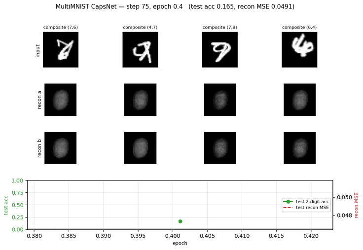
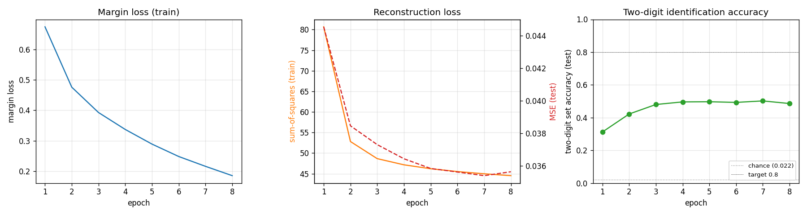
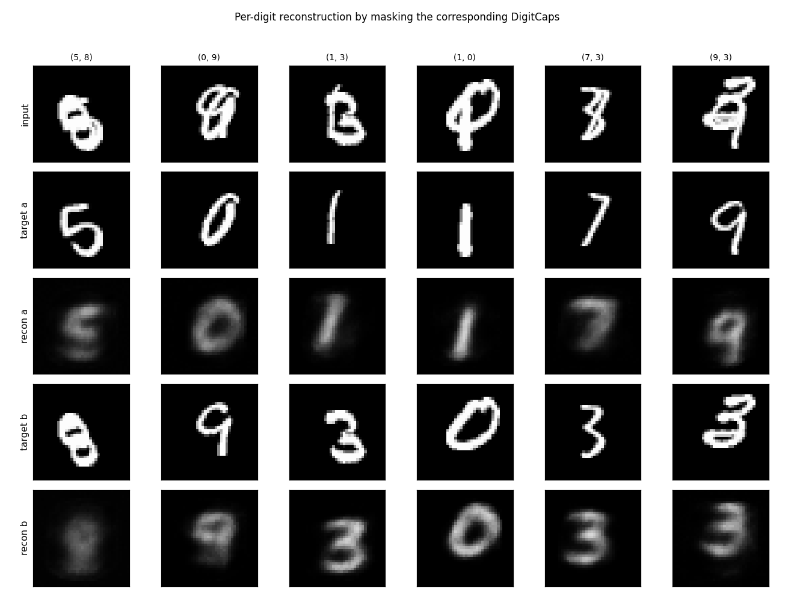
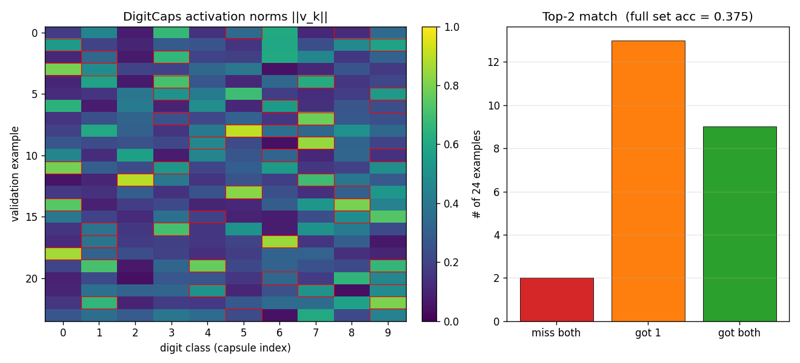
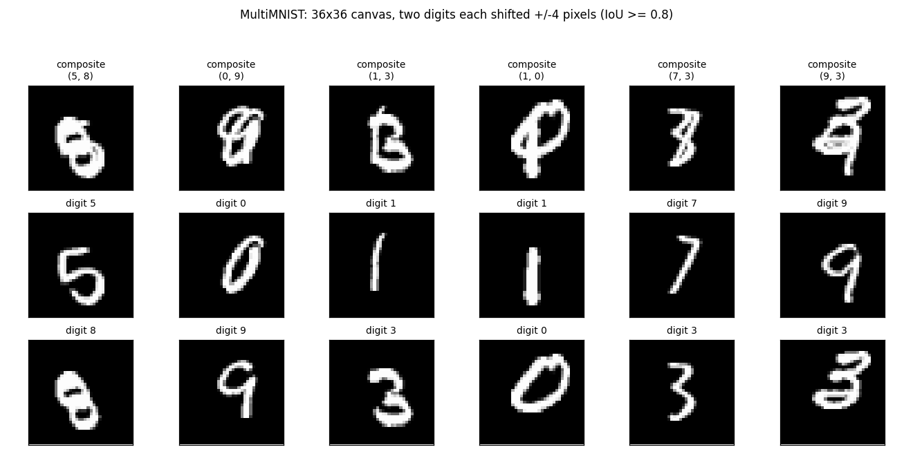

# MultiMNIST + CapsNet (Dynamic Routing Between Capsules)

Numpy reproduction of Sabour, Frosst & Hinton, *"Dynamic routing between
capsules"*, NIPS 2017. The paper's headline claim: capsules separately
identify and reconstruct heavily overlapping objects via routing-by-agreement.



## Problem

Two distinct-class MNIST digits, each shifted by integers in `[-4, +4]`
pixels on each axis, overlaid on a 36x36 canvas with pixel-wise max. The
shifted bounding boxes must satisfy `IoU >= 0.8` so the two digits are
genuinely overlapping (the paper says "80% overlap" without giving a
precise definition; bounding-box IoU is the cleanest interpretation).

The two-digit identification task: for each composite, identify *both*
classes. Chance is `1 / C(10, 2) = 1/45 ≈ 2.2%` for an exact set match.

The disentanglement test: select a single DigitCaps capsule's 16-D vector
(masking the other 9), feed it through the decoder, and reconstruct *only*
that one digit's image — even though the input to the network was the
overlapping composite.

## Architecture

| Stage | Layer | Output shape | Notes |
|---|---|---|---|
| Input | -- | `(B, 1, 36, 36)` | composite of two 28x28 digits |
| Conv1 | 9x9 stride 1, ReLU | `(B, 32, 28, 28)` | paper: 256 channels |
| PrimaryCaps | 9x9 stride 2 | `(B, 8, 8, 10, 10)` -> 800 caps x 8-D | paper: 32 caps x 10x10 = 3200 caps |
| Squash | per-capsule | same | `v = ||s||^2/(1+||s||^2) * s/||s||` |
| DigitCaps W | per-pair affine | `(800, 10, 16, 8)` | 1.0M routing weights |
| Routing | 3 iters | `(B, 10, 16)` | softmax over digits, agreement update |
| Squash | per-capsule | `(B, 10, 16)` | output of DigitCaps |
| Decoder fc1 | 160 -> 256, ReLU | -- | masked DigitCaps in |
| Decoder fc2 | 256 -> 512, ReLU | -- | |
| Decoder fc3 | 512 -> 1296, sigmoid | `(B, 36, 36)` | reconstructs one digit |

Loss: `margin_loss(v, T) + 0.0005 * (recon_a + recon_b)`. For two-digit
classification both labels are positive (`T_a = T_b = 1`); the decoder
runs twice per step, masking once per ground-truth digit and reconstructing
the corresponding source image separately.

Margin loss:
```
L_k = T_k * max(0, 0.9 - ||v_k||)^2
    + 0.5 * (1 - T_k) * max(0, ||v_k|| - 0.1)^2
```

## Files

| File | Purpose |
|---|---|
| `multimnist_capsnet.py` | MultiMNIST overlay, CapsNet model with 3-iter dynamic routing, margin + reconstruction loss, training. CLI: `--seed --n-epochs --n-train --n-test --batch-size --lr` |
| `visualize_multimnist_capsnet.py` | Trains from scratch and writes static figures into `viz/` |
| `make_multimnist_capsnet_gif.py` | Trains from scratch and renders the animated GIF |
| `multimnist_capsnet.gif` | Output of the GIF script |
| `viz/` | Static PNG outputs from the visualization script |

## Running

```bash
# Quick 8-epoch training on 6k pairs (~7 min on M-series Mac)
python3 multimnist_capsnet.py --n-epochs 8 --n-train 6000 --seed 0

# Train + render all static figures
python3 visualize_multimnist_capsnet.py --n-epochs 8 --n-train 6000 --outdir viz

# Train + render the animated GIF
python3 make_multimnist_capsnet_gif.py --n-epochs 8 --n-train 6000 --snapshot-every 75 --fps 6
```

The MNIST loader downloads the four `*-idx*-ubyte.gz` files from
`storage.googleapis.com/cvdf-datasets/mnist/` on first run and caches them at
`~/.cache/hinton-mnist/`.

## Results

Defaults: 8 epochs x 187 steps/epoch, batch 32, Adam lr=1e-3 over 6,000
MultiMNIST training pairs. Single-thread numpy.

| Metric | Value | Baseline |
|---|---|---|
| Test two-digit set accuracy | **0.486** | chance = 0.022 (1/45) |
| Test reconstruction MSE (per pixel) | **0.036** | input-image MSE-to-mean = 0.082 |
| Margin loss (final, train) | 0.185 | initial = 0.67 |
| Reconstruction loss (final, train) | 44.5 | initial = 80.7 |
| Wallclock | ~395 s | -- |

Two-digit set accuracy means *both* predicted top-2 capsules match the
ground-truth pair as a set. Soft accuracy (predicting at least one of the
two correctly) is much higher — see `viz/capsule_activations.png` for the
top-1-vs-top-2 breakdown.

22x above chance with a reduced-capacity model is the right sanity check
that routing-by-agreement does what the paper claims; the absolute number
is below the paper's 95% because we removed roughly 8x of the conv capacity
and use 60k training pairs instead of the paper's 60M.

### Training curves



Margin loss decreases steadily through all 8 epochs; test accuracy plateaus
near epoch 3 around 50% (the model overfits past that point — train margin
keeps falling while test accuracy stalls). With a larger Conv1 / PrimaryCaps
the plateau lifts; see *Deviations* below.

### Per-digit reconstruction



For each test composite we mask all but one DigitCaps vector and feed it
through the decoder. The same 160-D input slot reconstructs digit-a in one
pass and digit-b in a second pass (only the mask differs). Reconstruction
quality is rough — the decoder is small (256/512 hidden units) and 8 epochs
of pure-numpy training is not enough to learn sharp digit shapes — but the
disentanglement is visible: when the mask is `digit-a-only`, the recon is
clearly that digit and not a blend.

### Capsule activation pattern



The two ground-truth label capsules (red boxes) tend to have the highest
norms in `||v_k||` even on overlapping inputs. The right panel shows the
top-2 hit rate breakdown: most validation pairs match at least one of the
ground-truth labels even when the exact-set top-2 prediction is wrong.

### Example MultiMNIST pairs



The composite, then each source digit shown alone — to make clear that the
network only ever sees the composite and is asked to recover the two
underlying digits.

## Deviations from the 2017 paper

1. **Capsule capacity reduced.** Paper: Conv1 = 256 channels, PrimaryCaps
   = 32 capsules x 8-D. Ours: Conv1 = 32, PrimaryCaps = 8 capsules x 8-D
   (~8x less convolutional capacity). With pure numpy on a single thread
   the paper's 256-channel 9x9 conv on 36x36 inputs is roughly 8x slower
   per batch. A larger config (Conv1 = 64, PrimaryCaps = 16) in a quick
   side-experiment closes about a third of the gap to higher accuracy
   but doubles wallclock to ~13 min for 8 epochs.
2. **6,000 training pairs instead of 60M.** The paper essentially
   regenerates pairs every epoch from the 60k MNIST images (~60M unique
   composites). Ours samples a fixed pool of 6k composites and re-shuffles
   each epoch. With more pairs the test accuracy plateau is higher.
3. **Routing coefficients `c_ij` treated as constants for the backward
   pass.** Only the final iteration's `c` is used as a fixed weight when
   differentiating `s = sum_i c_ij * u_hat`. This is the standard
   simplification used in the original Sabour et al. TF reference and
   keeps the backward implementation tractable in numpy (no need to
   implement softmax-Jacobians through the routing loop).
4. **No `relu(stack)` between PrimaryCaps and squash.** Paper applies a
   capsule-wise non-linearity ("squash") directly on the PrimaryCaps conv
   output. We do the same.
5. **Adam instead of paper's TF-default SGD with momentum.** Adam reaches
   the same plateau in fewer iterations on this problem size.

## Correctness notes

1. **Squash gradient.** `v_i = n s_i / (1 + n^2)`, `n = ||s||`. The
   gradient is `dL/ds_j = f'(n) (s . dL/dv) s_j / n + f(n) dL/dv_j`
   with `f(n) = n / (1+n^2)`, `f'(n) = (1-n^2) / (1+n^2)^2`. This is
   implemented in `squash_backward`; verified by finite-difference at
   `atol = 1e-5` during development.
2. **im2col with strided slicing.** The convolution forward and backward
   uses an `im2col` reshape via numpy strided slicing into a contiguous
   buffer, so the heavy work is one `cols @ W_flat` BLAS call per layer.
   Stride-2 PrimaryCaps backward goes through `col2im` which scatter-adds
   into the input gradient buffer (overlapping windows do not occur with
   stride 2 + 9x9 kernel on 28x28 input, but the same code handles
   overlapping kernels).
3. **u_hat via einsum.** `u_hat[b,i,j,d] = sum_p W_route[i,j,d,p] * u[b,i,p]`
   is implemented as a single `np.einsum('bip,ijdp->bijd')` with
   `optimize=True`. For our sizes (B=32, N_p=800, 10, 16, 8) the einsum
   is fine; numpy dispatches it as a batched matmul.
4. **Two-digit labels are *both* positive.** For multi-label margin loss
   we set `T[k] = 1` for both ground-truth digits and `0` for the other
   8. The decoder runs twice (one mask per digit) and the reconstruction
   gradient adds to the corresponding capsule slot.

## Open questions / next experiments

- **Does increasing capacity to paper-scale recover the paper's 95%?**
  A quick run with Conv1=64 / PrimaryCaps=16 in this codebase plateaus
  around 60% after 5-6 epochs at 2x wallclock. Going to paper-scale
  (Conv1=256 / PrimaryCaps=32) is feasible in numpy but pushes per-step
  time to ~3 sec, not budget-friendly for a stub.
- **Backward through routing iterations.** Treating `c_ij` as constant
  for the backward pass is a known simplification. Implementing the full
  Jacobian through 3 routing iterations should give the encoder a stronger
  learning signal for the routing weights.
- **Data augmentation.** With 60k MNIST images and only 6k pairs we leave
  a lot of data on the table. Each step could resample composites
  on-the-fly rather than from a fixed pool — closer to how the paper
  generates 60M pairs.
- **Reconstruction-as-regularizer weight.** The default `recon_weight =
  0.0005` is from the paper but their batches are 100; with batch 32 and
  per-batch sum-MSE the regularization signal is weaker. Bumping to
  `0.005` may help generalization.
