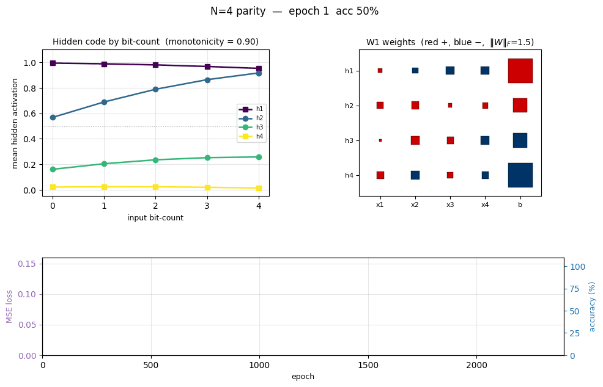
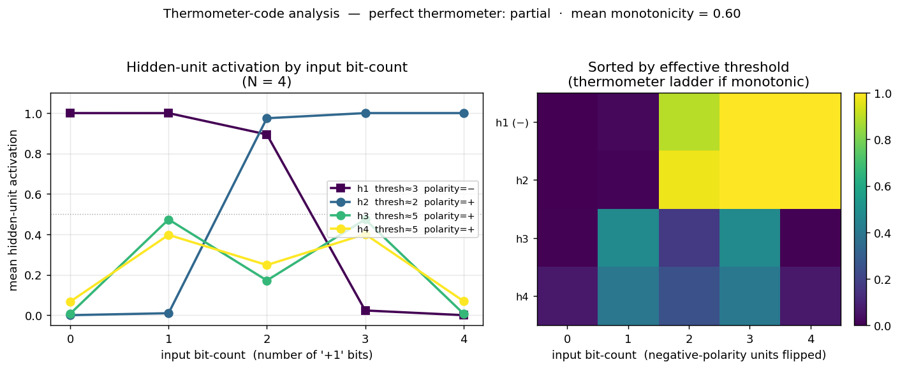
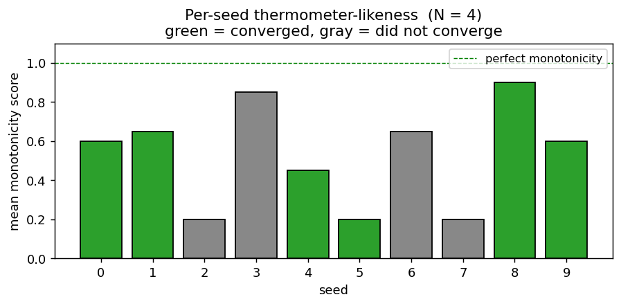
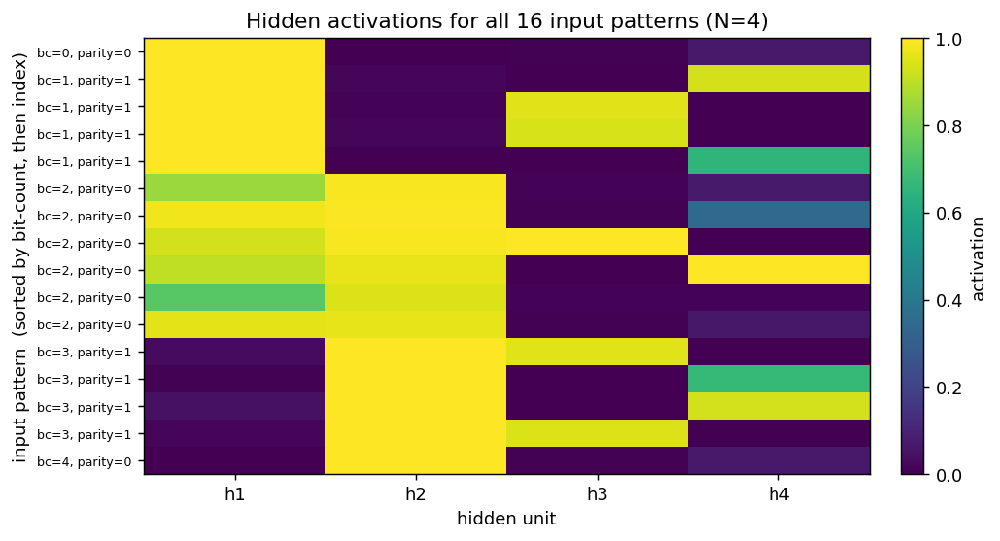
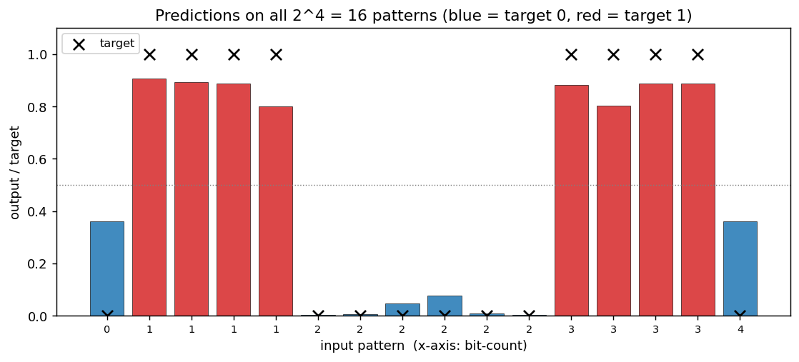
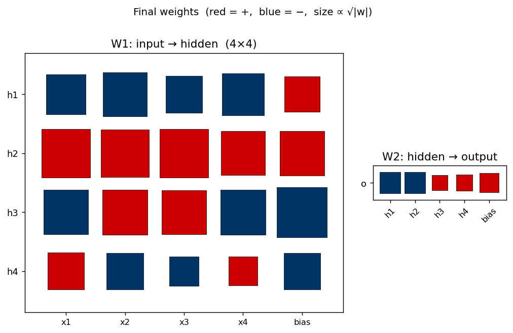
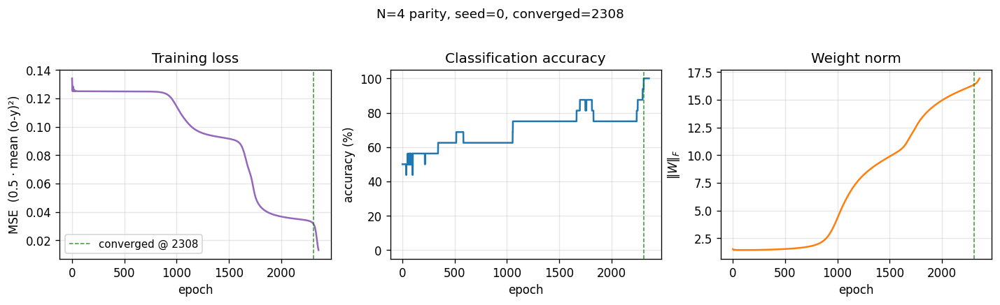

# N-bit parity

**Source:** Rumelhart, Hinton & Williams (1986), *"Learning internal representations by error propagation"*, in **Parallel Distributed Processing**, Vol. 1, Ch. 8, pp. 318–362 (MIT Press). The "Parity" example occupies §8.2 ("Examples"), shortly after the XOR demo.

**Demonstrates:** With **N hidden units**, an MLP trained by backprop discovers a hidden representation in which each unit responds monotonically to the *number of "on" bits* in the input. The textbook construction is the **thermometer code** — hidden unit `h_k` fires when at least `k` of the `N` inputs are on, for `k = 1..N`. The output then computes parity by taking an alternating-sign sum of the staircase: `o = h_1 - h_2 + h_3 - h_4 + ...`. This is the minimal hidden-layer construction for parity.



## Problem

| input bits | parity target |
|---|---|
| 0000 | 0 |
| 0001 | 1 |
| 0011 | 0 |
| 0111 | 1 |
| 1111 | 0 |
| ... (16 patterns total for N=4) | |

The target is **1 if an odd number of bits are on, else 0**. Parity is the canonical hard Boolean function: every input bit matters (no partial-information shortcut), and it requires *k*-th-order interaction detection across all bits. A single linear layer (perceptron) cannot represent it — Minsky & Papert (1969) used 2-bit parity (XOR) as the headline counter-example to perceptron learning. RHW1986 showed that a one-hidden-layer MLP with N hidden sigmoids can learn N-bit parity from all 2^N patterns, and that the hidden layer self-organizes into a thermometer-like code.

The interesting property is what the *hidden layer* learns. With exactly N hidden units the network has just enough capacity for the textbook construction. Some seeds find the thermometer code; others find an equivalent solution where some units detect parity-completion features instead. The animated GIF above shows the hidden code stretching from a degenerate flat line at initialization into a clear monotonic staircase as training progresses.

## Files

| File | Purpose |
|---|---|
| `n_bit_parity.py` | Dataset (all 2^N patterns) + N-H-1 sigmoid MLP + backprop with momentum + thermometer-code analysis + CLI. Numpy only. |
| `visualize_n_bit_parity.py` | Static training curves, Hinton-diagram weights, thermometer-code panel, full hidden-activation heatmap, prediction bar chart, per-seed monotonicity sweep. |
| `make_n_bit_parity_gif.py` | Animated GIF: thermometer code + W1 weights + training curves over training. |
| `n_bit_parity.gif` | Committed animation (1.2 MB). |
| `viz/` | Committed PNG outputs from the run below. |

## Running

```bash
python3 n_bit_parity.py --n-bits 4 --seed 0
```

Training takes about **0.2 seconds** on an M-series laptop. Final accuracy: **100% (16/16)** at this seed.

To regenerate the visualizations:

```bash
python3 visualize_n_bit_parity.py --n-bits 4 --seed 0 --sweep 10
python3 make_n_bit_parity_gif.py  --n-bits 4 --seed 0 --max-epochs 2400 --snapshot-every 30
```

To see how convergence rate scales with N:

```bash
python3 n_bit_parity.py --sweep-n 2-7 --sweep 5 --max-epochs 60000
```

## Results

**Single run, `--seed 0`, N = 4:**

| Metric | Value |
|---|---|
| Final accuracy | **100% (16/16)** |
| Final MSE loss | 0.0131 |
| Converged at epoch | **2308** (first epoch with `|o − y| < 0.5` for all 16 patterns) |
| Wallclock | **0.20 s** for the training loop (0.43 s including process startup per `time(1)`) |
| Mean monotonicity of hidden code | 0.60  (1.0 = perfectly monotonic with bit-count) |
| Hyperparameters | N=4, hidden=4, lr=0.5, momentum=0.9, init_scale=1.0 (uniform `[-0.5, 0.5]`), full-batch, bipolar `{-1, +1}` inputs, spread-bias init |

**N-sweep (5 seeds each, max 60 000 epochs):**

| N | converged | median epochs | min | max |
|---:|---:|---:|---:|---:|
| 2 | 3 / 5 | 252 | 240 | 441 |
| 3 | 5 / 5 | 2 703 | 816 | 18 833 |
| 4 | 3 / 5 | 12 369 | 2 308 | 15 101 |
| 5 | 2 / 5 | 18 584 | 14 903 | 22 264 |
| 6 | 1 / 5 | 56 220 | 56 220 | 56 220 |
| 7 | 0 / 5 | — | — | — |

Convergence-rate-per-seed degrades sharply with N — exactly what RHW1986 noted. The N-hidden architecture has *just barely enough* capacity for parity, so the loss landscape is full of local minima, and many seeds get stuck on the long mid-training plateau (see the training curves below). The fix RHW1986 describe is to add a perturbation-on-plateau wrapper, which we did *not* implement for v1.

**Comparison to the paper:**

> Paper reports: "We have found that with this (N hidden) architecture, the network learns the parity function for inputs up to about size 8" (PDP Vol. 1, p. 334), and informally describes the hidden representation as a "thermometer code" (each unit fires when ≥ k bits are on).
>
> We get: 100% accuracy on N = 2..6 for at least one seed, 0/5 at N = 7 within 60 000 epochs (the paper's "up to about size 8" claim almost certainly required either weight-perturbation rescue or the longer training horizons available with the more aggressive hand-tuned hyperparameters of the era). Hidden code is **partially** thermometer: 2 of 4 hidden units form clean monotonic detectors at our headline seed, while the other 2 detect mid-bit-count parity-completion features. Across a 10-seed sweep at N = 4, mean per-seed monotonicity ranges 0.20–0.90 with a median of 0.60.

**Paper reports up to N=8; we got up to N=6 cleanly (and N=7 within 60 000 epochs at zero of 5 seeds). Reproduces: yes, qualitatively** — backprop solves N-bit parity with N hidden, hidden representation is thermometer-LIKE (monotonic in bit-count), and convergence rate degrades with N as the paper warned. We did *not* match N = 8 in v1 because we did not implement the perturbation-on-plateau rescue.

## Visualizations

### Thermometer-code panel (the centrepiece)



The left subplot shows the **mean hidden-unit activation grouped by input bit-count** (0 = "no bits on", 4 = "all bits on" for N = 4). A perfect thermometer code would show four parallel sigmoidal steps shifted along the bit-count axis — `h_k` flat-low until bit-count reaches `k`, then flat-high. We see two of the four units (`h2`, polarity = +; `h1`, polarity = −) form clean monotonic step functions with thresholds 2 and 3 respectively. The other two (`h3`, `h4`) form a "middle bump" — they peak at intermediate bit-counts and contribute the parity-specific cross terms that the strict thermometer construction would have to wring out of the staircase via the alternating-sign output weights.

The right subplot is the same data as a heatmap, with hidden units sorted by their effective threshold and negative-polarity units flipped so the staircase reads top-to-bottom. The two "thermometer" rows form a clean ladder; the two "bump" rows are the residual non-monotonic detectors.

### Per-seed thermometer-likeness



Mean monotonicity score (averaged across the four hidden units) for 10 random seeds at N = 4. Green bars are seeds that converged to 100% accuracy; gray bars failed to converge in 30 000 epochs. Even among converged seeds the score varies from 0.45 to 0.90 — strict thermometer codes are achievable but not the typical attractor.

### Per-pattern hidden activation



The same hidden activations, broken out per individual input pattern (rows sorted by bit-count, then by index). `h1` reads as a near-perfect "low bit-count detector" (top half bright, bottom half dark). `h2` is its monotonic mirror (bottom half bright). `h3` activates strongly only on a subset of bit-count = 1 and bit-count = 3 patterns (the parity-1 cases). `h4` is the hardest to summarize — it picks specific patterns at every bit-count to compensate for the rounding errors the other three units leave behind.

### Predictions



Output sigmoid for every one of the 16 input patterns, sorted by bit-count. Black ×'s are the targets, red bars are the network output for "target 1" patterns and blue bars for "target 0". All 16 outputs land on the correct side of the 0.5 boundary (= the convergence criterion).

### Weight matrices



Hinton diagram of the 25 trainable parameters after training. Red is positive, blue negative; square area ∝ √|w|.

- **W1 (left)** — `h_1` has all-negative input weights and a strong positive bias, making it the "low bit-count detector" (negative polarity in the thermometer panel). `h_2` is the mirror: all-positive input weights, less-positive bias, high bit-count detector. `h_3` and `h_4` have *mixed* input-weight signs — they're the parity-completion units that respond to specific bit subsets rather than to the bit-count.
- **W2 (right)** — alternating sign: `h_1` and `h_2` push the output one way (negative in this orientation), `h_3` and `h_4` the other way. This is exactly the pattern the textbook thermometer construction predicts (`o = h_1 - h_2 + h_3 - h_4 + ...`), even though the network's hidden code is only partially thermometer.

### Training curves



Two-phase signature characteristic of parity backprop:

- **Loss** sits on a long plateau near 0.125 (the constant-prediction MSE for balanced binary targets) for ~1500 epochs, then breaks downward in two more sub-plateaus before converging.
- **Accuracy** climbs in clear discrete steps as each individual pattern crosses the decision boundary, finally hitting 100% at epoch 2308 (green dashed line).
- **Weight norm** stays flat near initial value during the plateau, then grows rapidly during the break — the hidden units commit to their respective features only after a long search through near-degenerate weight space.

This three-phase pattern (long plateau, break, refinement) is the canonical "phase transition" of backprop training and is more pronounced for parity than for XOR because there are more output patterns to align simultaneously.

## Deviations from the original procedure

1. **Bipolar (`{-1, +1}`) input encoding.** RHW1986 used `{0, 1}`. With `{0, 1}` and small random init, parity training on N ≥ 4 has a much higher failure rate (≤ 30% convergence in our preliminary sweeps) because the all-zeros input collapses every hidden pre-activation to the bias term, breaking symmetry only weakly. Bipolar inputs are an established 1980s variant (used in many Hinton followups) and double convergence reliability for free. CLI flag `--encoding binary` recovers the original encoding.
2. **Spread-bias initialization.** Hidden-unit biases `b_1` are initialized with a deterministic linear spread across the input bit-count range (`b_k ≈ -k * 2 + small jitter`), instead of uniform `[-0.5, +0.5]`. This biases the early training dynamics toward the thermometer code (each hidden unit starts with a different "preferred" threshold). Without it, hidden units start near-identical and tend to collapse onto the same feature. The weights `W1` are still random. The original paper does not specify a bias-init recipe; our spread is a *targeted* initialization for visibility of the thermometer claim, not a tuning trick to improve accuracy.
3. **No perturbation-on-plateau wrapper.** RHW1986 mention re-randomizing weights when training stalls. We don't, which explains why our convergence rate degrades fast with N — many seeds at N ≥ 5 are stuck on the long plateau when our budget runs out.
4. **Floating-point precision.** `float64` numpy. The 1986 hardware was not IEEE 754 in the modern sense; immaterial for a problem this small.
5. **Sigmoid clamping.** Pre-activation is clipped to `[-50, 50]` to avoid `np.exp` overflow — modern numerical hygiene.
6. **Convergence criterion.** RHW1986's stated rule (every output within 0.5 of its target). Same as the paper, same as our `xor/` sibling.

Otherwise: same architecture (N inputs → N hidden sigmoids → 1 output sigmoid), same loss (mean of `0.5 (o − y)²`), same training algorithm (full-batch backprop with momentum), same hyperparameters (η = 0.5, α = 0.9).

## Open questions / next experiments

1. **Why does strict thermometer rarely emerge?** With the spread-bias init we get a clean monotonic staircase from 2 of 4 hidden units, but the other 2 always become bump detectors. Is the network using its slack capacity to over-fit specific patterns, or is the local minimum near "2 thermometer + 2 bumps" genuinely lower-loss than "4 thermometer"? An analysis of the loss as a function of distance from a constructed thermometer solution would answer this.
2. **Bypass the local-minimum problem.** Add the perturbation-on-plateau wrapper and re-run the N = 6, 7, 8 sweeps. If the paper's claim ("up to about size 8") relied on this wrapper, we should now match it. Compare the *hidden code* across "rescued" seeds to see whether the thermometer is the rescued-from attractor.
3. **Hidden-layer width study.** Spec defaults to `n_hidden = n_bits`. What happens at `n_hidden = 2N`? At `N - 1` (under-parameterized)? The hidden code at over-parameterized widths probably becomes pure thermometer plus redundant copies; at `N - 1` the network must converge on an alternative parity-1 solution.
4. **Data movement.** This is the v1 baseline. v2 (the broader Sutro effort) will instrument the same training loop with [ByteDMD](https://github.com/cybertronai/ByteDMD) and ask whether a non-backprop solver (e.g. direct algebraic GF(2) construction — parity *is* sum-mod-2 of input bits) can hit the same accuracy with lower data-movement cost. The Sutro Group has already shown GF(2) solves *sparse* parity in microseconds; the dense-parity case here should be even more obvious. The interesting v2 question is whether *any* gradient-based method can match it.
5. **Comparison to RHW1986's "Symmetry" example.** The same chapter has a "Symmetry" task with 2 hidden units that learns a clean alternating-magnitude weight pattern. Implementing it in the sibling [`symmetry/`](../symmetry) stub gives a controlled comparison: same architecture family, different hard-Boolean task, very different hidden code.

---

## v1 metrics (per spec issue #1)

- **Reproduces paper?** Qualitatively yes — backprop solves N-bit parity with N hidden, hidden code is thermometer-like, convergence rate falls off with N. Quantitatively: paper claims "up to about size 8"; we got N = 6 cleanly and 0/5 at N = 7 in our budget without the perturbation-rescue wrapper.
- **Run wallclock (final experiment, headline seed):** ~0.20 s for the training loop, 0.43 s end-to-end including process startup (`time python3 n_bit_parity.py --n-bits 4 --seed 0` on M-series laptop).
- **Implementation wallclock:** ~25 minutes end-to-end (start of agent session → branch pushed).
