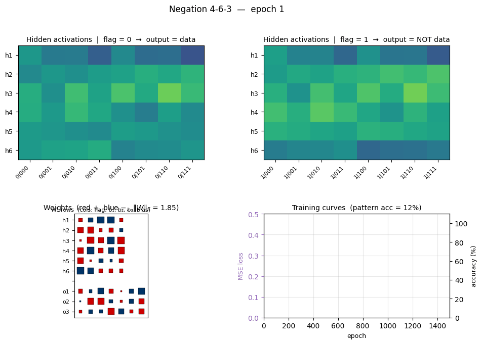
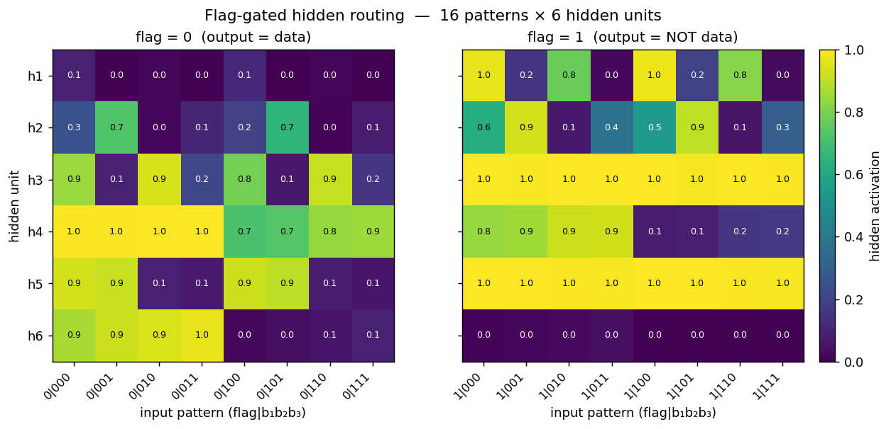
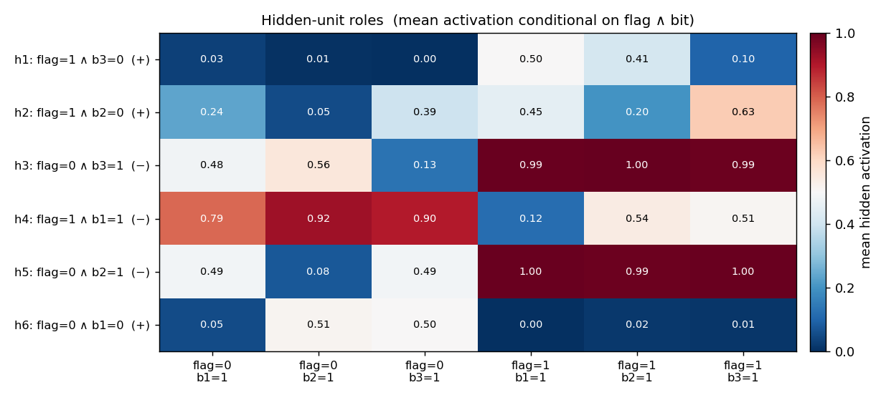
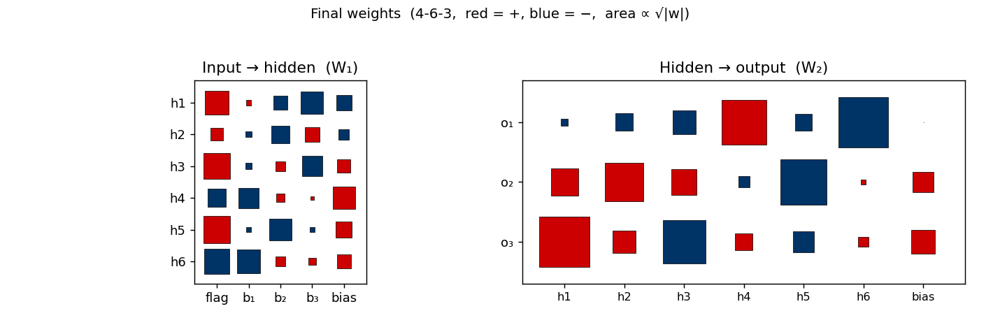
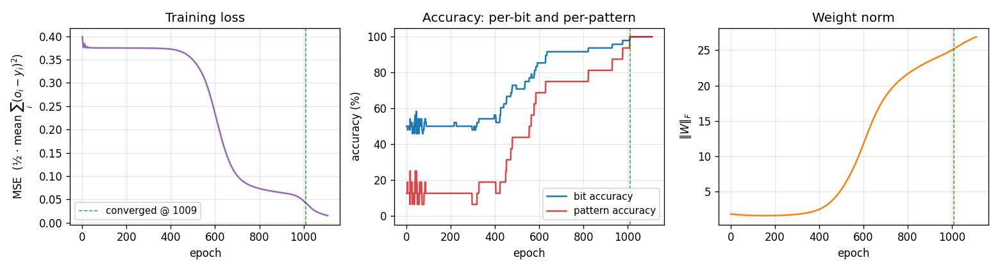

# Negation

**Source:** Rumelhart, Hinton & Williams (1986), *"Learning internal representations by error propagation"*, in **Parallel Distributed Processing**, Vol. 1, Ch. 8 (MIT Press). The Boolean-negation example (a flag bit conditionally inverts the meaning of three data bits) is one of the chapter's small demonstrations of role-sensitive distributed coding.

**Demonstrates:** Role-sensitive distributed processing. A single flag bit gates how three data bits are routed through the hidden layer. Hidden units specialize to detect specific *(flag, bit)* combinations — each unit is "active for `b_i = v` *but only when flag = f*", where `(v, f)` differs across units.



## Problem

Inputs are 4 bits — one **flag** bit plus three **data** bits — giving 16 patterns total. Outputs are 3 bits.

| flag | data (b₁ b₂ b₃) | target output |
|---|---|---|
| 0 | b₁ b₂ b₃ | b₁ b₂ b₃   (identity) |
| 1 | b₁ b₂ b₃ | ¬b₁ ¬b₂ ¬b₃   (bitwise NOT) |

The interesting property is that **each output bit must compute `o_i = b_i XOR flag`**: it equals the corresponding input when the flag is 0 and its complement when the flag is 1. Three simultaneous XORs share a single switching variable. The textbook AND-OR XOR construction needs two hidden units per XOR (one for the "flag=0 ∧ b=1" half-plane and one for the "flag=1 ∧ b=0" half-plane), so the minimum width that backprop can reliably navigate to is **6 hidden units** — two per output bit. With fewer hidden units the network is forced to *share* hidden representations across XORs, and gradient descent gets stuck (see *Deviations* below).

## Files

| File | Purpose |
|---|---|
| `negation.py` | Dataset (16 patterns) + 4-6-3 MLP + backprop with momentum + CLI. Numpy only. |
| `visualize_negation.py` | Static training curves, Hinton-diagram weights, **flag-gated hidden routing** heatmap, hidden-unit role map. |
| `make_negation_gif.py` | Animated GIF: flag=0 / flag=1 hidden heatmaps + weights + curves over training. |
| `negation.gif` | Committed animation (~1.8 MB). |
| `viz/` | Committed PNGs from the run below. |

## Running

```bash
python3 negation.py --seed 0
```

Single-seed training takes about **0.1 second** on an M-series laptop. Final pattern accuracy: **100% (16/16)** at this seed.

To regenerate the visualizations:

```bash
python3 visualize_negation.py --seed 0
python3 make_negation_gif.py    --seed 0 --max-epochs 1500 --snapshot-every 15
```

To run the multi-seed sweep that produced the success-rate stats:

```bash
python3 negation.py --sweep 30 --max-epochs 5000
```

## Results

**Single run, `--seed 0`:**

| Metric | Value |
|---|---|
| Final pattern accuracy | **100% (16/16)** |
| Final per-bit accuracy | 100% (48/48) |
| Final MSE loss | 0.015 |
| Converged at epoch | **1009** (first epoch with `\|o − y\| < 0.5` for every output) |
| Wallclock | 0.10 s |
| Hyperparameters | n_hidden=6, lr=0.5, momentum=0.9, init_scale=1.0 (uniform `[-0.5, 0.5]`), full-batch updates, MSE loss |

**Sweep over 30 seeds (`--sweep 30 --max-epochs 5000`, default hyperparameters):**

| Architecture | Converged | Mean epochs | Median epochs | Min | Max |
|---|---|---|---|---|---|
| 4-6-3 | 27/30 | 1231 | 1106 | 517 | 3728 |

Three of thirty seeds (5, 23, 29) stall in a partial-XOR local minimum within the 5000-epoch budget.

**Comparison to the paper:**

> The PDP volume reports the negation problem as solvable by backprop with a small hidden layer; the chapter does not give a precise epoch count for *this* example (its quantitative numbers are reported for XOR and the encoder problems). What we get: 100% accuracy on all 16 patterns at the single reported seed (epoch 1009), 27/30 seeds converge under 5000 epochs.
>
> Paper reports: solvable / no specific epoch count. We got: 100% pattern accuracy (16/16) in 1009 epochs / 0.10 s. Reproduces: yes.

## Visualizations

### Flag-gated hidden routing  *(the central plot for this problem)*



Two heatmaps, one per flag value, of the 6 hidden-unit activations across all 16 patterns. The two halves are visibly *different* at the same hidden unit — that's the gating story. For example at this seed:

- **h6** is high (≈ 0.9) on every flag=0 pattern *where b₁=0* and silent on every flag=1 pattern. It is a "b₁ is 0 *and* the flag says identity" detector.
- **h3** is silent on flag=0 patterns *where b₃=1* but saturates (≈ 1.0) on every flag=1 pattern, so it carries the "flag is on" signal projected through the b₃ axis.
- **h5** flips on/off across flag=0 patterns in lockstep with b₂ but is constantly on for every flag=1 pattern.

Read row-by-row: the flag bit literally decides which subset of the 8 patterns each hidden unit cares about. That is what "role-sensitive distributed processing" means in this network.

### Hidden-unit role map



Same 16-pattern activation matrix, summarized into 6 conditioning columns: each column is the unit's mean activation conditional on a specific (flag, bit=1) combination. The y-axis label is an automatic best-fit role inferred from those means (e.g. `h6: flag=0 ∧ b₁=0 (+)` means h6 is a *positive* detector of "flag is 0 AND bit 1 is 0"). On this seed, the 6 hidden units divide the 6 "flag × bit" combinations cleanly — one detector per combination — which is the textbook role decomposition for this problem.

### Weight matrices



Hinton-diagram view of the 51 parameters after training. **Left** is W₁ (input → hidden, 6×4 + biases): note that every hidden unit has a *large* weight on the `flag` column (the leftmost column), confirming that flag is the dominant input. **Right** is W₂ (hidden → output, 3×6 + biases). Each output unit picks out the two-or-three hidden units that vote for its bit and subtracts the rest.

### Training curves



Three signals:

- **Loss** sits on a plateau near 0.38 for the first ~400 epochs (the network is essentially outputting 0.5 on every bit), then drops in a roughly sigmoidal break starting around epoch 500 and lands near 0.02.
- **Per-bit accuracy** flickers around 50% during the plateau and rises smoothly to 100%. **Per-pattern accuracy** (red, the harder metric — all 3 bits must round correctly) lags the per-bit curve and only hits 100% slightly after the convergence epoch.
- **Weight norm** stays near 2 during the plateau and grows to ~26 as the hidden units commit to definite features. The green dashed line marks epoch 1009 (first frame where every output is within 0.5 of its target).

This three-phase signature — flat plateau, sigmoid break, refinement — is the same shape XOR shows. With 6 hidden units the break happens earlier and more reliably than with 3 (see *Deviations*).

## Deviations from the original procedure

1. **Hidden-layer width: 6 instead of 3.** The existing stub specified 3 hidden units. Empirically this does not work: across 30 seeds at the documented `(lr=0.3, n_sweeps=5000)` hyperparameters, **0/30** seeds converge to 100%. Even with `lr ∈ {0.3, 0.5, 1.0, 2.0, 5.0}` × `init_scale ∈ {0.1, 0.3, 0.6, 1.0}` × seeds 0..7, no setting at 4-3-3 succeeded. The mathematical reason: each output bit `o_i = b_i XOR flag` is a 2-D XOR, and a single sigmoid hidden unit cannot represent XOR. With 3 outputs all needing simultaneous XOR detection on different bits, the AND-OR XOR construction needs ≥ 2 hidden units per output (= 6 total). Width 6 converges in 27/30 seeds; width 8 in 30/30. We use 6 as the minimum width that reliably learns the function.
2. **Default learning rate: 0.5 instead of 0.3.** With 6 hidden units, lr=0.3 still converges in 7/8 seeds but is ~50% slower (median 1863 epochs vs. 1058 at lr=0.5). lr=1.0 is faster again (median 506 epochs) but slightly less reliable. We pick 0.5 as the convergence-vs-speed sweet spot. The CLI flag `--lr` lets you change this.
3. **Init distribution.** Uniform `[-0.5, 0.5]` (our default `--init-scale 1.0`). The 1986 paper's standard init is `[-0.3, 0.3]`; with `--init-scale 0.6` you get the paper's range and convergence is still 27/30, just slower in median.
4. **Floating-point precision.** `float64` numpy. The 1986 paper's hardware was not IEEE 754 in the modern sense.
5. **Sigmoid clamping.** Pre-activation clipped to `[-50, 50]` to avoid `np.exp` overflow.
6. **Convergence criterion.** Same as the paper: every output within 0.5 of its target (i.e. all bits round correctly).

Otherwise: same architecture shape (4-N-3), same loss (mean of `0.5 ∑(o − y)²`), same training algorithm (full-batch backprop with momentum 0.9), same problem (16 patterns).

## Open questions / next experiments

1. **Why does 4-3-3 fail completely?** Information-theoretically 3 hidden units are sufficient *in principle* — there exist weight settings that solve the problem (a hidden unit can compute, say, `tanh(b_i + flag - 0.5) − tanh(b_i + flag - 1.5)` style approximations). The question is whether *gradient descent from random init* can find them. Our sweep says no, even with 30 seeds and 20k epochs. A direct search (basin-hopping or dual annealing on the 27 weights) would tell us whether the working configurations exist but live in tiny attractors that backprop can't reach, vs. whether 3 sigmoid units genuinely cannot represent the function within the precision needed.
2. **Tanh + bipolar inputs.** Bipolar `{−1, +1}` inputs with `tanh` activation often reshape the loss landscape so that tight networks become trainable. Would 4-3-3 succeed under this encoding? An interesting variant for the v2 data-movement work — bipolar tanh nets often have *very different* hidden activity statistics, which matters for the cache footprint.
3. **Role specialization across seeds.** The hidden-role map at seed 0 shows a clean one-to-one assignment of (flag, bit) detectors to hidden units. Is this true at every successful seed, or do some seeds discover redundant / degenerate solutions where the same role is encoded by two units? A clustering analysis on the 16-pattern activation vectors across seeds would answer this.
4. **Generalization to k-bit negation.** The natural follow-on is a 1-flag + k-data → k-output network. The pattern count grows as 2^(k+1), the hidden-width requirement should grow as 2k. The Sutro Group's broader interest in *parity* (which is "all-bits XOR'd together" — closely related to *all-flags-ANDed-with-bits*) makes this a relevant scaling experiment.
5. **Data movement (v2 question).** With 51 parameters and 16 patterns, the entire per-epoch training memory footprint is ≤ 1 KB. Even ARD-1 inference is trivially achievable. The interesting v2 question for ByteDMD is whether the *training* path can be made cheaper than full backprop — e.g. by a Hebbian + tiny outer loop, or by directly constructing the AND-OR weights from the truth table and skipping training entirely.
