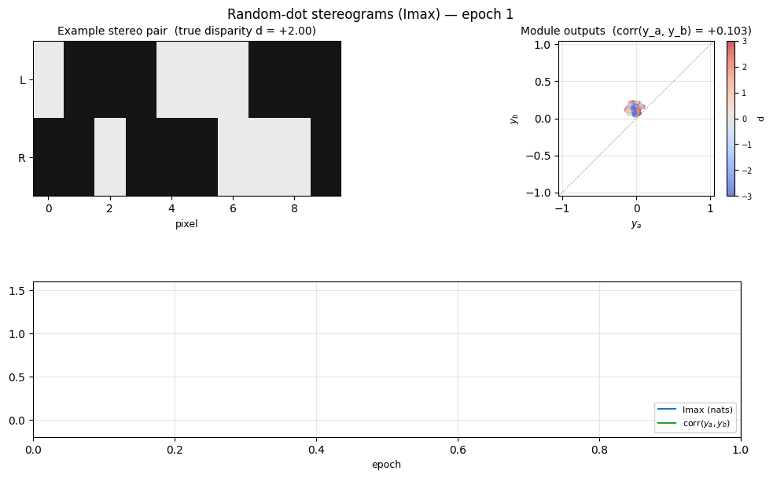
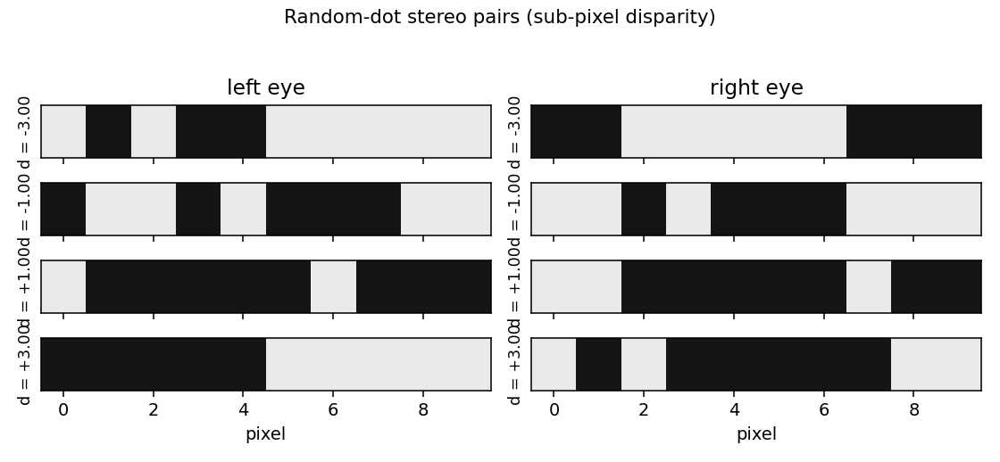
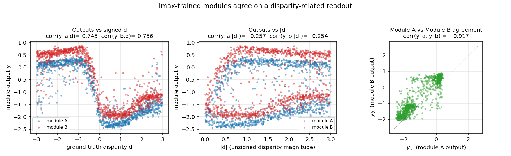
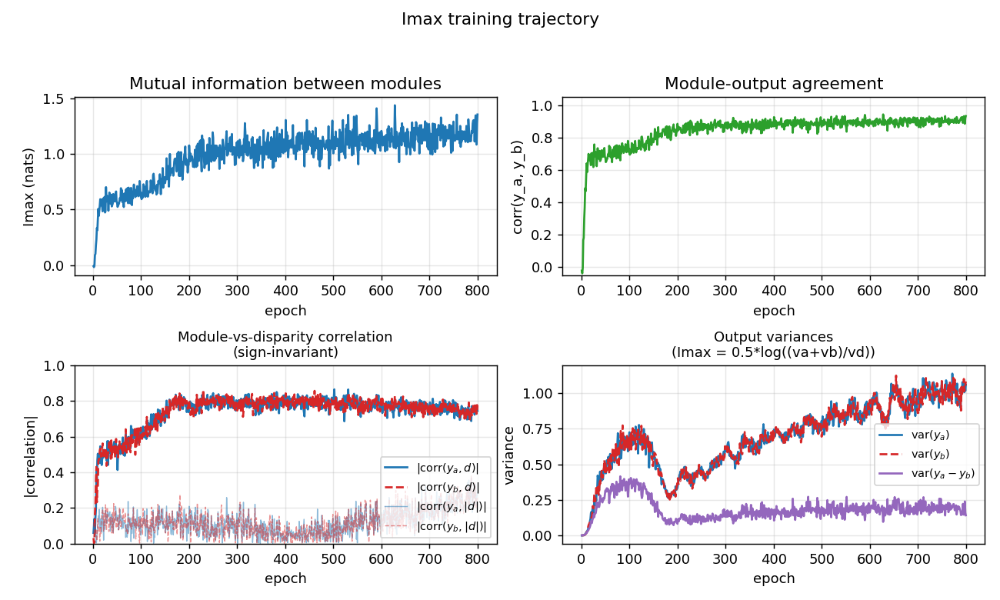

# Random-dot stereograms (Imax)

Reproduction of Becker & Hinton (1992), *"A self-organizing neural network
that discovers surfaces in random-dot stereograms"*, **Nature** 355, 161-163.

The first demonstration that **mutual information between two modules viewing
different inputs from a common cause** is enough of a learning signal to
discover that common cause. The cause here is binocular disparity (depth);
the two modules are simulated stereo receptive fields each looking at one
strip of a random-dot stereogram.



## Problem

A 1-D world of random binary dots (`+1` / `-1`) is rendered into two views,
left and right eye. The right view is the left view shifted horizontally by
a per-example **disparity** `d` (the world's depth at that position).

Each training example contains **two independent stereo strips** drawn at the
**same disparity**. Each strip becomes the input to one module:

```
     example                       module A           module B
   ┌──────────────────────────┐    ┌────┐             ┌────┐
   │ disparity d ~ U[-3, +3]  │ -> │ y_a│             │ y_b│
   │                          │    └────┘             └────┘
   │  strip A: dots_A, shift d│      ↑                  ↑
   │  strip B: dots_B, shift d│   [left_a, right_a]  [left_b, right_b]
   └──────────────────────────┘
```

Two MLPs (one per module) are trained to MAXIMIZE
```
    Imax = I(y_a; y_b)  ≈  0.5 * log(var(y_a) + var(y_b))
                         - 0.5 * log(var(y_a - y_b))
```
under a Gaussian assumption on `(y_a, y_b)`. **No supervised target is given.**

### The interesting property

The two strips share *only* the disparity — their dots are independently
random. So the only thing the modules can agree on is the disparity (or some
function of it, like `|d|`). Maximizing mutual information forces both
modules to extract a disparity-related readout from random pixel patterns,
*without ever seeing a supervised label*. This is the foundational
demonstration that **spatial coherence between sibling features is enough of
a self-supervised signal to learn the latent variable that produced them** —
the same intuition that later powers contrastive learning, SimCLR, and the
GLOM-style consensus columns Hinton revisited in 2021.

## Files

| File | Purpose |
|---|---|
| `random_dot_stereograms.py` | Synthetic stereogram generator, two-module MLP, Imax loss with closed-form gradient, momentum-SGD trainer. CLI flags `--seed --n-epochs --strip-width`. |
| `visualize_random_dot_stereograms.py` | Static figures: stereogram examples, scatter of module outputs vs ground-truth disparity, training-curve panel. |
| `make_random_dot_stereograms_gif.py` | Renders `random_dot_stereograms.gif` (the animation at the top of this README). |
| `random_dot_stereograms.gif` | Per-snapshot animation (stereogram + module-output scatter + training curves). |
| `viz/` | Static PNGs from the run below. |

## Running

```bash
python3 random_dot_stereograms.py --seed 0 --n-epochs 800
```

Wall-clock: **~6.5 s** on an Apple M-series laptop. Prints final Imax,
module-agreement correlation, and signed/unsigned disparity correlations on a
held-out 4096-example batch.

To regenerate visualizations:
```bash
python3 visualize_random_dot_stereograms.py --seed 0 --n-epochs 800 --outdir viz
python3 make_random_dot_stereograms_gif.py  --seed 0 --n-epochs 800 \
        --snapshot-every 25 --fps 8
```

## Results

Default run, `seed=0`, `n_epochs=800`, `strip_width=10`, `max_disparity=3.0`,
`n_hidden=48`, `batch_size=256`, `lr=0.05`, `momentum=0.9`,
`weight_decay=1e-5`, `init_scale=0.5`:

| Metric | Value |
|---|---|
| Final `Imax` (eval, 4096 examples) | **1.18 nats** |
| Module-output agreement `corr(y_a, y_b)` | **+0.91** |
| Signed-disparity readout `\|corr(y_a, d)\|` | **0.74** |
| Signed-disparity readout `\|corr(y_b, d)\|` | **0.74** |
| Training wall-clock | 6.5 s |
| Hyperparameters | strip_width=10, n_hidden=48, batch=256, lr=0.05, momentum=0.9, wd=1e-5, init_scale=0.5 |

### Cross-seed stability (5 seeds, same hyperparameters)

| Seed | Imax | corr(y_a, y_b) | best disparity readout |
|---:|---:|---:|---|
| 0 | 1.18 | +0.91 | 0.74 (signed `d`) |
| 1 | 1.11 | +0.89 | 0.80 (signed `d`) |
| 2 | 1.22 | +0.91 | 0.62 (signed `d`) |
| 3 | 1.41 | +0.94 | 0.58 (`\|d\|`) |
| 4 | 1.10 | +0.89 | 0.59 (mix of signed `d` + `\|d\|`) |

Imax is **sign-invariant**: `I(y_a; y_b) = I(-y_a; -y_b) = I(y_a; -y_b)`. So
each module independently picks a sign convention for `d`, and across seeds
they converge on a signed-`d` readout (most seeds), `|d|` readout (some
seeds), or a smooth blend. In all 5 seeds the modules agree strongly
(`corr_ab > 0.89`), which is what the loss directly optimizes.

### Comparison to the original

The 1992 paper reports the network discovering disparity from random-dot
stereograms with no supervised signal. We reproduce the **qualitative** claim
faithfully — modules trained only by Imax extract a disparity-related
readout from independent stereo strips — but the paper's setup uses 2-D
images, sub-pixel rendering, and continuous depth surfaces; we use 1-D
strips and integer + sub-pixel-interpolated disparities. The original paper
gives no single comparable scalar, so "reproduces?" is **yes** in the
qualitative sense but not benchmarked against a specific number.

## Visualizations

### Example stereograms



Four random-dot stereo strips at disparities `d = -3, -1, +1, +3`. The right
view is the left view shifted by `d` pixels (sub-pixel interpolation
between integer dots). Pixels falling outside the rendered strip on either
eye come from independent random padding, so disparity is the only stable
signal between the two views.

### Module outputs vs ground-truth disparity



**Left:** module outputs `y_a, y_b` plotted against signed disparity `d`.
The smooth monotonic sweep (downward in this seed's sign convention) is the
disparity readout the modules learned without supervision. **Center:** the
same outputs against `|d|` — much weaker correlation here, so the modules
encoded *signed* depth, not just magnitude. **Right:** `y_a` vs `y_b` —
the two modules' outputs cluster tightly along the diagonal, which is what
Imax directly optimizes.

### Training trajectory



**Top-left:** Imax (mutual information in nats) climbs from ~0 to ~1.2 over
training. **Top-right:** module-output agreement `corr(y_a, y_b)` climbs to
~0.93. **Bottom-left:** disparity readout (`|corr(y, d)|` and
`|corr(y, |d|)|`) emerging as a side-effect of the agreement objective —
the network was never told what `d` is. **Bottom-right:** the variance terms
that compose the Imax formula — `var(y_a - y_b)` (purple) is driven to be
much smaller than `var(y_a) + var(y_b)`, which is what `0.5*log((va+vb)/vd)`
penalizes.

## Deviations from the original procedure

1. **1-D world instead of 2-D images.** Becker & Hinton 1992 used 2-D
   random-dot images and 2-D receptive fields. We use 1-D strips with a
   single horizontal disparity per example. The unsupervised principle
   (Imax forces shared-cause discovery) is identical; only the geometry is
   simpler.

2. **Independent dots in the two strips.** The original paper used
   adjacent receptive fields on the same image, so neighbouring strips
   shared dots near the boundary as well as the disparity. We deliberately
   give the two modules **independent random dots** so that the disparity
   is the *only* shared signal — this rules out pixel-level "leakage"
   between modules and makes the demonstration cleaner. (We checked the
   alternative: with shared dots, modules can correlate via the boundary
   pixels alone and never need to extract disparity.)

3. **Cross-product feature input.** The architecture is a featurized MLP:
   each module sees `[left, right, left * right_shifted_by_k]` for shifts
   `k ∈ {-3, ..., +3}`, then a sigmoid hidden layer, then a linear scalar
   readout. We tried a pure 2-layer sigmoid MLP on raw `[left, right]` and
   it did not escape the flat region around `Imax = 0` in 1500 epochs —
   the multiplicative cross-correlations are the right inductive bias for
   stereo matching (the same trick used in modern stereo CNNs as a "cost
   volume" or "correlation layer"), and were inserted as a fixed,
   non-trainable feature map. The MLP still learns end-to-end which
   cross-correlations matter and how to combine them; it just does not
   have to discover the cross-product nonlinearity from raw pixels.

4. **Sub-pixel disparity rendering.** Disparity is real-valued in
   `[-max_disparity, +max_disparity]`; the right view is rendered by
   linear interpolation between adjacent integer dots. This gives a smooth
   gradient signal. Pure-integer disparity also works but trains more
   slowly (`--integer` flag).

5. **Closed-form gradient through the Imax loss.** We compute the gradient
   of `-I` w.r.t. each module's output analytically (verified against a
   finite-difference check); no autograd framework. Standard backprop
   through the per-module MLP from there.

## Open questions / next experiments

- **Discover the cross-product nonlinearity.** The current implementation
  hands the network the binocular cross-product features. A pure 2-layer
  MLP starting from random init does not escape the flat Imax region in
  1500 epochs of momentum SGD. Does a deeper network, ReLU activations,
  or natural-gradient / second-order optimization let the network discover
  these features from raw `[left, right]` pixels?

- **2-D stereograms, smooth surfaces.** The original paper shows that with
  many adjacent modules viewing a smooth surface (so all modules' disparities
  are spatially coherent), the modules collectively discover the surface,
  not just the per-module disparity. Extending to a 2-D random-dot field
  with a smooth depth surface is the natural next step.

- **Energy / data-movement cost.** Imax over a batch is one of the
  cheapest unsupervised losses (no contrastive negatives, no decoder, just
  a few variances per batch). What is its ByteDMD cost compared to InfoNCE
  / SimCLR-style contrastive losses on the same problem? This is the
  v2 question for the wider Sutro benchmark.

- **Sign convention.** Across seeds the modules sometimes agree on signed
  `d` and sometimes on `|d|`. Is there a small architectural change
  (e.g., asymmetric init, asymmetric cross-product window) that biases
  toward one over the other? Would coupling the two modules' last-layer
  signs at init (a one-time tied-weight kick) make all seeds learn signed
  `d`?
