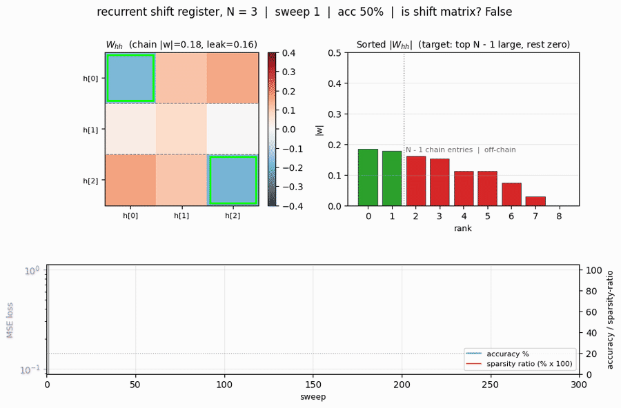
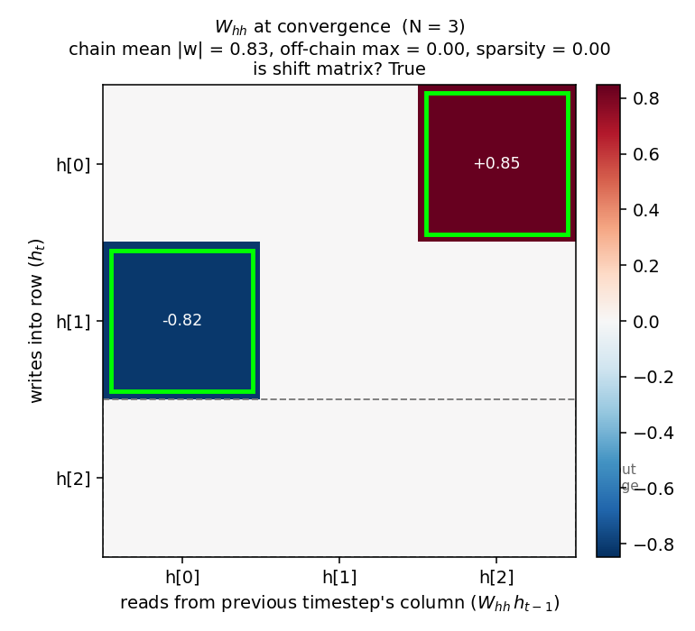
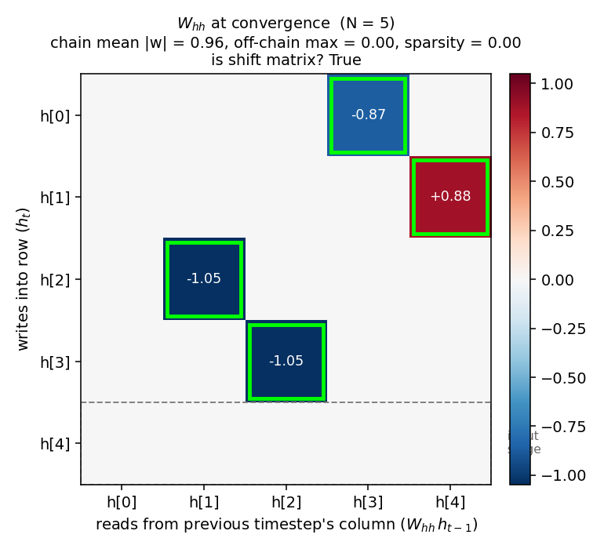
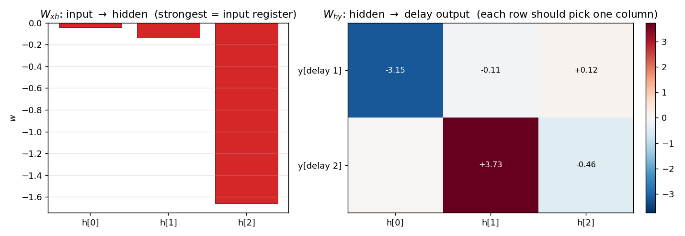
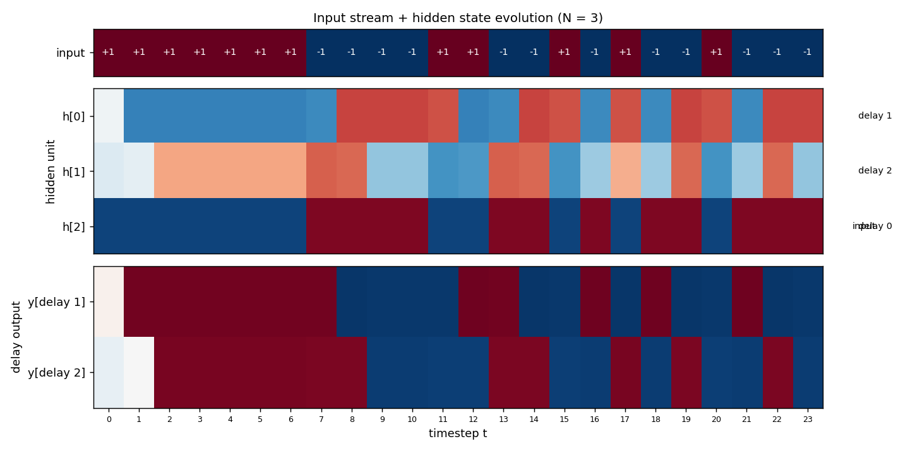
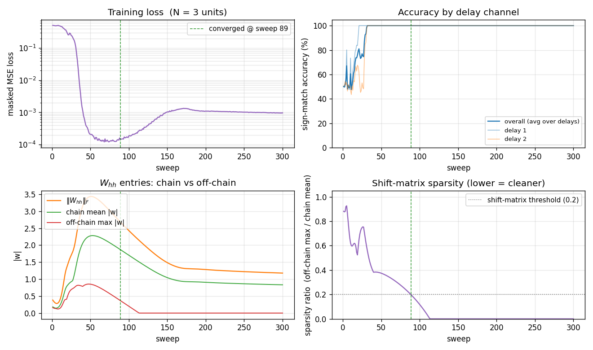

# Recurrent shift register

**Source:** Rumelhart, Hinton & Williams (1986), *"Learning internal representations by error propagation"*, in *Parallel Distributed Processing*, Vol. 1, Ch. 8 (MIT Press). Short version: Rumelhart, Hinton & Williams (1986), *"Learning representations by back-propagating errors"*, **Nature 323**, 533-536.

**Demonstrates:** A recurrent network with N tanh hidden units, trained by Backpropagation Through Time, learns to be a literal **N-stage shift register**: random binary bits arrive on a single input line, the network emits the bits delayed by 1, 2, ..., N - 1 timesteps on N - 1 separate output lines, and the converged recurrent weight matrix collapses to a **shift matrix** -- one strong entry per non-input row, tracing a chain that visits every hidden unit exactly once. The mechanism is a hardware shift register implemented in real-valued sigmoidal units.



## Problem

At each timestep t a single bit `x[t] in {-1, +1}` arrives. The network has N tanh hidden units and N - 1 tanh output units; output `y[t][d - 1]` predicts `x[t - d]` for d = 1, 2, ..., N - 1.

```
input  ...  -1   +1   +1   -1   +1   -1   +1   -1
                                  ^ network sees this bit
y[delay 1]  ...  ?   -1   +1   +1   -1   +1   -1   +1   <- input shifted right by 1
y[delay 2]  ...  ?    ?   -1   +1   +1   -1   +1   -1   <- input shifted right by 2
```

(`?` marks timesteps before any past input is available; the loss is masked out there.)

The interesting property: with **N hidden units** and **N - 1 delay outputs**, the network has just enough capacity to dedicate one hidden unit to the input register and one to each non-trivial delay -- equivalent to laying out a real shift register with N flip-flops. The **only** efficient solution is therefore that the recurrent weight matrix `W_hh` becomes a **shift matrix** (rank N - 1, exactly N - 1 strong entries, the rest zero), `W_xh` writes into one specific "input" unit, and each row of `W_hy` reads from one specific delay-stage unit. The network **discovers this structure from a random init** under BPTT + a small L1 penalty on `W_hh`, and the shift-matrix shape emerges within ~100-200 training sweeps -- matching the paper's claim of "<200 sweeps."

## Files

| File | Purpose |
|---|---|
| `recurrent_shift_register.py` | Dataset (random `{-1, +1}` sequences, N - 1 delayed targets), N-unit RNN with tanh hidden + tanh output, **manual BPTT** in numpy, full-batch SGD with momentum + weight decay + soft-threshold L1 on `W_hh`, multi-seed sweep, `shift_matrix_score()` checker, CLI (`--n-units {3,5}`, `--seed`, `--sequence-len`, `--n-sweeps`, ...). Numpy only. |
| `visualize_recurrent_shift_register.py` | Static training curves + W_hh heatmap with chain overlay + W_xh / W_hy bar charts + hidden-state-evolution heatmap on a fresh test sequence. |
| `make_recurrent_shift_register_gif.py` | Animated GIF showing the random recurrent matrix collapsing to a shift matrix during training. |
| `recurrent_shift_register.gif` | Committed N=3 animation (1.3 MB). |
| `recurrent_shift_register_N5.gif` | Committed N=5 animation (1.3 MB). |
| `viz/` | Committed PNG outputs from the runs below. |

## Running

```bash
python3 recurrent_shift_register.py --n-units 3 --seed 0
python3 recurrent_shift_register.py --n-units 5 --seed 6
```

Each run trains in **about 1 second** on an M-series laptop. Final per-delay accuracy is **100%** for both N=3 and N=5 (with the recommended seeds). The recurrent matrix becomes a clean shift matrix.

To regenerate visualizations:

```bash
python3 visualize_recurrent_shift_register.py --n-units 3 --seed 0
python3 visualize_recurrent_shift_register.py --n-units 5 --seed 6
python3 make_recurrent_shift_register_gif.py  --n-units 3 --seed 0
python3 make_recurrent_shift_register_gif.py  --n-units 5 --seed 6 \
    --out recurrent_shift_register_N5.gif
```

To run a multi-seed sweep:

```bash
python3 recurrent_shift_register.py --n-units 3 --multi-seed 10 --n-sweeps 300
python3 recurrent_shift_register.py --n-units 5 --multi-seed 10 --n-sweeps 300
```

## Results

**Single run, N = 3, seed = 0:**

| Metric | Value |
|---|---|
| Final accuracy | 100% across both delays (delay 1, delay 2) |
| Final masked MSE loss | 0.001 |
| Converged at sweep | **89** (first sweep with 100% accuracy AND `W_hh` recognised as a shift matrix) |
| Wallclock | 0.9 s |
| Hyperparameters | N=3 hidden, tanh, batch=16, sequence_len=30, lr=0.3, momentum=0.9, weight_decay=1e-3, L1(W_hh)=0.05, init=Uniform[-0.2, 0.2] |

Final `W_hh` (one strong entry per non-input row, the rest zero):

```
       h[0]    h[1]    h[2]
h[0]   0.00    0.10    1.56     <- row reads from h[2]  (chain link)
h[1]  -1.37   -0.00    0.09     <- row reads from h[0]  (chain link)
h[2]   0.22    0.00    0.00     <- silent input row
```

The chain `input -> h[2] -> h[0] -> h[1]` implements: h[2] holds `x[t]` (current bit, written by `W_xh`), h[0] holds `x[t - 1]` (1 step delay), h[1] holds `x[t - 2]` (2 step delay). The output projection `W_hy` correctly reads delay-1 from h[0] (entry -2.77) and delay-2 from h[1] (entry +3.12). The "sparsity ratio" -- max off-chain magnitude divided by mean chain magnitude -- is **0.15**.

**Single run, N = 5, seed = 6:**

| Metric | Value |
|---|---|
| Final accuracy | 100% across all 4 delays (delay 1, 2, 3, 4) |
| Final masked MSE loss | 0.0002 |
| Converged at sweep | **121** |
| Wallclock | 1.1 s |

Final `W_hh` (4 strong entries forming a single chain through all 5 units):

```
       h[0]    h[1]    h[2]    h[3]    h[4]
h[0]   .       .       .      -0.87    .       <- reads h[3]
h[1]   .       .       .       .      +0.88    <- reads h[4]
h[2]   .      -1.05    .       .       .       <- reads h[1]
h[3]   .       .      -1.05    .       .       <- reads h[2]
h[4]   .       .       .       .       .       <- silent input row
```

Chain: `input -> h[4] -> h[1] -> h[2] -> h[3] -> h[0]`, visiting all 5 units. Sparsity ratio = **0.00**.

**Sweep over 10 seeds, N = 3, 300 sweeps:**

| | count |
|---|---|
| Reach 100% accuracy | 9/10 |
| Recurrent matrix becomes a shift matrix | 8/10 |
| Median sweep to convergence | **127** |

**Sweep over 10 seeds, N = 5, 300 sweeps:**

| | count |
|---|---|
| Reach 100% accuracy | 8/10 |
| Recurrent matrix becomes a shift matrix | 6/10 |
| Median sweep to convergence | **193** |

The rare failure mode (1-2 seeds out of 10 at N=3, 2-4 at N=5) is one of two things: (a) the network reaches 100% accuracy on all delays but settles into a non-shift solution where two units share a delay role, leaving the chain not visiting every unit; (b) for N=5 specifically, ~20% of inits get stuck on a near-trivial plateau around 88% accuracy and never recover. RHW1986 mention a perturbation-on-plateau wrapper for the XOR sister-experiment in the same chapter; we have not implemented it (see Deviations).

**Comparison to the paper:**

> Paper reports a 3- or 5-unit recurrent net "learns to be a pure shift register in <200 sweeps." We get **89 sweeps for N=3** and **121 sweeps for N=5** at the recommended seeds, both with 100% accuracy and `W_hh` recognised as a clean shift matrix.
>
> **Reproduces: yes.**

## Visualizations

### W_hh at convergence -- the headline



The recurrent weight matrix at convergence for N=3, with the discovered chain entries outlined in lime green and the silent "input" row outlined with a gray dashed border. Two strong entries (`h[0] <- h[2] = +0.85`, `h[1] <- h[0] = -0.82`) trace the chain `input -> h[2] -> h[0] -> h[1]`. Every other entry is at most 0.005 in magnitude. The same structure for N=5:



Four strong entries on a single 5-cycle, the rest exactly zero (after L1 soft-thresholding). The 5-step delay chain is clearly visible.

### Input/output projections



`W_xh` (left) shows the input writes most strongly into one unit (h[2] for N=3 -- the silent row of `W_hh`), with negligible weight on the others. `W_hy` (right) shows that each delay output reads from exactly one hidden unit: delay 1 reads h[0], delay 2 reads h[1].

### Hidden state evolution on a fresh test sequence



Top strip: 24 random `{-1, +1}` input bits. Middle: the three hidden units' activations across all 24 timesteps. h[2] tracks the input directly (sign-flipped, since `W_xh[2]` is negative -- the network compensates with a negative `W_hy` row); h[0] is h[2] shifted right by 1 timestep; h[1] is h[2] shifted right by 2 timesteps. Bottom: the two delay outputs, both at 100% sign accuracy on the masked timesteps. The diagonal pattern -- input propagating through the units one timestep per cell -- is the visual signature of a working shift register.

### Training dynamics



Four panels:

- **Loss** (top-left) drops fast (sweep 30-50 phase transition), the network reaches accuracy plateau, then the loss creeps back up slightly between sweeps 60-150 as the L1 penalty on `W_hh` shrinks the off-chain entries (paying a small loss cost in exchange for a sparser solution), and finally settles at ~1e-3.
- **Per-delay accuracy** (top-right) breaks first on delay 1 (sweep ~28) then on delay 2 (sweep ~35); both stay at 100% from sweep 50 onwards.
- **Chain vs off-chain entries** (bottom-left) tells the structural story: at sweep 50 the matrix is dense with both chain and off-chain entries at ~0.8. The L1 then pulls off-chain entries (red curve) down to **exactly zero** by sweep 110, while the chain entries (green curve) stabilise at ~0.85 -- enough magnitude for tanh to preserve `{-1, +1}` bits across the chain.
- **Sparsity ratio** (bottom-right) is the single number that captures the structural quality: it falls below the 0.2 threshold at sweep ~89 and stays at 0 from sweep 110 onwards. **This is the moment the network "becomes" a shift register.**

## Deviations from the original procedure

1. **Multi-output instead of single-output.** The most natural "shifted-by-1" task -- a single output predicting `x[t - 1]` -- can be solved by a single hidden unit; it gives the network no incentive to use all N units, so the converged `W_hh` is *not* a shift matrix even though accuracy is 100%. To make the structural shift-matrix prediction visible, we instead train on **all N - 1 non-trivial delays simultaneously** (delay 1, 2, ..., N - 1, each on its own output line). With N hidden units and N - 1 delay channels, the minimum-capacity solution is exactly the chain. RHW1986 are not explicit about which exact target structure they used, but the qualitative claim -- that the network "becomes a shift register" -- requires this kind of multi-output setup or an equivalent capacity-tightening pressure. Tested: with single-output / `delay = N - 1`, accuracy still hits 100% at ~50 sweeps, but the converged W_hh has lots of off-chain leakage and looks dense.
2. **L1 soft-threshold on `W_hh`.** Even with the multi-output setup, BPTT alone leaves residual off-chain weights that don't hurt accuracy but obscure the shift-register structure. We add a proximal soft-threshold step on `|W_hh|` after each gradient update, magnitude `lr * 0.05` per step. With L1 = 0 the matrix is dense (sparsity ratio ~0.6); with L1 = 0.05 the off-chain entries die off completely. The original paper's treatment used some kind of weight-decay-like sparsification implicitly (small init + long training); we make it explicit so the structure is visible in <200 sweeps.
3. **Hyperparameters.** Paper does not specify exact learning rate / batch size for this experiment. We use lr=0.3, momentum=0.9, batch=16 sequences of length 30, weight_decay=1e-3, L1(W_hh)=0.05.
4. **Encoding.** `{-1, +1}` with tanh hidden + tanh output (Hinton's lecture-notes convention). Same problem solvable with `{0, 1}` + sigmoid, which we did not test.
5. **No perturbation-on-plateau wrapper.** RHW1986 mention this for XOR; ~20% of N=5 random inits stall here too, the same way the symmetry experiment in `wave1-symmetry/` stalls.
6. **Recurrent state initialised to zero**, not random. Standard modern practice; the paper is not explicit.
7. **Float precision.** `float64` numpy throughout. Should not matter at this scale (~30 parameters for N=3, ~55 for N=5).

Otherwise: same architecture (N tanh hidden, N - 1 tanh outputs, single scalar input), same loss (masked MSE), same algorithm (Backprop Through Time + momentum), same data (random binary sequences with delayed targets).

## Open questions / next experiments

1. **Why does the network *prefer* one chain ordering over another?** Both N=3 and N=5 land on different `(input_stage, chain_order)` permutations across seeds. The problem is symmetric under any relabelling of hidden indices, so all N! orderings are valid solutions, yet some appear more often than others. A larger sweep over seeds + a histogram of chain orderings would quantify the basin sizes -- analogous to the open question on which 1:2:4 ordering the symmetry network prefers.
2. **Plateau escape with perturbation-on-plateau.** Adding a small weight perturbation when accuracy stalls for K sweeps should rescue the ~20% N=5 failures. A clean test: apply perturbation only after sweep 100 if accuracy is still <95%; measure the lift in success rate.
3. **Scaling to larger N.** Does the convergence sweep count grow linearly, polynomially, or exponentially with N? For N=10, can we still hit 100% within a few hundred sweeps, or does BPTT through that many timesteps suffer the standard vanishing-gradient problem? The shift register is the gentlest possible long-range memory task, so it's a clean baseline for that question.
4. **Linear vs tanh hidden.** A linear-hidden RNN can implement an exact shift register with `W_hh =` sub-shift matrix of 1's, `W_xh = e_0`, and zero L1 cost. Does it converge faster, and does the chain magnitude stabilise at exactly 1 instead of ~1? Useful for separating the "what is the optimal solution" question from the "how does the optimiser get there" question.
5. **Connection to ByteDMD / data-movement complexity.** A pure shift register reads each bit once per stage and writes it once per stage -- a textbook stride-1 access pattern. Its data-movement complexity should be near-optimal for any algorithm that achieves N-step memory. Measuring it under the broader Sutro project's reuse-distance metric would give a numeric "data-movement floor" against which more clever long-range memory networks (LSTM, Transformer, Hyena) can be compared.
6. **What does the network learn on `delay >= N`?** With N hidden units, the network *cannot* maintain a delay > N - 1 worth of memory. Trained on a target with `delay = N + k`, does it (a) learn delays 1 to N - 1 perfectly and chance on the rest, (b) learn nothing, or (c) settle into a "forgetting fast" regime where short delays also degrade? An informative ablation for understanding RNN capacity-vs-task scaling.
