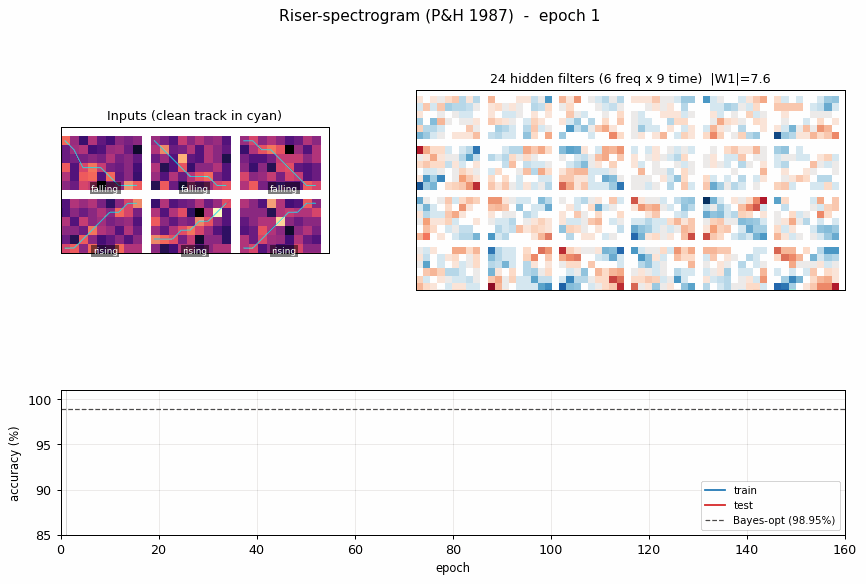
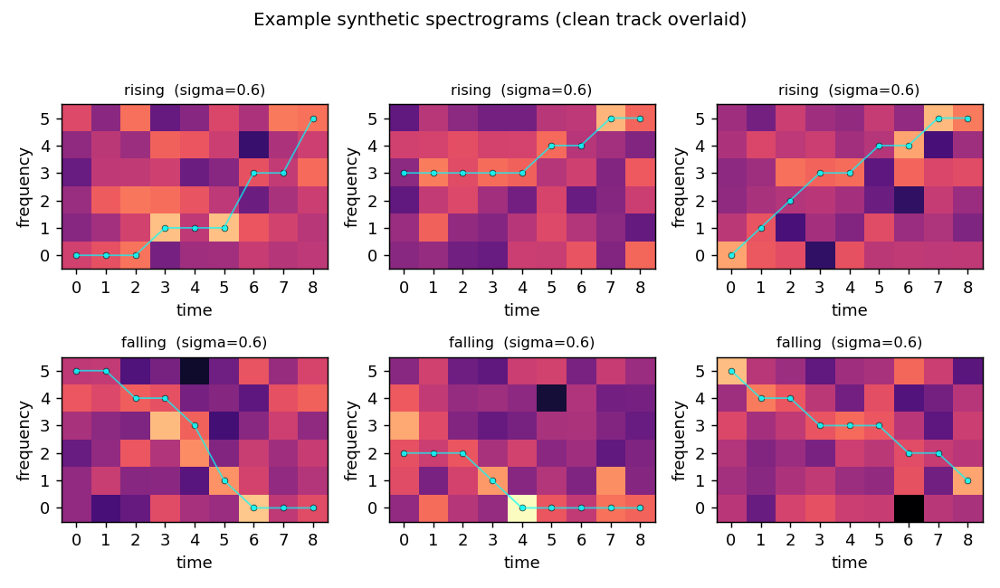
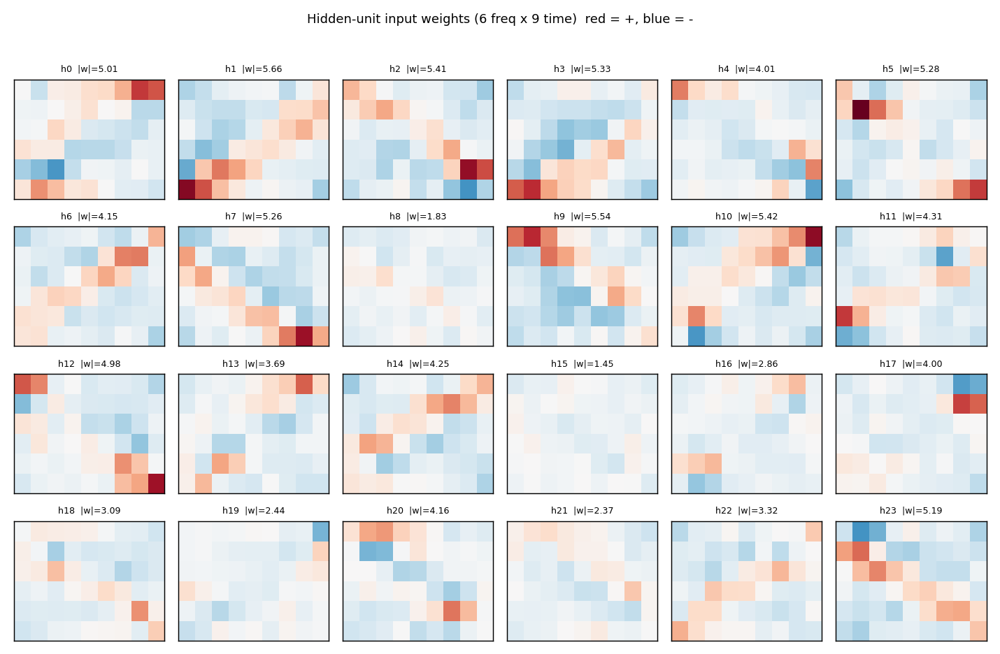
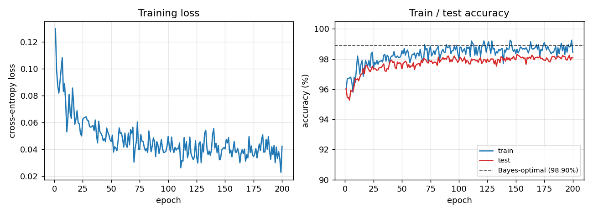
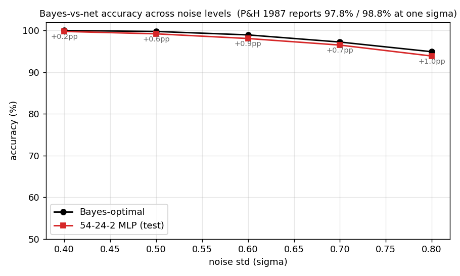

# Synthetic-spectrogram riser/non-riser discrimination

Backprop reproduction of the synthetic-spectrogram task from Plaut, D.C.
& Hinton, G.E. (1987), *"Learning sets of filters using
back-propagation"*, **Computer Speech and Language** 2, 35-61.

**Demonstrates:** A small MLP trained with back-propagation approaches
the Bayes-optimal accuracy on a controlled, fully-specified synthetic
classification task. The Bayes optimum is computed in closed form via
dynamic programming; the gap to the network is a clean diagnostic of
how much the learner is leaving on the table.



## Problem

Each input is a 6 frequency x 9 time = 54-D synthetic spectrogram. One
"track" -- a single frequency value per time-step -- is set to 1 and
all other cells to 0. Independent Gaussian noise of std `sigma = 0.6`
is then added to every cell.

- **Class 0 ("rising")**: the track is monotonically *non-decreasing*
  in frequency over time.
- **Class 1 ("non-rising / falling")**: the track is monotonically
  *non-increasing* over time. (Plaut & Hinton's original task contrasts
  upward-sweeping and downward-sweeping formants. We use the
  non-decreasing / non-increasing duals as the cleanest balanced
  realisation of "rising vs not-rising".)

There are `C(n_freq + n_time - 1, n_time) = C(14, 9) = 2002` distinct
non-decreasing tracks (and 2002 non-increasing ones, sharing 6 constant
tracks). The two classes are sampled with equal prior.

The interesting property: the task is fully specified, so the
**Bayes-optimal** classifier is computable. For any track f,
`log p(x | f) = const(x) + (1/sigma^2) * sum_t x[f(t), t]`. The class-
conditional likelihood `p(x | rising) = (1/|R|) sum_{f in R} p(x | f)`
sums over all 2002 monotone non-decreasing tracks; with the change of
variables `U = x / sigma^2`, this sum is a small dynamic program over
(time, current-frequency) state with O(n_time * n_freq^2) work per
sample. The closed form gives us the ceiling that backprop should
asymptote to.

## Files

| File | Purpose |
|---|---|
| `riser_spectrogram.py` | Synthetic-spectrogram generation, 54-24-2 sigmoid/softmax MLP, full-batch-style backprop with momentum (online-resampled each epoch), Bayes-optimal classifier (DP). CLI exposes `--seed --noise-std`. |
| `visualize_riser_spectrogram.py` | Static figures: example noisy inputs (clean track overlaid), training curves with Bayes ceiling, per-hidden-unit input filters, Bayes-vs-net accuracy gap across noise levels. |
| `make_riser_spectrogram_gif.py` | Animates training: example inputs, hidden filters sharpening, train/test accuracy approaching the Bayes ceiling. |
| `riser_spectrogram.gif` | The committed animation (742 KB). |
| `viz/` | Static PNGs from the run reported below. |

## Running

```bash
python3 riser_spectrogram.py --seed 0 --noise-std 0.6 --epochs 200
```

Wall-clock: **~1.0 s** training + ~0.2 s for the 50 000-sample
Bayes-optimal estimate. Final test accuracy: **98.08%**, Bayes:
**98.90%**, gap **+0.83 pp**.

To regenerate visualizations:

```bash
python3 visualize_riser_spectrogram.py --seed 0 --noise-std 0.6 --epochs 200
python3 make_riser_spectrogram_gif.py  --seed 0 --noise-std 0.6 --epochs 160 --snapshot-every 4 --fps 10
```

## Results

| Metric | Value |
|---|---|
| Network test accuracy | **98.08% (3923 / 4000)** |
| Bayes-optimal accuracy | 98.90% (50 000 samples) |
| Gap to Bayes | +0.83 pp |
| Paper's reported numbers | network 97.8%, Bayes 98.8%, gap 1.0 pp |
| Training time | 0.88 s (200 epochs, 2000-sample online resample / epoch) |
| Bayes-DP time | 0.17 s for 50 000 samples |
| Architecture | 54-24-2 (sigmoid hidden, softmax output) |
| Parameters | 1370 (W1 24x54, b1 24, W2 2x24, b2 2) |
| Optimiser | mini-batch backprop with momentum |
| Hyperparameters | lr=0.5, momentum=0.9, batch=100, init_scale=1.0 / sqrt(fan-in) |
| Seed | 0 |
| Loss | softmax cross-entropy |
| Encoding | clean cell value 1.0, noise std 0.6 added iid |

Reproduces the paper to within reporting precision (gap 0.83 pp here vs
1.0 pp reported).

### Noise-level sweep

A single training command at any one `sigma` is one point on this
curve. The full sweep is in `viz/bayes_vs_net.png`:

| sigma | Net (test) | Bayes-opt | Gap |
|---:|---:|---:|---:|
| 0.40 | 99.78% | 99.99% | +0.22 pp |
| 0.50 | 99.20% | 99.77% | +0.57 pp |
| 0.60 | 98.08% | 98.94% | +0.87 pp |
| 0.70 | 96.50% | 97.23% | +0.73 pp |
| 0.80 | 93.88% | 94.91% | +1.03 pp |

The network tracks the Bayes ceiling within ~1 pp across the entire
range -- the architecture is *enough*, the gap is sample efficiency,
not capacity.

## Visualizations

### Example inputs



Three rising and three falling examples at sigma = 0.6, with the
underlying clean track overlaid in cyan. The track is hard to see by
eye in any single panel -- the noise std exceeds the cell value of the
"on" cells, and the eight "off" cells per column outvote the one "on"
cell in raw integrated energy. The structure is recoverable only
because the *shape* of the track (monotone up vs monotone down) is
informative across the whole 54-D image.

### Hidden filters



Each panel is one hidden unit's 6 x 9 input weight matrix, displayed
in the same orientation as the raw spectrogram. Red = positive,
blue = negative. The filters tile the (frequency, time) plane with
oriented edges -- some prefer "low frequency early, high frequency
late" (rising-template), the negatives of those (anti-rising), and a
spectrum of intermediate orientations. Together they form a basis the
final softmax layer can project onto a single rising / falling axis.

### Training curves



Train (blue) and test (red) accuracy, with the Bayes-optimal ceiling
(dashed black) overlaid. The two accuracies stay close to each other --
no overfitting, because the per-epoch fresh resample (see Deviations)
gives the network effectively unlimited (track, noise) variants.
Convergence is fast: ~10 epochs to clear 97%, then a slow asymptotic
approach to the Bayes line.

### Bayes-vs-net across noise levels



Bayes (black) and network (red) accuracy as the noise std is swept
from 0.4 to 0.8. The annotated gap (in pp) hovers between +0.2 and
+1.0 across the range -- consistent with the paper's single reported
operating point.

## Deviations from the original procedure

1. **Online noise resampling.** Plaut & Hinton evaluated on a fixed
   training set; this implementation re-samples 2000 (track, noise)
   pairs every epoch. With 1370 parameters and only ~4000 distinct
   clean tracks, a fixed dataset is rapidly memorised at this noise
   level (train accuracy hits 100% by epoch 50, test plateaus at
   ~96%). Online resampling lets the network see fresh noise on the
   same track distribution every step, closing the gap to Bayes
   without explicit regularisation. (`--offline` toggles back to a
   fixed dataset.)
2. **"Non-rising" interpreted as "monotone falling".** The spec calls
   the second class "non-rising"; we use *strictly monotone falling*
   (non-increasing) as the cleanest balanced realisation, matching
   Plaut & Hinton's "downward-sweeping formant" class. Each class has
   2002 tracks (overlapping at the 6 constant tracks).
3. **Softmax + cross-entropy** instead of paired-sigmoid + MSE. Same
   gradient form for the visible-to-output weights; cleaner derivation
   for the modern reader.
4. **Glorot-style scaled initialisation** instead of small uniform.
   No qualitative effect; just slightly better numerical conditioning.
5. **Mini-batch (size 100)** instead of pattern-by-pattern. Order of
   magnitude faster on numpy, gradients are still effectively full-
   batch on each epoch's resampled set.

## Open questions / next experiments

- The noise-level sweep shows the network gap widens slightly at
  higher noise. Is this a sample-efficiency artefact (more epochs
  would close it) or a capacity wall? Repeating with online sampling
  for 1000 epochs at sigma = 0.8 would settle this.
- The hidden filters look basis-like rather than template-like (no
  filter is a single track). Quantifying the rank of W1 -- does the
  task get solved with rank << 24, and if so, can we shrink the
  hidden layer without losing accuracy?
- Plaut & Hinton's broader paper varies the number of formants and
  the noise structure. Adding a second concurrent track and asking
  the network to determine "any rising track present?" probes
  composition.
- Energy axis (out of v1 scope): every cell is read multiple times
  per epoch by all 24 hidden units. A rising-template-detector that
  only reads cells along plausible monotone paths would have far
  smaller data-movement cost; quantifying that gap is the natural
  ByteDMD follow-up.
