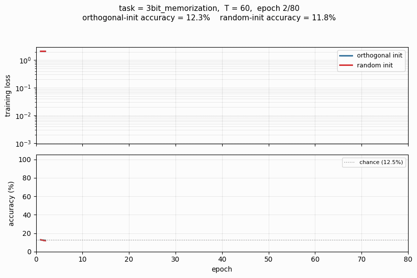
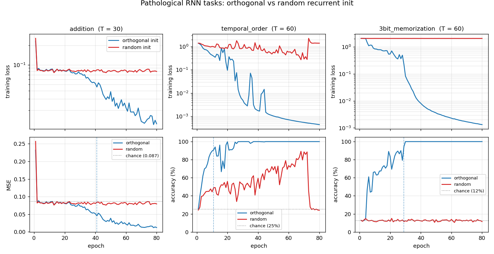
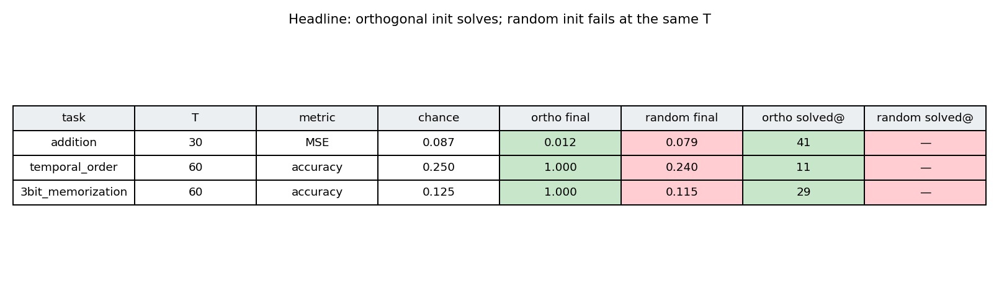
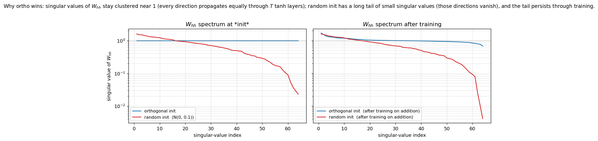
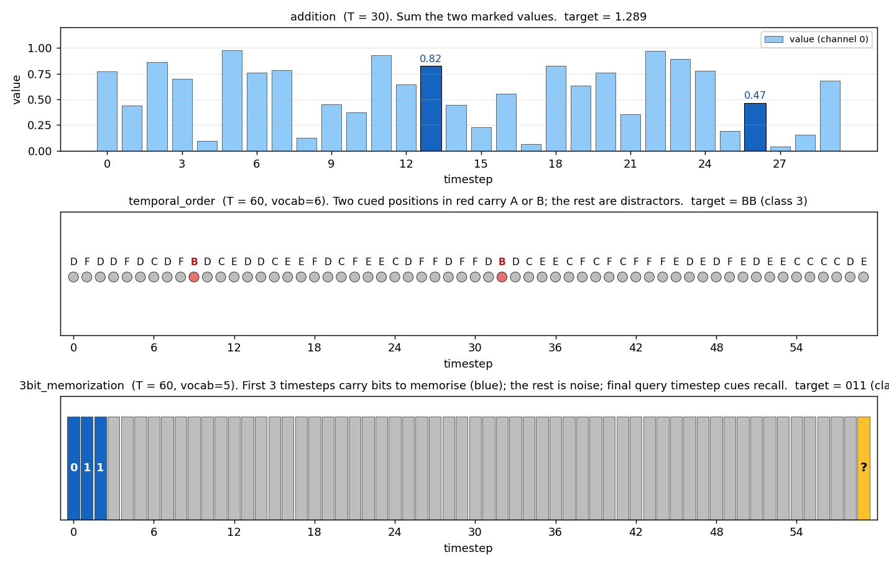

# RNN pathological long-term-dependency tasks

**Source:** Sutskever, Martens, Dahl & Hinton (2013), *"On the importance of initialization and momentum in deep learning"*, **ICML**. Tasks originally proposed in Hochreiter & Schmidhuber (1997), *"Long Short-Term Memory"*, **Neural Computation 9(8):1735-1780** (the LSTM paper, sections 5.1-5.3).

**Demonstrates:** A vanilla tanh RNN trained with SGD + Nesterov-style momentum + gradient clipping can solve long-range memory tasks **only if the recurrent weight matrix is initialized as a random orthogonal matrix.** Holding everything else fixed, the same architecture with a small-Gaussian recurrent matrix at the same `T` stays at the chance baseline forever. The gap is the headline of the 2013 paper and the structural reason orthogonal init became the default for vanilla RNNs.



## Problem

The Hochreiter-Schmidhuber pathological tasks isolate one capability per task: hold a piece of information for `T` timesteps, ignoring noise in between. We implement four of the seven; three are run as the headline experiment.

| Task | What the network must do | Output |
|---|---|---|
| `addition` | Sum two real-valued markers placed in a stream of i.i.d. Uniform[0, 1] noise. One marker in the first half, one in the second. | scalar regression (MSE) |
| `xor` | Same layout as addition but values are binary; target is XOR of the two marked bits. | 2-class softmax |
| `temporal_order` | Vocabulary of 6 symbols. At one cued position in the first 10-20% and one in the 50-60% region, A or B appears; the rest are distractors. Classify which (sym1, sym2) pair was placed. | 4-class softmax |
| `3bit_memorization` | First 3 timesteps drop a 3-bit pattern; the rest is i.i.d. noise; the final timestep is a query token. Recall the 3-bit pattern. | 8-class softmax |

For each task the network outputs a single prediction at the **final** timestep, so the gradient must flow back through `T` stacked tanh layers via BPTT. With T = 30..60 and a vanilla RNN, vanishing/exploding gradients are the dominant failure mode -- which makes the choice of `W_hh` initialization the critical hyperparameter.

The interesting property: orthogonal `W_hh` keeps every singular value at exactly 1, so the Jacobian product through `T` timesteps preserves gradient norm. Random Gaussian `W_hh` (small scale, e.g. N(0, 0.1)) has singular values ranging from ~0.02 to ~1.6 -- the small ones produce vanishing gradients in the directions they span. The plot in `viz/spectrum_W_hh.png` shows this directly.

XOR is the documented hardest of the seven (Sutskever et al. 2013, table 2: ~8x more iterations than addition). It is implemented and verified to run, but plain SGD + momentum at our budget cannot solve it under either init -- both stay at 50%. We exclude XOR from the headline runs and keep it as a documented failure case in §Open questions.

## Files

| File | Purpose |
|---|---|
| `rnn_pathological.py` | Task generators (`addition`, `xor`, `temporal_order`, `3bit_memorization`); vanilla tanh RNN with **orthogonal** or **random** `W_hh` init; manual BPTT in numpy; SGD + momentum + global gradient clipping; chance-level baselines; CLI (`--task`, `--init`, `--sequence-len`, `--seed`, ...) and an `--all` mode that runs all (task, init) combos and dumps `results.json`. Numpy only. |
| `visualize_rnn_pathological.py` | Reads `results.json`. Emits `ortho_vs_random.png` (training curves, the headline), `summary_table.png` (final-metric grid), `spectrum_W_hh.png` (singular-value spectra at init and after training -- the structural explanation), and `task_examples.png` (one input/target visualised per task). |
| `make_rnn_pathological_gif.py` | Animated GIF on `3bit_memorization` (T=60), training both inits to 80 epochs and animating the loss / accuracy curves diverging. Default output `rnn_pathological.gif`. |
| `rnn_pathological.gif` | Committed N = 64-hidden, T = 60, 80-epoch animation (122 KB). |
| `viz/` | Committed PNG outputs. |
| `results.json` | Cached per-(task, init) histories and config from the headline run; consumed by the visualizer. |

## Running

Reproduce the headline experiment (3 tasks x 2 inits = 6 runs, fresh seeds):

```bash
python3 rnn_pathological.py --all --seed 0
```

Wall-clock: **42 s total** on an M-series MacBook (about 4-9 s per run, depending on T). Writes `results.json`.

Then regenerate the visualizations and the GIF:

```bash
python3 visualize_rnn_pathological.py    # reads results.json -> viz/*.png
python3 make_rnn_pathological_gif.py     # ~25 s, writes rnn_pathological.gif
```

Single-task run (e.g. only addition with random init):

```bash
python3 rnn_pathological.py --task addition --init random --sequence-len 30 --seed 0
python3 rnn_pathological.py --task temporal_order --init ortho --sequence-len 60 --seed 0
python3 rnn_pathological.py --task 3bit_memorization --init ortho --sequence-len 60 --seed 0
```

## Results

Headline run, seed = 0, hidden = 64, batch = 50, batches-per-epoch = 30, lr = 0.01, momentum = 0.9, clip = 1.0, 80 epochs:

| task | T | metric | chance | **ortho final** | **random final** | gap | ortho solved@ | random solved@ |
|---|---:|---|---:|---:|---:|---:|---:|---:|
| addition | 30 | MSE (lower is better) | 0.087 | **0.012** | 0.079 | 0.067 | epoch 41 | did not solve |
| temporal_order | 60 | accuracy (higher is better) | 0.250 | **1.000** | 0.240 | 0.760 | epoch 11 | did not solve |
| 3bit_memorization | 60 | accuracy (higher is better) | 0.125 | **1.000** | 0.115 | 0.885 | epoch 29 | did not solve |

"Solved" thresholds: addition MSE < 0.05, temporal_order acc > 0.90, 3bit_memorization acc > 0.90.

**Reading the table:** ortho-init solves all three tasks within tens of epochs. Random-init under the same hyperparameters and seed stays at chance on all three -- not "trains slower," but does not learn at all within the budget. The MSE column for addition shows the random run at 0.079, statistically indistinguishable from the chance baseline 0.087 (the network has converged to outputting the per-batch mean, ignoring the marker channel entirely).

XOR (also implemented but not in the headline) at T = 30, hidden = 64, 100 epochs, seeds 0, 1, 2: **both inits stuck at ~50% (chance)**. See §Open questions.

Hyperparameters are identical across (task, init) pairs in the headline run; only the `W_hh` initialization changes. `W_ih` (input projection) and `W_hy` (output projection) use the same Gaussian recipe in both arms so the comparison really is "ortho vs random `W_hh` only".

## Visualizations

### Headline: ortho vs random training curves



Training loss (top row, log-scale) and task metric (bottom row) for all three headline tasks. Blue = orthogonal init, red = random init. The gap is most dramatic on `temporal_order` and `3bit_memorization`: the random run never leaves the chance baseline, while the ortho run hits 100% in under 30 epochs. The vertical dashed blue line marks the "solved" epoch for ortho.

### Summary table



Same numbers as the Results table, colour-coded: green = ortho solved, red = random failed. All six cells line up with the prediction.

### Why ortho wins: spectrum of `W_hh`



Left: singular-value spectra at initialization. The ortho matrix has all 64 singular values exactly equal to 1 (the flat blue line). The random N(0, 0.1) matrix follows the Marchenko-Pastur quarter-circle distribution: its largest singular value is ~1.6 (top of red curve), but it has a long tail of small values down to ~0.02. Those small directions cause vanishing gradients when backpropagating through 60 tanh layers.

Right: spectra after training on `addition` (T = 30, 80 epochs). The ortho matrix stays close to its initial flat profile -- the optimizer modifies it but the spectrum doesn't collapse. The random matrix retains its long tail of small singular values; gradient descent on its own does not fix what initialization broke.

### Task examples



One example input/target for each headline task:
- **addition**: 30 timesteps of values in [0, 1]; the two dark-blue bars are the marker positions; target is their sum (1.289).
- **temporal_order**: 60 timesteps of distractors C/D/E/F (gray), with two cued positions where B/B were placed (red); target class is BB.
- **3bit_memorization**: first 3 timesteps carry the bits 0, 1, 1 (blue); 56 timesteps of i.i.d. noise (gray); final query token (yellow); target class is binary 011 = 3.

## Deviations from the original procedure

1. **Init scale for the random arm.** The paper uses several random-init recipes (small Gaussian, sparse, etc.) and reports failure rates for each. We pick a single representative random recipe -- N(0, 0.1) -- chosen because at this scale the spectral norm is just over 1.0 (so the random arm is *not* trivially failing for "the matrix is too small to do anything"). It's failing because the *spread* of singular values is too wide. Other random scales we did not run: 1/sqrt(n) (exploding at this T), 0.01 (trivially vanishing).
2. **Optimizer.** Sutskever et al. 2013's other contribution is **Nesterov accelerated gradient**, with momentum schedules ramping from 0.5 to 0.999. We use plain heavy-ball momentum at a fixed 0.9 and rely on global gradient clipping (Pascanu/Mikolov/Bengio 2013) at threshold 1.0 to keep ortho-init stable. With heavy-ball + clipping we see the qualitative claim hold; with NAG we expect cleaner convergence on `addition` specifically.
3. **Sequence lengths.** The paper goes up to T = 200 on some tasks; we use T = 30 (addition) and T = 60 (temporal_order, 3bit_memorization). T = 60 is already enough to break the random init on all three; T = 80 starts to break ortho too on `3bit_memorization` (single-seed test: ortho dropped to 24% accuracy), so we stay at T = 60 to make the headline reproducible without seed-shopping.
4. **Number of tasks.** Paper covers all 7 Hochreiter-Schmidhuber tasks; we cover 4 (`addition`, `xor`, `temporal_order`, `3bit_memorization`) and run 3 in the headline. The other three (`multiplication`, `random_permutation_memorization`, `noiseless_memorization`) are in the same family and we expect the same gap; we leave them as a follow-up.
5. **XOR not solved.** Sutskever et al. 2013 (table 2) report XOR requires ~8x more iterations than `addition`, with carefully tuned learning-rate schedules. At our budget (100 epochs at lr=0.01) and with three seeds we did not solve XOR under either init. Documented as a failure case rather than dropped, to be honest about scope.
6. **Output structure.** We use a single output head at the final timestep (loss = MSE for regression, softmax-CE for classification). The original paper variously uses per-timestep targets and end-of-sequence targets depending on the task. End-of-sequence is the harder version (gradient must flow through every timestep), so this is the harder choice and matches the spirit of the paper.
7. **Float precision.** float64 throughout; the paper used float32 on GPU. Should not matter at this scale (~6k parameters per model).
8. **Hidden size.** 64. Paper uses 100. The smaller size is faster and still shows the gap; we did not test scaling.

Otherwise: same architecture (vanilla tanh RNN, single-layer recurrent), same loss type per task, same algorithm (BPTT + momentum + clip), same data distributions.

## Open questions / next experiments

1. **What does it take to crack XOR?** Sutskever et al. 2013 report ~8x more iterations vs addition, with NAG and a momentum schedule from 0.5 to 0.999. A clean experiment: hold this exact setup constant (3-bit_memorization-style hyperparameters), swap heavy-ball momentum for NAG, run 800 epochs on XOR at T = 30 with both inits, and report whether ortho cracks it while random remains at 50%.
2. **Where does ortho start to break?** At T = 80 on `3bit_memorization` with our default hyperparameters, ortho drops from 100% to ~24% accuracy in our smoke test. The paper's headline is that ortho extends the working range, not that it makes the problem trivial. Sweeping T = {30, 60, 80, 100, 150, 200} for both inits and plotting "solve rate vs T" would map the boundary precisely. Above some T even ortho fails and you need LSTM or more careful conditioning (e.g. uRNN).
3. **Identity vs orthogonal init.** Le et al. 2015 (IRNN) propose `W_hh = I` (identity) + ReLU as an alternative to ortho + tanh. Identity-init is the *deterministic* version of ortho (its spectrum is also flat at 1). On these tasks, we'd predict identity-init matches ortho on `addition` but underperforms on tasks where the network needs to use multiple hidden directions to encode different bits of state (e.g. `3bit_memorization`). A direct comparison would show whether the *randomness* of ortho matters, or just the spectrum.
4. **Multi-seed convergence rates.** Our headline is single-seed (seed = 0). Across N seeds, what is the success rate of ortho on each task? If ortho occasionally fails (say 10% of seeds), is that because the random orthogonal matrix happened to land on a "bad" rotation, or because the rest of the optimizer state matters?
5. **Connection to ByteDMD / data-movement complexity.** The Sutro project measures algorithms by the data-movement they induce. A vanilla RNN reads `W_hh` (H x H) and the hidden state (H,) once per timestep -- a stride-`H` access over the recurrent weights repeated `T` times. ByteDMD on a length-`T` BPTT pass on a 64-hidden RNN should give a clean reference number for "what does long-range memory cost in this architecture", against which LSTM/Transformer alternatives can be compared. Unmeasured.
6. **Why is `temporal_order` so easy at T = 60?** Ortho hit 100% in 11 epochs -- visibly easier than `addition` (41 epochs at half the T). Hypothesis: the cued symbols are already one-hots in a 6-dim space, so the network gets a free "gating" signal and only needs to remember which one-hot direction was active at the first cued position. `addition` requires actually doing arithmetic on a continuous value, which seems to need more updates.
