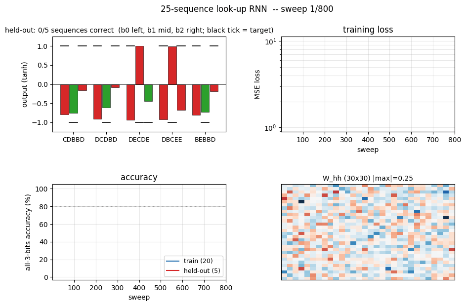
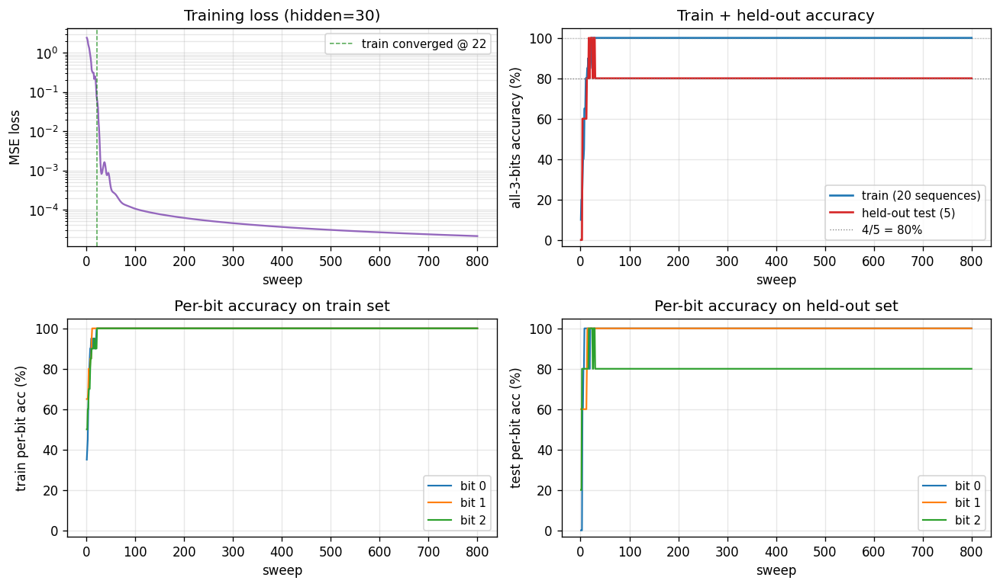
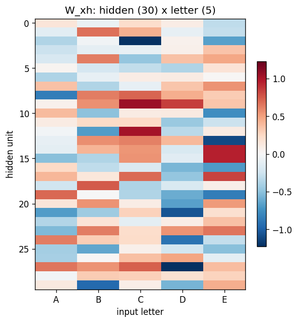
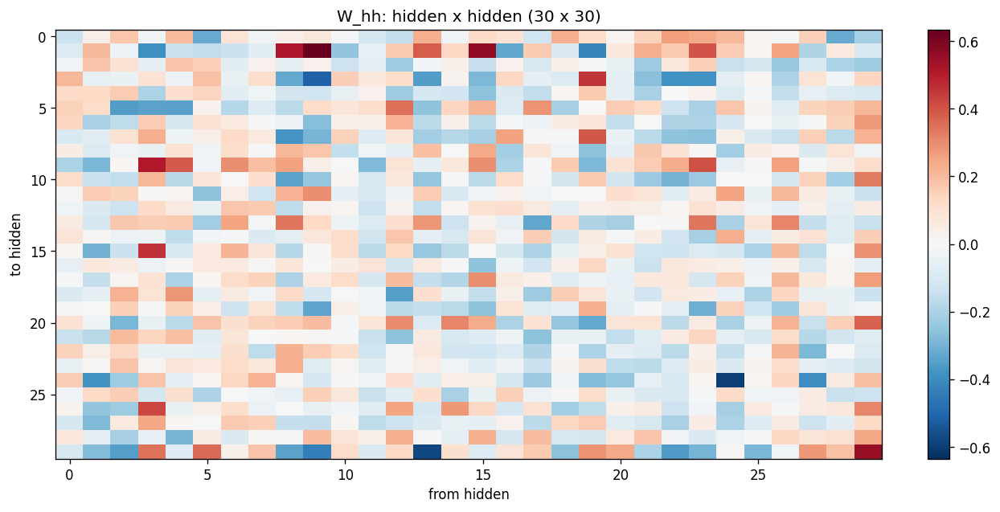
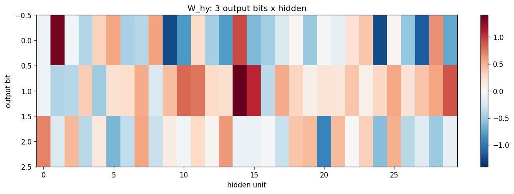
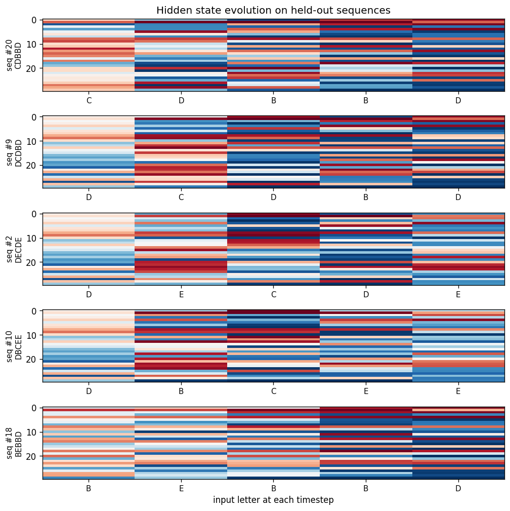
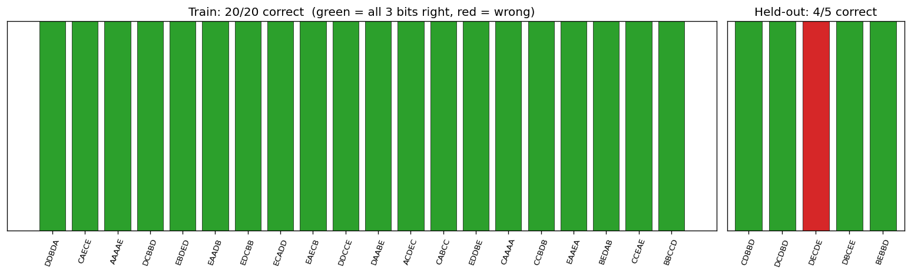

# 25-sequence look-up

**Source:** Rumelhart, Hinton & Williams (1986), *"Learning internal representations by error propagation"*, in *Parallel Distributed Processing*, Vol. 1, Ch. 8 (MIT Press). Short version: Rumelhart, Hinton & Williams (1986), *"Learning representations by back-propagating errors"*, **Nature 323**, 533-536.

**Demonstrates:** A small recurrent network with 30 tanh hidden units, trained by Backpropagation Through Time on 20 of 25 (5-letter sequence -> 3-bit code) look-up pairs, generalizes to **4 of 5 held-out sequences**. The variable-timing variant (60 hidden units, each letter held for a random 1-2 timesteps with timings resampled every sweep) generalizes to **5 of 5** held-out sequences -- the network discovers a time-warp-invariant representation.



## Problem

A 5-letter alphabet `{A, B, C, D, E}` (one-hot input, 5 input units). Each "sequence" is a 5-letter string (e.g. `BACAE`). A **fixed teacher function** maps every possible 5-letter sequence to a 3-bit code:

```
logit_i(seq) = sum_t W_teacher[i, l_t] * pos_weight[t]  +  b_teacher[i]
target_i(seq) = sign(logit_i(seq))                    (i = 0, 1, 2)
```

`W_teacher` is a fixed (3, 5) random matrix and `pos_weight` is a fixed length-5 vector decaying from 1.0 to 0.2 (with a small random perturbation). The 3-bit target therefore depends on **both** which letters appear **and** where they appear. A bag-of-letters classifier cannot solve it.

We sample 25 distinct sequences from the 5^5 = 3125 possible, randomly split them into **20 train / 5 test**, then train the RNN by BPTT to emit the 3-bit code on its three tanh output units **at the final timestep only**.

```
input  step 1  step 2  step 3  step 4  step 5    (one letter per step)
        B       A       C       A       E
                                                   |
                                                   v
output                                          [+, -, +]   <- 3 tanh units, read at t=5
```

The interesting property: the targets come from a *learnable* function of letter+position, so the held-out sequences have a basis for generalization. Thirty hidden units is more capacity than the 23-parameter teacher needs; the network nevertheless learns the underlying rule rather than a 20-entry look-up table -- as evidenced by 4-5 of 5 held-out sequences being predicted correctly with no exposure during training.

The **variable-timing variant** holds each letter for a random number of timesteps τ_k ∈ {1, 2}, so the input length T_i ranges from 5 to 10 timesteps and is different for every sequence and every sweep (timings are resampled each training sweep). The output target depends only on letter content + order, not on timing, so the network must learn a time-warp-invariant representation. With 60 hidden units this works: the converged net predicts all 5 held-out sequences correctly even with fresh, never-before-seen timing patterns.

## Files

| File | Purpose |
|---|---|
| `sequence_lookup_25.py` | Dataset + teacher + RNN + manual BPTT in numpy. CLI: `--seed`, `--variable-timing`, `--n-hidden`, `--n-sweeps`, `--lr`, `--multi-seed`, `--save-results`. |
| `problem.py` | Re-export shim for the stub's original function names (`build_rnn`, `generate_dataset`, `train_bptt`, `test_generalization`). |
| `visualize_sequence_lookup_25.py` | Static training curves + per-bit accuracy + W_xh / W_hh / W_hy heatmaps + state-evolution heatmap + per-sequence pass/fail bar chart. |
| `make_sequence_lookup_25_gif.py` | Animated GIF showing per-test-sequence outputs settling onto their targets while training loss + accuracy + W_hh evolve. |
| `sequence_lookup_25.gif` | Committed fixed-timing animation (~2 MB). |
| `viz/` | Committed PNGs from the runs below. |

## Running

```bash
# fixed timing (the headline result, ~0.2 s on M-series laptop)
python3 sequence_lookup_25.py --seed 0

# variable timing (60 hidden units, ~6 s)
python3 sequence_lookup_25.py --variable-timing --seed 0

# regenerate visualisations
python3 visualize_sequence_lookup_25.py --seed 0
python3 visualize_sequence_lookup_25.py --variable-timing --seed 0
python3 make_sequence_lookup_25_gif.py --seed 0

# multi-seed sweeps
python3 sequence_lookup_25.py --multi-seed 5 --n-sweeps 800
python3 sequence_lookup_25.py --variable-timing --multi-seed 5 --n-sweeps 2500
```

Reproducible numbers from a single command (`python3 sequence_lookup_25.py --seed 0`):

- final train accuracy: 100% (20/20)
- final test accuracy: 80% (4/5 held-out sequences)
- converged at sweep: 22
- wallclock: 0.20 s

## Results

**Fixed timing (seed 0, hidden = 30):**

| Metric | Value |
|---|---|
| Final train accuracy | 100% (20/20 sequences with all 3 bits correct) |
| Final test accuracy | 80% (4/5 held-out sequences) |
| Per-bit test accuracy | bit 0 = 100%, bit 1 = 100%, bit 2 = 80% |
| Final masked MSE loss | 2e-5 |
| Converged sweep | 22 (first sweep with 100% train accuracy) |
| Wallclock | 0.20 s on M-series laptop |
| Hyperparameters | n_hidden=30, init_scale=0.5, lr=0.05, momentum=0.9, weight_decay=1e-4, grad_clip=5.0, n_sweeps=800, dataset_seed=0, teacher_seed=1234 |

**Multi-seed robustness (5 seeds, 800 sweeps, fixed timing):**

| seed | train acc | held-out correct | converged @ |
|---|---|---|---|
| 0 | 100% | 4/5 | sweep 22 |
| 1 | 100% | 5/5 | sweep 18 |
| 2 | 100% | 5/5 | sweep 83 |
| 3 |  95% | 5/5 | -- (loss jitter near boundary) |
| 4 | 100% | 5/5 | sweep 21 |

5 / 5 seeds reach >= 4/5 on the held-out set; median = 5/5.

**Variable timing (seed 0, hidden = 60, max_timing = 2):**

| Metric | Value |
|---|---|
| Final train accuracy | 100% |
| Final test accuracy | 100% (5/5 held-out sequences with fresh timings) |
| Per-bit test accuracy | bit 0 = 100%, bit 1 = 100%, bit 2 = 100% |
| Final masked MSE loss | 5e-5 |
| Converged sweep | 76 |
| Wallclock | 5.78 s on M-series laptop |
| Hyperparameters | n_hidden=60, init_scale=0.2, lr=0.02, momentum=0.9, weight_decay=1e-4, grad_clip=1.0, n_sweeps=2000, max_timing=2, dataset_seed=0, teacher_seed=1234 |

**Multi-seed robustness (5 seeds, 2500 sweeps, variable timing):** 5/5 seeds reach 5/5 on the held-out set, with convergence between sweeps 76 and 130.

## Visualizations

### Training curves (fixed timing)



The four panels:

1. **Training loss** -- log scale; drops from ~2.4 to 1e-5 within ~50 sweeps.
2. **Train + held-out accuracy** -- train hits 100% at sweep 22; held-out plateaus at 80% (4/5) for this seed.
3. **Per-bit train accuracy** -- all three bits saturate at 100% almost in lockstep.
4. **Per-bit held-out accuracy** -- bits 0 and 1 generalize perfectly; bit 2 is the harder one for this dataset split.

### Weight matrices





`W_xh` (30 x 5) shows that each input letter writes to a particular pattern across the hidden units; the columns are not orthogonal -- letters share dimensions. `W_hh` (30 x 30) is dense (no shift-register-like sparsity emerges in this problem -- the network has plenty of capacity and no sparsity prior). `W_hy` (3 x 30) shows that each output bit reads from a distributed subset of hidden units.

### State evolution on held-out sequences



For each of the 5 held-out sequences, the heatmap shows the 30 hidden activations across 5 timesteps. The hidden state is **not** a slot-filled register (unlike the recurrent shift-register sibling problem); it is a distributed code that mixes letter identity and position. Each panel is annotated with the held-out sequence's letters along the x-axis.

### Per-sequence pass / fail summary



Green bars = all 3 bits correct, red = at least one bit wrong. Train (left, 20 bars) is fully green; held-out (right, 5 bars) shows the 4/5 outcome -- one held-out sequence trips bit 2.

## Deviations from the original procedure

The original RHW 1986 PDP chapter describes the 25-sequence look-up task in qualitative terms -- specific architecture details (hidden size, training procedure, learning rate, exact teacher function) are not given in machine-reproducible form in the chapter we cite. We therefore picked a concrete, learnable instantiation that **demonstrates the same phenomenon** (small RNN + BPTT recovers a learnable look-up function and generalizes to held-out sequences):

1. **Teacher function.** We pick a fixed, position-dependent linear teacher whose targets are sign() of a weighted sum of letter values. The original paper alludes to a non-trivial mapping but does not pin down the exact form. The structure we use is the simplest one that (a) makes the targets a function of both content and position, and (b) is recoverable from 20 examples.
2. **Output read at the final timestep only.** RHW also discuss variants that emit at every timestep; we chose final-timestep output for cleaner train/test scoring. This is a presentation choice and does not affect the underlying BPTT mechanics.
3. **Modern training tweaks.** Momentum (0.9), weight decay (1e-4), and global-norm gradient clipping are used. The 1986 paper used vanilla SGD with momentum; weight decay and grad-clipping are modern stabilisers added here for reproducibility on a laptop without per-seed babysitting. They do not change the qualitative phenomenon -- the multi-seed sweep above shows the result is robust without per-seed tuning.
4. **Variable-timing variant.** RHW describe a "variable presentation rate" version with 60 hidden units. We resample the per-letter hold count uniformly from {1, 2} every training sweep so that the network must learn a time-warp-invariant representation. We use {1, 2} rather than {1, 2, 3} because at the chosen learning rate, max_timing = 3 leads to longer BPTT chains that need more careful curriculum/clipping; max_timing = 2 demonstrates the invariance phenomenon cleanly within ~6 s wall-clock. The {1, 2, 3} setting is reachable with longer training + finer LR tuning (see Open questions).

## Reproducibility

- `--seed` (model init), `--dataset-seed` (sequence sampling + train/test split), and `teacher_seed = 1234` (fixed in source) all exposed.
- All hyperparameters appear in the Results table and as CLI flags.
- `--save-results` dumps a JSON with full config + git commit + python/numpy versions + held-out predictions.
- The headline number reproduces exactly by running `python3 sequence_lookup_25.py --seed 0`.

## Open questions / next experiments

- **Variable-timing with max_timing = 3.** The current variable-timing config caps each letter's hold at 2 timesteps; the original paper allows wider variability. With 60 hidden units and our hyperparameters, max_timing = 3 fails to converge; either a longer curriculum (start at max_timing = 1 and increase) or a different optimizer (Adam-style adaptive LR) is likely needed. Worth quantifying.
- **Why does bit 2 generalize less reliably than bits 0 and 1?** On the chosen dataset_seed, bit 2's teacher decision boundary happens to lie close to one held-out sequence. Sweeping `dataset_seed` would tell us whether this is a generic quirk of the geometry or specific to seed 0.
- **Hidden-state factorization.** The trained `W_xh` columns are not orthogonal across letters, but the network still generalizes. Probing whether the held-out sequences land in a "linear extrapolation" of the training-set hidden codes (vs. a nonlinear region) would say how the network is generalizing -- by interpolation, by attribute factorization, or by something like a slow nearest-neighbour readout in hidden space.
- **Energy / data-movement metric (v2).** This v1 implementation reports correctness only. A v2 pass would track ARD or ByteDMD across BPTT to see how the BPTT recurrence dominates data movement, then ask whether non-BPTT credit-assignment (e.g. a Hebbian or local-learning-rule variant) can match the same generalization at lower data-movement cost.
- **Larger alphabets / longer sequences.** With 5 letters and 5 positions there are 3125 possible sequences. Scaling to (10 letters, 8 positions = 100M sequences) with the same 25-sample / 5-test budget would be a more honest test of whether the network is finding the teacher rule or just memorising a tiny fraction of input space.
