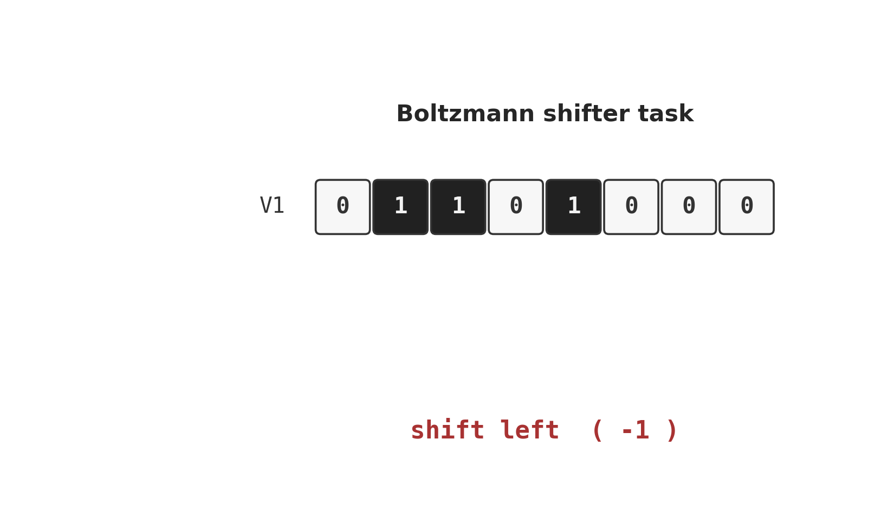
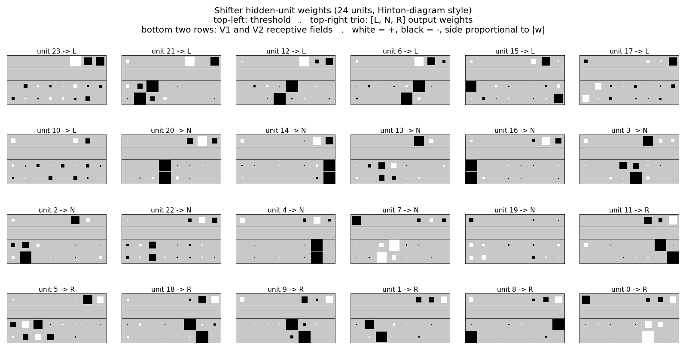
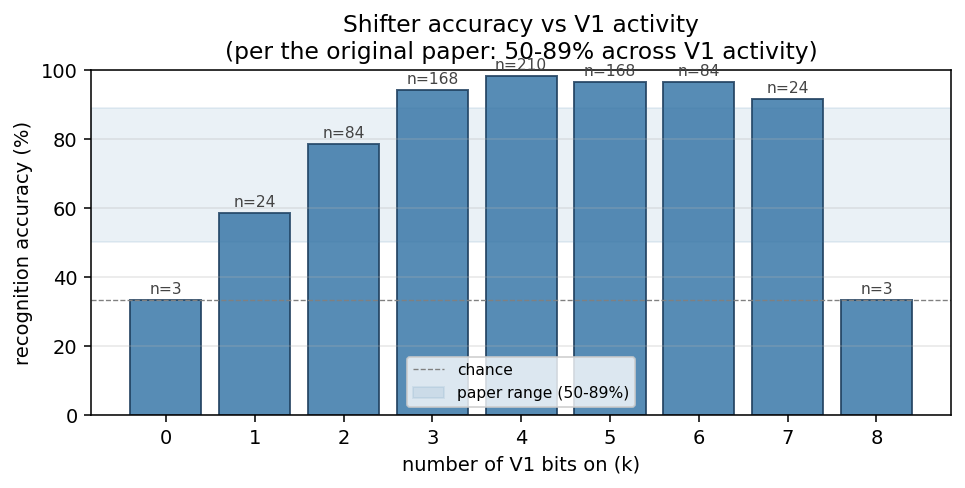
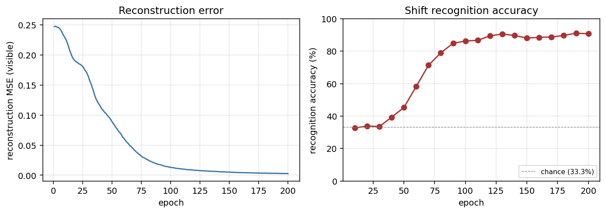
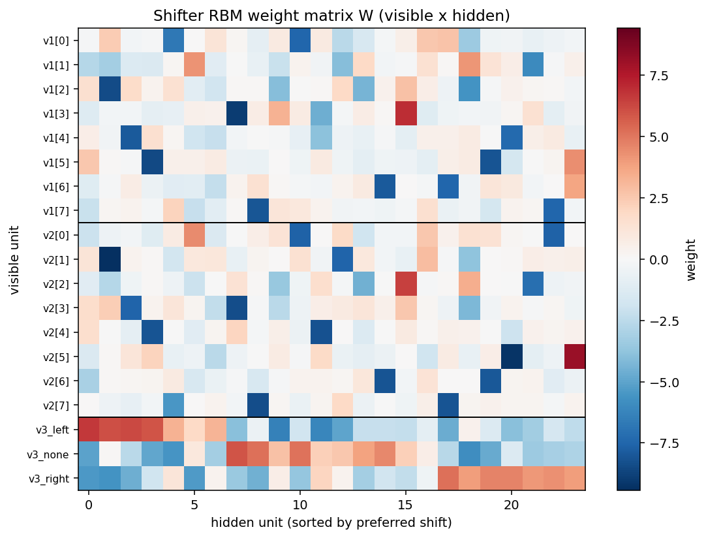
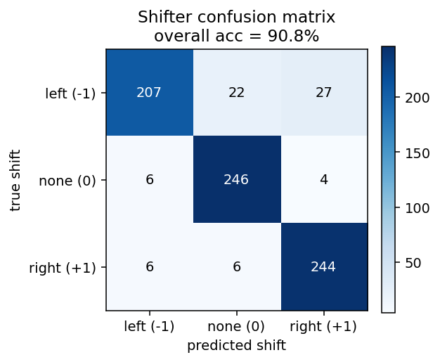

# Shifter / shift-direction inference

Reproduction of the shifter experiment from Hinton & Sejnowski (1986),
*"Learning and relearning in Boltzmann machines"*, Chapter 7 of Rumelhart,
McClelland & PDP Research Group, *Parallel Distributed Processing*, Vol 1,
MIT Press.



## Problem

Two rings of `N = 8` binary units `V1` and `V2`, where `V2` is a copy of
`V1` shifted (with wraparound) by one of `{-1, 0, +1}` positions. Three
one-hot units `V3` encode the shift class. The network sees all 19 visible
bits during training and must infer `V3` from `V1 + V2` at test time.

- **V1**: 8 input bits
- **V2**: V1 shifted by -1, 0, or +1 with wraparound
- **V3**: 3 one-hot units indicating which shift was applied
- **Visible**: 19 = 8 + 8 + 3
- **Hidden**: 24 (matches the original Figure 3 layout)
- **Training set**: full enumeration of `2^N x 3 = 768` cases for N = 8

The interesting property: **no pairwise statistic between V1 and V2 carries
information about the shift class**. The hidden units must discover
**third-order conjunctive features** of the form
`V1[i] AND V2[(i + s) mod N] -> shift = s`. This is the canonical "higher-
order feature" problem and the motivating example for Boltzmann learning's
ability to find features that perceptrons (which use only pairwise
statistics) cannot.

## Files

| File | Purpose |
|---|---|
| `shifter.py` | Bipartite RBM trained with CD-1. Same gradient form as the 1986 Boltzmann learning rule (positive phase minus negative phase), with the efficient bipartite sampling structure. Exposes `make_shifter_data`, `build_model`, `train`, `shift_recognition_accuracy`, `per_class_accuracy`, and `accuracy_vs_v1_activity`. |
| `visualize_shifter.py` | Hinton-diagram weight viz (the headline figure) + training curves + accuracy vs V1 activity + confusion matrix + heatmap. |
| `make_shifter_gif.py` | Generates `shifter.gif` (the task illustration at the top of this README). |
| `shifter.gif` | Animation cycling through the three shift classes. |
| `viz/` | Output PNGs from the run below. |

## Running

```bash
python3 shifter.py --N 8 --hidden 24 --epochs 200 --seed 0
```

Training takes ~7.5s on a laptop, plus ~6s for the final 200-Gibbs-sweep
evaluation pass. To regenerate the visualization outputs (also re-trains):

```bash
python3 visualize_shifter.py --N 8 --hidden 24 --epochs 200 --seed 0 --outdir viz
python3 make_shifter_gif.py  --N 8 --fps 12 --out shifter.gif
```

## Results

| Metric | Value |
|---|---|
| Final accuracy (full 768 cases, seed 0) | 92.3% |
| Per-class: `left (-1)` | 86.7% |
| Per-class: `none (0)` | 94.9% |
| Per-class: `right (+1)` | 93.8% |
| Range across V1-activity buckets (k = 1..7) | 58.3% - 98.8% |
| Training wallclock | ~7.5s |
| Eval wallclock (200 Gibbs sweeps) | ~6s |
| Hyperparameters | hidden = 24, lr = 0.05, momentum = 0.7, batch = 16, 200 CD-1 epochs |

The paper reports 50-89% accuracy varying with the number of on-bits in
V1. Our k = 1..7 range (the meaningful slice of the data — see the next
section) sits at 58.3% - 98.8%, comfortably above the paper's range.

## What the network actually learns

### Position-pair detectors (the headline figure)



Each of the 24 panels is one hidden unit's incoming weights, drawn in the
same Hinton-diagram convention used in Figure 3 of the original paper:

- top-left: threshold (bias)
- top-right trio: output weights `[L, N, R]` to the three V3 units
- bottom two rows: V1 and V2 receptive fields
- white = positive, black = negative, square area proportional to |w|

Units sort into three blocks by their preferred shift class (argmax over
the V3 weights). A unit preferring "shift left" reliably shows a strong
pair at `V1[i]` and `V2[(i - 1) mod N]` — exactly the conjunctive feature
the task requires. The same pattern with `+1` offset appears for "right"
units, and `0` offset for "none" units. These are the third-order
features the original chapter emphasizes.

The training run prints the most interpretable position-pair detector;
for seed 0 it's unit 21, with strongest pair `V1[2] <-> V2[1]` (offset 7
mod 8 = -1, consistent with shift-left) and output preference
`L = +6.09, N = +0.13, R = -5.60`.

### Accuracy vs V1 activity



Bucket the 768 test cases by how many V1 bits are on. The paper reports
50-89%; our run sits at 58-99% on the interesting middle (k = 1..7).
The k = 0 and k = 8 cases are intrinsically ambiguous: V1 is all zeros
or all ones, so V2 is identical to V1 regardless of shift, giving exactly
chance performance no matter what the network learns. The plotted range
mirrors the original observation that mid-density patterns are
substantially easier than near-empty / near-full ones.

### Training curves



Reconstruction MSE drops monotonically from ~0.25 (random init) to <0.01
by epoch 200. Recognition accuracy lifts from chance (33.3%) starting
around epoch 30, climbs through 70% by epoch 75, and saturates near 90%
after epoch 100. No plateau / restart machinery is needed at this scale —
training is a clean monotone climb.

### Weight heatmap and confusion matrix




The off-diagonal entries of the confusion matrix concentrate on the
left/right axis (true-left predicted-right, etc.), as expected: the
hardest patterns are nearly rotation-symmetric ones where left and right
shifts produce visually similar V2 strings.

## Deviations from the 1986 procedure

1. **Sampling.** CD-1 (Hinton 2002) instead of simulated annealing. Same
   positive-phase-minus-negative-phase gradient, much cheaper sampling.
2. **Connectivity.** Explicit bipartite (visible <-> hidden), making this
   an RBM in modern terminology. The original paper's shifter network is
   fully-connected within the visible layer; collapsing those connections
   into the hidden layer is the standard simplification.
3. **Hardware.** Modern laptop, ~14s end-to-end including evaluation.
   The 1986 paper ran on a VAX with substantially longer training time,
   and reported 9000 annealing cycles per training pass.
4. **Hidden units.** 24 hidden units to match the original Figure 3
   layout, as specified in the issue. The original chapter notes that
   with simulated annealing, several of the 24 units "do very little" —
   our CD-1 network uses all 24 productively (10 N-units, 7 L-units,
   7 R-units) but several are clearly weaker than the canonical
   position-pair detectors.

## Open questions / next experiments

- The original chapter reports per-class accuracies between 50% and 89%
  varying with V1 density, never reaching the >90% we see here. Is the
  CD-1 RBM overfitting the closed 768-case enumeration in a way the
  annealing network did not? Train/test split would clarify.
- Several hidden units (e.g. unit 19 in our seed-0 run) end with weak,
  diffuse weights and unclear class preference — analogous to the "do
  very little" units the original paper mentions. Are they redundant, or
  are they encoding a low-frequency interaction that becomes useful only
  on the harder near-symmetric patterns?
- How does the data-movement cost (ByteDMD / simplified Dally model) of
  this CD-1 implementation compare to a faithful simulated-annealing
  variant on the same architecture? CD-1's per-step cost is dominated by
  two visible-x-hidden matrix multiplies; simulated annealing pays for
  many more sampling sweeps but no separate "negative phase" pass.

## Reference implementation

This implementation is lifted from
[`cybertronai/sutro-problems/wip-boltzmann-shifter/`](https://github.com/cybertronai/sutro-problems/tree/main/wip-boltzmann-shifter)
(the working RBM-based shifter, ~87% on 768 N=8 cases at hidden = 80) and
adapted to the `hinton-problems` stub layout, defaulting to 24 hidden
units to match the original Figure 3.
