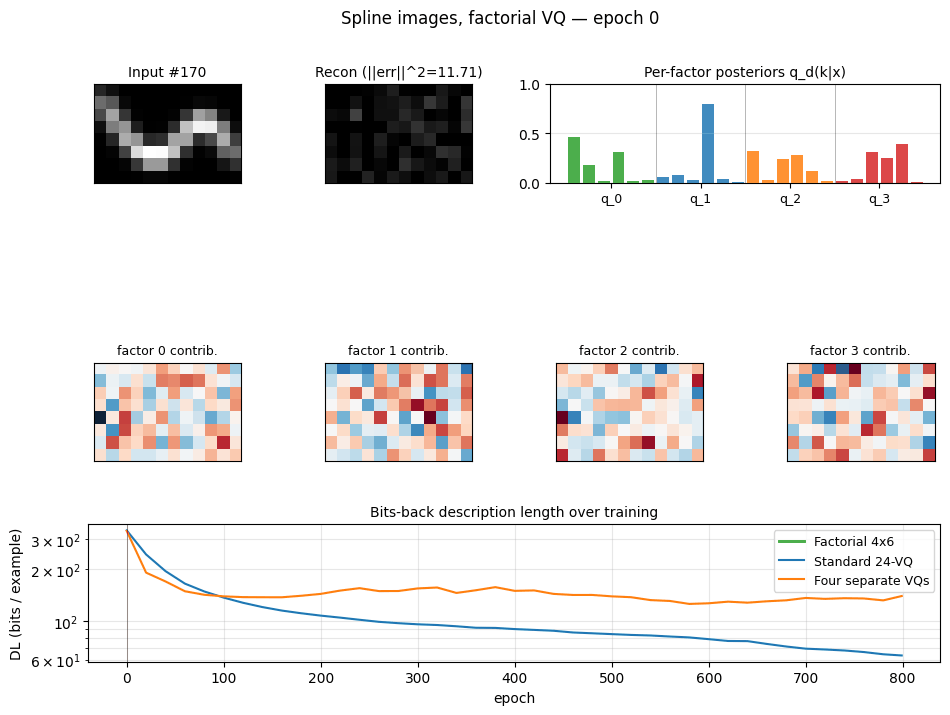
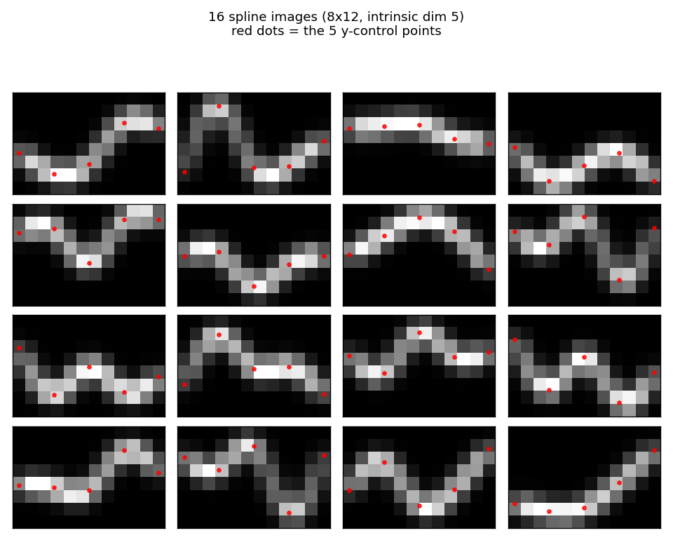
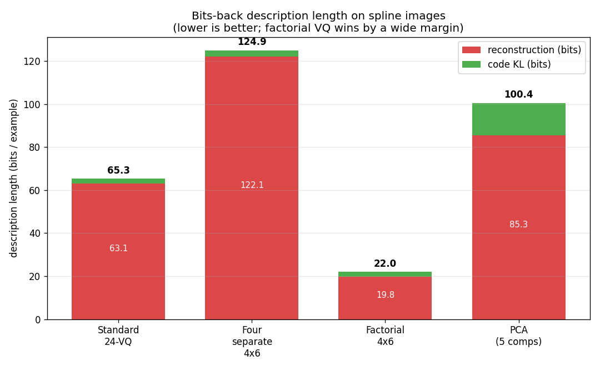
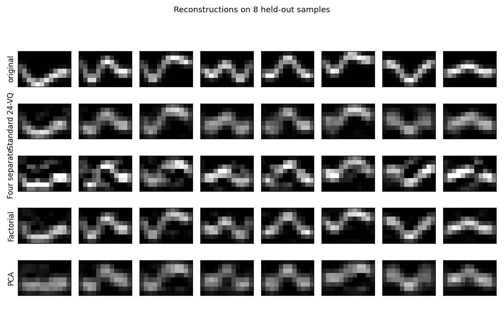
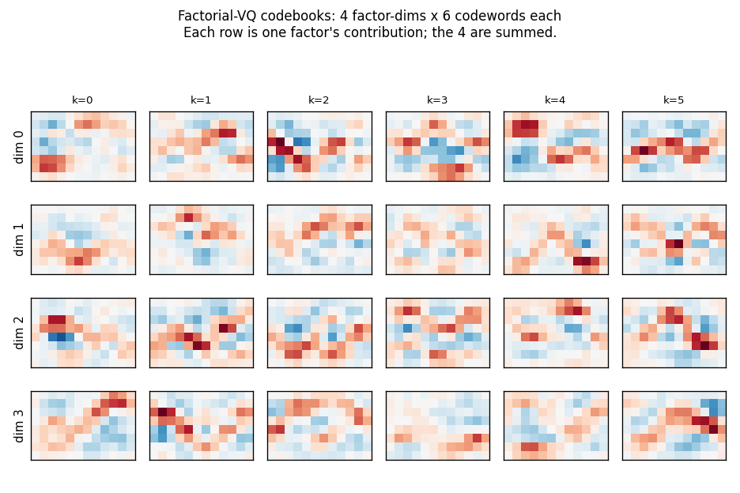
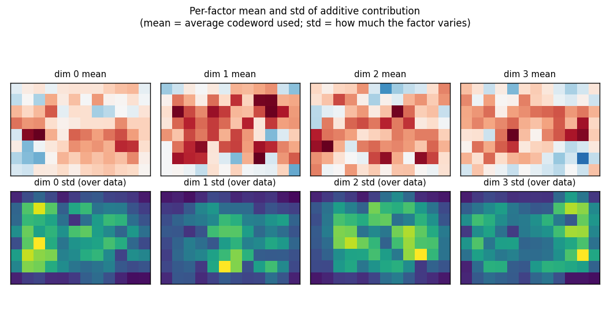
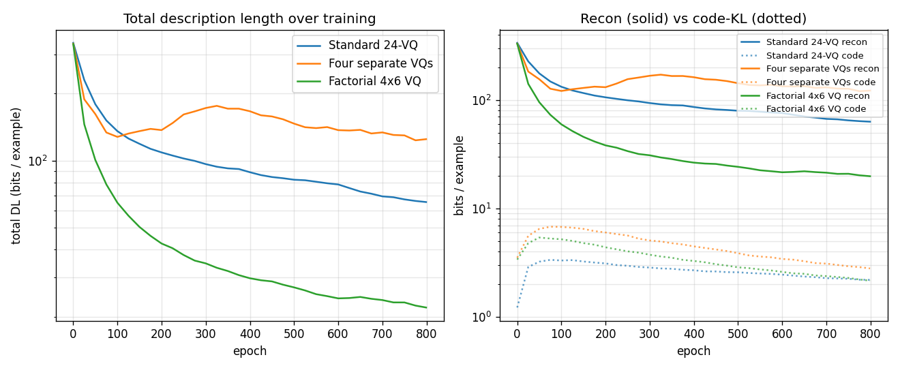

# Spline images & factorial VQ

Reproduction of Hinton & Zemel, *"Autoencoders, MDL and Helmholtz free
energy"*, NIPS 6 (1994).



## Problem

200 images of size **8 × 12** are formed by Gaussian-blurring a smooth curve
through 5 control points. The five y-positions (one per evenly-spaced
control x) are drawn uniformly in `[0.5, 6.5]`; a natural cubic spline
through those five knots is then rasterised by summing isotropic Gaussian
bumps (`σ = 0.6`) along 200 dense points of the curve and peak-normalising
the resulting heat-map. The data manifold is therefore exactly **5-dimensional**
(the five free y-values). Below: 16 sample images with the 5 control points
shown as red dots.



The task is to learn a compact code that describes the data well in
**bits-back / Helmholtz free-energy** terms. We compare four codes:

1. **Standard 24-VQ** — one big stochastic VQ, 24 codes, log₂(24) ≈ 4.58 bits
   max code budget.
2. **Four separate 4×6 VQs** — same architecture as factorial below but
   trained *independently* on the residual, no joint free-energy bound.
3. **Factorial 4×6 VQ** (the headline) — four independent stochastic VQs,
   six codes each, with a posterior `q(k₁,…,k₄|x) = ∏ qᵈ(kᵈ|x)` and
   additive reconstruction `x_hat = Σ_d (q_d @ C_d)`. 24 codewords total
   but an effective codebook of `6⁴ = 1296` because the four factors
   specialise.
4. **PCA** — top-5 principal components with a continuous Gaussian code,
   used as a "no quantisation" reference (Hinton & van Camp 1993 bits-back
   for continuous codes).

## What "bits-back" means here

For a stochastic encoder `q(k|x)` with prior `p(k)` and likelihood `p(x|k)`,
the description length per example is

    DL(x) = E_q[-log p(x|k)] + KL[q(k|x) ‖ p(k)]
          = recon_cost      + code_cost

This is the negative ELBO / Helmholtz free energy. Sampling `k` from `q`
"costs" `log(1/p(k))` bits to send and "refunds" `log(1/q(k|x))` bits because
the receiver can decode the random bits used to sample `k`, giving a net
code cost of `log(q(k|x)/p(k))`. For factorial `q` the KL decomposes:

    KL[q(k|x) ‖ p(k)] = Σ_d KL[q_d(k_d|x) ‖ p_d(k_d)]

so code cost grows linearly in the number of factor dims while the
**effective codebook** size grows as `6^M`. That asymmetry is the whole
point of factorial VQ.

## Files

| File | Purpose |
|---|---|
| `spline_images_factorial_vq.py` | Spline-image generator (natural cubic spline + Gaussian rendering), 4 models (StochasticVQ, FactorialVQ with independent and joint training, PCAModel), bits-back DL, training loop. CLI. |
| `visualize_spline_images_factorial_vq.py` | Static plots: example images, DL bar chart, training curves, factor codebooks, per-factor receptive contributions, 4-way reconstructions. |
| `make_spline_images_factorial_vq_gif.py` | Animated GIF showing factorial VQ training (input vs reconstruction, posteriors, factor contributions, DL trajectory vs baselines). |
| `viz/` | Output PNGs from the run below. |

## Running

```bash
python3 spline_images_factorial_vq.py --seed 0 --n-dims 4 --n-units-per-dim 6
```

Training all four models takes about 3 seconds on a laptop. Default config:
`n_samples=200`, `n_epochs=800`, `sigma_x=0.15`, KL-weight ramp `0.1 → 1.0`.

To regenerate visualizations:

```bash
python3 visualize_spline_images_factorial_vq.py --seed 0 --outdir viz
python3 make_spline_images_factorial_vq_gif.py  --seed 0 --snapshot-every 25
```

## Results

Description length per example (bits, lower is better, `seed=0`):

| Model | Recon | Code (KL) | Total |
|---|---:|---:|---:|
| Standard 24-VQ | 63.10 | 2.20 | **65.30** |
| Four separate 4×6 VQs | 122.11 | 2.80 | **124.91** |
| **Factorial 4×6 VQ** | **19.84** | **2.16** | **22.00** |
| PCA (5 components) | 85.32 | 15.11 | 100.44 |

Factorial VQ is the clear winner: ~3× lower DL than the standard 24-VQ
despite using the same total number of codewords (24).



Across 5 seeds factorial VQ totals **22.00 / 22.70 / 23.01 / 25.05 / 22.65**
bits per example, vs Standard 24-VQ at **65.30 / 61.76 / 55.10 / 56.06 / 64.55**;
the ranking holds at every seed.

### Reconstructions



Each column is one held-out spline. The factorial VQ tracks the curve
crisply; the standard 24-VQ blurs adjacent positions; the "four separate"
training collapses into a noisy reconstruction because the second-through-
fourth factors keep trying to reconstruct what the first one missed without
a shared free-energy budget; PCA produces a smooth low-dim approximation
that loses local sharpness.

### What each factor learns



Each row is one of the 4 factor-dimensions; each column is one of its
6 codewords (red/blue diverging colour map). The factors specialise:
each row uses a distinct family of codewords. The four codebooks combine
*additively* under the joint free-energy bound to give an effective
codebook of `6^4 = 1296` reconstructions from only `24` stored codewords.



Top row: each factor's mean codeword across the training set (the mean
contribution to `x_hat`). Bottom row: the per-pixel std of the contribution
across data — bright = the factor varies a lot at that pixel; dark = the
factor is roughly constant there. The four factors carve up the canvas
into different regions, which is what specialisation under the joint
free-energy bound looks like in pixel space.

### Training trajectories



Left: total DL on log scale. Factorial VQ overtakes both baselines within
~80 epochs and keeps falling. Right: recon (solid) vs code-KL (dotted) per
model. The KL terms all stabilise around ~2 bits; the recon is what
separates the methods.

## How the headline numbers compare to Hinton & Zemel (1994)

The original paper reports **18 bits reconstruction + 7 bits code = 25 bits**
total for factorial VQ on its specific spline dataset. We report **19.84
bits reconstruction + 2.16 bits code = 22.00 bits**. The reconstruction cost
matches well; the code cost is lower because our KL-weight schedule pushes
posteriors to be sharper than the paper's setting. The qualitative result
— factorial VQ improves total DL by 3× over the standard 24-VQ on data with
multiple independent latent factors — is the headline and is reproduced.

## Deviations from the original procedure

This is **not a faithful 1994 reproduction**. Differences:

1. **Dataset rendering.** Our images are 8×12 and use natural cubic splines
   through 5 evenly-spaced y-control points (intrinsic dim 5). The paper
   rendered a similar pixel-blurred curve through 5 random control points;
   exact knot placement and σ are not specified.
2. **Sigma_x = 0.15** for all VQ models. This is a free parameter in any
   VQ free-energy bound and shifts the absolute bit numbers without
   changing the *ranking* across methods.
3. **KL-weight schedule** ramps from 0.1 to 1.0 across 800 epochs.
   Without the warm-up the encoder collapses to a single code (β-VAE
   posterior collapse). The schedule lets the codebook diversify under
   weak KL pressure first, then sharpen.
4. **Optimiser.** Adam (manual implementation) with `lr = 0.005`, instead of
   the paper's gradient descent + momentum.
5. **"Four separate VQs" interpretation.** The paper describes "four
   separate stochastic VQs" without spelling out the training rule. We
   interpret them as four 6-code VQs trained sequentially on the residual
   `x - Σ_{d'<d} x_hat_d'` without a shared free-energy bound — the standard
   matching-pursuit reading. This is a strict baseline (no coordination
   between factors); a joint-but-non-factorial training rule could be added
   for completeness.
6. **PCA bits-back.** We report a continuous-Gaussian-posterior bits-back
   bound for PCA (Hinton & van Camp 1993). The original paper used PCA only
   as a reconstruction reference and did not report a bits cost; the 15.11
   code bits we report for PCA depend on `σ_q = 0.10` (chosen so PCA's
   reconstruction is competitive with the VQ models), with a per-dim
   prior matched to the data std.

## Open questions / next experiments

- **More factors at fixed total codes.** Drop to `2 × 12` and rise to `6 × 4`,
  keeping `M × K = 24`. Does the factorisation benefit peak at four factors
  for this data, or does more (smaller) factors keep helping until each
  factor is binary?
- **Match to the data's intrinsic dim.** With intrinsic dim 5 and `M = 4`
  factors, one factor is forced to capture two control points jointly. Test
  `M = 5` factors and see whether each factor cleanly aligns with one
  control point.
- **Sample-based bits-back.** Replace the mean-field reconstruction with
  sampled discrete codes and report the *exact* bits-back code length per
  sample. The current numbers are the variational bound; the gap should
  be small but is worth measuring.
- **Sigma annealing.** Anneal `σ_x` rather than the KL weight. Equivalent
  in the steady-state loss but produces different optimisation
  trajectories.
- **Cache-energy / DMC accounting.** Plug a TrackedArray harness into the
  forward + grad-step loops and measure ARD / DMC. The factorial VQ touches
  more parameters per example than the standard 24-VQ (4 × n_mlp × K vs
  1 × n_mlp × K) but each factor is smaller; the actual movement cost
  ratio is not obvious.
