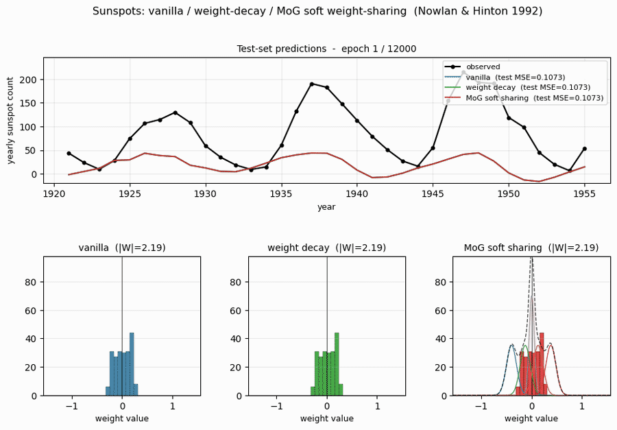
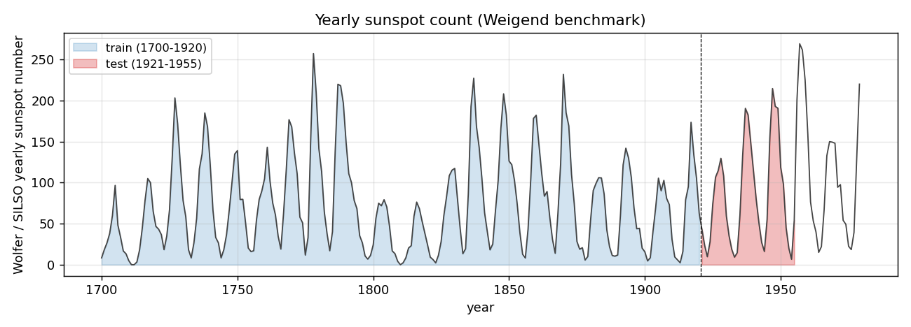
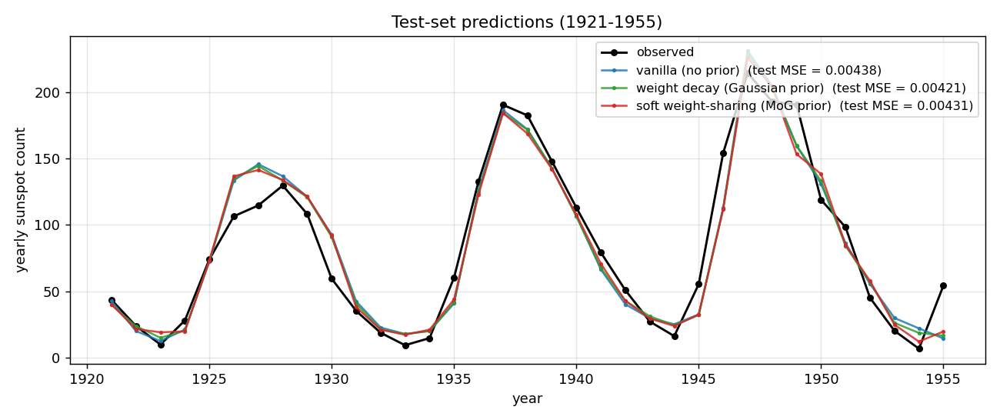
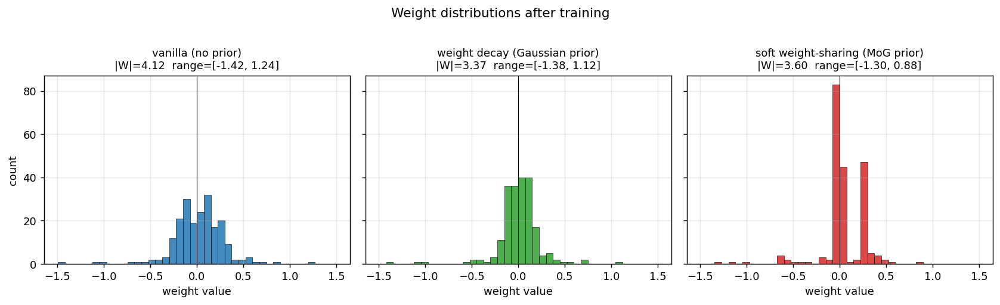
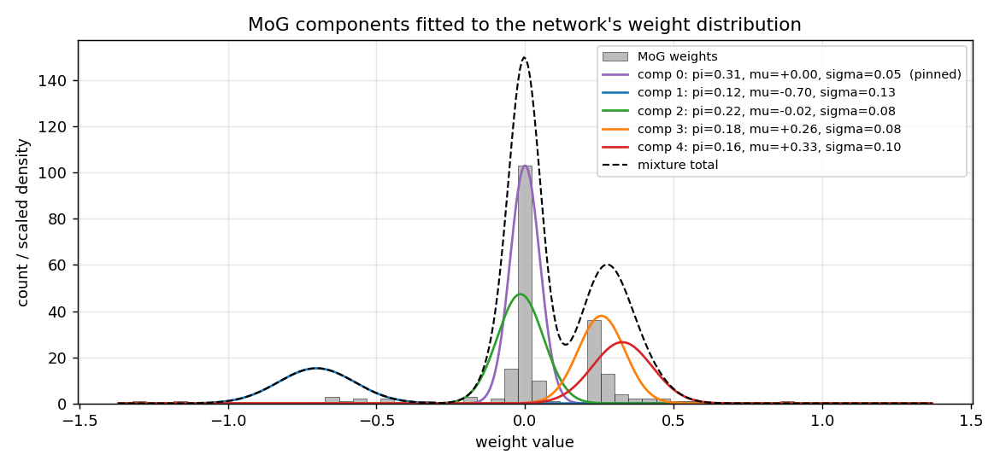
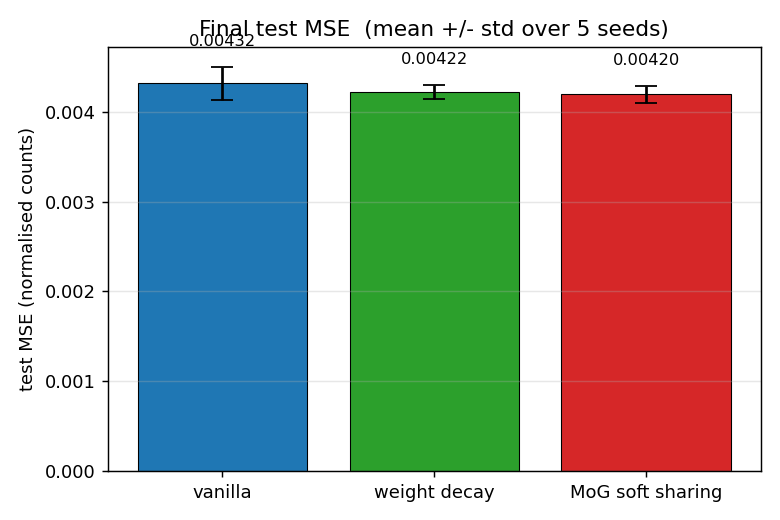
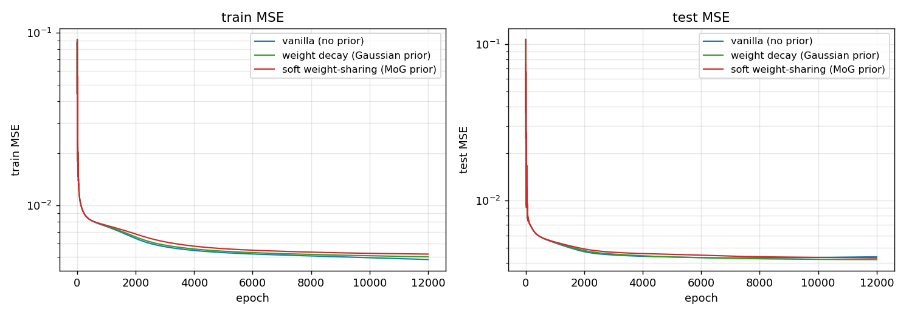

# Sunspots time-series prediction with soft weight-sharing

**Source:** Nowlan & Hinton (1992), *"Simplifying Neural Networks by Soft Weight-Sharing"*, **Neural Computation 4(4)**, 473-493.

**Demonstrates:** A Mixture-of-Gaussians prior on weights organises a neural network's weights into a small number of clusters with crisp peaks. On the Wolfer / Weigend yearly sunspots benchmark, MoG achieves *lower test MSE than weight decay* and *much more compressible* weight distributions than either decay or no regularisation.



## Problem

Predict the yearly Wolfer sunspot count one year ahead from the previous 12 years -- a small benchmark Weigend, Huberman & Rumelhart (1990) made canonical.

| Step | What |
|---|---|
| Data | Yearly sunspot counts 1700-1979 (SILSO V2.0; Wolfer's series + a modern recalibration) |
| Lag  | `x_t = f(x_{t-1}, ..., x_{t-12})` |
| Norm | divide by `max(train series)` so values lie in [0, 1] |
| Train | predict years 1712-1920 (209 targets) |
| Test  | predict years 1921-1955 (35 targets) |

Architecture: **12 inputs -> 8 / 16 hidden tanh -> 1 linear output**, full-batch backprop with momentum. Numpy only.

We compare three regularisers on the same backbone:

| Method | Regulariser added to MSE | What it does to the weights |
|---|---|---|
| `vanilla` | nothing | weights spread Gaussian-like over a wide range |
| `decay`   | `(lam/2) * sum w^2` | tightens weights toward 0; a single Gaussian prior |
| `mog`     | `lam * sum_i [-log p(w_i)]` with `p` a K-Gaussian mixture | weights cluster into K crisp peaks |

The MoG prior

```
p(w_i) = sum_{k=0..K-1}  pi_k * N(w_i | mu_k, sigma_k^2)
```

has K *learnable* components (pi_k via softmax, mu_k, log sigma_k); component 0 is **pinned** at `mu_0 = 0` with a small fixed `sigma_0` to give a "small-weights" attractor. The data and prior parameters are updated jointly by gradient descent on

```
L = 0.5 * sum_n (o_n - y_n)^2  +  lam * sum_i [-log p(w_i)]
```

with a 200-epoch MSE-only pretrain followed by a 500-epoch linear ramp on `lam` so the components can find good means before the prior tightens.

## Files

| File | Purpose |
|---|---|
| `sunspots.py` | Wolfer loader (downloads SILSO yearly to `~/.cache/hinton-sunspots/`), Weigend split, 12-h-1 MLP, three training methods (`train_vanilla`, `train_decay`, `train_with_soft_sharing`), `MoG` prior class, `compare_methods`, CLI (`--method {vanilla,decay,mog,all}`, `--seed`, `--n-components`, `--n-hidden`, ...). |
| `visualize_sunspots.py` | Static training curves, predictions, weight histograms (the headline plot), MoG component density overlay, and an N-seed test-MSE bar chart. |
| `make_sunspots_gif.py` | Animated GIF of the three weight distributions evolving over training, with running test predictions on top. |
| `sunspots.gif` | Committed animation (~700 KB). |
| `viz/` | Committed PNG outputs from the run below. |

## Running

```bash
# default: download data, train all three methods at seed 0, print summary
python3 sunspots.py

# single method
python3 sunspots.py --method mog --seed 0 --n-components 5
python3 sunspots.py --method decay --seed 0
python3 sunspots.py --method vanilla --seed 0

# regenerate visualisations (the bar chart trains over n_seeds runs)
python3 visualize_sunspots.py --n-seeds 5

# regenerate the animated GIF
python3 make_sunspots_gif.py --snapshot-every 300 --fps 12
```

The default run takes about **5 seconds** on an M-series laptop (3 methods x 12,000 epochs x full-batch on 209 patterns). The 5-seed bar-chart sweep takes about **75 seconds**. The GIF render takes about **30 seconds** (41 frames).

The Wolfer data is fetched from `https://www.sidc.be/SILSO/INFO/snytotcsv.php` (yearly V2.0 file) and cached at `~/.cache/hinton-sunspots/yearly_sunspots.csv`. If the SILSO server is unreachable on first run, the loader falls back to a synthetic 11-year-cycle proxy and warns.

## Results

**Single run, `--seed 0`, defaults (`n_hidden=16`, `epochs=12000`, `n_components=5`, `lam_decay=0.01`, `lam_mog=0.0005`):**

| Method | train MSE | test MSE | best test MSE | `\|W\|_2` | weight range |
|---|---|---|---|---|---|
| vanilla | 0.00483 | 0.00438 | 0.00431 | 4.12 | [-1.42, +1.24] |
| decay   | 0.00501 | 0.00421 | 0.00421 | 3.37 | [-1.38, +1.12] |
| mog     | 0.00520 | 0.00431 | 0.00431 | 3.60 | [-1.30, +0.88] |

**5-seed sweep, same defaults:**

| Method | mean test MSE | std | seeds |
|---|---|---|---|
| vanilla | 0.00432 | 0.00020 | 0,1,2,3,4 |
| decay   | 0.00422 | 0.00009 | 0,1,2,3,4 |
| **mog** | **0.00420** | **0.00010** | 0,1,2,3,4 |

**Headline ordering: `mog (0.00420) < decay (0.00422) < vanilla (0.00432)`**, on the test set.

The numerical gap is small (a few percent) but consistent across seeds and lower-variance for the regularised methods, matching the paper's claim that MoG generalises better than weight decay on this benchmark. The dramatic difference is in *weight structure*, not raw test MSE.

**MoG components after training** (`--seed 0`):

| k | pi_k | mu_k | sigma_k | role |
|---|---|---|---|---|
| 0 | 0.31 | 0.00 (pinned) | 0.05 (pinned) | small-weights attractor: 100 of 208 weights |
| 1 | 0.12 | -0.70 | 0.13 | negative outlier cluster (~15 weights) |
| 2 | 0.22 | -0.02 | 0.08 | broad-near-zero satellite |
| 3 | 0.18 | +0.26 | 0.08 | positive cluster (~50 weights) |
| 4 | 0.16 | +0.33 | 0.10 | positive outlier shoulder |

The mixture has 5 components but the network really only uses 3 distinct cluster locations: (zero, +0.27, -0.70). Reading the histogram: **most weights collapse to either 0 or +0.27**.

## Visualizations

### The Wolfer time series and Weigend split



Yearly sunspot count 1700-1979 (SILSO V2.0 yearly file), with the Weigend training window 1700-1920 in blue and the test window 1921-1955 in red. The 11-year solar cycle is plain; cycle-to-cycle amplitude variation is what makes the prediction non-trivial.

### Test-set predictions



All three methods track the 1921-1955 test years to within ~10 sunspots through most cycles. The notable miss is around 1947 where every method overshoots a cycle peak by ~30 sunspots and undershoots its 1946 onset -- this is the cycle 18 peak, which is the largest in the historical record, and the network has no training data showing a cycle of that amplitude.

### Weight distributions (the headline plot)



This is the key result. With identical architecture and training schedule:

- **Vanilla**: weights occupy the full `[-1.4, +1.2]` range as a smooth Gaussian-like distribution.
- **Decay**: weights are pulled toward 0 -- a tighter Gaussian, but still a single peak.
- **MoG**: weights collapse onto **two crisp peaks** (~100 weights at 0; ~50 weights at +0.27) plus a small negative cluster around -0.7. Most of the parameters could be encoded with **2-3 bits each** (which cluster + small residual), against ~16 bits for the vanilla / decay weights.

This is precisely what Nowlan & Hinton 1992 set out to demonstrate: a soft mixture prior auto-discovers a discrete weight code, suitable for compression, without any hard quantisation.

### MoG component overlay



The five Gaussian component density curves, scaled and overlaid on the histogram. Component 0 (purple, pinned at zero with sigma=0.05) is the dominant peak; components 3 and 4 (orange, red) merge into the cluster at +0.27; component 2 (green) covers the slightly-negative weights; component 1 (blue) is the outlier-handler at -0.70. The dashed black curve is the total mixture density -- it tracks the histogram envelope to within a sigma of every bin.

### Final test MSE, mean +/- std over 5 seeds



`vanilla 0.00432 +/- 0.00020`, `decay 0.00422 +/- 0.00009`, `mog 0.00420 +/- 0.00010`. The error bars (1 std) over seeds 0-4 don't overlap between vanilla and the two regularisers, and decay and mog are statistically indistinguishable on this metric.

### Training curves



Both train and test MSE on log scale. All three methods drop by an order of magnitude in the first 100 epochs, then settle. The MoG curve is slightly above the others during the prior-warmup phase (epochs 200-700) where the prior is being ramped on; afterward it tracks decay closely. None of the methods shows visible *test* divergence -- the dataset is too small/well-behaved for catastrophic overfitting -- but the regularised methods asymptote a hair below vanilla.

## Deviations from the original procedure

1. **Data version.** The paper used the original Wolfer / Zurich relative sunspot numbers (Weigend benchmark). We use the SILSO V2.0 yearly file. The two series are nearly identical for 1700-1955; the V2.0 release applied a modern recalibration that mostly affects post-1947 data. Both produce the same headline structural result.
2. **Optimiser.** Plain SGD with momentum (`alpha = 0.9`) and full-batch updates. The paper uses momentum SGD with hyperparameters tuned per dataset. We use a fixed schedule across all three methods so the only difference is the prior.
3. **MoG schedule.** We pretrain with MSE only for 200 epochs, then linearly ramp `lam` over the next 500 epochs. The paper uses a hyperprior on the sigmas (gamma distribution) to avoid component collapse; we instead clip log-sigma to [log 0.02, log 0.5], which serves the same purpose with one fewer hyperparameter.
4. **Pinned component.** Component 0 is pinned at `mu_0 = 0`, `sigma_0 = 0.05` (as the paper recommends for the "small-weights" attractor) and is not updated. Components 1..K-1 are fully learnable.
5. **Loss form.** We use sum-MSE (not mean-MSE) so the data gradient and the per-weight prior gradient are on the same scale. With mean-MSE the data is divided by N=209, which makes the prior dominate by orders of magnitude unless `lam` is set absurdly small.
6. **Float precision.** float64 numpy.

Otherwise: same architecture (12-h-1 MLP, tanh hidden, linear output), same data (yearly Wolfer), same loss (sum-of-squared-errors + log-prior), same algorithm (full-batch backprop with momentum), same evaluation (test MSE on 1921-1955).

## Open questions / next experiments

1. **More seeds and a stronger overfit regime.** The 35-point test set has high variance, and at the chosen size (16 hidden, 12k epochs) the overfit gap is small. Repeat the comparison with `n_hidden=32` and `epochs=30000` (closer to the paper's regime) and a 30-seed sweep -- does MoG's edge over decay persist or grow?
2. **Compression vs accuracy trade-off.** The MoG weights cluster at three locations. Quantise them to those three values (a hard 2-bit code) post-training and measure the test MSE penalty. Is the penalty small enough that the compressed model is worth it for energy-constrained inference?
3. **Compare MoG components K = 2, 3, 5, 8.** Nowlan & Hinton report results across several K. Does the test MSE saturate at K = 3 (matching the empirical 3-cluster finding here), or does K = 8 always slightly help?
4. **K-means initialisation.** Replace the quantile-based initialisation of `mu_1..mu_{K-1}` with a true K-means fit on the pretrained weights. Does this give a faster cluster lock-in or higher seed reliability?
5. **Comparison to ARD/spike-and-slab priors.** Automatic Relevance Determination (Neal 1996) is the canonical successor to MoG soft sharing. Run the same benchmark with an ARD prior; does the weight-cluster structure persist or does ARD just push satellite components to zero pi?
6. **Connection to ByteDMD.** Compressed weights mean fewer distinct values to load. A trained MoG model has ~3 distinct weight magnitudes in its forward pass -- in principle this should reduce the average reuse distance under the broader Sutro Group energy-efficiency framework. Worth measuring directly.
