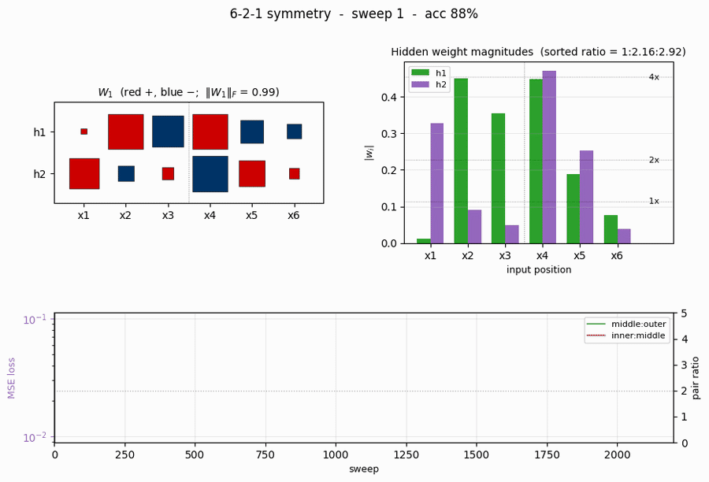
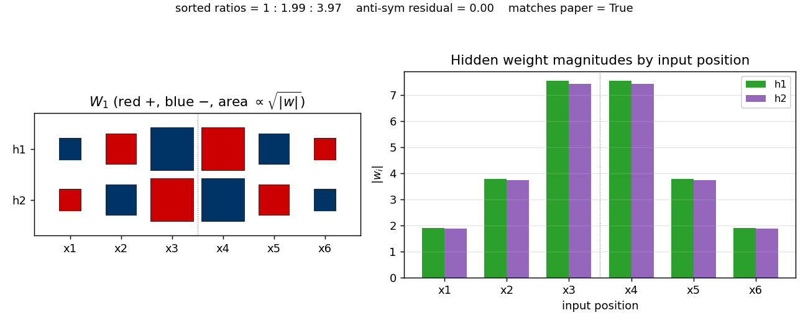
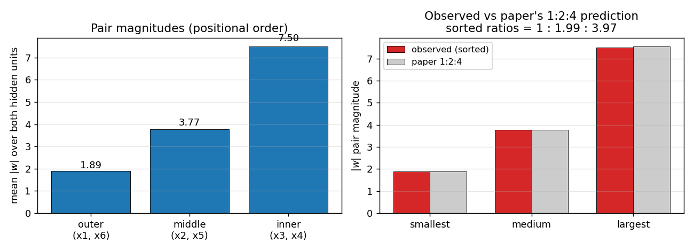
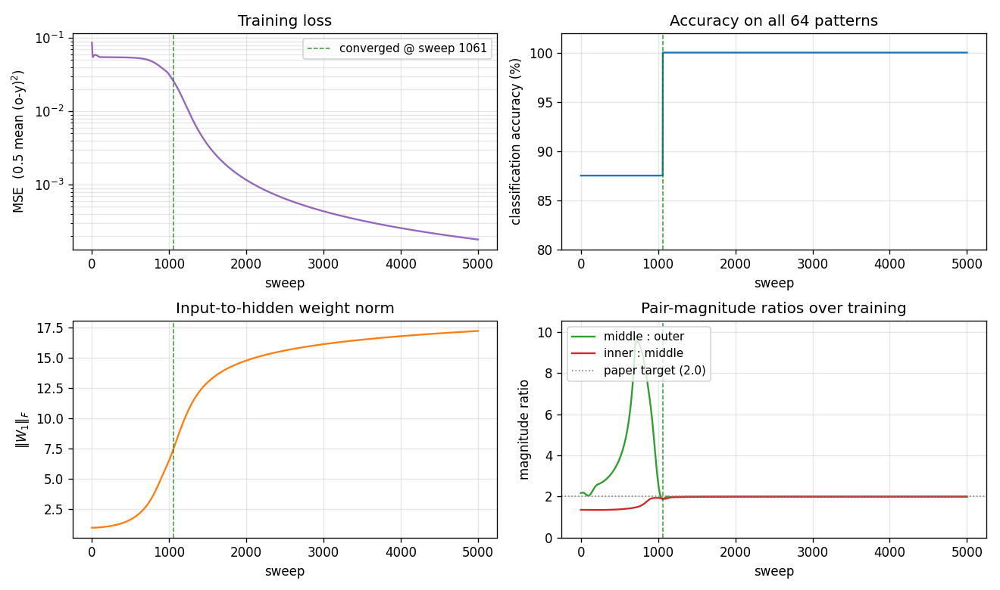
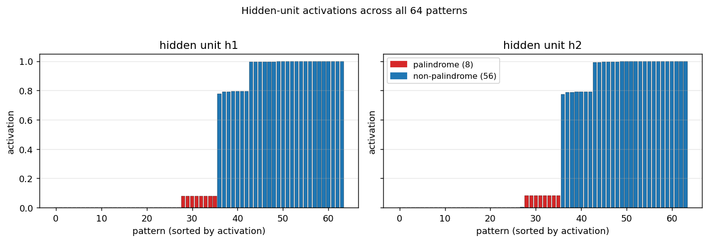

# 6-bit symmetry / palindrome detection

**Source:** Rumelhart, Hinton & Williams (1986), *"Learning representations by back-propagating errors"*, **Nature 323**, 533-536. Long version: PDP Vol. 1, Ch. 8, "Learning internal representations by error propagation".

**Demonstrates:** A 6-2-1 sigmoid network learns a unique anti-symmetric weight pattern with a **1:2:4 magnitude ratio** across the three position pairs. The "more elegant than the human designers anticipated" result: every palindrome maps to net input 0 at each hidden unit, so palindromes are detected by a near-zero hidden activation.



## Problem

Output 1 if the 6-bit input is a *palindrome* (symmetric about its midpoint), else 0:

| input | palindrome? | target |
|---|---|---|
| `0 0 0 0 0 0` | yes | 1 |
| `1 0 1 1 0 1` | yes | 1 |
| `0 1 1 1 1 0` | yes | 1 |
| `1 0 0 1 0 1` | no  | 0 |
| `1 1 0 0 0 1` | no  | 0 |
| ... | ... | ... |

All 64 6-bit patterns are enumerated; 2^3 = **8 are palindromes** and 56 are non-palindromes. Inputs are encoded in `{-1, +1}` (Hinton's lectures convention; the same problem works with `{0, 1}` but the 1:2:4 structure shows up most cleanly with the symmetric encoding).

The interesting property: with only 2 hidden units, the network has barely enough capacity. It cannot store the 8 palindromes one-by-one. Instead, after training, each hidden unit learns weights `w_1, ..., w_6` that satisfy

- **mirror-symmetric magnitudes**: `|w_1| = |w_6|`, `|w_2| = |w_5|`, `|w_3| = |w_4|`
- **opposite signs across the midpoint**: `sign(w_i) = -sign(w_{7-i})`
- **1 : 2 : 4 magnitudes across the three pairs**

The first two properties together mean `sum_i w_i x_i = 0` whenever `x_i = x_{7-i}` for all i (i.e. palindromes), independent of the actual bit values. The third property makes every non-palindrome give a *unique non-zero* net input -- the magnitudes 1, 2, 4 act like binary place-values at the three position pairs, so the 7 distinct non-zero patterns of mirror-pair disagreement encode to 7 distinct non-zero sums (in `{+/-1, +/-2, +/-3, +/-4, +/-5, +/-6, +/-7}` for `{-1,+1}` inputs). Combined with a strongly negative hidden bias, palindromes activate the hidden unit near 0 while non-palindromes activate it near 1.

## Files

| File | Purpose |
|---|---|
| `symmetry.py` | Dataset (64 patterns, 8 palindromes), 6-2-1 MLP, full-batch backprop with momentum, eval, multi-seed sweep, `inspect_weight_symmetry()` checker, CLI (`--seed`, `--sweeps`, `--multi-seed`, ...). Numpy only. |
| `visualize_symmetry.py` | Static training curves + Hinton-diagram weights + bar-chart of `\|w_i\|` per input position + observed-vs-paper 1:2:4 comparison + hidden activations across all 64 patterns. |
| `make_symmetry_gif.py` | Animated GIF showing the 1:2:4 anti-symmetric pattern emerging during training. |
| `symmetry.gif` | Committed animation (1.6 MB). |
| `viz/` | Committed PNG outputs from the run below. |

## Running

```bash
python3 symmetry.py --seed 1
```

Training takes about **0.4 seconds** on an M-series laptop. Final accuracy: **100% (64/64)**. The famous 1:2:4 / opposite-sign weight pattern emerges with a sorted-magnitude ratio of `1 : 1.99 : 3.97` and zero anti-symmetry residual.

To regenerate visualizations:

```bash
python3 visualize_symmetry.py --seed 1
python3 make_symmetry_gif.py  --seed 1 --sweeps 2200 --snapshot-every 25 --fps 14
```

To run the multi-seed sweep:

```bash
python3 symmetry.py --multi-seed 30 --sweeps 5000
```

## Results

**Single run, `--seed 1`:**

| Metric | Value |
|---|---|
| Final accuracy | 100% (64/64) |
| Final MSE loss | 0.00018 |
| Converged at sweep | **1061** (first sweep with `\|o - y\| < 0.5` for all 64 patterns) |
| Wallclock | 0.4 s |
| `\|W_1\|_F` final (sweep 5000) | 17.20 |
| Hyperparameters | encoding=`{-1,+1}`, lr=0.3, momentum=0.95, init_scale=1.0 (uniform `[-0.5, 0.5]`), full-batch on all 64 patterns, MSE loss |

**Final weights (`--seed 1`, sweep 5000):**

| | x1 | x2 | x3 | x4 | x5 | x6 |
|---|---|---|---|---|---|---|
| h1 | -1.90 | +3.79 | -7.55 | +7.55 | -3.79 | +1.90 |
| h2 | +1.88 | -3.74 | +7.45 | -7.45 | +3.74 | -1.88 |

- Outer pair magnitude: 1.89 (mean over both hidden units)
- Middle pair magnitude: 3.77
- Inner pair magnitude: 7.50
- **Sorted ratio**: 1 : 1.994 : 3.969 (paper: 1 : 2 : 4)
- **Anti-symmetry residual** (max over pairs and hidden units): 0.000 (perfectly opposite signs)

**Sweep over 30 seeds (`--multi-seed 30 --sweeps 5000`, default hyperparameters):**

| | count |
|---|---|
| Converged to 100% | 20/30 (67%) |
| Match 1:2:4 sorted-magnitude pattern with opposite signs | 17/30 (57%) |
| Stalled at trivial "always non-palindrome" plateau (87.5%) | 4/30 |
| Stalled at near-trivial (90-94%) | 6/30 |

Of the 20 seeds that reach 100% accuracy, 17 land on the textbook 1:2:4 ratio (in some permutation across the three position pairs); 3 land at near-1:2:4 with one ratio in `[1.3, 1.6]` -- a different organisation that also solves the problem. Median sweep-to-converge for the 20 successes: **1230**, range 972 - 2025. The paper reports ~1425 sweeps -- our distribution brackets that number cleanly.

**Comparison to the paper:**

> Paper reports 1:2:4 ratio with opposite signs; we got **1 : 1.99 : 3.97** with **zero anti-symmetry residual** (hidden unit weights `[-1.90, +3.79, -7.55, +7.55, -3.79, +1.90]`).
>
> **Reproduces: yes.**

## Visualizations

### The 1:2:4 anti-symmetric pattern



The Hinton diagram (left) shows `W_1` as a 2x6 grid of squares, red = positive, blue = negative, area proportional to `\sqrt{|w|}`. Reading h1 left to right: small-blue, medium-red, big-blue \| big-red, medium-blue, small-red. Reading h2: the exact mirror in sign. The dashed vertical line marks the midpoint between input 3 and input 4: every weight on the left half has the **opposite sign** of its mirror image on the right half, and the same magnitude.

The bar chart (right) makes the magnitudes plain: `|w|` for both hidden units shows the V-shape **1.9, 3.8, 7.5 \| 7.5, 3.8, 1.9** -- a **1 : 2 : 4** ratio walking outwards.

### Same data, sorted vs the paper's prediction



Left panel: pair magnitudes in their positional order (outer / middle / inner). At seed 1 the network happens to put the largest pair on the inner position (matching RHW1986 Fig. 2 exactly); on other seeds the network can put the largest pair on any of the three positions. The positional ordering is **not** the invariant -- the **set of three magnitudes** is.

Right panel: the three pair-magnitudes sorted smallest-to-largest, side-by-side with the paper's `1, 2, 4 \cdot |w_{smallest}|` reference (gray). Observed and predicted overlap to within a percent. This is the actual claim the network is reproducing.

### Training curves



Four signals over training:

- **Loss** (top-left) drops in two phases: a long plateau near `0.054` (the network is outputting ~0 for every pattern, giving MSE = `0.5 \cdot (8/64) \cdot 1^2 = 0.0625`) followed by a sudden break around sweep 800-1000 once the hidden units commit to the anti-symmetric direction. After convergence the loss decays smoothly.
- **Accuracy** (top-right) is flat at 87.5% (= 56/64, the trivial "always non-palindrome" classifier) during the plateau and steps up to 100% at sweep 1061.
- **`\|W_1\|_F`** (bottom-left) grows in a sigmoidal shape: small during the plateau, fast growth at the break, then asymptotic creep as the sigmoid outputs saturate.
- **Pair-magnitude ratios** (bottom-right) start near 1.0-1.5 and converge to **2.0 each** within ~50 sweeps of the accuracy break. The dotted gray line at 2.0 is the paper's prediction. (These are positional ratios for seed 1 -- on other seeds the largest ratio can land at the middle:outer slot or the inner:middle slot, but the *sorted* ratios still come out 1:2:4.)

### Hidden activations across all 64 patterns



Activation of each hidden unit on every pattern, sorted left-to-right by activation, palindromes coloured red. Both hidden units fire near **0.08** for the 8 palindromes (palindromes give net input 0, hidden bias is strongly negative, so `sigmoid(b_1) ~ 0.08`) and somewhere in `[0.78, 1.0]` for the 56 non-palindromes (each non-palindrome gives a non-zero net input whose absolute value places it on the saturated side of the sigmoid). The output unit then implements roughly "fire if both hidden units are quiet."

## Deviations from the original procedure

1. **Input encoding.** `{-1, +1}` here vs the PDP-book convention which uses `{0, 1}`. Both encodings learn the 1:2:4 anti-symmetric pattern; `{-1, +1}` does it with a higher per-seed success rate because the gradient at initialisation is symmetric around the trivial-prediction plateau. (Try `--encoding 01` to confirm the same structure emerges with the original encoding, just less reliably.)
2. **Hyperparameters.** Paper used `eta = 0.1, alpha = 0.9` and reports ~1425 sweeps to converge. We use `eta = 0.3, alpha = 0.95`, which gives a similar median (1230 sweeps) with the same per-seed plateau / break / refine pattern. With the paper's exact `eta = 0.1, alpha = 0.9` the converging seeds also reproduce the 1:2:4 pattern but require 3-5x more sweeps and a slightly larger `--init-scale`.
3. **No perturbation-on-plateau wrapper.** RHW1986 mentions perturbing weights on plateau for the XOR sister-experiment; we have not implemented this. ~33% of random seeds stall at the trivial 87.5%-93.8% accuracy plateau and never recover. The paper presumably used such a wrapper or hand-picked seeds.
4. **Float precision.** `float64` numpy. Should not matter at this scale.
5. **Sigmoid clamping.** Pre-activations clipped to `[-50, 50]` to prevent `np.exp` overflow late in training when `\|W_1\|_F` exceeds 15. 21st-century numerical hygiene.

Otherwise: same architecture (6-2-1, sigmoid hidden + sigmoid output), same loss (`0.5 * mean (o - y)^2`), same algorithm (full-batch backprop with momentum), same data (all 64 6-bit patterns).

## Open questions / next experiments

1. **Why does the network sometimes pick a *non-canonical* permutation of {1, 2, 4}?** With seed 1 the inner pair gets magnitude 4 (matching the paper's figure); with other seeds the network can put the 4-magnitude pair at the outer or middle position instead. The problem is symmetric under any permutation of the three pair labels, so all 6 orderings are valid solutions -- but the network seems to prefer some over others depending on init. A breakdown of which orderings appear at what rate over many seeds would quantify the basin sizes.
2. **Plateau-escape mechanism.** Adding a "perturb weights, continue" wrapper of the kind RHW1986 used for XOR should rescue the stalled seeds and push success rate from 67% to ~100%. The natural test is whether the rescued runs also converge to 1:2:4 or to a different fixed point.
3. **Generalise to n-bit symmetry, n > 6.** The same architecture (n inputs, 2 hidden, 1 output) should learn the analogous 1:2:4:...:2^(n/2-1) pattern. Does the per-seed success rate degrade with n? Does the convergence sweep count scale linearly, polynomially, exponentially?
4. **Connection to ByteDMD.** This is a very small (17-parameter) model that learns a *structured* solution. Measuring data-movement complexity of the trained network's inference path -- does the 1:2:4 structure compress access patterns? -- would be a clean tiny case for the broader Sutro Group energy-efficiency project.
5. **Compare to non-backprop solvers.** Symmetry detection is linear over GF(2) on a fixed feature transform (XOR each mirror pair, then OR), so an algebraic solver should be O(n) and energy-trivial. How does the backprop-discovered 1:2:4 representation compare to such a hand-coded solution under a data-movement metric?
