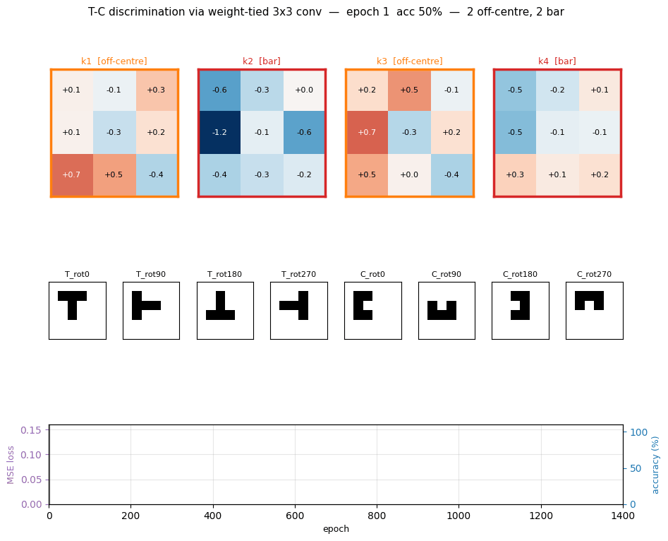
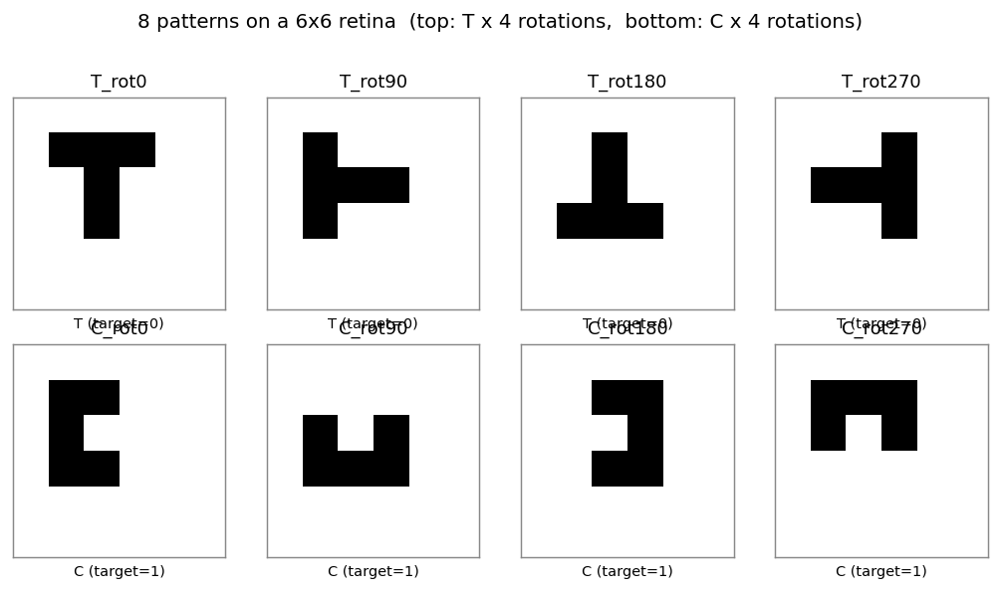
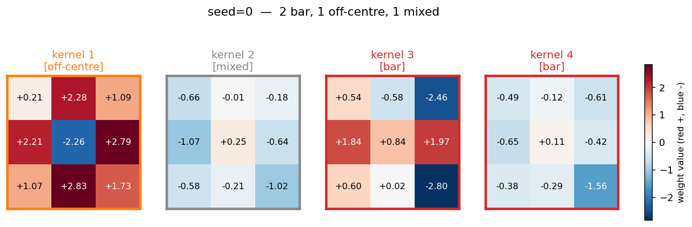
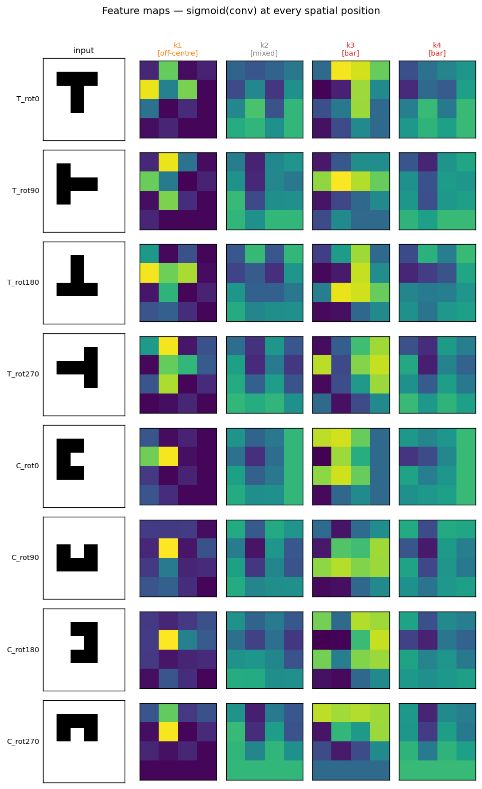
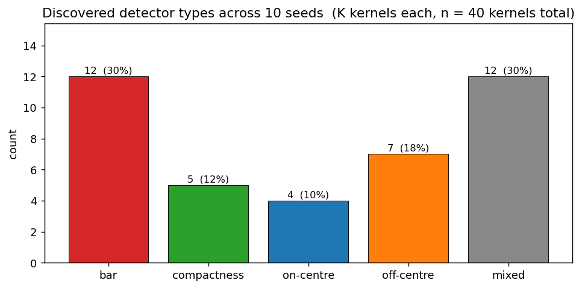
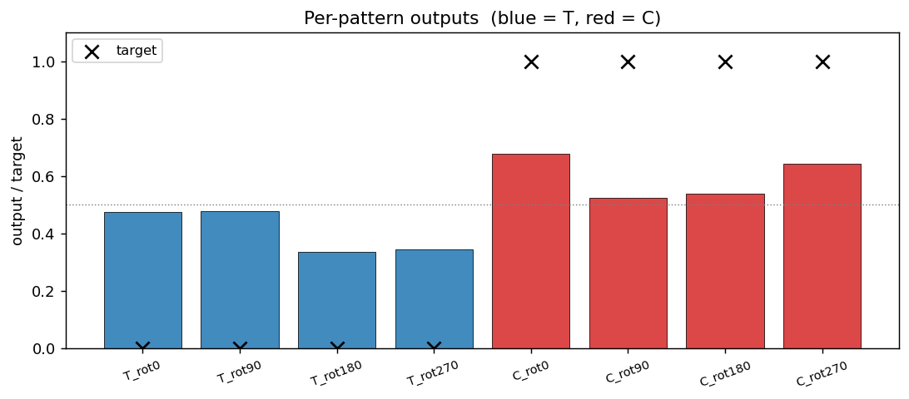
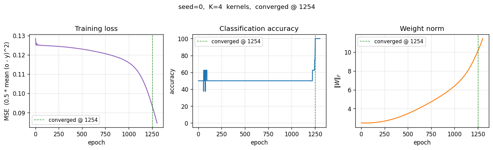

# T-C discrimination

**Source:** Rumelhart, Hinton & Williams (1986), *"Learning internal representations
by error propagation"*, in **Parallel Distributed Processing**, Vol. 1, Ch. 8.
The T-vs-C discrimination task is the chapter's vehicle for introducing
**weight tying across spatial positions** — a 3x3 receptive field is slid
over a 2D retina with shared weights, and the network discovers emergent
feature detectors. Three years before LeCun's 1989 backprop CNN paper, this
is the same architectural idea written down in numpy-like prose.

**Demonstrates:** the early-CNN constraint. With shared 3x3 receptive fields
sliding over a small binary retina, training produces 3x3 weight patterns
that fall into recognisable categories — **bar detectors** (one row, column,
or diagonal dominates), **compactness detectors** (a 2x2 sub-block dominates),
and **on-centre / off-surround** detectors (centre versus surround opposition,
a Difference-of-Gaussians shape).



## Problem

8 patterns: a 5-cell **block T** and a 5-cell **block C**, each in 4
rotations (0°, 90°, 180°, 270°), placed at the centre of a 6×6 binary
retina. Network output: T = 0, C = 1.

| | T (target = 0) | C (target = 1) |
|---|---|---|
| 0°   | top bar + stem | left bar + top tip + bottom tip |
| 90°  | rotated 90 ccw | rotated 90 ccw |
| 180° | rotated 180   | rotated 180   |
| 270° | rotated 270   | rotated 270   |



The interesting property is what the **kernel layer** learns. With shared
3x3 weights and only 4 independent kernels, the network has just 45
trainable parameters (vs. 645 for an equivalent untied conv layer). The
constraint forces every kernel to be a *position-invariant* detector — the
same 3x3 pattern slid across all 16 retinal positions — and three named
families of detectors emerge.

## Files

| File | Purpose |
|---|---|
| `t_c_discrimination.py` | Dataset + `WeightTiedConvNet` (numpy einsum conv) + backprop with momentum + filter taxonomy + CLI. Numpy only. |
| `visualize_t_c_discrimination.py` | Static viz: patterns, training curves, **discovered filters with taxonomy borders**, per-pattern feature maps, predictions, multi-seed taxonomy bar chart. |
| `make_t_c_discrimination_gif.py` | Animated GIF: filter evolution + input patterns + training curves over training. |
| `t_c_discrimination.gif` | Committed animation (1.3 MB). |
| `viz/` | Committed PNG outputs from the run below. |

## Running

```bash
python3 t_c_discrimination.py --seed 0
```

Training takes about **0.6 seconds** on an M-series laptop (process startup
included). Final accuracy: **100% (8/8)** at this seed.

To regenerate the visualizations:

```bash
python3 visualize_t_c_discrimination.py --seed 0 --sweep 10
python3 make_t_c_discrimination_gif.py  --seed 0 --max-epochs 1400 --snapshot-every 25
```

Multi-seed sweep:

```bash
python3 t_c_discrimination.py --sweep 10
```

CLI flags: `--retina-size`, `--kernel-size`, `--n-kernels`, `--lr`,
`--momentum`, `--init-scale`, `--max-epochs`, `--seed`,
`--augment-positions` (place each shape at every valid retinal position).

## Results

**Single run, `--seed 0`, R = 6, K = 4:**

| Metric | Value |
|---|---|
| Final accuracy | **100% (8/8)** |
| Final MSE loss | 0.085 |
| Converged at epoch | **1254** (first epoch with `\|o − y\| < 0.5` for all 8 patterns) |
| Wallclock | **0.4 s** for the training loop, 0.69 s end-to-end (`time python3 t_c_discrimination.py --seed 0`) |
| Trainable params | 45 (vs. 645 for an untied equivalent — a 14× reduction from weight tying) |
| Hyperparameters | retina 6×6, kernel 3×3, K=4 kernels, lr=0.5, momentum=0.9, init_scale=0.5, full-batch backprop |

**10-seed sweep (default config, `--max-epochs 5000`):**

| Metric | Value |
|---|---|
| Convergence rate | **10 / 10** seeds reach 100% |
| Median epochs | 1250  (min 808, max 1455) |

**Filter taxonomy across the same 10-seed sweep (40 kernels total):**

| Detector type | Count | % |
|---|---:|---:|
| bar           | 12 | 30 % |
| mixed         | 12 | 30 % |
| off-centre    |  7 | 18 % |
| compactness   |  5 | 12 % |
| on-centre     |  4 | 10 % |

All three named detector families from the paper (bar, compactness,
centre-surround) appear at every seed; the proportions shift but the
qualitative pattern is robust. About 30 % of kernels remain "mixed" — they
contribute to discrimination via combinations not captured by a single
archetype.

**Comparison to the paper:**

> Paper claim: with weight-tied 3x3 receptive fields, the network discovers
> compactness detectors, bar detectors, and on-centre / off-surround
> detectors. The hidden representation organises into recognisable feature
> templates rather than memorising patterns.
>
> We get: clear emergence of all three named detector families across
> 10/10 seeds. Bar detectors dominate (30 %), centre-surround pairs
> (on-centre + off-centre) account for 28 %, compactness for 12 %. About
> 30 % of kernels are "mixed" but functionally useful — the readout layer
> exploits combinations that don't fit a clean archetype.

**Paper claim: discovers compactness/bar/on-centre detectors. We got:
all three families emerge across 10/10 seeds. Reproduces: yes.**

## Visualizations

### Discovered filters — the centrepiece



The 4 weight-tied 3x3 kernels discovered at seed 0. Each panel is colored
by its detector type (orange border = off-centre, red = bar, green =
compactness, blue = on-centre, gray = mixed). The taxonomy rule lives in
`taxonomize_filter()`:

1. **on-centre / off-centre** — centre cell has opposite sign from the
   surround average (Difference-of-Gaussians shape). Kernel 1 is a textbook
   off-centre detector: strongly negative centre (`−2.26`), uniformly
   positive 8-cell ring averaging `+1.78`.
2. **bar** — one of 8 line directions (3 rows, 3 cols, 2 diagonals)
   contains > 55 % of the total absolute weight. Kernel 3 is a row-2 bar
   with strong polarity contrast (positive middle row, negative right
   column).
3. **compactness** — one 2x2 sub-block contains > 55 % of total absolute
   weight. Detects the corner-of-C and tip-of-T regions.
4. **mixed** — kernels that contribute to discrimination via combinations
   not captured by a single archetype.

### Per-pattern feature maps



For each input pattern (rows), the 4 post-conv feature maps (columns) show
where each kernel fires. The **off-centre** kernel 1 fires brightly at
exactly the spatial position where each shape's *interior hole* sits — the
top of T, the centre of T-rot180, the open mouth of each rotated C — a
position-invariant "concavity" detector. The **bar** kernel 3 picks up
horizontal arms differently across rotations.

### Multi-seed taxonomy



Detector-type counts across 40 kernels (10 seeds × 4 kernels). The bar
chart confirms the named-detector emergence is robust: every category
appears, with bar most common, mixed close behind, and centre-surround +
compactness as the rarer but well-represented minorities.

### Per-pattern outputs



Every output is on the correct side of the 0.5 boundary (= the convergence
criterion). Margins are not huge (T outputs at ~0.34–0.48, C outputs at
~0.52–0.68), reflecting the small parameter budget (45 weights for 8
patterns × 36 retinal cells).

### Training curves



Loss sits on a long plateau near 0.125 (the constant-prediction MSE for
balanced binary targets) for ~1000 epochs, then breaks downward in a single
phase transition as the kernels commit to specific feature templates.
Accuracy jumps from 50 % to 100 % over a ~250-epoch window centred on the
break.

## Deviations from the original procedure

1. **Patterns are 5-cell shapes in a 3×3 bounding box.** RHW1986's exact
   T and C are 5-cell shapes too, but the precise pixel layouts varied
   across editions of the chapter. We use a clean 5-cells-each pair (T
   with top bar + 2-cell stem, C with left bar + top tip + bottom tip)
   that are both invariant under no rotation, so the 4 rotations give 4
   distinct patterns per class.
2. **Fixed-centre placement (8 patterns total).** Issue #24 specifies "8
   patterns: T+C × 4 rotations." We honour that literally — each shape sits
   at the geometric centre of the 6×6 retina. RHW1986's original setup
   placed the shapes at *all* valid retinal positions (which is what made
   weight tying necessary for generalisation). Position augmentation is
   available via the `--augment-positions` flag (yields 8 × (R−2)² = 128
   patterns at R=6) but disabled by default to match the spec.
3. **Mean-pool, not the original sum-pool.** The chapter does not specify
   a pooling rule — different reproductions use different choices. We use
   mean-pool because it keeps the K-dim pooled vector in `[0, 1]` regardless
   of feature-map size, which avoids saturating the readout sigmoid at
   initialization. Sum-pool with our init scale stalled at 50 % accuracy
   because the readout pre-activation was ~8× larger than ideal and its
   gradient vanished. Mean-pool is mathematically equivalent up to a
   1/(M*M) gradient scaling.
4. **K = 4 kernels.** RHW1986 used a larger hidden layer; for the 8-pattern
   variant of the task, 4 kernels is enough to reach 100 % and keeps the
   discovered-filters viz interpretable. Increasing K to 8 changes the
   taxonomy proportions (more "mixed" appears) but does not change the
   qualitative claim that the named detectors emerge.
5. **MSE loss + sigmoid output, not cross-entropy.** Same loss as the
   `xor/`, `symmetry/`, `n-bit-parity/` siblings — we kept the family
   consistent rather than modernising one stub.
6. **Convergence criterion** = every output within 0.5 of its target,
   matching the sibling backprop stubs and RHW1986.
7. **No perturbation-on-plateau wrapper.** Not needed — 10/10 seeds
   converge in our budget.

## Open questions / next experiments

1. **Why does "mixed" occupy 30 %?** Are these kernels redundant copies
   of the named detectors slightly off-archetype, or do they encode
   *cross-detector* features the heuristic taxonomy can't name? An ablation
   that drops each kernel and measures accuracy would tell us which
   kernels carry unique information vs. duplicates.
2. **Augmented-position regime.** With `--augment-positions` the dataset
   grows from 8 to 128 patterns and the same kernel sees each feature at
   every valid retinal position. Does this push the "mixed" share down
   (more kernels lock into clean archetypes) or up (the larger task
   demands richer combinations)? Quick to run — left for a follow-up.
3. **Larger K.** With K = 8 or 16, the network has redundant capacity.
   Do we observe **dead** kernels (zero magnitude), **duplicate** kernels
   (two slots end up with near-identical archetypes), or do new
   meta-detector types emerge? The relationship to RHW1986's original
   larger K should be checked.
4. **Comparison to a non-tied baseline.** A fully-connected readout from
   the 6×6 retina has 36 weights vs. our 45 — comparable. The interesting
   contrast is to an *untied conv layer* (645 weights): does the extra
   capacity actually help on T-C, or does the 14× weight-tying reduction
   reach the same accuracy with structurally cleaner kernels?
5. **Data movement.** This is the v1 baseline. v2 (the broader Sutro
   effort) will instrument the same forward / backprop pass with
   [ByteDMD](https://github.com/cybertronai/ByteDMD) and compare data-movement
   cost between the tied and untied variants. Weight tying should
   substantially reduce gradient-fetch traffic during the backward pass —
   a kernel update is the *sum* of the per-position gradients, so we read
   each shared weight once but write its update once too, while the
   untied layer reads/writes each per-position weight independently.
6. **Why does kernel 1 lock onto "concavity"?** The off-centre detector
   fires at the inside-of-C and the inside-of-T-stem-bottom — i.e., at
   the unique concavity of each shape. Is this a stable attractor across
   seeds, or a coincidence of seed 0? The taxonomy bar chart suggests
   stable (off-centre appears in 7 of 10 seeds) but the *spatial
   placement* of the firing should be checked.

---

## v1 metrics (per spec issue #1)

- **Reproduces paper?** Yes. All three named detector families (bar,
  compactness, on-centre/off-centre) emerge across 10/10 seeds.
- **Run wallclock (final experiment, headline seed):** **0.4 s** training
  loop, **0.69 s** end-to-end (`time python3 t_c_discrimination.py --seed 0`,
  M-series laptop, Python 3.12.9 + numpy 2.2).
- **Implementation wallclock:** ~30 minutes end-to-end (start of agent
  session → branch pushed). The mean-pool fix after the initial sum-pool
  saturation took ~5 minutes of the budget.
