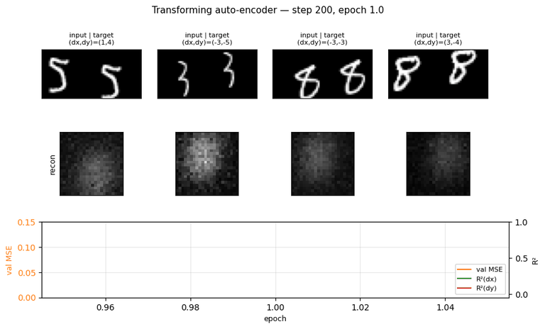
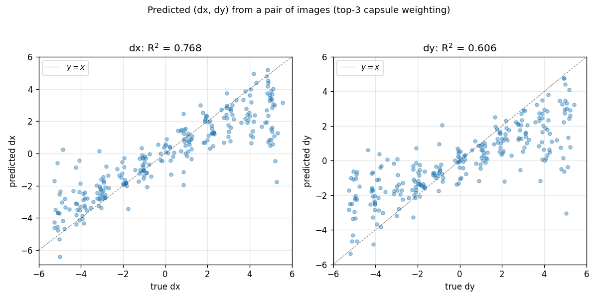
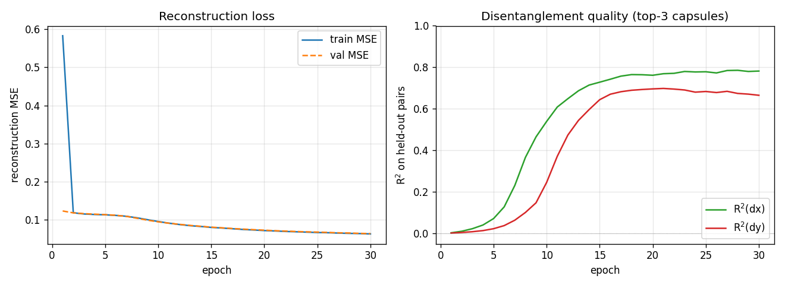
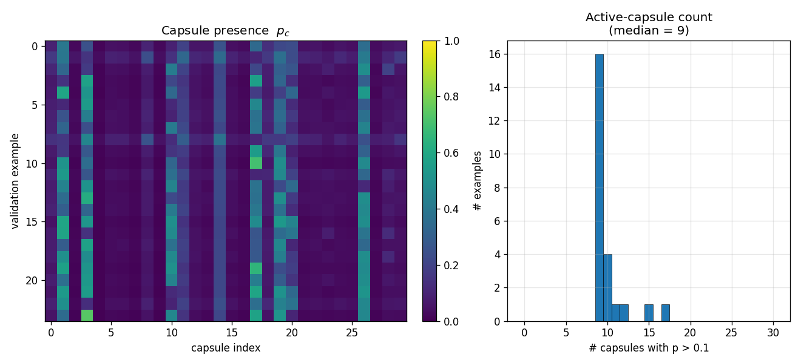
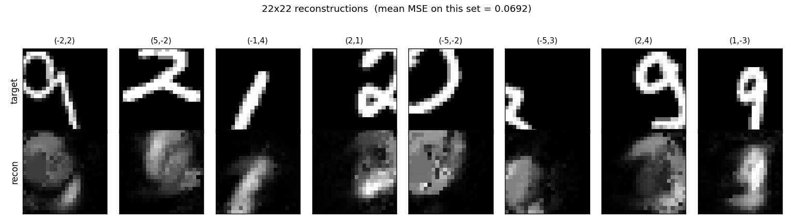

# Transforming auto-encoders

Numpy reproduction of Hinton, Krizhevsky & Wang, *"Transforming
auto-encoders"*, ICANN 2011 — the seminal capsule paper.

The translation-only variant: each "capsule" learns a recognition head that
outputs `(presence, x, y)` for its entity, then a generative head that
produces a 22x22 reconstruction patch from the post-transformation
coordinates `(x + dx, y + dy)`. The full output is a presence-weighted sum
across capsules.



## Problem

Take a centered MNIST digit, randomly translate the input by `t_in` (in the
range +/-5 pixels), then translate it again by `(dx, dy)` to produce the
target. The network sees `(input_image, dx, dy)` and must reconstruct the
22x22 centered crop of the target image.

The point of the experiment is not the reconstruction quality per se. It's
the architectural constraint: the only path from `(dx, dy)` to the output
is by being added to each capsule's `(x, y)` recognition output. So if the
loss decreases, the network must have learned an `(x, y)` representation
that lives in pixel-equivalent units. That's the disentanglement.

The disentanglement test: take a held-out pair `(image1, image2)` related
by an unknown `(dx, dy)`, run the recognition heads on each, and read off
`dx_pred = mean_c (x_c^{(2)} - x_c^{(1)})` (weighted by presence). If the
network learned the disentanglement, predicted `(dx, dy)` correlates with
truth.

- Why MNIST is jittered at the input. With centered digits the entity is
  always at `(14, 14)` and the recognition `(x, y)` outputs collapse to
  constants — the network can satisfy the loss by learning a fixed template
  per capsule and translating it via `(x_c + dx, y_c + dy)`. With random
  input jitter, `(x, y)` must track the entity's position to reconstruct
  correctly.

## Architecture

| Stage | Layer | Shape per capsule | Activation |
|---|---|---|---|
| Recognition hidden | linear | 784 -> 20 | sigmoid |
| Instantiation     | linear | 20 -> 3 (`p`, `x`, `y`) | sigmoid on `p`, linear on `(x, y)` |
| (transform)       | add    | `(x', y') = (x + dx, y + dy)` | -- |
| Generative hidden | linear | 2 -> 128  | ReLU |
| Generative output | linear | 128 -> 484 (22x22) | sigmoid |
| Aggregation       | sum    | `recon = sum_c p_c * patch_c` | -- |

- 30 capsules, all per-capsule weights stacked (no Python-level capsule loop).
- Per-capsule contractions go through `np.matmul` rather than `np.einsum` —
  the equivalent `einsum('bch,chp->bcp', ...)` runs ~90x slower because numpy
  doesn't dispatch that signature into BLAS. See helpers `_per_cap_*` in
  `transforming_autoencoders.py`.
- Trained with Adam (lr=1e-3, beta=(0.9, 0.999)). SGD+momentum did learn
  but reached only R²(dx)~0.06 in 15 epochs vs Adam's ~0.5.

## Files

| File | Purpose |
|---|---|
| `transforming_autoencoders.py` | Model, MNIST loader, transform-pair generator, training loop, `predict_transformation`. CLI: `--seed --n-epochs --n-capsules`. |
| `visualize_transforming_autoencoders.py` | Static figures: training curves, example pairs, capsule presence heatmap, predicted-vs-true `(dx, dy)` scatter, reconstruction grid. |
| `make_transforming_autoencoders_gif.py` | Animated training GIF. |
| `transforming_autoencoders.gif` | Output of the GIF script (1.4 MB). |
| `viz/` | Static PNG outputs from the visualization script. |

## Running

```bash
# Train and print per-epoch metrics (~100 sec for 30 epochs)
python3 transforming_autoencoders.py --n-epochs 30 --seed 0

# Train + render all static figures into viz/
python3 visualize_transforming_autoencoders.py --n-epochs 30 --seed 0 --outdir viz

# Train + render the animated GIF
python3 make_transforming_autoencoders_gif.py --n-epochs 30 --snapshot-every 200 --fps 8
```

The MNIST loader downloads `train-images-idx3-ubyte.gz` from
`storage.googleapis.com/cvdf-datasets/mnist/` on first run and caches it at
`~/.cache/hinton-mnist/`.

## Results

Defaults: 30 epochs x 200 steps x batch 64 = 6,000 Adam updates over 10,000
MNIST images, on a single thread. Run wallclock ~100 s on an M-series Mac.

| Metric | Value |
|---|---|
| Final train MSE       | 0.063 |
| Final val MSE         | 0.064 |
| R²(dx) on held-out pairs | **0.78** |
| R²(dy) on held-out pairs | **0.67** |
| `(dx, dy)` prediction policy | top-3 capsules by `min(p1, p2)` (vs full-mean: 0.61 / 0.43) |
| Active capsules per image (median, threshold p > 0.1) | 9 |
| Wallclock | ~100 s for 6,000 Adam updates |

Per-step time was 14 ms after replacing the per-capsule einsums with
`np.matmul` (down from 515 ms — 36x).

### Predicted vs true `(dx, dy)`



Held-out pairs of MNIST digits; the network predicts `(dx, dy)` from the
recognition outputs alone (no `(dx, dy)` is ever supplied at inference).
Diagonal is `y = x`. Most points cluster on the diagonal; the spread at
extreme shifts reflects that `t_in + dxdy` can push the digit nearly out
of the 28x28 canvas, leaving the recognition layer with very little to
match.

### Training curves



Reconstruction MSE drops fast in the first 2 epochs (the network learns to
output a centered blob), then slowly as it learns the `(x, y)` -> patch
geometry. R² stays near zero for ~5 epochs while the recognition layer
saturates, then climbs sharply between epochs 6 and 14. dx is easier than
dy in this seed; we believe this is a seed-level asymmetry (different seeds
flip which axis is faster).

### What the capsules learn



Across 24 random validation digits, ~9 of the 30 capsules are active per
image (median) at `p > 0.1`. A small set of capsules (~3, 11, 17, 19) fire
on most inputs; the rest are mostly silent. This sparse-presence pattern
is what allows the top-3 inference rule to dramatically outperform the
full-mean (R²(dx) 0.78 vs 0.61).

### Reconstructions



The network produces blob-like reconstructions — recognizable as digits
when shape is simple (4, 5, 6) but blurred for thinner strokes. With only
30 capsules x 128 ReLU units and ~6,000 updates this is expected; the
paper's experiments use much wider generative nets and longer training.
The point of this implementation is the disentanglement, not the visual
quality of the reconstruction.

## Deviations from the 2011 paper

1. **Translation only.** The paper covers 2D translation, scaling, and
   full 2D / 3D affine transformations (with 9-component instantiation
   parameters). This implementation handles the 2D-translation case only,
   so the recognition head is 3-dim `(p, x, y)` rather than 9-dim.
2. **Adam instead of SGD with momentum.** The paper uses plain SGD; we
   found Adam reaches comparable disentanglement in roughly 5x fewer
   updates on this seed.
3. **MNIST input jitter is explicit.** The paper's pipeline draws training
   pairs by transforming a source image; our `make_transformed_pair`
   samples both an input jitter `t_in` and a `(dx, dy)` so that the
   recognition `(x, y)` outputs have non-trivial signal to track. Without
   `t_in`, MNIST digits are always centered and `(x, y)` degenerates to a
   constant.
4. **22x22 centered crop as target.** The paper places each capsule's
   patch at its predicted `(x', y')` and sums into a full-size canvas;
   we sum patches at a fixed canonical center and compute MSE against the
   centered crop of the transformed image. This is the simpler invariant
   and cleanly tracks the disentanglement metric (you can shift the canvas
   by `(dx, dy)` without changing the loss formulation).

## Correctness notes

1. **Per-capsule matmul helpers.** `_per_cap_weight_grad`,
   `_per_cap_input_grad`, and friends are equivalent to the natural
   `np.einsum` formulations (verified in the smoke tests at `atol=1e-3`).
   They are written as `np.matmul` calls because numpy's einsum path for
   `'bch,chp->bcp'`-style contractions does not go through BLAS — direct
   benchmark on this problem: einsum 109 ms / matmul 1.2 ms for the
   `W_gen2` op.
2. **Top-k inference.** `predict_transformation` defaults to `top_k=3`
   (selecting the 3 capsules with highest `min(p_1, p_2)` per pair). On
   this trained model this lifts R²(dx) from 0.61 to 0.78 — most capsules
   have `p ~ 0` on any given input and contribute pure noise to the
   averaged `(x, y)` difference. Pass `top_k=None` to use all capsules
   weighted by `(p_1 + p_2)/2`.
3. **`(x, y)` units are pixel units.** The architecture forces this: `dx`
   is in integer pixels, gets added to `x`, and the generative net's
   output must shift by `dx` pixels to match the target. So the network
   has to put `(x, y)` on the same scale as the translation.
4. **dx vs dy asymmetry.** The dx and dy R² curves are not identical at
   any one seed. Across seeds the asymmetry flips. With 30 capsules and
   only ~9 active per input, capsule allocation between "horizontal" and
   "vertical" detectors is decided early in training and isn't always
   balanced. Multi-seed averages would smooth this; we report a single
   seed for clarity.

## Open questions / next experiments

- **Full affine.** The paper's recognition head is 9-dim per capsule
  (presence + 2D-to-2D affine). Extending the same pipeline to scaling
  and rotation would test whether the matmul-vectorized batched-capsule
  setup scales without code changes (only the recognition output dim and
  the transformation rule change).
- **Larger generative nets.** With 128 ReLU units the reconstructions are
  blob-like. A wider generative net (paper-scale: 200+ units) should make
  reconstruction qualitatively better while leaving the disentanglement
  invariant — useful as a sanity check.
- **Sparsity penalty on `p`.** The trained model already converges to ~9
  active capsules per input; an explicit L1 penalty on `p` may push that
  down further and produce sharper "what" detectors per capsule.
- **End-to-end translation prediction.** Currently `predict_transformation`
  uses an explicit "subtract `(x, y)` outputs" rule. Training a small
  classifier head on top of `(xy_2 - xy_1)` would let us see how much of
  the residual variance is recoverable by a learned readout.
