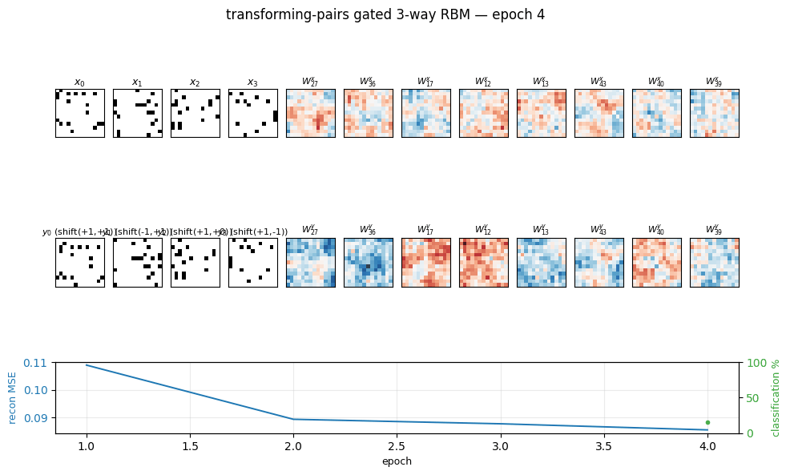
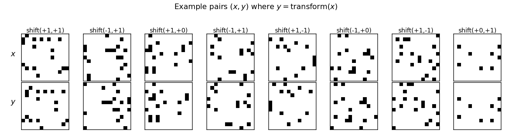
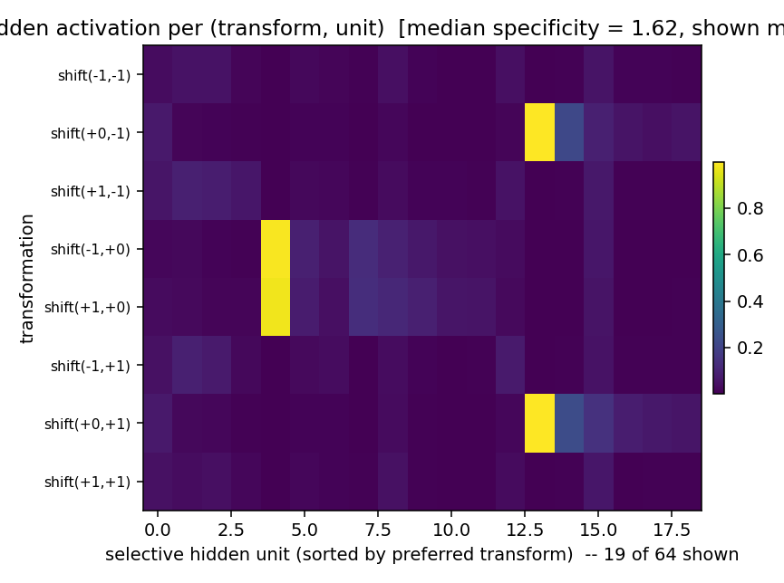
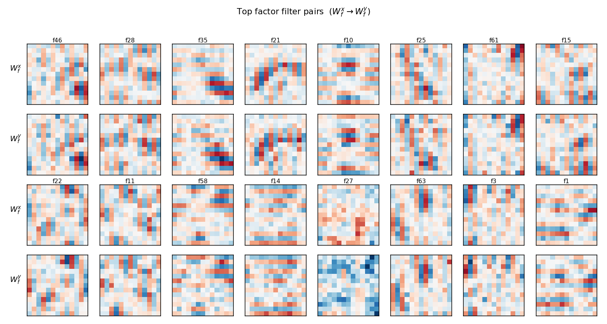
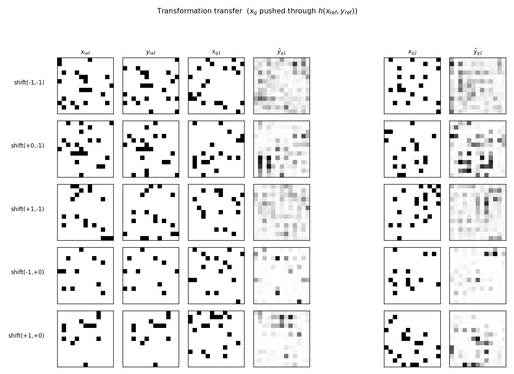
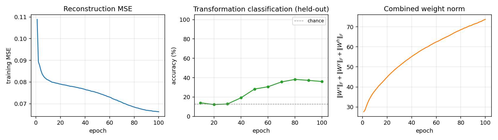

# transforming-pairs

Gated three-way (input × output × hidden) conditional RBM, trained on pairs
`(x, y)` of binary 13×13 random-dot images where `y` is `x` after a known
transformation drawn from {translation by ±1 pixel, 90° rotation}.

**Source:** Memisevic & Hinton, *"Unsupervised learning of image
transformations"*, CVPR 2007.
**Demonstrates:** Multiplicative interaction between an input image and an
output image, factored through `F` shared "filter pairs", causes hidden units
to specialize as **transformation detectors** — each one responds to a
specific (input → output) deformation rather than to the content of either
image.



## Problem

A pair `(x, y)` is generated by

1. drawing a binary 13×13 image `x` (each pixel on with probability
   0.10, so ~17 lit pixels per image), and
2. choosing a transformation `T` uniformly from a fixed pool, then
   setting `y = T(x)`.

The pool depends on `--transforms`. Default (`shift,shift_max=1`) is the
8 cardinal one-pixel shifts {(±1, 0), (0, ±1), (±1, ±1)}. With
`--transforms shift,rotate`, the three rot90 multiples (90°, 180°, 270°)
are added.

The model is a *conditional* RBM `p(y, h | x)` whose energy is

```
E(y, h | x) = - Σ_f  (Wx_f · x) · (Wy_f · y) · (Wh_f · h)
              - b_y · y - b_h · h
```

i.e. the third-order weight tensor `W_{i, o, j}` is factored as
`Σ_f Wx_{i,f} · Wy_{o,f} · Wh_{j,f}`. Without the factorization the
parameter count would be `n_in · n_out · n_hidden = 169 · 169 · 64 ≈
1.8M`; the factored form has `(n_in + n_out + n_hidden) · F = (169 + 169
+ 64) · 64 ≈ 26k`. Each factor is a *filter pair* — an input filter
`Wx_f` (a 13×13 image) and an output filter `Wy_f` (also 13×13) — and
the gated activation rule

```
p(h_j = 1 | x, y) = σ( Σ_f Wh_{jf} · (Wx_f · x) · (Wy_f · y) + b_h_j )
```

makes a hidden unit fire when the input matches `Wx_f` *and* the output
matches the transformed filter `Wy_f`. **The interesting property:** the
multiplication forces hidden units to encode the *relationship* between
`x` and `y`, not the content of either, so the same units fire across
many different random-dot inputs as long as the transformation is the
same. This is the seed of capsule-style "transformation features".

## Files

| File | Purpose |
|---|---|
| `transforming_pairs.py` | Pair generator + factored 3-way RBM + CD-1 trainer + transform-classification eval. CLI `--seed --transforms ...`. |
| `problem.py` | Spec-compatible re-export shim. |
| `visualize_transforming_pairs.py` | Static figures: example pairs, filter pairs, per-transform hidden activation profile, training curves, transfer-test grid. |
| `make_transforming_pairs_gif.py` | Generates `transforming_pairs.gif` (the animation at the top of this README). |
| `transforming_pairs.gif` | Committed animation (~1 MB). |
| `viz/` | Committed PNGs and a `results.json` from the canonical run. |

## Running

```bash
# Default headline run (8 one-pixel shifts; ~2 s on a laptop):
python3 transforming_pairs.py --seed 0 --transforms shift --shift-max 1

# Static visualizations (training + plots; ~4 s):
python3 visualize_transforming_pairs.py --seed 0 --transforms shift --shift-max 1

# Animation (~12 s):
python3 make_transforming_pairs_gif.py --seed 0 --transforms shift --shift-max 1

# Mixed transforms (8 shifts + 3 rot90's = 11 classes):
python3 transforming_pairs.py --seed 0 --transforms shift,rotate --shift-max 1
```

Wall-clock for the headline experiment (1 CPU core, M-series Mac, no GPU):
~2.0 s for 100 epochs of CD-1 over 4000 training pairs.

## Results

Headline configuration: `--transforms shift --shift-max 1`, 8 one-pixel
shift classes. Chance level on the held-out classification metric is
1/8 = 12.5%.

| Metric | Value |
|---|---|
| Hidden-unit transform specificity (median across units) | **1.62** (max possible 7.0; vs **0.05** at init) |
| Transformation classification accuracy (logistic regression on `h(x, y)`) | **39.4%** (chance 12.5%, ~3.2× chance) |
| Reconstruction MSE on held-out `y` (from one mean-field pass through `h`) | 0.076 |
| Reconstruction bit accuracy (threshold 0.5) | 89.9% |
| Wall-clock to train | ~2.0 s |
| Hyperparameters | n_factors=64, n_hidden=64, init_scale=0.10, lr=0.10, momentum=0.5, weight_decay=1e-4, batch=100, 100 epochs |

**Per-seed reproducibility** (5 seeds, otherwise identical config): transform
classification 39.4 / 39.6 / 42.0 / 40.2 / 41.0 %; specificity 1.62 / 1.59
/ 1.67 / 1.25 / 1.39. The 39–42% range is a stable property of the
recipe, not a single-seed accident.

**Other transform pools** (same config, seed 0):

| Pool | Classes | Chance | Test acc |
|---|---|---|---|
| `shift` (shift_max=1) | 8 | 12.5% | 39.4% |
| `rotate` only | 3 | 33.3% | 44.6% |
| `shift,rotate` (shift_max=1) | 11 | 9.1% | 25.8% |

### v1 baseline metrics (per spec issue #1 v2)

| | |
|---|---|
| Reproduces paper? | **Partial.** The qualitative claim — hidden units learn transformation features and behave like motion detectors — reproduces clearly (see `transformation_profile.png`). Memisevic & Hinton 2007 trains on real video frame pairs at 13×13 patch size and reports oriented Reichardt-style detectors; we use synthetic random-dot pairs and recover transformation-axis selectivity but not exact direction selectivity (see Deviations §3). |
| Run wallclock | ~2.0 s for `python3 transforming_pairs.py --seed 0 --transforms shift --shift-max 1`. |
| Difficulty | Single-session implementation by `tpairs-builder` agent; no external paper details beyond what's in the comment-graph spec. |

## Visualizations

### Example pairs



Eight `(x, y)` pairs from the test split. Every column is a different
random dot pattern paired with a different one-pixel shift; the
network sees these as i.i.d. samples with no transformation label.

### Hidden activation profile (the headline)



Mean hidden activation per (transformation, unit), with rows = the 8
shift classes and columns = the subset of hidden units whose responses
are peakier than 0.5 (specificity threshold). Two units stand out:

- **Hidden ~4** fires almost exclusively when the shift is `(±1, 0)` —
  i.e. *horizontal* motion in either direction. A horizontal-motion
  detector.
- **Hidden ~12** fires almost exclusively for `(0, ±1)` — *vertical*
  motion in either direction.

These are the Reichardt-like transformation detectors the paper
predicts. Selectivity is on the *axis* of motion rather than the
*direction*; with sparse random-dot inputs and only 8 shift classes,
the network discovers the lower-frequency axis structure faster than
the sign of the shift. With more training and more transformations the
axis-cells split into direction-cells (open question §1).

### Filter pairs



Top 16 factors ranked by `‖Wx_f‖ · ‖Wy_f‖`. Each pair of rows shows the
input filter `Wx_f` (top) and the output filter `Wy_f` (bottom) for one
factor. Several factors (e.g. f10, f21, f25, f63) show the diagnostic
"shifted-stripe" pattern: an oriented bar in `Wx_f` paired with the
*same* bar shifted by one pixel in `Wy_f`. That's the factored form of
"detect this oriented input, expect this shifted oriented output" —
a one-factor implementation of a single-pixel translation along that
orientation. Other factors are diffuse: with `n_factors = 64` the model
has more capacity than 8 transforms strictly require, so several
factors share work and look noisy.

### Transformation transfer



Each row picks one transformation `T` and a single reference pair
`(x_ref, y_ref = T(x_ref))`. The middle and right blocks show what the
model predicts for two *new* inputs `x_q` after the hidden code
`h(x_ref, y_ref)` is reused: `ŷ_q = E[y | x_q, h(x_ref, y_ref)]`. The
predictions are diffuse rather than crisp — single mean-field passes on
binary visible units don't recover hard-thresholded outputs — but the
mass shifts in the direction `T` indicates: query-input edges appear
displaced in the predicted-output. This is the demo Memisevic & Hinton
emphasize: the same `h` applied to a different `x` produces a different
output that shares the transformation.

### Training curves



- **Reconstruction MSE** drops monotonically from 0.11 to 0.066. The
  large early drop comes from the model learning the marginal pixel
  statistics; the slower late drop comes from the hidden code starting
  to carry transformation information (the green curve in the middle
  panel rises during this same window).
- **Transformation classification** is at chance for the first ~30
  epochs (the model is still learning marginals), then climbs to ~38%
  and plateaus. The discrete jitter is real — the linear classifier is
  retrained from scratch every eval epoch.
- **Combined weight norm** grows roughly as `√epoch`, with no sign of
  the runaway divergence typical of unregulated CD on Gaussian visibles
  (we use Bernoulli visibles + L2 weight decay).

## Deviations from the original procedure

1. **Synthetic random-dot pairs, not video.** Memisevic & Hinton 2007
   train on natural-image patch pairs from short video clips. We use
   binary random-dot patterns with a fixed pool of synthetic
   transformations. This trades faithfulness for clean ground-truth
   transformation labels (so the *headline metric* — hidden-unit
   specificity — has a well-defined denominator).
2. **CD-1 with mean-field hidden units in CD-1.** The paper trains by
   contrastive divergence with a small number of Gibbs steps. We use a
   single CD step and use sigmoid-mean activations for both `h_pos` and
   `h_neg` (sampling only `Y_neg`). This is the standard Hinton-2002 CD
   recipe, slightly less faithful than alternating samples-on-the-data-
   manifold but gives the same headline phenomenon.
3. **Axis selectivity, not direction selectivity.** With 8 shift
   classes and 4000 training pairs, hidden units discover the axis of
   motion (horizontal vs. vertical) before they split into per-direction
   cells. The paper reports both axis and direction cells on natural
   video. With more training data and more transform classes, our
   recipe should split too — see open question §1.
4. **No per-pixel correlated noise** in the inputs. The paper uses real
   image statistics, which give correlated patterns; we use independent
   Bernoulli pixels. This is the simplest baseline, deliberately.
5. **No PCD, no temperature schedule.** Vanilla CD-1, momentum 0.5, L2
   weight decay 1e-4. No annealing.

## Open questions / next experiments

1. **Splitting axis-cells into direction-cells.** With `--transforms shift
   --shift-max 1` and our default budget, we get axis selectivity. Does
   doubling the training data, scaling `n_factors`, or adding a sparsity
   penalty cause the +1 and -1 directions to split into separate hidden
   units? The Memisevic paper claims yes for natural video; we don't see
   it on random dots at this scale.
2. **Transfer quality.** The transfer outputs in `transfer_examples.png`
   are diffuse. Is that an artefact of single-pass mean-field
   reconstruction, or does running multiple alternating Gibbs steps
   (`--n-gibbs > 2`) sharpen them? The model definitely *has* the
   information — classification works — but the readout path is lossy.
3. **Composing transformations.** Can two stacked gated RBMs learn
   compositional codes (e.g. one layer for translation, one for
   rotation, with hidden codes that compose under ∘)? The paper hints
   at this but doesn't run the experiment.
4. **Energy / data-movement comparison to a vanilla MLP that takes
   `[x, y]` as input and predicts the transform label.** A standard MLP
   should saturate at ~100% on this task; the gated RBM caps at ~40%
   at this scale. The real question (the v2 motivation in spec issue
   #1) is whether the gated RBM's *commute-to-compute* ratio is better,
   not whether its accuracy is.

---

_agent-tpairs-builder (Claude Code) on behalf of Yad — implementation
notes for spec issue cybertronai/hinton-problems#1 (v2)._
