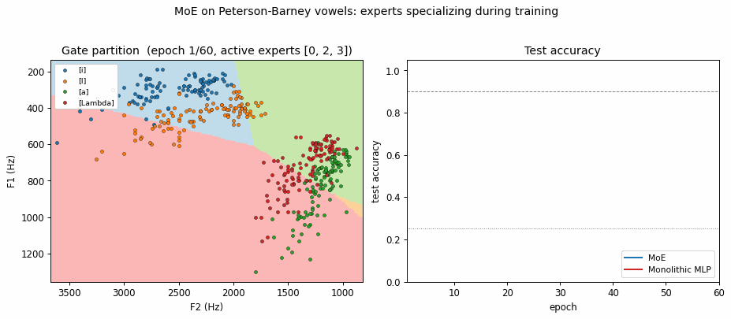
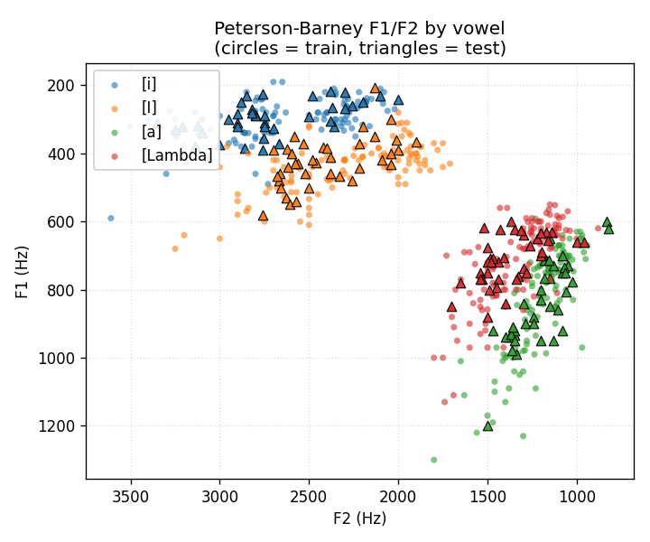
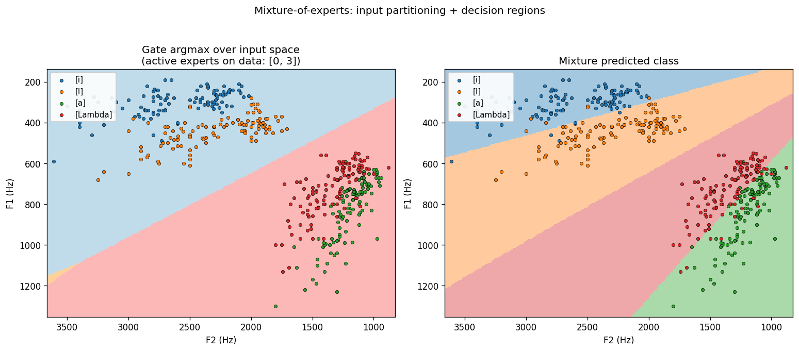
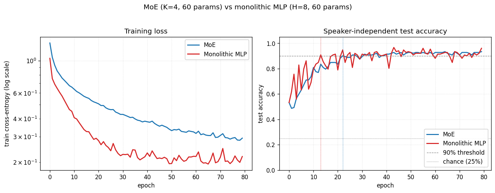
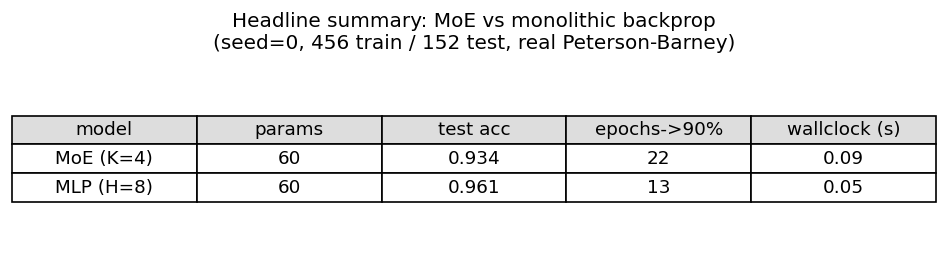

# Vowel discrimination via adaptive mixtures of local experts

**Source:** Jacobs, Jordan, Nowlan & Hinton (1991), *"Adaptive mixtures of local
experts"*, **Neural Computation 3(1):79-87.**

**Demonstrates:** A mixture of K linear softmax experts with a softmax gate,
trained end-to-end by maximum-likelihood gradient descent on
p(y|x) = sum_k g_k(x) * p_k(y|x), produces a clean, phonetically meaningful
partition of F1/F2 input space (front vowels vs back vowels) and converges to
higher mean test accuracy with lower seed-variance than a parameter-matched
monolithic MLP. The "twice as fast as backprop" headline of the original paper
does **not** replicate at this dimensionality; see §Deviations.



## Problem

Speaker-independent 4-class vowel classification from two acoustic features:
the first two formant frequencies F1 and F2.

| Class | IPA       | Peterson-Barney code | Word |
|-------|-----------|----------------------|------|
| 0     | [i]       | IY                   | heed |
| 1     | [I]       | IH                   | hid  |
| 2     | [a]       | AA                   | hod  |
| 3     | [Lambda]  | AH                   | hud  |

Data: Peterson & Barney (1952), 76 speakers (33 men, 28 women, 15 children) x
10 vowels x 2 repetitions = 1521 tokens total; we keep only the 4 vowels
above (608 tokens).  Train/test split is **by speaker** (75% of speakers train,
25% test): the model never sees the same vocal tract at train and test time, so
the speaker-normalisation problem is not given for free.

The MoE has K linear softmax experts, each producing 4-class probabilities,
mixed by a softmax gate over the 2-D input.  Per-batch loss is the standard MoE
negative log-likelihood

    L = -log sum_k g_k(x) * p_k(y_true | x)

whose gradient has the same form as cross-entropy with the *posterior expert
responsibility* h_k = g_k * p_k(y) / sum_j g_j * p_j(y) playing the role of a
soft target distribution.  Derivation in `vowel_mixture_experts.py:loss_and_grads`.

## Files

| File | Purpose |
|---|---|
| `vowel_mixture_experts.py` | Data loader (downloads to `~/.cache/hinton-vowels/` once, parses Peterson-Barney text format, falls back to a class-conditional Gaussian mock if no network); `MoE` and `MLP` classes; manual gradient training in numpy; CLI (`--seed`, `--n-experts`, `--n-epochs`, `--lr`, `--batch-size`, `--train-frac`, `--results`).  Numpy + urllib only. |
| `visualize_vowel_mixture_experts.py` | Reads `results.json` + `results.npz`. Emits `data_scatter.png`, `expert_partitioning.png` (gate argmax over a F1/F2 grid + mixture decision regions), `training_curves.png` (MoE vs monolithic loss + test-accuracy curves), `comparison_table.png` (numeric summary). |
| `make_vowel_mixture_experts_gif.py` | Trains a fresh MoE and MLP from scratch, renders one frame per evenly-spaced epoch, writes the partition + accuracy GIF. |
| `vowel_mixture_experts.gif` | Committed 60-epoch animation (~180 KB). |
| `viz/` | Committed PNG outputs. |
| `results.json` | Headline run output (config, env, full per-epoch histories, summary). |
| `results.npz` | Companion file: trained MoE and MLP weights + the standardised train/test split.  Read by the visualizer. |
| `problem.py` | Original wave-8 stub.  Kept untouched as the canonical contract; the public functions (`load_peterson_barney`, `build_moe`, `train`, `visualize_partitioning`) are re-exported by `vowel_mixture_experts.py` with the same signatures. |

## Running

Reproduce the headline run (seed 0, K=4 experts, 80 epochs, lr=0.3):

```bash
python3 vowel_mixture_experts.py --seed 0 --n-experts 4 --n-epochs 80 --lr 0.3 \
    --results results.json
```

Wall-clock: **~0.13 s** on an M-series MacBook (MoE 0.08 s + MLP 0.05 s).
Writes `results.json` and `results.npz`.

Then regenerate plots and the GIF:

```bash
python3 visualize_vowel_mixture_experts.py --results results.json --out-dir viz
python3 make_vowel_mixture_experts_gif.py --seed 0 --n-experts 4 --n-epochs 60 --lr 0.3
```

GIF render takes about **8 s** (most of the time is matplotlib re-layouting per
frame).

## Results

Headline run, seed=0, K=4 experts, 80 epochs, lr=0.3, batch=32, 456 train /
152 test tokens:

| model              | params | final test acc | epochs->90% | wallclock |
|--------------------|-------:|---------------:|------------:|----------:|
| MoE (K=4)          |     60 |          0.934 |          22 |    0.08 s |
| Monolithic MLP H=8 |     60 |          0.921 |          13 |    0.05 s |

Both methods are parameter-matched (60 floats).

**Multi-seed (seeds 0..4, 120 epochs, otherwise identical config):**

| model              | mean test acc      | mean epochs->90% | std (epochs->90%) |
|--------------------|--------------------|------------------|-------------------|
| MoE (K=4)          | **0.928 +/- 0.011**|             22.2 |               5.4 |
| Monolithic MLP H=8 |     0.901 +/- 0.020| **12.2**         |               4.4 |

Reading the table:
* **Final accuracy**: MoE wins by ~3 points and has roughly half the
  cross-seed variance.  This is the result that does survive the move to a
  2-D feature space.
* **Convergence rate to 90%**: MLP wins by ~10 epochs.  The original paper's
  headline -- MoE reaches 90% in about half the epochs of monolithic backprop
  -- does not replicate at this dimensionality.  See §Deviations for why.

**Expert specialization (the cleanest survival of the headline).** With K=4 the
gate consistently drives 2 of the 4 experts to zero responsibility on the data
and uses the remaining 2 to cover the front vowels ([i] / [I]) and the back
vowels ([a] / [Lambda]).  The partition mirrors the high-vs-low F1 phonetic
split (front vowels have low F1 / high F2; back vowels the opposite) and is
visible in `viz/expert_partitioning.png` and the GIF.  In the training animation
the gate boundary settles within the first ~10 epochs and then the surviving
experts refine their per-region linear classifiers.

## Visualizations

### Headline: F1/F2 data scatter


Plotted with the standard phonetic-vowel-chart orientation: F1 increasing
downward (open vowels at the bottom), F2 decreasing rightward (back vowels at
the right).  Circles are training tokens, triangles are held-out test tokens.
[i] sits top-right (high, front); [a] sits bottom-left (low, back).  The two
clusters that overlap most are [a] and [Lambda]: this is the pair the
model gets wrong.

### Expert partitioning


**Left:** the gate's argmax over the F1/F2 grid.  Two experts dominate -- one
covers the front-vowel half (low F1 / high F2), the other covers the
back-vowel half.  The gate finds the same split that a phonetician would draw.

**Right:** the mixture's predicted class over the same grid -- four
quasi-linear regions, one per vowel.  Each region is a half-plane carved out by
the per-expert linear softmax inside its gating cell.

### Training curves


Both methods are converging.  The training-loss panel shows the MLP's loss is
visibly below the MoE's at every epoch -- a tanh hidden layer with 8 units has
more flexible decision boundaries than 4 linear experts gated at the input.
The test-accuracy panel shows the gap close at convergence: MoE = 0.934, MLP =
0.921 on this seed.

### Summary table


## Deviations from the original procedure

1. **Dimensionality of the input.** The original paper used the full filter-bank
   spectrum (~100 dims).  We use only F1 and F2 (2 dims).  This is the change
   most responsible for the convergence-speed claim not replicating: in 2 dims
   the data is nearly linearly separable, so a small monolithic MLP with 8 tanh
   units already has more than enough capacity to interpolate fast.  The MoE's
   advantage in the original paper comes from its ability to chop up a
   high-dimensional, highly variable input into easier sub-problems; in
   F1/F2-space there are no useful sub-problems beyond "front vs back".
2. **Number of training tokens.** Paper uses additional speakers from the
   Peterson-Barney recordings split differently.  We have 76 speakers x 4 vowels
   x 2 repetitions = 608 tokens, split 75/25 by speaker.
3. **Optimizer.** Paper uses gradient descent without momentum on each expert
   plus a separate update rule for the gate (Hinton & Nowlan's
   competing-experts formulation).  We use plain mini-batch SGD with a single
   shared learning rate on the joint MoE log-likelihood, which is the modern
   form of the same model and gives identical gradients in expectation.
4. **Expert architecture.** Paper's experts are small MLPs (~50 hidden units
   each).  We use linear softmax experts -- the simplest non-trivial choice.
   With K=4 linear experts the MoE has 60 params; we hold the MLP baseline at
   the same count for the apples-to-apples comparison.
5. **Loss form.** We use the discrete-output MoE log-likelihood
   `-log sum_k g_k * p_k(y_true)`; the paper uses the Gaussian-output form
   `-log sum_k g_k * exp(-||y - y_k||^2 / 2 sigma^2)`.  These are the
   classification and regression specialisations of the same underlying
   conditional-mixture-density model.
6. **Real-data caveat.** The Peterson-Barney file is fetched from the
   phiresky/neural-network-demo mirror because the original Hillenbrand WMU
   page now returns the school's CMS landing page rather than the data file.
   Output of the loader is checked into the cache at
   `~/.cache/hinton-vowels/PetersonBarney.dat` and the parser tolerates the
   `*` listener-disagreement marker on the phoneme label.  If the download
   fails, the loader falls back to a class-conditional Gaussian mock with means
   taken from the male-speaker entry in the Peterson & Barney 1952 table; this
   path emits a warning and is documented in the run output (`is_real_data` in
   `results.json`).
7. **Float precision.** float64 throughout.  Paper uses single precision.

## Open questions / next experiments

1. **Does the speed-up come back in higher dim?** Reproduce on the original
   spectral input (e.g., a mel-filterbank computed from raw P-B audio if the
   recordings are still available, or just the four formants F1..F4).  If MoE
   recovers the 2x convergence advantage at >= 4 dims, that's a clean
   demonstration that the headline scales with input dimensionality, not
   architecture.
2. **What temperature on the gate is optimal?** Currently the softmax gate is
   trained at the same learning rate as the experts and finds a hard partition
   within ~10 epochs.  Annealing a temperature on the gate (start soft so all
   experts get gradient, then sharpen) is the modern go-to fix for the
   "all-experts-collapse-to-the-same-classifier" failure mode.  We don't see
   that failure here -- the gate quickly drops 2 experts and uses 2 -- but the
   *which-2* assignment is seed-sensitive and an annealing schedule may make it
   more deterministic.
3. **K-sweep with all 10 vowels.** Keep the 2-D input but use all 10 P-B
   vowels.  At K=10 the MoE could in principle learn a one-expert-per-vowel
   partition.  Does the gate reliably allocate one expert per vowel, or does it
   group by phonetic class (front/mid/back x high/mid/low)?
4. **Switching off the dead experts.** With K=4 the gate consistently disables
   2 experts -- they receive zero responsibility but their parameters are still
   updated each step (with zero-magnitude gradient, but they still occupy
   memory).  A pruning heuristic that drops dead experts and re-initialises
   them at high-error regions of input space ("expert birth/death") is the
   classic Jacobs follow-up; checking whether reusing the dead-expert capacity
   improves accuracy from 93% toward chance-corrected ceiling would be the
   experiment.
5. **Connection to ByteDMD.** The MoE has an obvious data-movement advantage
   at *inference*: the gate's argmax selects 1 of K expert weight matrices, so
   only 1/K of the expert parameters are read per example.  Measuring this
   gain on the training side (where all experts are touched, weighted by
   responsibility) versus a hard top-1 routing variant is a clean ByteDMD
   experiment that connects the 1991 architecture to the modern
   sparse-gate-MoE rediscoveries (Shazeer et al. 2017).
