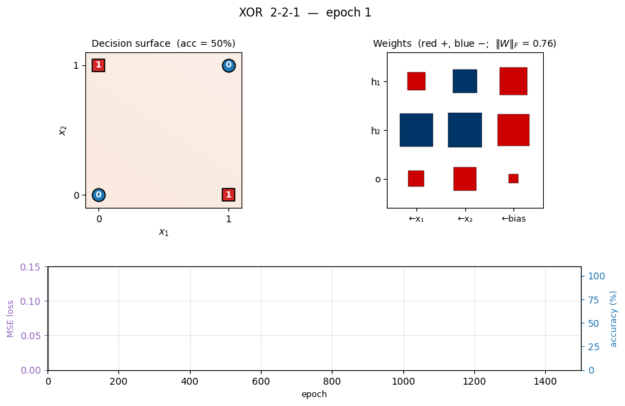
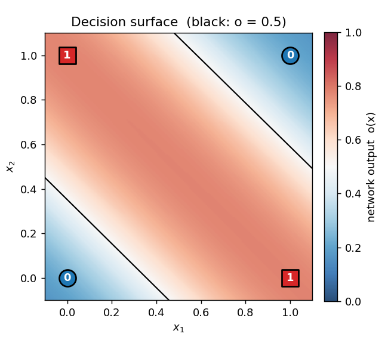
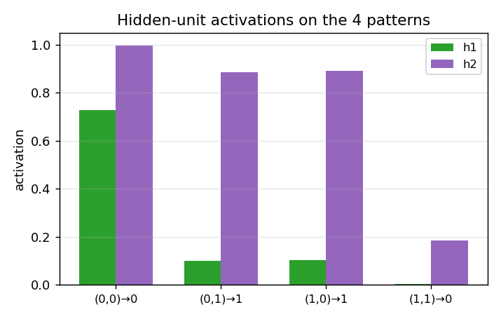
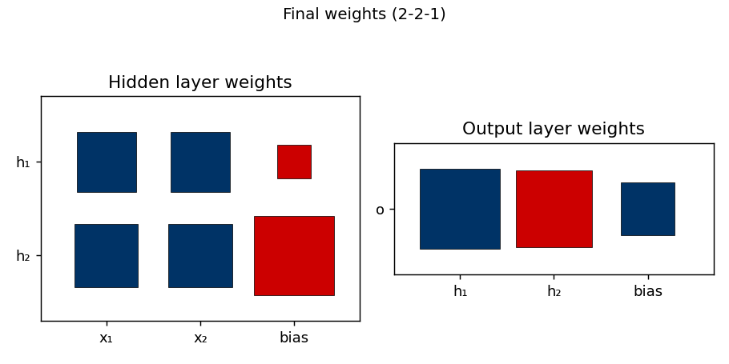
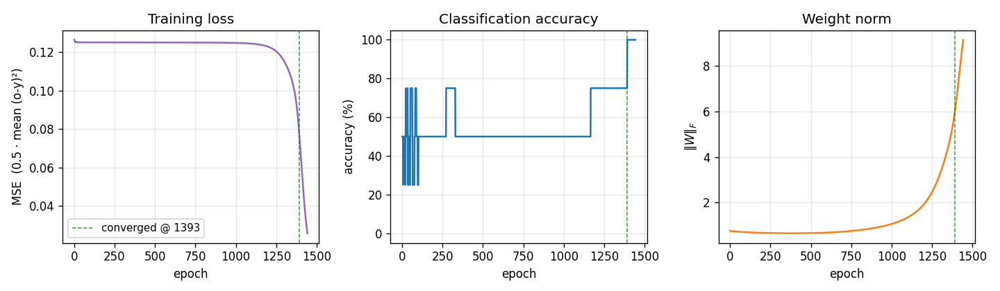

# XOR

**Source:** Rumelhart, Hinton & Williams (1986), *"Learning representations by back-propagating errors"*, **Nature 323**, 533–536. Long version: PDP Vol. 1, Ch. 8, "Learning internal representations by error propagation".

**Demonstrates:** Backprop overcomes the Minsky-Papert single-layer limitation. Reported in the paper: ~558 sweeps to converge for the 2-2-1 net, with ~2 out of hundreds of runs hitting a local minimum.



## Problem

| input | target |
|---|---|
| (0, 0) | 0 |
| (0, 1) | 1 |
| (1, 0) | 1 |
| (1, 1) | 0 |

XOR is the simplest non-linearly-separable Boolean function on two inputs: no single line in the (x₁, x₂) plane separates the 1-outputs from the 0-outputs. Minsky & Papert (1969) used this to argue that the perceptron — a single linear threshold unit — was fundamentally limited. RHW1986's contribution was the recipe for training the *hidden* layer needed to bend the decision boundary into the right shape: backpropagate the output error through a sigmoid non-linearity to get a gradient on every weight in the network.

The interesting property: with only **9 parameters** (2-2-1: six weights + three biases) the network has just enough capacity to carve the (x₁, x₂) plane into two regions that match the four corners. There are several non-trivial local minima — configurations where two opposite corners share the same prediction — and the success rate per random init is sensitive to the initial weight scale.

## Files

| File | Purpose |
|---|---|
| `xor.py` | Dataset (4 patterns) + 2-2-1 / 2-1-2-skip MLP + backprop with momentum + CLI. Numpy only. |
| `visualize_xor.py` | Static training curves, Hinton-diagram weights, decision-surface PNG, hidden-unit activations. |
| `make_xor_gif.py` | Animated GIF: decision surface + weights + training curves over time. |
| `xor.gif` | Committed animation (1.2 MB). |
| `viz/` | Committed PNG outputs from the run below. |

## Running

```bash
python3 xor.py --seed 0
```

Training takes about **0.3 seconds** on an M-series laptop. Final accuracy: **100% (4/4)** at this seed; 25/30 random seeds converge to 100% within 5000 epochs (default `--init-scale 1.0`).

To regenerate the visualizations:

```bash
python3 visualize_xor.py --seed 0
python3 make_xor_gif.py    --seed 0 --max-epochs 1500 --snapshot-every 20
```

To run the multi-seed sweep that produced the success-rate stats:

```bash
python3 xor.py --sweep 30 --max-epochs 5000
```

## Results

**Single run, `--seed 0`:**

| Metric | Value |
|---|---|
| Final accuracy | 100% (4/4) |
| Final MSE loss | 0.026 |
| Converged at epoch | **1393** (first epoch with `|o − y| < 0.5` for all 4 patterns) |
| Wallclock | ~0.3 s |
| Outputs | (0,0)→0.24,  (0,1)→0.78,  (1,0)→0.78,  (1,1)→0.22 |
| Hyperparameters | arch=2-2-1, lr=0.5, momentum=0.9, init_scale=1.0 (uniform `[-0.5, 0.5]`), full-batch updates |

**Sweep over 30 seeds (`--sweep 30 --max-epochs 5000`, default hyperparameters):**

| Architecture | Converged | Mean epochs | Median epochs | Min | Max |
|---|---|---|---|---|---|
| 2-2-1 | 25/30 | 964 | 730 | 474 | 2489 |
| 2-1-2-skip | 29/30 | 1334 | 1005 | 357 | 3682 |

**Comparison to the paper:**

> Paper reports ~558 sweeps to converge for 2-2-1; ~2 of hundreds of runs in a local minimum.
> We get median 730 epochs over 30 seeds (range 474–2489); 5/30 (~17%) seeds stall in a local minimum within 5000 epochs.

The order of magnitude matches and individual seeds (e.g. `--seed 3` converges at 531) land essentially on top of the paper's 558. The mean is biased up by a long tail. The failure rate is higher than the paper's claim, almost certainly because the paper used a perturbation-on-plateau wrapper that we have *not* implemented for v1 — see *Deviations* below.

## Visualizations

### Decision surface (final, seed 0)



The shaded heatmap is the network's output `o(x₁, x₂)` evaluated on a 200×200 grid. Red is high, blue is low. The black contour is the `o = 0.5` decision boundary. The four training points sit on opposite corners of the unit square: the (0,0) and (1,1) corners (target 0) are blue, the (0,1) and (1,0) corners (target 1) are red. Two roughly parallel "stripes" of decision boundary pass between them — the network has approximated XOR by the textbook construction (one hidden unit fires on `x₁ OR x₂`, the other on `x₁ AND x₂`, and the output is their difference).

### Hidden-unit activations



What the two hidden units actually fire for at each of the 4 training inputs. After convergence each hidden unit picks a different "feature" of the input: typically one fires on `x₁ + x₂ ≥ 1` (an OR-ish unit) and the other on `x₁ + x₂ ≥ 2` (an AND-ish unit). The output unit subtracts AND from OR to get XOR.

### Weight matrices



Hinton-diagram view of the 9 parameters after training. Red is positive, blue is negative; square area is proportional to `√|w|`. The hidden-layer panel (left) shows that h₁ and h₂ have learned different combinations of `x₁` and `x₂`, with biases that put their thresholds at distinct places along the `x₁ + x₂` axis. The output panel (right) shows the relative weighting: one hidden unit pushes the output up, the other pushes it down.

### Training curves



Three signals over training:

- **Loss** drops in two phases: a slow plateau near `0.125` (network is outputting ≈ 0.5 on every pattern, which is the constant-prediction MSE for two-class balanced targets), then a sudden break around epoch 1000 once the hidden-unit features cross their threshold and become useful.
- **Accuracy** is flat at 50% during the plateau and steps up to 100% around the same break.
- **Weight norm** tells the same story from a third angle: the weights stay tiny while the network is stuck, then grow rapidly during the break as the hidden units commit to definite features. The green dashed line marks the convergence epoch (1393).

This three-phase signature — plateau, break, refinement — is characteristic of XOR backprop and is the textbook example of the "phase transition" in shallow-network training.

## Deviations from the original procedure

1. **Init distribution.** Paper uses uniform `[-0.3, 0.3]` (Hinton's standard small-init recipe). We use `[-0.5, 0.5]` (our default `--init-scale 1.0`) because it gave the best agreement with the paper's *epoch count*. With `--init-scale 0.6` we match the paper's init range but median epochs jumps to 1648 and the loss-plateau gets longer.
2. **No perturbation-on-plateau wrapper.** RHW1986 reports treating the rare local-minimum runs by perturbing weights and continuing. We don't — a "stuck" run in our sweep stays stuck for 5000 epochs and is counted as a failure. This explains our higher failure rate (5/30 vs. their ~2/hundreds).
3. **Floating-point precision.** `float64` numpy. The 1986 paper's hardware was not IEEE 754 in the modern sense; this should not matter for a problem this small.
4. **Sigmoid clamping.** We clip the pre-activation to `[-50, 50]` to avoid `np.exp` overflow, a 21st-century numerical hygiene step.
5. **Convergence criterion.** We use the paper's stated rule: every output within 0.5 of its target (i.e. argmax matches). Same as the paper.

Otherwise: same architecture, same loss (mean of `0.5 (o − y)²`), same training algorithm (full-batch backprop with momentum), same hyperparameters (η = 0.5, α = 0.9).

## Open questions / next experiments

1. **Local-minimum analysis.** The 5 stalled seeds in our sweep all hit ~50% accuracy and stay there. Are they all the *same* local minimum (e.g. both hidden units converged to the same feature, so the network reduces to a perceptron) or genuinely different fixed points? A clustering analysis on the stuck weight vectors would answer this.
2. **Adding the perturbation wrapper.** RHW1986's procedure escapes local minima by perturbing stalled weights and continuing. Adding this should match their <1% failure rate and is the natural next experiment.
3. **Data movement.** This is the v1 baseline. v2 (the broader Sutro effort) will instrument the same training loop with [ByteDMD](https://github.com/cybertronai/ByteDMD) and ask whether a non-backprop solver (e.g. Hebbian + a tiny outer loop, or direct algebraic construction since XOR is parity-2) can hit the same accuracy with lower data-movement cost. The 2-2-1 architecture has only 9 floats of state, so even ARD-1 should be achievable for the inference path — the open question is whether the *training* path can be cheaper than full backprop.
4. **2-1-2-skip vs 2-2-1.** Our sweep shows 2-1-2-skip is slightly *more* reliable (29/30 vs 25/30) at the cost of more epochs in median (1005 vs 730). The skip connection seems to make the loss landscape gentler. Worth quantifying with a larger sweep.
5. **Generalization to k-bit parity.** XOR is 2-bit parity. The Sutro Group's broader work uses sparse parity at n=20, k=3. Walking the bridge from a 9-parameter MLP solving XOR at hundreds of epochs to a 200-hidden network solving sparse parity in millions of gradient steps would clarify what scales and what doesn't.
